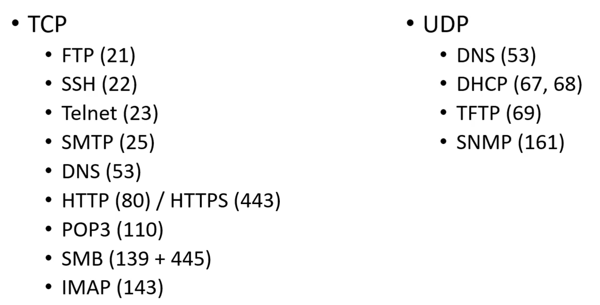
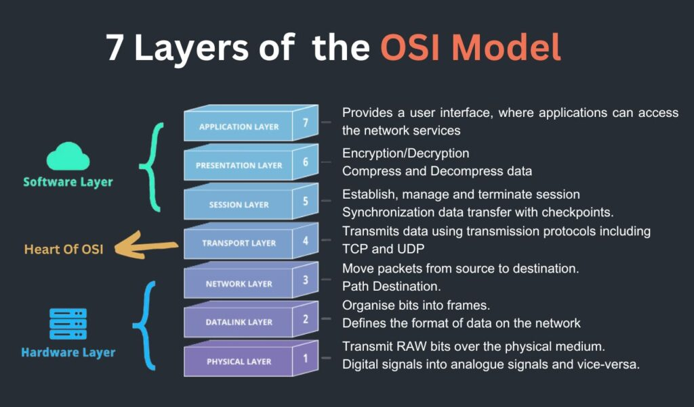
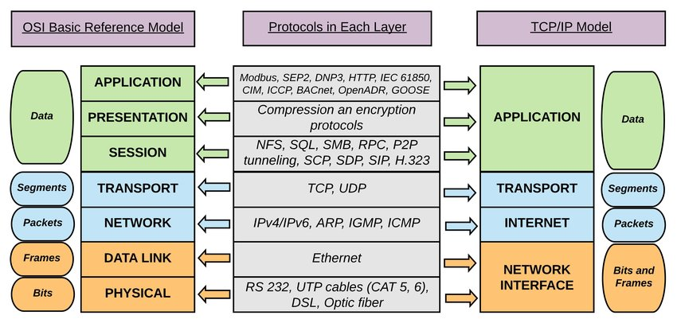

# Networking Refresher

## IP Addresses

Layer 3, network layer

The IP protocol is used by IP routers.

**IPv4:**

* Dotted-decimal notation, 4 octets/bytes (4 x 8 bits = 32 bits), separated by dots
* Binary to decimal conversion
* Number of possible IPv4 addresses: ca. 4.3 billion, but 7 billion people on
  earth. All IPv4 addresses used up.

**IPv6:**

* Hexadecimal notation
* 128 bits in 8 blocks with 4 nibbles, separated by colons (1 nibble = 4 bits,
  one hexadecimal number).
* Leading zeros within a group can be omitted, and a full block of zeros can be
  entire omitted (::).
* In total ca. 3.4E38 possible addresses.
* Not widely used. Reason: network address translation (NAT) multiplies address
  space using private networks
* IPv6 also offers other features, e.g. improved security and
  auto-configuration.

**Private IP Addresses:**

* Class A: also `/8` to indicate that the first 8 bits of the IP address range
  remain fixed. First bit always `0`. Private address range: `10.0.0.0 - 10.255.255.255`
* Class B: also `/16`, first two bits always `10`. Private address range: `172.16.0.0 - 172.31.255.255`
* Class C: also `/24`, first three bits always `110`. Private address range: `192.168.0.0 - 192.168.255.255`
* Loopback (localhost): address range `127.0.0.1 - 127.0.0.7`

Private IP addresses are not used on the public internet, they are reserved for
NAT and internal networks.

## MAC Addresses

Layer 2 protocol, data-link layer

* Switches forward information based on physical addresses.
* MAC addresses are assigned to network interface cards (NICs) by the manufacturer
  and stored in their firmware.
* MAC = media access control, listed under `ether` in the `ifconfig` output; 6
  bytes in hexadecimal notation and separated by colons
* The first 3 bytes identify the manufacturer (OUI), the trailing 3 bytes identify
  the specific device.
* MAC addresses are used on local area networks (LAN). Beyond that, IP addresses
  are used to identify source and destination of a packet. 

## TCP, UDP, and the Three-Way Handshake

Layer 4: transport layer

**TCP, transmission control protocol:**

* Connection-oriented protocol
* Reliable, ordered, error-checked through acknowledgement, retransmission and flow control
* Guarantees that data is received correctly by destination device
* Breaks data down into smaller packets, assigns sequence numbers and ensures that the packets are reassembled correctly.
* Downside: slow
* Used for applications that require guaranteed delivery, examples: file transfer, email, remote login, websites
* TCP uses 3-way handshake to establish a connection between two devices before
  communication begins:
    1. SYN (synchronize; packet with SYN flag and initial sequence number set)
    2. SYN/ACK (synchronize/acknowledge; SYN and ACK flags set, own initial sequence number)
    3. ACK (acknowledge; ACK flag set, confirms establishment of connection)

**UDP, user datagram protocol:**

* UDP is a connectionless protocol
* Does not wait for acknowledgement or retransmission
* Does not provide the same level of reliability as TCP
* Simpler and faster than TCP, suitable for applications that can tolerate some data loss or delay
* Used for real-time applications like streaming media, online games, DNS, and voice-over-IP

TCP and UDP use ports (0-65535) to bind a connection to a specific application,
e.g port 80 for HTTP (TCP), 443 for HTTPS (TCP). Port can be opened for
connection or closed for higher security.

Wireshark can be used to capture and analyse network traffic.

## Common Ports and Protocols

Ports should be memorized over time because they are frequently needed in
penetration testing.

* Telnet is transmitted in clear text, SSH is encrypted.
* SMTP, POP3 and IMAP all relate to email
* DNS (Domain Name System) translates top-level domains (e.g., google.com) into IP addresses
* Most websites use encryption (HTTPS, 443), not clear-text HTTP (80)
* SMB (Server Message Block) relates to Windows file shares (sometimes called Samba), will show up a
  lot in penetration testing
* DHCP (Dynamic Host Configuration Protocol) assigns IP addresses to new hosts dynamically and leases the address for
  a limited time; opposite is a static IP address
* TFTP (trivial FTP)
* SNMP (Simple Network Management Protocol), can be used to gather information
  transmitted in clear text (community/public strings)

## The OSI Model

The OSI model (Open Systems Interconnection) is a conceptual framework that
standardizes the functions of a communication system into seven layers. Each layer
interacts with the layers above and below it. "Conceptual" means it does not
necessarily reflect all exact implementations, which are sometimes hybrids of
various layers and protocols.

**Key idea:** separate the complex task into manageable layers focussed on
specific functions. This facilitates ease of implementation and
troubleshooting in network systems.

1. **Physical Layer:** transmission and reception of raw data bits over a
   physical medium; defines electrical, mechanical and functional
   characteristics of the physical interface; example: everything tangible
2. **Data Link Layer:** handles the reliable transmission of data frames
   between directly connected nodes over a physical link; provides error
   detection and correction, flow control and access to the physical medium;
   examples: Ethernet, WiFi, switches, MAC
3. **Network Layer:** enables routing of data packets across different
   networks, deals with logical addressing and determines the best path based
   on network conditions and routing protocols; example: IP, routing
4. **Transport Layer:** ensures reliable delivery of data between end systems,
   breaks data into smaller segments, and provides error recovery and flow
   control; examples: TCP, UDP
5. **Session Layer:** establishes, manages and terminates communication
   sessions between applications, provides synchronization, session
   checkpointing and recovery
6. **Presentation Layer:** responsible for data representation, encryption,
   compression, and formatting; ensures that application layers understand each
   other; deals with data syntax and semantics; examples: jpg, mov
7. **Application Layer:** provides services directly to the user application,
   e.g. protocols for file transfer, email, web browsing and remote access;
   examples: HTTP, SMTP, FTP, and DNS

**Mnemonics:**

* Please Do Not Throw Sausage Pizza Away (layer 1-7)
* All People Seem To Need Data Processing (layer 7-1)

When troubleshooting, start with the physical layer and work towards the
application layer.

## Subnetting (Part 1 & 2)

This subject was unfortunately not explained well by the Cybermentor. Most of the
information below is from my recollection of the Udemy course for CompTIA
Network+ plus additional/double-checked information from Google and Wikipedia.

* IPv4 addresses consist of 32 bits in 8 bytes separated by dots. Subnetting
  involves borrowing some of the host bits to create a subnet identifier.
* The purpose of subnetting is the sub-division of an IP range into smaller
  subnets that are separated from other subnets (network management). It also
  allows a more efficient use of IP address range.
* Borrowing 2 host bits means we can create 4 subnets with these two bits. Each
  subnet can then be assigned to a different segment or a different purpose
  within the network.
* Routers and subnets
* Subnet mask
* CIDR notation: Classless Inter-Domain Routing, replaces the older system
  based on classes A, B, and C. CIDR specifies the length of the network portion
  of an IP address range, indicated by a slash and the prefix length of the
  network part, e.g. /25 for the first 25 bits, leaving 7 host bits.
* Always subtract 2 from total number of hosts:
    * First subnet address is the **network ID** (usually)
    * Last subnet address is the **broadcast address** (usually)
* Procedure to determine subnet mask, number of hosts, network and broadcast
  address from CIDR notation:
    * Determine subnet mask from number of free bits (= 32 - CIDR)
    * Determine number of hosts from number of free bits (= sum over free bits - 2 for network ID and broadcast address)
    * Network ID is given by IP in CIDR notation
    * Broadcast IP is given by setting all host bits to 1 and appending that to the network ID
* Website to check this kind of exercises:
  [ipaddressguide.com](https://ipaddressguide.com/cidr)
* Understanding subnetting is important for communication with customers about
  the IP address range that shall be subject to a pentest.
