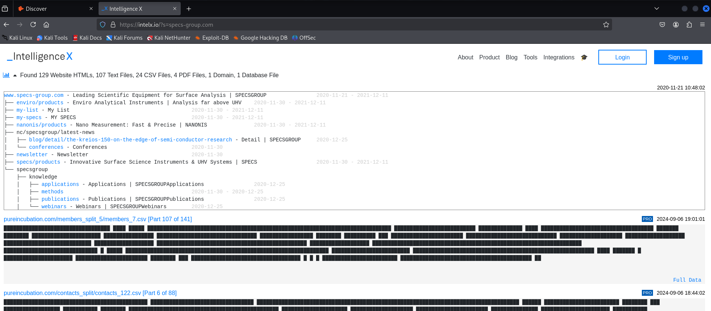

## Discovering Email Addresses

Not only interesting for pentesting, but also, e.g. for sales (find email
addresses of leads).

* [hunter.io](https://www.hunter.io) -- search engine for email addresses and
  other information with fair amount of free searches; allows filtering for
  function within the target organization, e.g. HR or management

  

* [phonebook.cz](https://phonebook.cz) -- recommended here, but no free access
  to meaninful data any more, all information is blacked out

  

* [voilanorbert.com](https://voilanorbert.com) -- free plan, but account
  creation did not work yet
* Chrome extension **Clearbit Connect** -- community edition lets one find up
  to 100 emails per month
* [emailhippo](https://tools.emailhippo.com) -- verify whether a found email
  address really exists
* [email-checker.net](https://email-checker.net/validate) -- validate email
  addresses without interacting directly with the target. Seems to work well.
  There is also an API that might be usable for automation.

Generally, access to many email addresses is valuable information already,
since it allows password spraying (trying email addresses from an exported list
with passwords from a list with popular passwords).

Google search is a good starting point for hunting information, then go to
hunter.io or phonebook.cz to find their email address or (better) email format.

If email addresses show up in breached data, e.g. in the
[haveibeenpwned.com](https://haveibeenpwnd.com) database, the email address or
address format must have existed in the past.

The "forgot password" function in many login forms often may offer helpful clues,
e.g. to check if two emails belong to the same person.

## Gathering Breached Credentials with Breach-Parse

* Download repository with bash script from [TCM's Github](https://github.com/hmaverickadams/breach-parse)
* Script will download a 44 GB file (extracted) via Bittorrent
* THM has data stored in `/opt/breach-parse`: email address:password pairs from
  data breaches, alphabetically sorted into folders. Data source: dark web.
* bash script will parse the data and store the relevant data sets into text
  files
* Alternative approach will be shown in next video: DeHashed
* Watch out for repeat offenders and similar patterns (both, emails and
  passwords, but particularly password patterns)
* **Credential stuffing**: trying username:password pairs if we already know the
  username and have a shortlist of possible passwords. If we only know the
  username, but have to try a long list of common passwords: **password spraying**.
* This is an important and very critical part of information gathering and part of
  every assessment.

## Hunting Breached Credentials with DeHashed

* Information presented in the course could change since services get shut down 
and new ones emerge. There is always more out there, the methodology and
thought process is what matters.
* [Dehashed](https://dehashed.com) is a paid service, but a very good one and
  absolutely worth it (TCM: fast, maintained, allows search by many categories,
  which allows to connect the dots, e.g. a Tesla email address to a private email
  address, etc.).
* [hashes.org](https://hashes.org) is a database to search for hashes and find
  the mating password
* General reasoning: use whatever starting point we have and look for related
  information and try to work our way forward and find more information, e.g.
  hashes, IP addresses, user names, etc.. Do not rely on a single tool, just
  keep the thought process (and red yarn) in mind!

