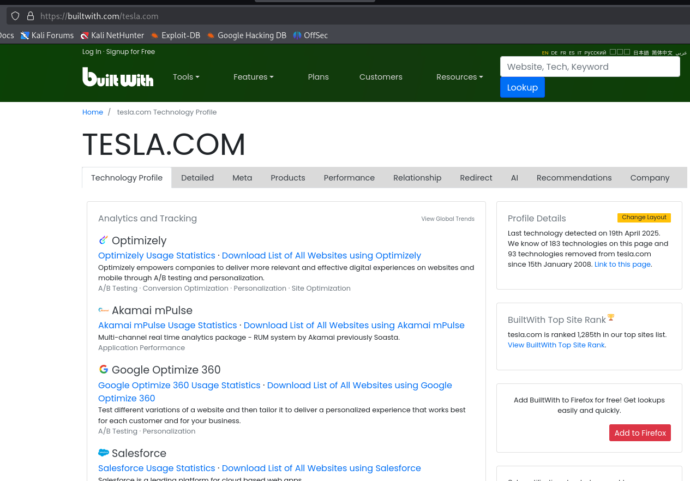
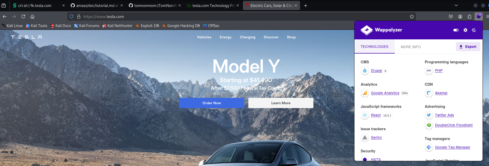
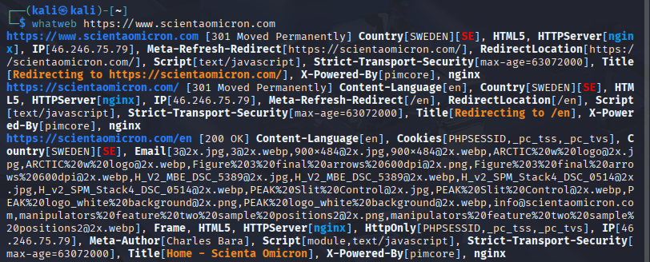
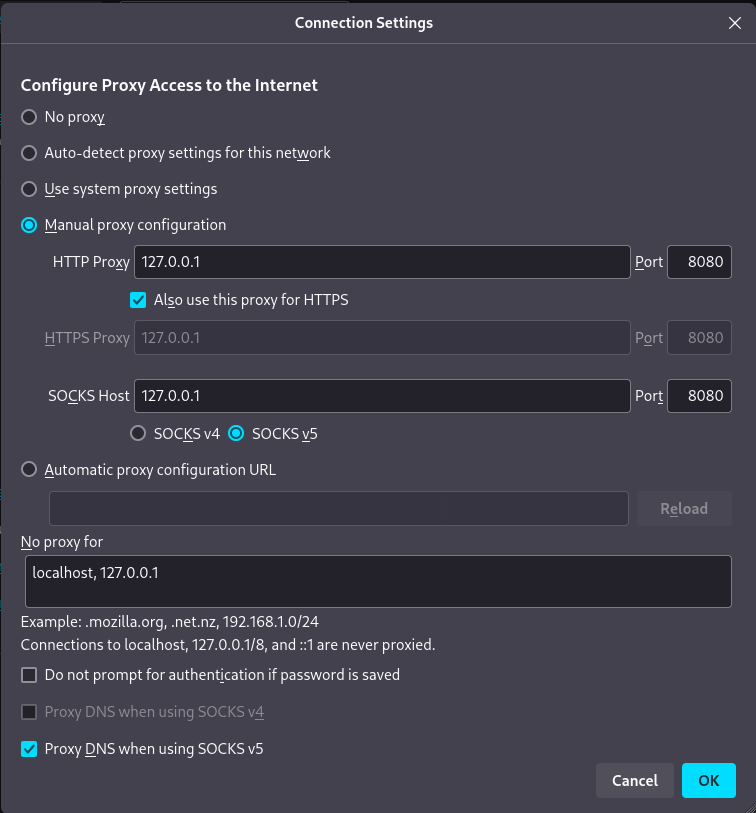
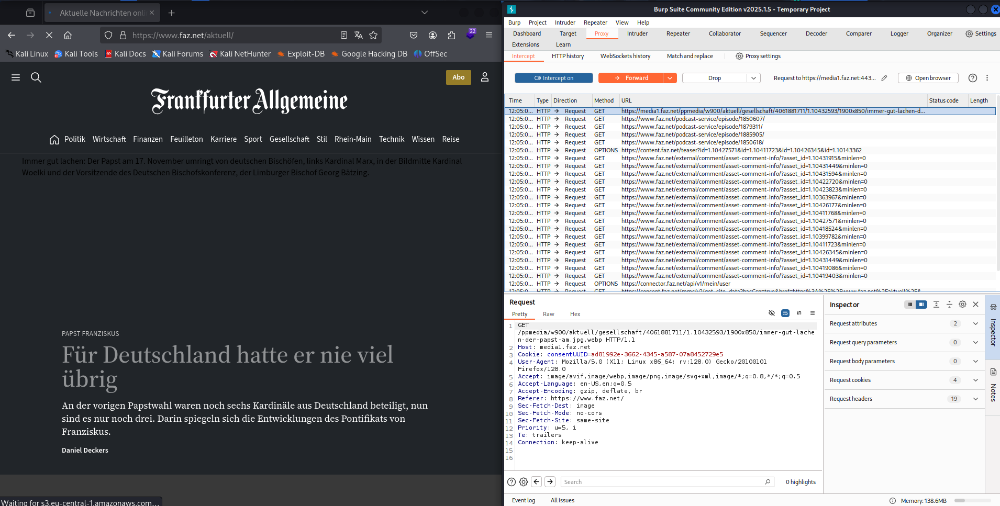

## Hunting Subdomains

* Web information gathering: passive and active methods to find subdomains are
  very important
* First step, especially for web penetration testing or bug bounty hunting: What
  subdomains are related to the website / domain that we are pentesting? We need
  to find these subdomains to make sure we do not miss any vulnerable websites on
  these sudomains.
* **sublist3r** is a Python script that can be installed under Kali Linux
  (`sudo apt install sublist3r`) and allows to search for subdomains. Usage:
  `sublist3r -d tesla.com` (ignore error messages). Always check the help
  function: use -t to adjust the number of threads used and thus speed up the
  scan. Similar to TheHarvester, but apparently also a bit outdated.
* Interesting subdomains: dev, test, sso (single sign-on), vpn, qa, mail, also
  look for sub-domains that tell what technologies are used on the website.
* [crt.sh](https://crt.sh) uses registered certificates to find subdomains.
  Uses "%" as wildcard, searches for sub-sub-domains, too.
* Additional tool to find subdomains: [OWASP
  Amass](https://github.com/OWASP/Amass), already installed on Kali 2025.1.
  Running Amass takes a very long time!
* Use probing tools, e.g. [Tomnomnom's HTTProbe](https://github.com/tomnomnom/httprobe),
  to check in an automated way which subdomains are alive and which ones are not.
* Youtube video ["How to Find Subdomains"](https://www.youtube.com/watch?v=Yl-hjAVwYFo):
    - Find subdomains ("-passive" deprecated, standard setting):   
      `amass enum -d tesla.com -passive -o tesla.txt`
    - Find active subdomains:   
      `massdns -r /root/Downloads/massdns/lists resolvers.txt -o S -t A tesla.txt > tesla2.txt`
    - Remove A and CN entries:   
      `sed "s/A.*//" tesla2.txt | sed "s/\..$//" > tesla3.txt`

## Identifying Website Technologies

Enumeration also includes the analysis what technologies a website is built
with. The following tools can be used for this purpose:

* [BuiltWith](https://builtwith.com) -- technology information profiler tool.
  Look for frameworks, programming languages, etc. and version numbers  to identify
  vulnerabilities. Detailed information is only available for users with a
  yearly subscription.

   

* **Wappalyzer** plugin for Firefox -- limited amount of information is freely
  available, other information requires a paid upgrade. Shows less information
  than BuiltWith and is closer to active reconnaissance.

  

* **whatweb** application is preinstalled on Kali Linux 2025.1, delivers some
  version information.

  

Using several tools tends to give us more information than just a single tool.

## Information Gathering with Burpsuite

The web proxy **Burpsuite** is installed on Kali Linux by default. It
intercepts traffic and lets us modify and re-send messages. Upon start of the
commmunity edition, click "Temporary project" followed by "Start Burp" on the
next screen.

**Configure Firefox for Burpsuite:**

* Start Firefox, click on the "Hamburger" (Start menu), then click on "Settings"
  and scroll down to "Network settings" at the bottom of the "General" settings
* Set proxy to 127.0.0.1, port 8080 and click on "Also use this for HTTPS".
  Fill in the same info for SOCKS proxy (v5), click OK.
  
  

* Open a new tab and enter "https://burp", click on "CA Certificate" in the
  upper right corner and download the certificate. Go to the "Settings" tab,
  then to "Privacy & Security", search for "Certificates", click "View
  Certificates" and import the downloaded certificate. Confirm both checkboxes
  and click "OK".
* Burpsuite and Firefox are then set up to intercept web traffic. Go to
  Burpsuite and click "Intercept on" on the "Proxy" tab. Upon going to a new
  website, each HTTP request will first be shown in Burpsuite and has to be
  forwarded manually. The requests can also be changed before they are forwarded.

  
