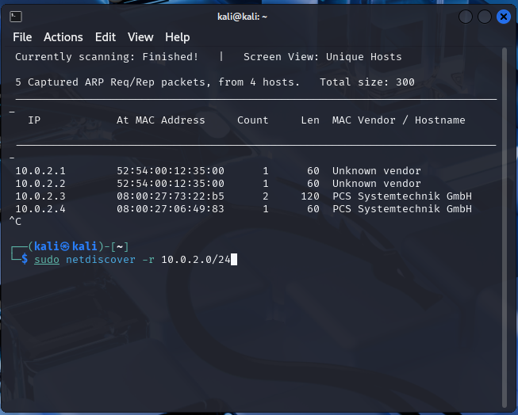
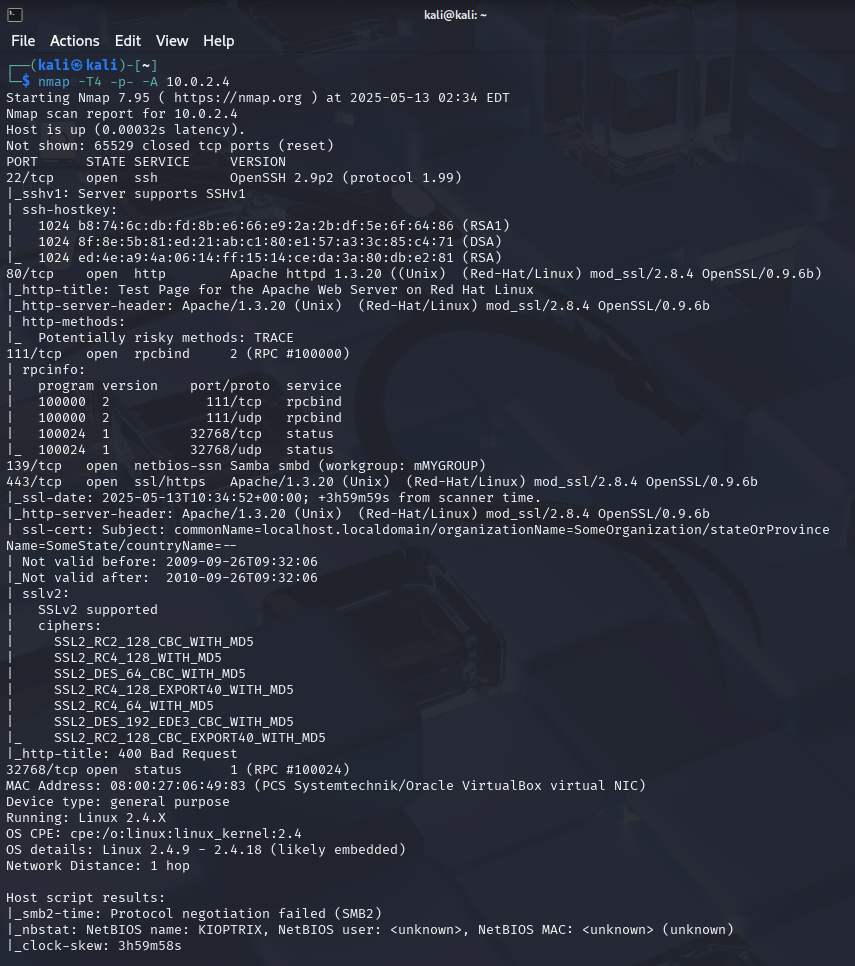
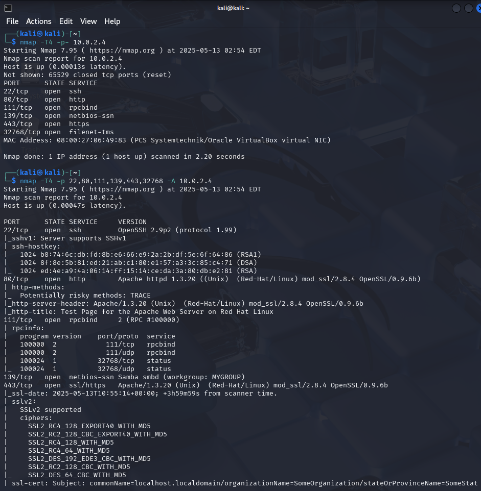

# Scanning with NMap

Login credentials for Kioptrix level 1: `john:TwoCows2`. Use this to figure out
the IP address of the VM, if necessary. `ifconfig` and `ip addr` will not work
on this machine since it is already too old, but using `ping` on an arbitrary IP
address or URL will show the host ip.

## Netdiscover

From Kali Linux, find the IP address of the Kioptrix machine with the built-in
Kali tool `arp-scan -l`, which performs an ARP scan, which is also what
`netdiscover` does. Look for `VMware, Inc.` (in my case, `PCS Systemtechnik
GmbH`, though). `<CTRL>-<C> kills the netdiscover session.

## NMap

`NMap` (Network Mapper) scans for open ports and services. It can discover open
ports with something similar to the 3-way handshake (SYN - SYN/ACK - ACK). The
process called stealth scanning is now the default mode, it used to be an option
chosen with the switch `-sS`. Actually, the stealth scan is not very stealthy.
It can be picked up in networks with good security (though usually < 20%).

To be stealthy, nmap sends an RST instead of an ACK flag to terminate the
connection before it has been set up.

`nmap -T4 -p- -A <IP address>`

* `-T4` : choice in speed from 1 (slow) to 5 (fast)
* `-p-` : scan all ports; If we leave away -p completely, the top 1000 ports
will be scanned. Otherwise one can also scan a port list or range with `-p`
(0-65535).
* `-A` : scan for all available information (operating system, version, etc.)

Use `nmap --help` for more information on options.

* Ping scan `-sn` can be used to find all machines on a subnet quickly.
* If we know a machine is there, use `-Pn` to enforce that it is treated as
online, even if it does not respond to a ping.
* `-sU` : UDP scan, takes forever to scan because being a connectionless
protocol,  it does not have an instant response time. Recommendation: scan only
the top 1000 ports with `-p` instead of `-p-`, and remove the `-A` option.
* Use `-sV` (probe open ports for version info), `-sC` (script scan) and `-O`
with the `-A` option
* To gain speed, use `-p-` first without `-A` and use the `-A` option only on
the found open ports in the second step. This can also be scripted.
* Nmap is typically used to scan while one is working on OSINT in parallel

Now we can look up the information on the open ports and services running on
these ports and try to find exploits to use this information.

