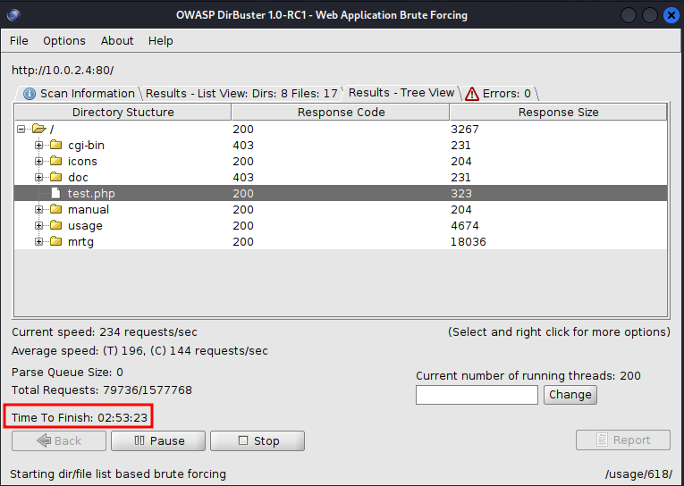
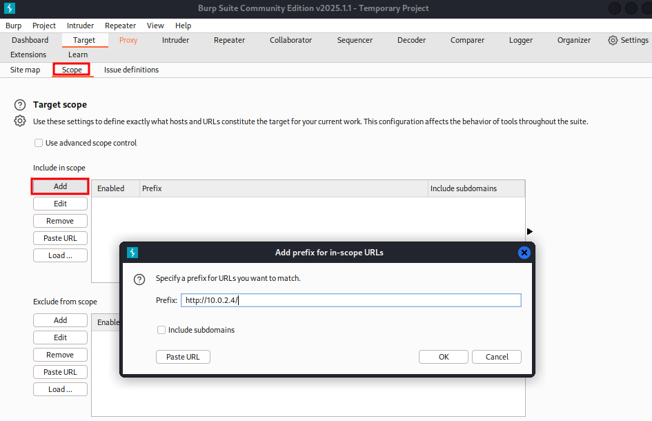

# Scanning with NMap

Login credentials for Kioptrix level 1: `john:TwoCows2`. Use this to figure out
the IP address of the VM, if necessary. `ifconfig` and `ip addr` will not work
on this machine since it is already too old, but using `ping` on an arbitrary IP
address or URL will show the host ip.

## Netdiscover

From Kali Linux, find the IP address of the Kioptrix machine with the built-in
Kali tool `arp-scan -l`, which performs an ARP scan, which is also what
`netdiscover` does. Look for `VMware, Inc.` (in my case, `PCS Systemtechnik
GmbH`, though). `<CTRL>-<C> kills the netdiscover session.

## NMap

`NMap` (Network Mapper) scans for open ports and services. It can discover open
ports with something similar to the 3-way handshake (SYN - SYN/ACK - ACK). The
process called stealth scanning is now the default mode, it used to be an option
chosen with the switch `-sS`. Actually, the stealth scan is not very stealthy.
It can be picked up in networks with good security (though usually < 20%).

To be stealthy, nmap sends an RST instead of an ACK flag to terminate the
connection before it has been set up.

`nmap -T4 -p- -A <IP address>`

* `-T4` : choice in speed from 1 (slow) to 5 (fast)
* `-p-` : scan all ports; If we leave away -p completely, the top 1000 ports
will be scanned. Otherwise one can also scan a port list or range with `-p`
(0-65535).
* `-A` : scan for all available information (operating system, version, etc.)

Use `nmap --help` for more information on options.

* Ping scan `-sn` can be used to find all machines on a subnet quickly.
* If we know a machine is there, use `-Pn` to enforce that it is treated as
online, even if it does not respond to a ping.
* `-sU` : UDP scan, takes forever to scan because being a connectionless
protocol,  it does not have an instant response time. Recommendation: scan only
the top 1000 ports with `-p` instead of `-p-`, and remove the `-A` option.
* Use `-sV` (probe open ports for version info), `-sC` (script scan) and `-O`
with the `-A` option
* To gain speed, use `-p-` first without `-A` and use the `-A` option only on
the found open ports in the second step. This can also be scripted.
* Nmap is typically used to scan while one is working on OSINT in parallel

Now we can look up the information on the open ports and services running on
these ports and try to find exploits to use this information.

## Dirbuster

Preinstalled directory busting tools in Kali Linux:

* **dirbuster**
* **dirb**

The mentioned **gobuster** is actually not installed in Kali 2025.01.

`dirbuster&` starts a Java program with the GUI shown below. Example settings
are shown here, too. The port number is important, there are more wordlists in
the shown folder and even larger ones on the internet.

The wordlists contain large numbers of typical folder and filenames that are
used on webservers. The tool probes whether any of these exist on the website.
One can also add file extensions in the lower right corner, e.g. php, pdf, docx,
etc. On the `Results tree` tab, one can right-click on the found results and
open them directly in a browser. The estimated duration, even with a small word
list, is about 3 hours!

The response codes are broadly classified as follows:

* 200: OK
* 300: Redirect
* 400: Some type of error, e.g. page not found
* 500: Server error

Looking through the found pages, we see a `usage...html` page that shows version
information at the bottom. We can add this to our pentesting report, too. (The
software might or might not run on the webserver.)

We can dig through the results found and check whether we can find any helpful
information. Be mindful of the danger of going down a rabbit hole!

In general, when we are enumerating a website, we are looking for service and
version information, backend directory names and structure, source code, and
potential vulnerabilities shown by Nikto. We can also use tools like
`Wappalyzer' or `BuiltWith`. 

## BurpSuite

In the browser settings (General/Network Settings), switch manually to using
proxy 127.0.0.1:8080 for HTTP(S) and SOCKS v5, then start BurpSuite from the
menu bar. BurpSuite is our friend, especially when we are looking at websites.

If we are looking at real web pages (not a test page as in the Kioptrix case),
we should always look at the source code (right-click on the website, "View Page
Source" in Firefox). Look for comments, user names, passwords, keys, etc..

On the `Proxy` tab, switch `Intercept on`, then reload the website. Right-click
on the request that is intercepted and chose `Send to Repeater`. The
`Repeater` tab will then be highlighted. The `Repeater` lets us modify the HTTP
request manually and shows the response at the same time.

On the `Repeater`tab, we can sometimes see version information as in the
following screenshot (see server header). This is also information that can be
put into the pentesting report.

We can limit the scope to just a URL or IP address using the `Scope` tab and
adding an entry for our website and service, e.g. `http://10.0.2.4/`

