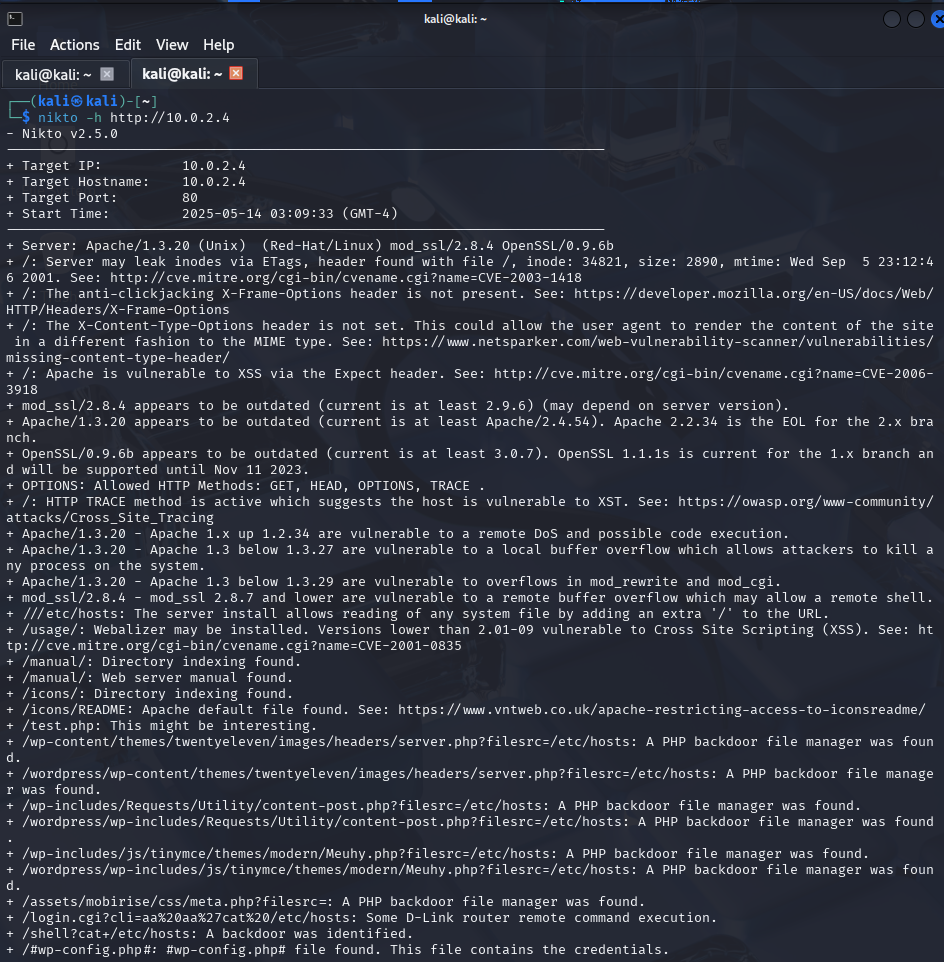
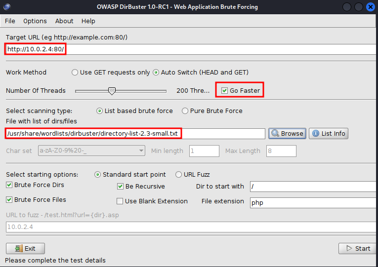
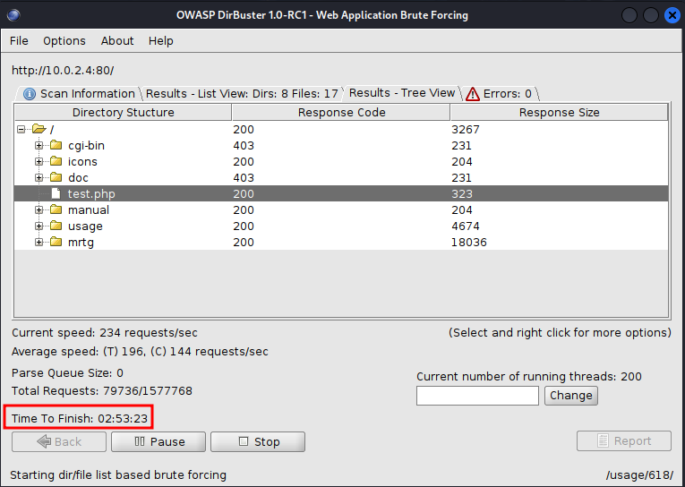
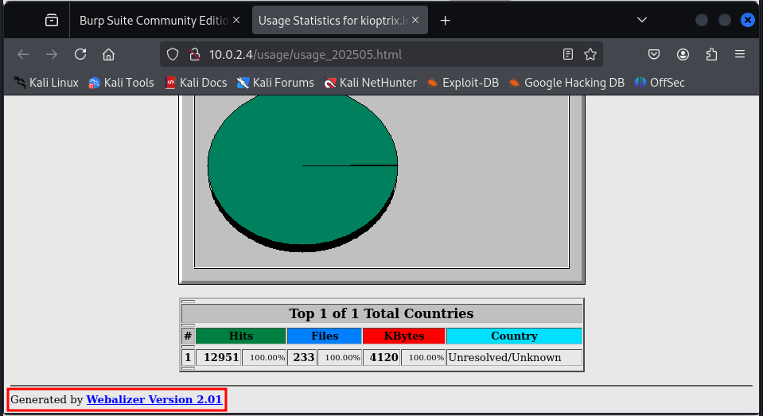
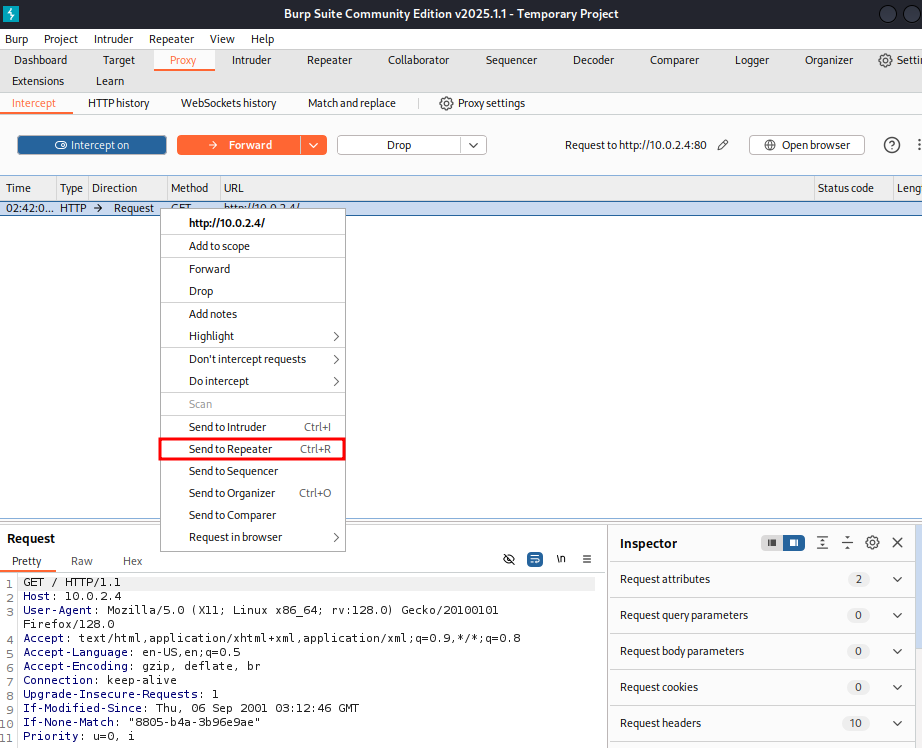
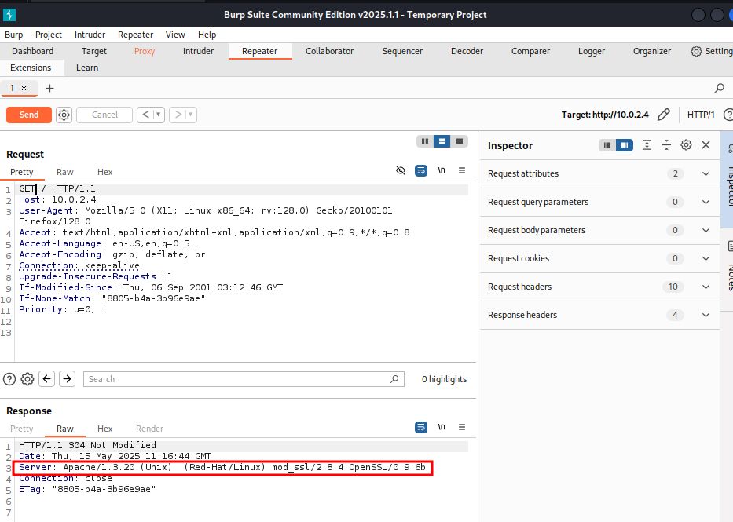
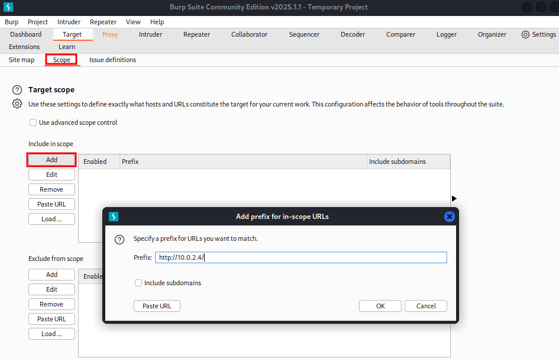

# Enumerating HTTP and HTTPS

Interesting open ports as points of attack from Kioptrix port scan:

* 80 and 443, HTTP and HTTPS
* 139, sometimes in combination with 445, SMB

SMB has been historically bad: WannaCry / EternalBlue, and websites, too. Port
22 (SSH) is less prone, e.g. through brute force attacks or stolen credentials
-- not common as attack target.

If there is a website (80, 443), try and go to the website first. The website
might give clues about the architecture on the target, e.g. the web server and
operating system, diligence (open ports for no reason?), version numbers, naming
conventions, etc.. *Make the findings part of the pentesting report!*

## Nikto

Nikto is a web vulnerability scanner that is particularly helpful for beginners
(Vulnhub, CTF, HackTheBox). If the website runs good security measures, the
Nikto scans might be blocked (oftentimes not the case!).

 

`nikto -h http://10.0.2.4`

`-h` : specify host

Look for outdated software for a pentesting report, also the mentioned
vulnerabilities and exploits (here: mod_ssl vulnerable to remote buffer overflow).
Save the scan for later!

## Dirbuster

Preinstalled directory busting tools in Kali Linux:

* **dirbuster**
* **dirb**

The mentioned **gobuster** is actually not installed in Kali 2025.01.

`dirbuster&` starts a Java program with the GUI shown below. Example settings
are shown here, too. The port number is important, there are more wordlists in
the shown folder and even larger ones on the internet.

The wordlists contain large numbers of typical folder and filenames that are
used on webservers. The tool probes whether any of these exist on the website.
One can also add file extensions in the lower right corner, e.g. php, pdf, docx,
etc. On the `Results tree` tab, one can right-click on the found results and
open them directly in a browser. The estimated duration, even with a small word
list, is about 3 hours!

The response codes are broadly classified as follows:

* 200: OK
* 300: Redirect
* 400: Some type of error, e.g. page not found
* 500: Server error

Looking through the found pages, we see a `usage...html` page that shows version
information at the bottom. We can add this to our pentesting report, too. (The
software might or might not run on the webserver.)

We can dig through the results found and check whether we can find any helpful
information. Be mindful of the danger of going down a rabbit hole!

In general, when we are enumerating a website, we are looking for service and
version information, backend directory names and structure, source code, and
potential vulnerabilities shown by Nikto. We can also use tools like
`Wappalyzer' or `BuiltWith`. 

## BurpSuite

In the browser settings (General/Network Settings), switch manually to using
proxy 127.0.0.1:8080 for HTTP(S) and SOCKS v5, then start BurpSuite from the
menu bar. BurpSuite is our friend, especially when we are looking at websites.

If we are looking at real web pages (not a test page as in the Kioptrix case),
we should always look at the source code (right-click on the website, "View Page
Source" in Firefox). Look for comments, user names, passwords, keys, etc..

On the `Proxy` tab, switch `Intercept on`, then reload the website. Right-click
on the request that is intercepted and chose `Send to Repeater`. The
`Repeater` tab will then be highlighted. The `Repeater` lets us modify the HTTP
request manually and shows the response at the same time.

On the `Repeater`tab, we can sometimes see version information as in the
following screenshot (see server header). This is also information that can be
put into the pentesting report.

We can limit the scope to just a URL or IP address using the `Scope` tab and
adding an entry for our website and service, e.g. `http://10.0.2.4/`

