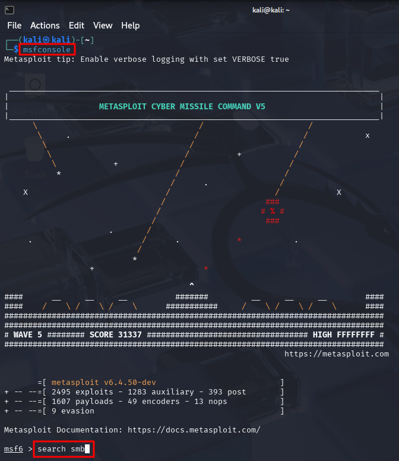
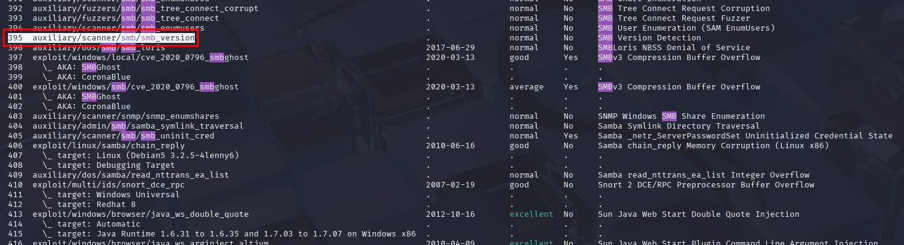
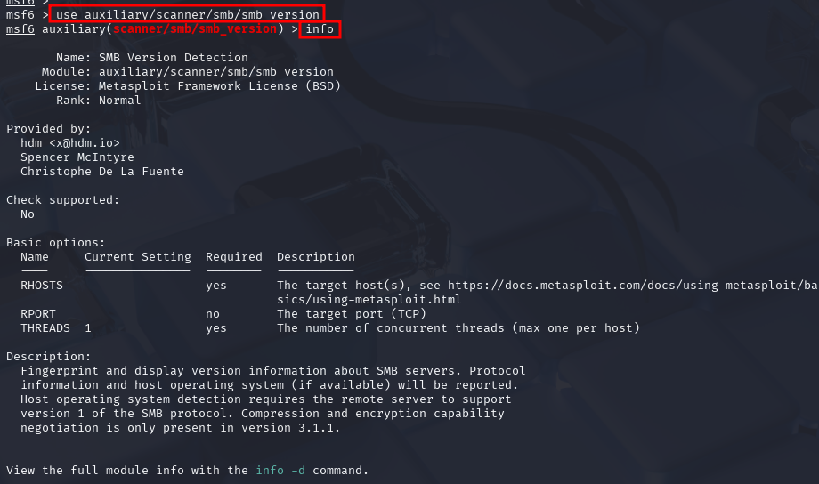
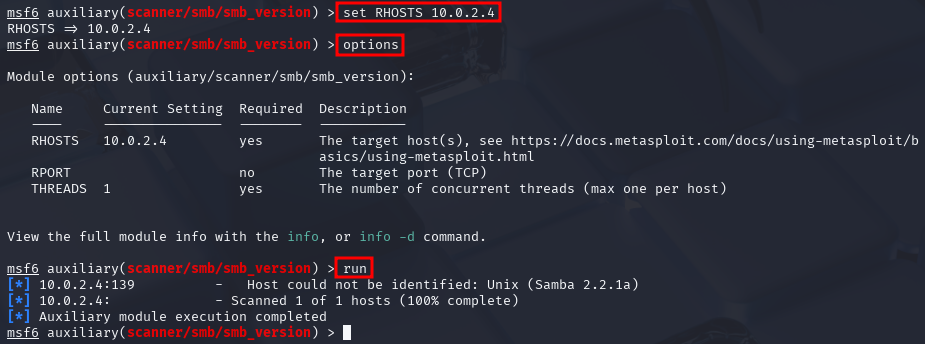
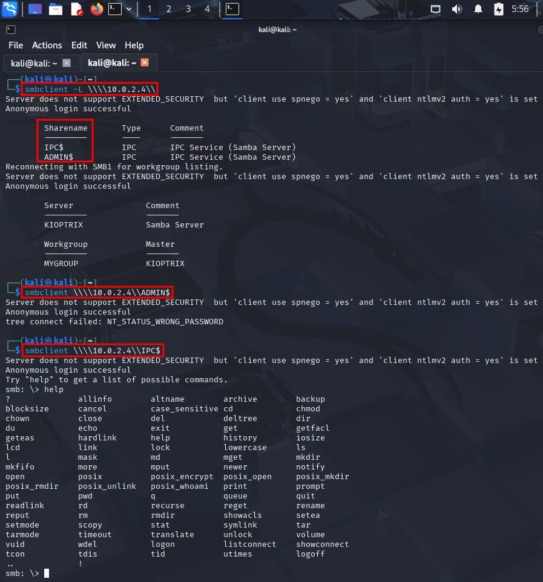

# Enumerating SMB

SMB (Server Message Block, port 139) is a **file share**, it is commonly used in
work environments. Start with information from NMap scan. `-A` runs scripts and
delivers some enumeration information ("Host script results"):

* 139/tcp   open  netbios-ssn Samba smbd (workgroup: MYGROUP)
* nbstat: NetBIOS name: KIOPTRIX, NetBIOS user: <unknown>, NetBIOS MAC: <unknown> (unknown)
* smb2-time: Protocol negotiation failed (SMB2)

## Metasploit

Start Metasploit from the terminal with `msfconsole`. one of the most commonly
used pentesting tools in the field.

We can search for SMB-related tools in Metasploit from its command line with
`search SMB`. There are 447 results (May 2025).

Metasploit's tools are grouped into different categories, such as exploits,
auxiliary modules, etc. (see starting screen). We can use this categories to
find the right module for SMB enumeration more quickly.

We can either copy the path information within the Metasploit tools or just
remember the number among the search results (here: 395). With some practice, it
becomes easier to find the right tool for the job using the search function and
the structure of the tools included in Metasploit. `use
auxiliary/scanner/smb/smb_version` or `use 395` will load the module. The name
of the loaded module is then displayed in red in the Metasploit command prompt.
Typing `info` will display a short description of the module, including the
parameters that need to be defined to use the module, but also its description.

The option `RHOST(S)` always specifies the target address, either one or
several. In the latter case it can be in CIDR notation. Metasploit is not
case-sensitive. `set RHOSTS 10.0.2.4` will set the target IP address to
10.0.2.4.. The parameters can be double-checked with the `options` command. When
all parameters are set correctly, the module is started with `run`.

The information about the SMB version running on the target (Samba 2.2.1a) is
valuable information that we should write into our pentesting report.

The information to gather information and enumerate is the skill the sets one
apart from other pentesters. The exploitation is often the easier step.

## smbclient

`smbclient` can be used to attempt to connect to the found file share with
anonymous login. We might find valuable information in the files on the file
share.

`smbclient -L \\\\10.0.2.4\\`

* `-L`: list the discovered file shares 
* IP addresses with double backslashes (character-escaping on Linux)

The scan has discovered two file shares: `IPC$` and `ADMIN$`. The `IPC$` is
usually not valuable, but access to `ADMIN$` would probably be very valuable.

We can try to connect anonymously to a file share, e.g. `IPC$`, with

'smbclient \\\\10.0.2.4\\IPC$`

This was successful in the case of Kioptrix, we get an SMB prompt. It did not
work with the `ADMIN$` file share. However, we are not allowed to execute any
commands at the prompt, therefore we leave with `exit`.

# Enumerating SSH

We know from the NMap scan that Kioptrix has an open ssh port (22), running
OpenSSH 2.9p2 (should be added to the pentest report). We can try to connect via
SSH to see if we can get any banner back.

`ssh 10.0.2.4` returns error messages about missing key exchange method and
cipher. This can be healed as follows:

* `ssh 10.0.2.4 -oKexAlgorithms=+diffie-hellman-group1-sha1` in the first step,
followed by
* `ssh 10.0.2.4 -oKexAlgorithms=+diffie-hellman-group1-sha1-oHostKeyAlgorithms=+ssh-rsa` for the missing host key type and
* `ssh 10.0.2.4 -oKexAlgorithms=+diffie-hellman-group1-sha1 -oHostKeyAlgorithms=+ssh-rsa -c
aes128-cbc` to add a common cipher

However, all of this does not help since we are asked for the root password, and
the SSH server does not display any banner. We stop with the SSH enumeration at
this point. The way to get into SSH is through brute-force password attacks like
password spraying.
