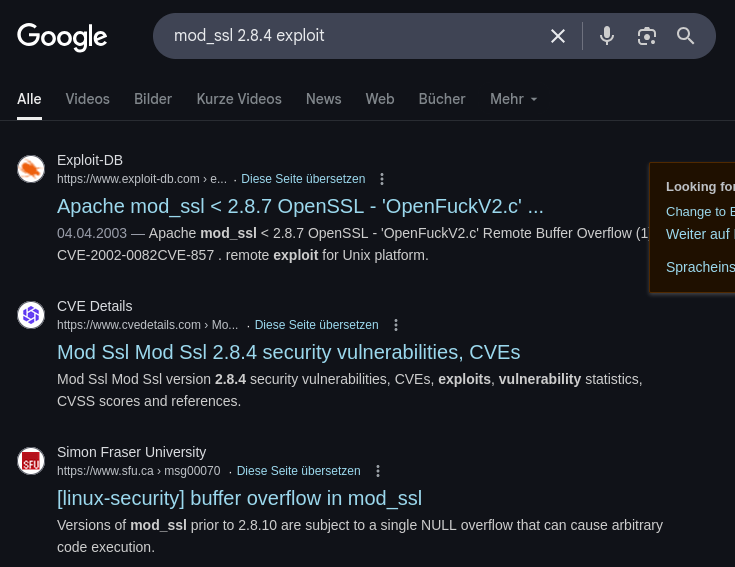
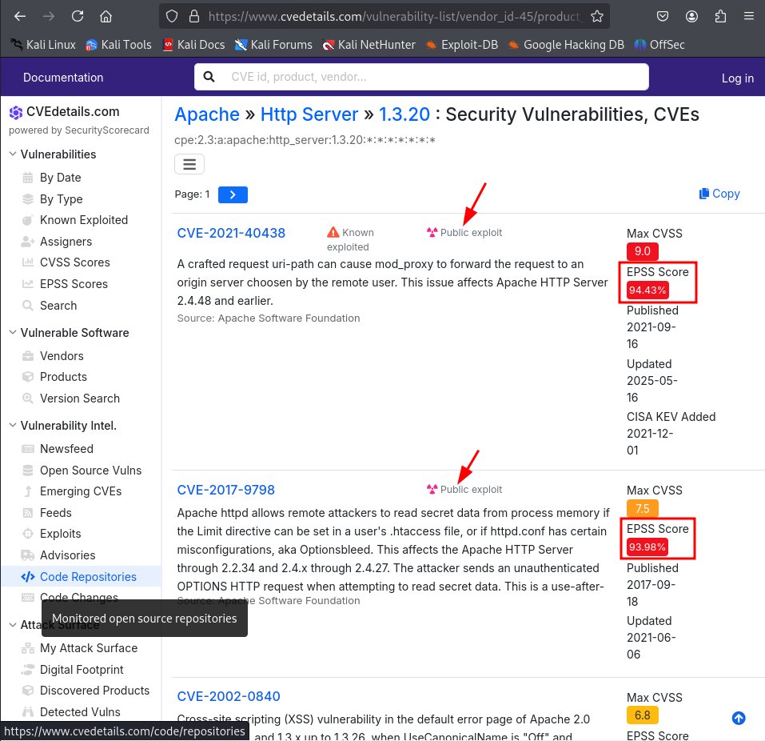
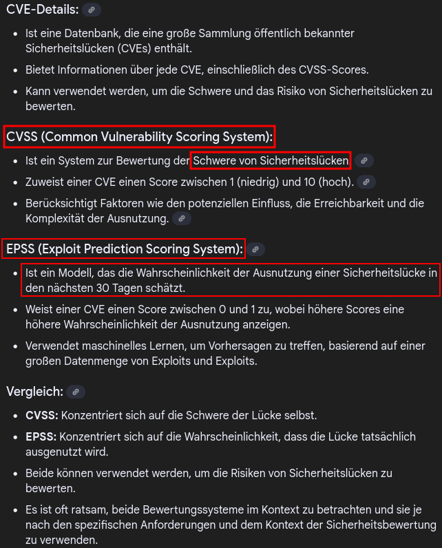
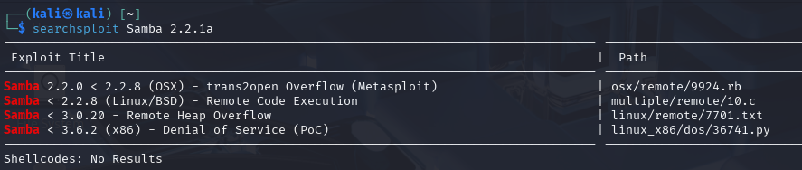
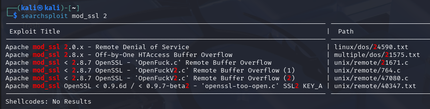

# Researching Potential Vulnerabilities

In the next step, we can use our notes to search for potential exploits for the
identified vulnerabilities (with nmap, nikto, metasploit), which we have stored
in our draft pentest report:

* Ports 80/443 (HTTP/HTTPS): Apache httpd 1.3.20, mod_ssl 2.8.4, OpenSSL 0.9.6b
* Port 139 (SMB): Samba 2.2.1a
* Port 22 (SSH): OpenSSH 2.9p2
* Webalizer 2.01

80/443 and 139/445 are generally the most attractive to TCM.

## Google

If source code is available, skim and try to figure out if it is not harmful for
the attacking machine. If the code stems from `Exploit Database`, we can assume
that the code is trustworthy.

* [`Exploit Database`](https://www.exploit-db.com/exploits/764), includes C
source code of "OpenFuck" to exploit buffer overflow and a vulnerable app to
test the code. Dated, might no work any more.
* [`OpenLuck` on github](https://github.com/heltonWernik/OpenLuck)

We can do the same for the Apache server:

* [`CVE Details`](https://www.cvedetails.com/vulnerability-list/vendor_id-45/product_id-66/version_id-369927/Apache-Http-Server-1.3.20.html?page=1&order=5)
can be sorted by EPSS score to identify the most attractive vulnerabilities (red
is a critical vulnerable)
* OpenSSL is tied to the mod_ssl, therefore we do not have to research it

The same for SMB (Samba 2.2.1a):

* One of the hits is from Rapid 7, the company behind `Metasploit`: the
[`trans2open` buffer
overflow](https://www.rapid7.com/db/modules/exploit/linux/samba/trans2open/).
There is information on a `Metasploit` module that can be used. 
* There is also a hit on [`Exploit DB`](https://www.exploit-db.com/exploits/7),
a Perl script with instructions on the options in the header of the script
* There is also a hit in the [`Nessus Plugins`](https://www.tenable.com/plugins/nessus/122056) by Tenable

## searchsploit

`searchsploit` is a command line tool that downloads the information from the
`Exploit DB` with every Kali update, so that we can also use the database
offline. If we do not find results with `searchsploit`, we may have been to
specific with the search terms because `searchsploit` searches for the exact
term given.

Learning to read the `metasploit` directory structure is very helpful.
Everything under `\remote` stands for remote code execution.

