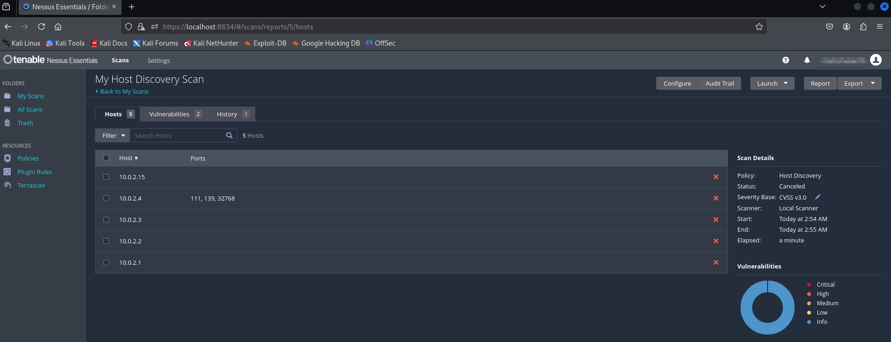
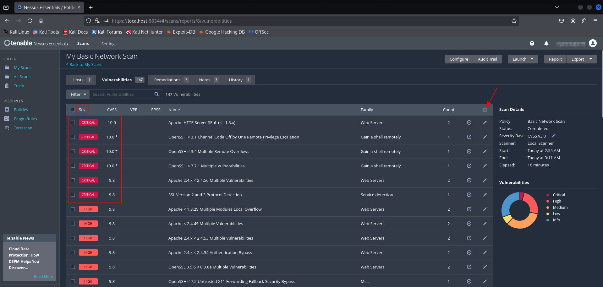
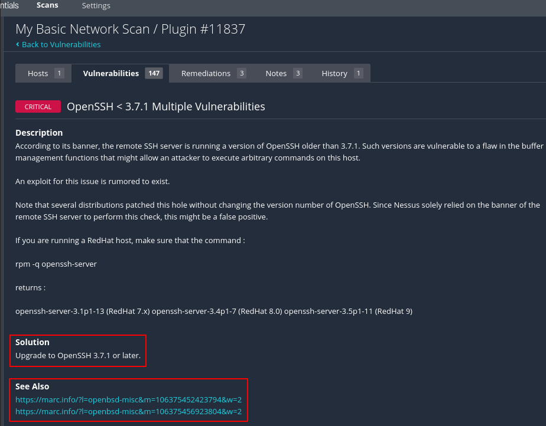

# Scanning with Nessus (Parts 1 & 2)

Nessus is a **vulnerability scanner**. The scans take some time, therefore it
makes sense to start them right away so that they run while we do our OSINT.

**External vs internal assessment?**

* Download 64-bit Debian version of Nessus Essentials from Tenable, use `dpkg -i nessus...deb`.
* To start Nessus, type `sudo systemctl start nessusd.service`, then start the
browser and enter the URL `https://localhost:8834/`.
* Software update, downloads, installation of plugins, etc. takes quite a while

* Basic Network Scan:
    * Click the play button to start the scan

* Advanced Network Scan gives more control and options than the Basic Network Scan.
    * UDP scan takes forever and cannot distinguish between open and filtered
    ports with 100% certainty.
    * SYN scan = stealth scan
    * We can use `Hydra` to try to brute-force passwords

As a beginner, use Basic Network Scan as the starting point, then gradually try
the Advanced Network Scan to see if we can get more input than just from the
Basic Scan.

The grouping of vulnerabilities can be switched off using the gear-wheel in the
upper right corner ("Settings") and chosing `Disable Groups`. After that we can
show and sort the individual findings by severity ("CVSS").

If we click on a particular vulnerability, we get a short summary of the
problem, links to websites offering more details ("See Also"), and a suggestion
for a solution ("Solution").

If we are conducting a penetration test, the level to which we report
vulnerabilities may vary with the number and severity of the ones found. If
there are a lot of vulnerabilities, we might skip the ones with low CVSS scores.
Some vulnerabilities also appear more than once, e.g. OpenSSH or Apache in the
Kioptrix scan. In that case we may subsumize them. In any case, we should
download the scan report and export it into a Nessus file (XML) or a report
(pdf, csv, html) that we provide to the customer together with our pentest
report.

Never trust the vulnerability scanner alone, always double-check reported
vulnerabilities really do exist! Rather than providing screenshots of Nessus in
our test report, we should rather show screenshots of our own verification. A
vulnerability scanner is just a convenience tool for a pentester.

TCM owns two commercial software tools for pentesting: Nessus and Burpsuite Pro.
Nessus Essentials is limited in its functionality. It does not allow the user to
scan websites for vulnerabilities.

