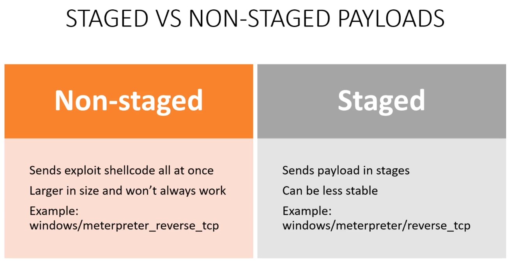

# Staged vs Non-Staged Payloads

 A **payload** is code that we send to the victim machine to get a shell. If one
 type of payload fails, try the other one. Notice the extra forward slash in the
 `metasploit` path, which indicated that the staged payload.

