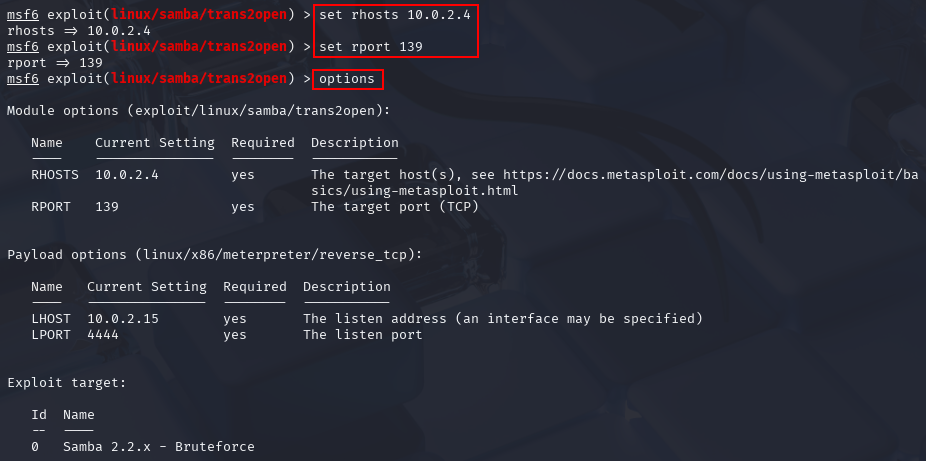

# Gaining Root with Metasploit

`Metasploit` allows us to exploit the vulnearbilities that we have found in an
automated way. We start by typing `msfconsole` at the command prompt.

We can search for e.g. certain software versions on the target using the
`search` command at the Metasploit prompt. The database is identical with the
`searchsploit` command at the Kali prompt.

`search trans2open` gives the following results (with Kioptrix1 as the target):

We know from our enumeration that the target is running Linux, therefore we pick
the Linux version of the exploit with `use 1`.

The command prompt then includes the path to the chosen exploit. We can display
the current settings that are used for the exploit with the `options` command.

`RHOST` and `RPORT` are the IP address and port on the target machine, `LHOST`
and `LPORT` the IP and port of our attacking machine. The local IP address is
sometimes not selected correctly, it should therefore be checked as well. The
default port 4444 is typical for the Meterpreter shell and can trigger warnings
in the IT infrastructure of the victim, hence it should be changed for real
engagements.

The settings can be changed using the `set` command. Before we launch the scan,
we can double-check all settings by using the `options` command once more.

The exploit can be started using either the `run` or the `exploit` command.

The attempt was not successful yet (interrupt with <CTRL>C). It brute-forced
some return addresses and was successful as we can tell by the "Sending
stage..." log output, but the Meterpreter session that it tried to start always
failed. When we enter `options` again, we are shown the payload that was used,
and we can see that it was a staged payload. Instead, we can try another payload
until we find one that works:

`set payload linux/x86/ <TAB><TAB>` will display a list of payloads that we can
chose from. We pick a non-staged payload, `shell_reverse_tcp` (use
auto-complete!).

When we run the exploit again, this time using `run` instead of `exploit`
(equally good), we finally get a shell, as we can verify with the Linux commands
`hostname` and `whoami` (showing we are logged in as root).

