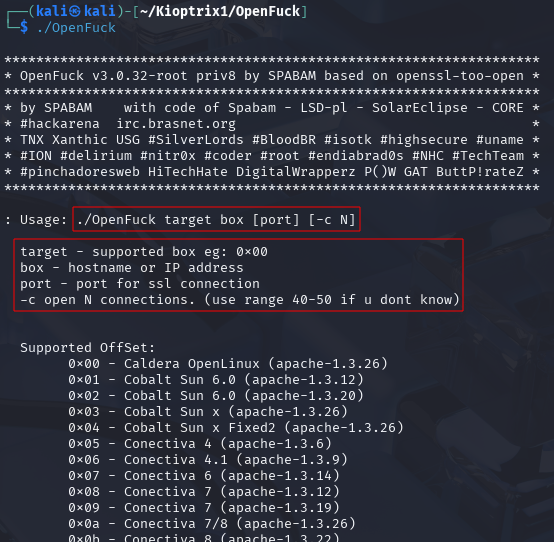
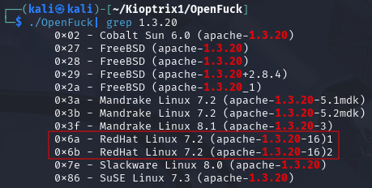
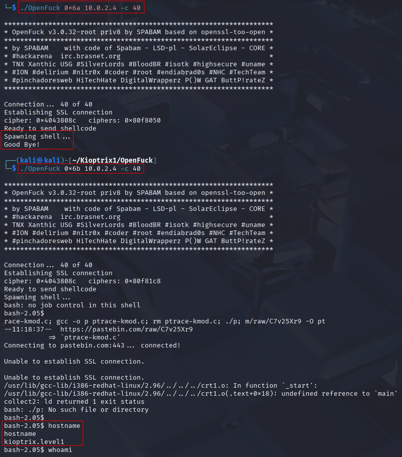

# Manual Exploitation

The OpenFuck exploit is outdated and has been superseeded by Open**Luck**, which
can be found on [Github](https://github.com/heltonWernik/OpenLuck). Download and
installation procedure are described on the Github page.

When the `OpenFuck` binary is executed without any parameters, it provides a
short description of the necessary input parameters. (This is often a good first
step.)

The supported offset values refer to a buffer overflow exploit. We know from the
enumeration phase that we are probably dealing with a Red Hat Linux and that the
`Apache` version is 1.3.20. We can filter for that version number in the long
parameter list using the `grep` command:

The first attempt with the target parameter `0x6a` is not successful, the
connection is closed immediatedly. The second attempt with `0x6b` is successful
(most of the time) and gives us a `bash` shell with root login as the `hostname`
and `whoami` commands show.

In contrast to my 2022 attempt, I only get logged in as user `apache` in 2025.
There are a couple of error messages while the exploit is running.

In penetration testing, `Metasploit` is a more robust and more commonly used
tool than manual exploitation. The OSCP exam allows only one use of `Metasploit`
during their exam. Pentesters use the most practical tool for the job, and that
is oftentimes `Metasploit`.

In the post-exploitation, we strive to find out what the infrastructure around
the popped machine is, e.g. is there a 2nd NIC, try to see the ARP and routing
tables, get hold of the `/etc/shadow` file, which contains the hashes of the
user passwords, whereas `/etc/passwd` does not. We can download the hashes and
try to crack them offline. With root level access, we can start enumerating the
files on the hacked machine again.

<!---
span style="color:green;font-weight:700;font-size:20px">
markdown color font styles

