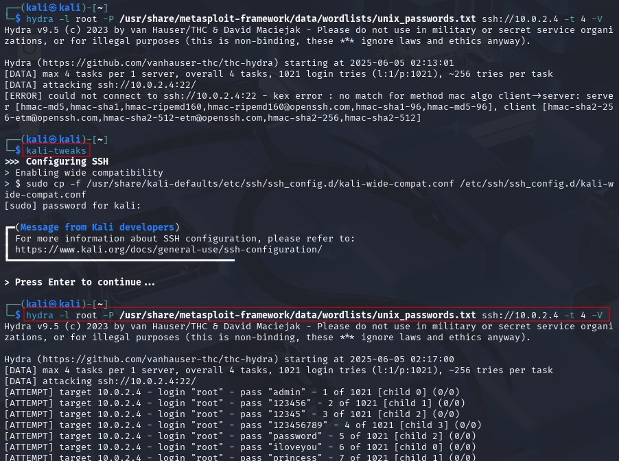
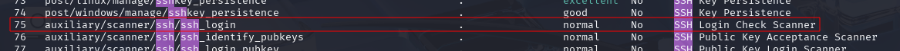
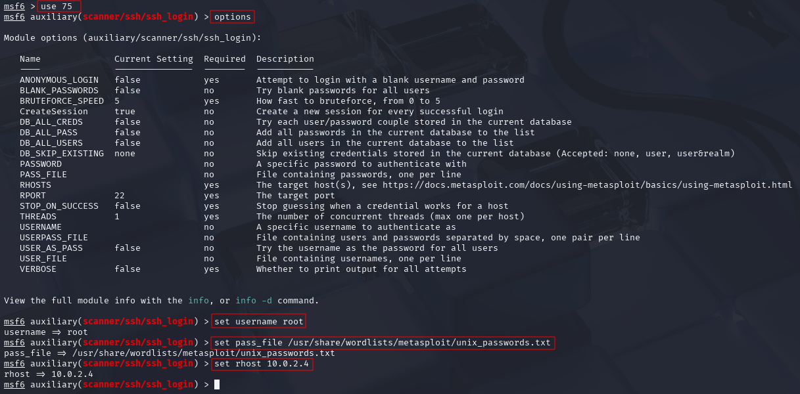
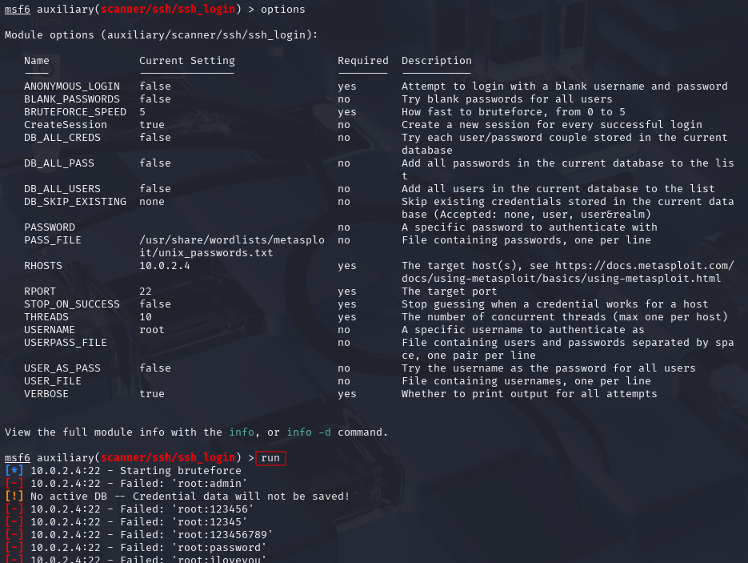

# Brute Force Attacks

SSH is usually not a low hanging fruit. We can try to brute-force against it or
use weak or default passwords. This is also a test of password strength and a
test of a blue team, which should notice if a (loud) brute force attack is going
on.

## Hydra

Hydra is a brute force tool with the following syntax:

`hydra -l root -P /usr/share/wordlists/metasploit/unix_passwords.txt
ssh://10.0.2.4:22 -t 4 -V`

* `-l`: login name, here: `root`
* `-P`: load several passwords from a file
* `-t 4`: run 4 threads in parallel (default: 16)
* `-V`: verbose, show login + password on each attempt

Capitalization is used to distinguish between different settings, e.g. `-v` and
`-V` lead to different results.

After some fiddling with the outdated ssh settings on the Kioptrix1 machine, I
have found the following suggestion on the TCM Discord server, which solved the
SSH connection problem: enter `kali-tweaks` on the command line, then enable
wide compatibility mode for SSH.

After that, the brute force attack with Hydra works in principle, but the
password is not found with the used password list.

## Metasploit

As an alternative to Hydra we can also use Metasploit for the brute force
attack. Use `search SSH`, then we look for a scanner under the `auxiliary`
modules.

We chose the module and set the options as follows, then we double-check them by
typing `options` once more and perhaps use `set threads 10` and `set verbose`
before we start the scan with `run`.

Despite the 10 threads, the scan seems to be slower than the one with Hydra, but
in general, it works, too.

<!--
span style="color:green;font-weight:700;font-size:20px">
markdown color font styles

