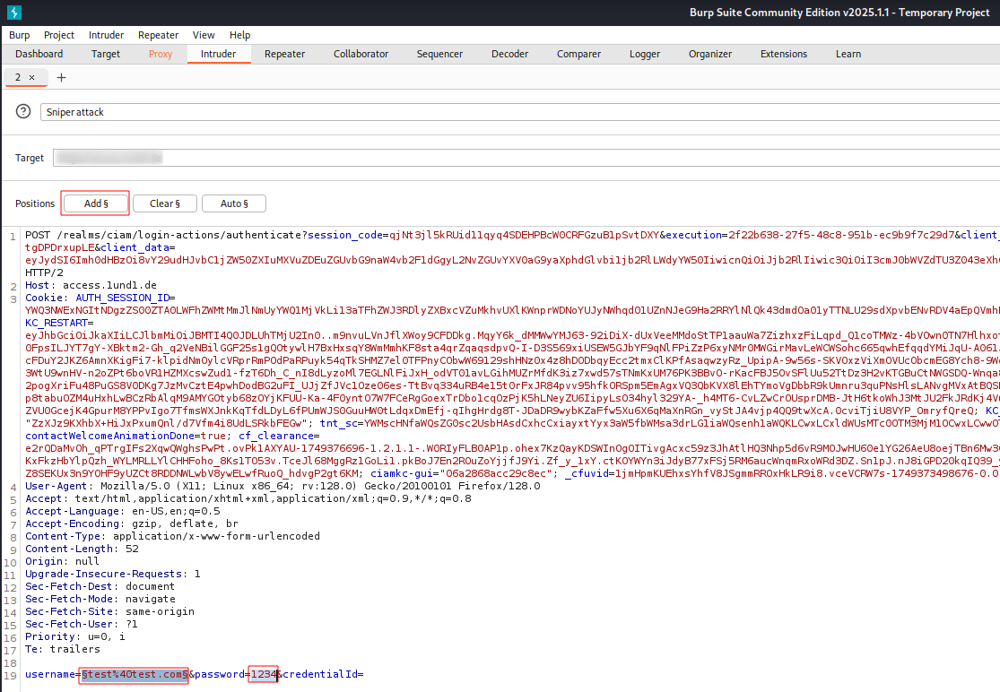

# Credential Stuffing and Password Spraying

## Credential Stuffing

**Credential stuffing** is the injection of breached account credentials in hopes
of account takeover. We can get stolen credentials from leaks and databases like
breach-parse or [We leak Info](https://weleakinfo.io).

From these databases we get a collection of `username`:`password` datasets. We
store the usernames and the passwords in separate files to throw them at a
website in the next step.

Next, we need to install the `Foxy Proxy` plugin for Firefox. We can find it by
searching for `Foxy Proxy` in the Firefox extensions.

We create a new proxy called `Burp Suite` with type `HTTP`, IP address `127.0.0.1`
and port number `8080`.

We can start or stop it by clicking on the puzzle piece in the upper right corner
of Firefox and then chosing the proxy to work with, here `Burp Suite`.

**Side note:** I could not access the `tesla.com` website, neither with Foxy
Proxy nor with a manually configured proxy. This seems to be related to Tesla,
not to the combination Firefox/Foxy Proxy. I have therefore used another website
to capture web traffic and find the fields to inject the breached data. I did
not actually launch the attack, anyway. I have used Foxy Proxy for that test.

Navigate to the website that is to be attacked. It must have fields to enter
user name and password.

Start Burp Suite, go to the `Proxy` tab and switch `Intercept On`. Enter a user
name / email address and a password that can easily be identified in the
captured POST message and click on the `Login` button to create a login attempt
that we can intercept and modify.

Right-click on the intercepted POST request and choose `Send to Intruder`. After
that we can modify the POST request on the `Intruder` tab to generate further
requests in an automated way.

On the `Intruder` tab we identify the chosen user name / email and password that
we have entered on the login website. We highlight the first value and click the
`Add §` button to add this field for automated variation of its value. We do the
same for the second value, in this case the password. We do not need to care
about the rest of the POST request.

With the `Pitchfork` attack type, entry 1 from the payload list 1 will be paired
with entry 1 from payload list 2 to send the 1st login attempt, and then so
forth with 2nd line of both payloads.

Finally, we need to define where the values to fill into the now defined
variable fields should come from. We can either load them from a file or simply
copy-paste a list of values (user names, passwords, etc.) into the respective
fields. We just need to make sure that we pick the right parameter from the
drop-down list before we fill in the values.

Once these settings have been made, we can click `Start Attack` and watch as
Burp Suite sends login attempts. We watch out for a change of `Status` (the 200
group is generally an error code) or `Length`. There is also the option to
search for a particular text to get a checkbox in the attack log that shows
whether the text has been found in the POST reply.

## Password Spraying

**Password spraying** means we have a list of known user names (e.g. from
LinkedIn, hunter.io, breached password lists, etc.), but no
passwords. In the same manner as in credential stuffing, we use a list of known
user names, but try one or several passwords (e.g. from a wordlist).

**-- Warning --** In a pentest, we could easily lock out users from logging in
to their account if we run too many unsuccessful login attempts. We should
therefore always first find out their login policy (how many attempts,
especially for Active Directory) to make sure we do not cause any harm.

To actually carry out the attack, `Clear` the parameters that we had set for the
credential stuffing attack and just set one for the known user names and one
fixed common password (hard-coded, attack type `Sniper`-- only one free
parameter) or chose a parameter for that field, too, and let it pick passwords
from a wordlist (attack type `pitchfork`).

**Credential stuffing and password spraying are by far the most common ways by
which we get access to the victim machine in external pentests!** Oftentimes we
can also get access on login screens using default credentials. Also worth
noting: external login credentials are usually very solid, but internal barriers
are often much weaker.

<!--
span style="color:green;font-weight:700;font-size:20px">
markdown color font styles

