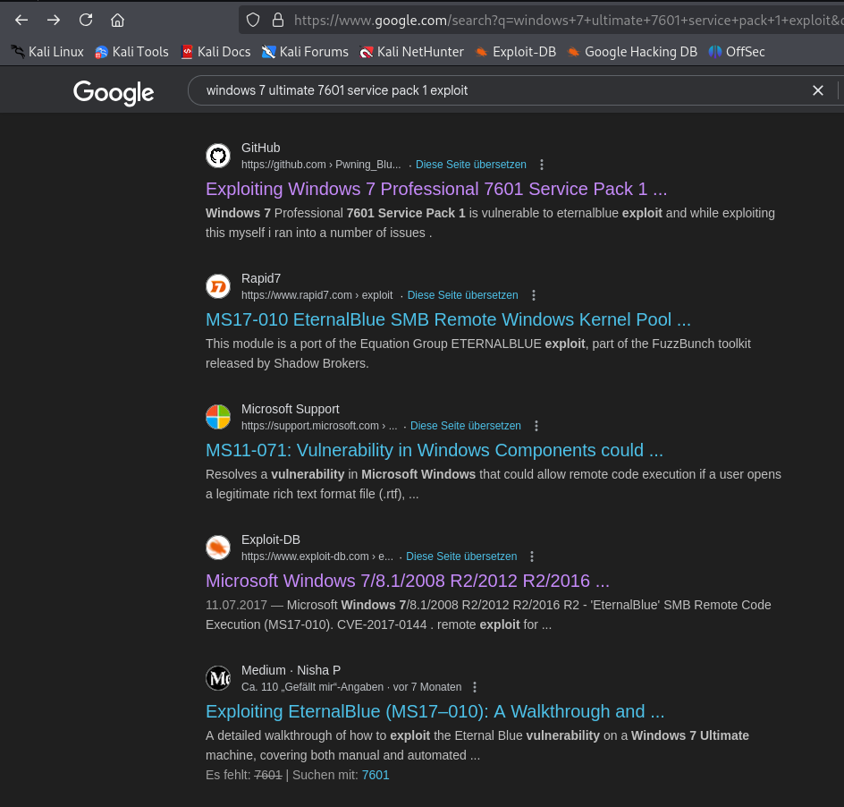
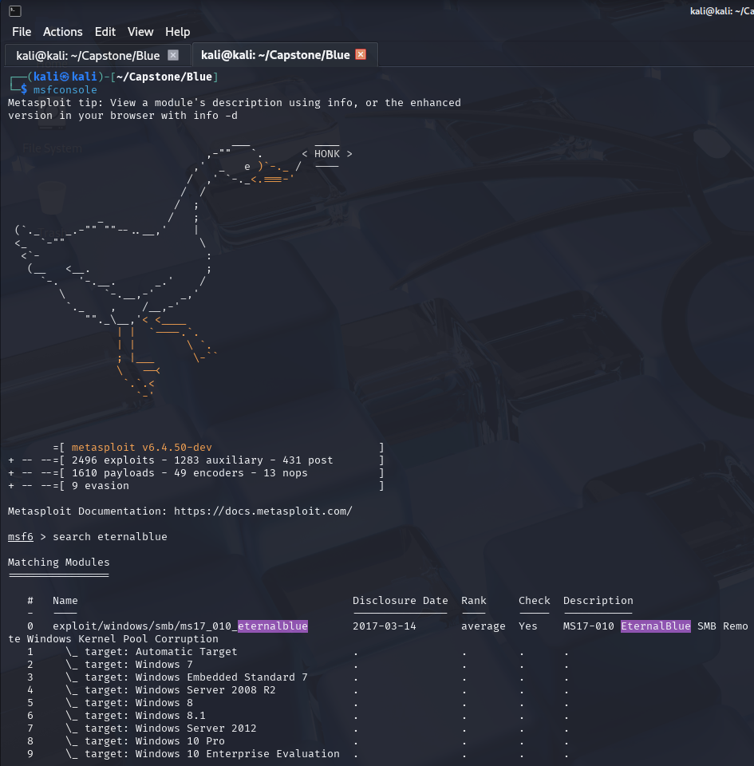
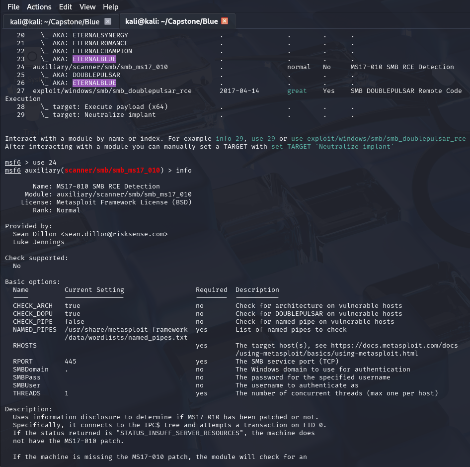
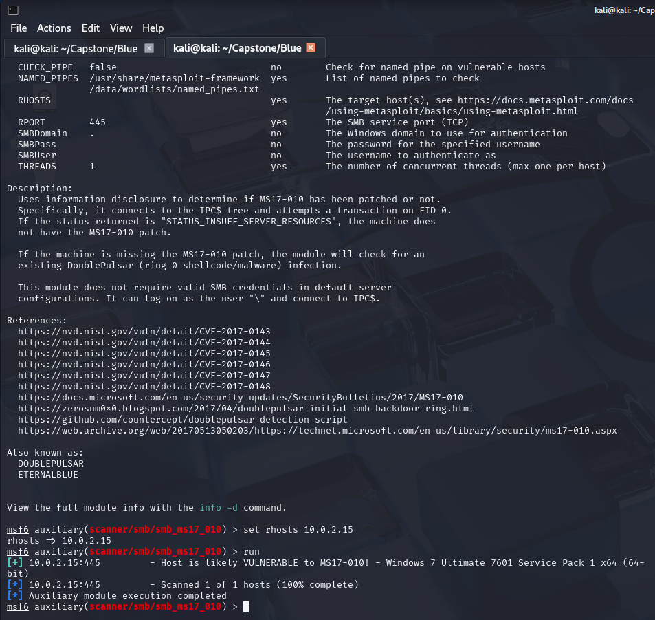
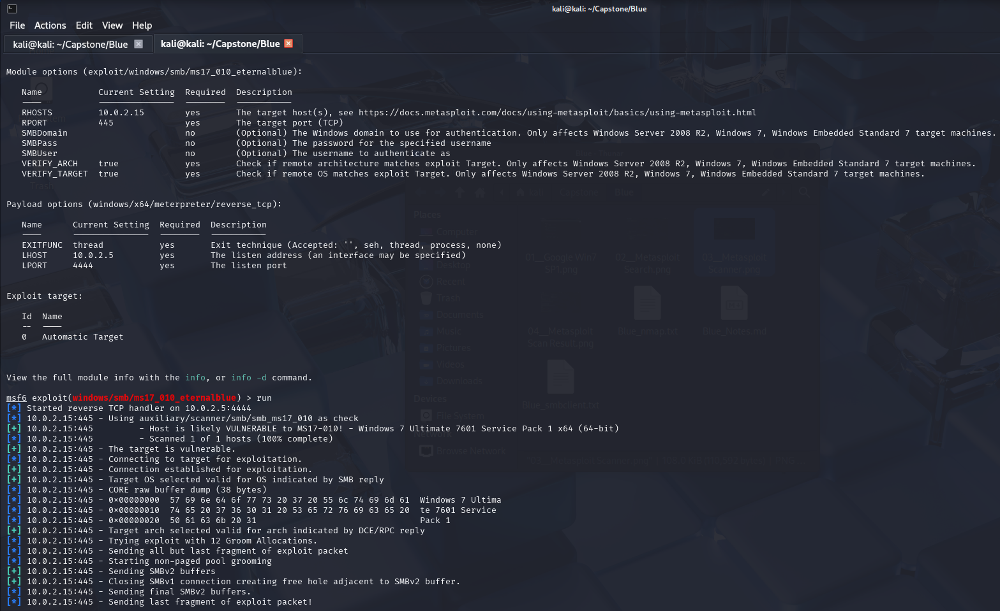
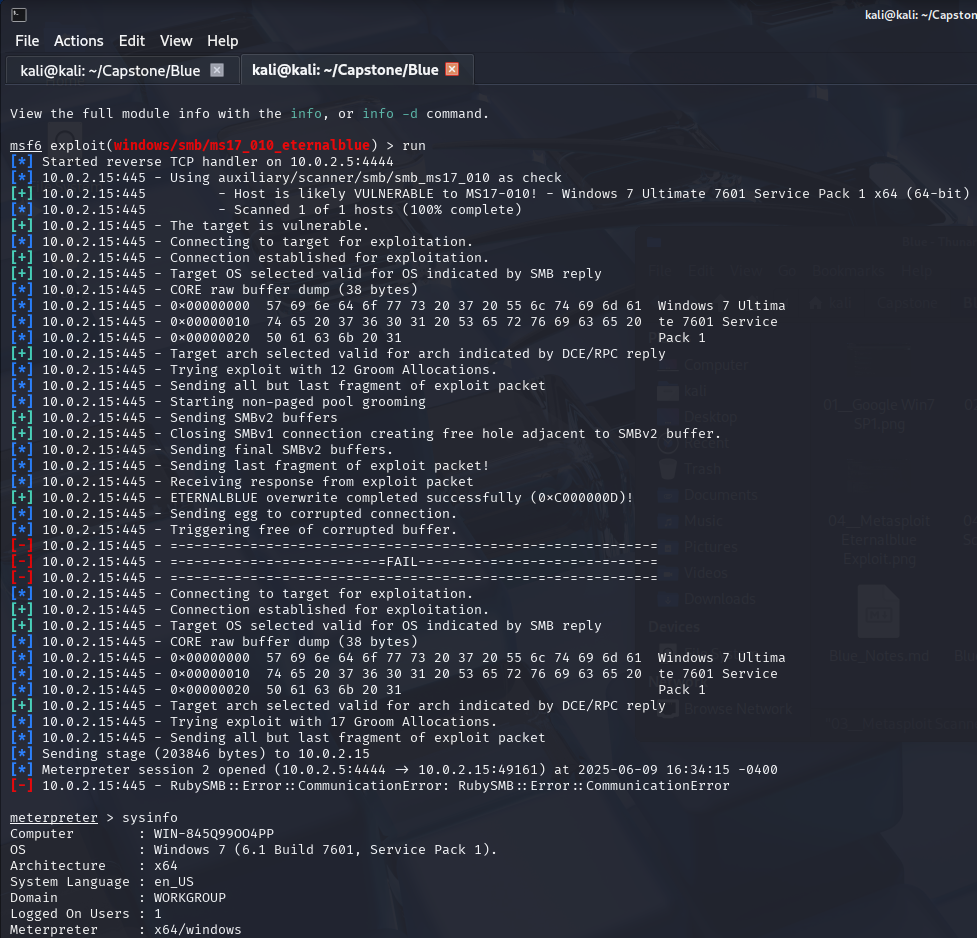

# Blue

**Known access credentials before the start (to figure out the IP address):**

* user:Password123!
* administrator:Password456!

## Confirm Victim's IP Address

└─$ sudo arp-scan -l
Interface: eth0, type: EN10MB, MAC: 08:00:27:b4:a1:05, IPv4: 10.0.2.5
Starting arp-scan 1.10.0 with 256 hosts (https://github.com/royhills/arp-scan)
10.0.2.1        52:54:00:12:35:00       QEMU
10.0.2.2        52:54:00:12:35:00       QEMU
10.0.2.3        08:00:27:3c:aa:a3       PCS Systemtechnik GmbH
10.0.2.15       08:00:27:2a:95:91       PCS Systemtechnik GmbH

4 packets received by filter, 0 packets dropped by kernel
Ending arp-scan 1.10.0: 256 hosts scanned in 2.008 seconds (127.49 hosts/sec). 4
responded

Own IP Address: 10.0.2.5
**Victim's IP Address: 10.0.2.15** (from login to Blue as Administrator with
known password `Password456!`)

## Active reconnaissance with nmap

┌──(kali㉿kali)-[~/Capstone/Blue]
└─$ nmap -T4 -p- 10.0.2.15 > Blue_nmap.txt

Starting Nmap 7.95 ( https://nmap.org ) at 2025-06-09 14:45 EDT
Nmap scan report for 10.0.2.15
Host is up (0.00036s latency).
Not shown: 65526 closed tcp ports (reset)
PORT      STATE SERVICE
135/tcp   open  msrpc
139/tcp   open  netbios-ssn
445/tcp   open  microsoft-ds
49152/tcp open  unknown
49153/tcp open  unknown
49154/tcp open  unknown
49155/tcp open  unknown
49156/tcp open  unknown
49159/tcp open  unknown
MAC Address: 08:00:27:2A:95:91 (PCS Systemtechnik/Oracle VirtualBox virtual NIC)

Nmap done: 1 IP address (1 host up) scanned in 27.77 seconds

**Open ports: 135, 139, 445, 49152-49156, 49159**

┌──(kali㉿kali)-[~/Capstone/Blue]
└─$ nmap -T4 -p 135,139,445,49152-49156,49159 -A 10.0.2.15 >> Blue_nmap.txt

Starting Nmap 7.95 ( https://nmap.org ) at 2025-06-09 14:55 EDT
Nmap scan report for 10.0.2.15
Host is up (0.00051s latency).

PORT      STATE SERVICE      VERSION
135/tcp   open  msrpc        Microsoft Windows RPC
139/tcp   open  netbios-ssn  Microsoft Windows netbios-ssn
445/tcp   open  microsoft-ds Windows 7 Ultimate 7601 Service Pack 1 microsoft-ds (workgroup: WORKGROUP)
49152/tcp open  msrpc        Microsoft Windows RPC
49153/tcp open  msrpc        Microsoft Windows RPC
49154/tcp open  msrpc        Microsoft Windows RPC
49155/tcp open  msrpc        Microsoft Windows RPC
49156/tcp open  msrpc        Microsoft Windows RPC
49159/tcp open  msrpc        Microsoft Windows RPC
MAC Address: 08:00:27:2A:95:91 (PCS Systemtechnik/Oracle VirtualBox virtual NIC)
Warning: OSScan results may be unreliable because we could not find at least 1 open and 1 closed port
Device type: general purpose
Running: Microsoft Windows 2008|7|Vista|8.1
OS CPE: cpe:/o:microsoft:windows_server_2008:r2 cpe:/o:microsoft:windows_7 cpe:/o:microsoft:windows_vista cpe:/o:microsoft:windows_8.1
OS details: Microsoft Windows Server 2008 R2 SP1 or Windows 7 SP1, Microsoft Windows Vista SP2 or Windows 7 or Windows Server 2008 R2 or Windows 8.1
Network Distance: 1 hop
Service Info: Host: WIN-845Q99OO4PP; OS: Windows; CPE: cpe:/o:microsoft:windows

Host script results:
| smb-security-mode: 
|   account_used: guest
|   authentication_level: user
|   challenge_response: supported
|_  message_signing: disabled (dangerous, but default)
| smb-os-discovery: 
|   OS: Windows 7 Ultimate 7601 Service Pack 1 (Windows 7 Ultimate 6.1)
|   OS CPE: cpe:/o:microsoft:windows_7::sp1
|   Computer name: WIN-845Q99OO4PP
|   NetBIOS computer name: WIN-845Q99OO4PP\x00
|   Workgroup: WORKGROUP\x00
|_  System time: 2025-06-09T20:56:34-04:00
| smb2-security-mode: 
|   2:1:0: 
|_    Message signing enabled but not required
| smb2-time: 
|   date: 2025-06-10T00:56:34
|_  start_date: 2025-06-10T00:37:37
|_clock-skew: mean: 7h19m58s, deviation: 2h18m33s, median: 5h59m58s
|_nbstat: NetBIOS name: WIN-845Q99OO4PP, NetBIOS user: <unknown>, NetBIOS MAC: 08:00:27:2a:95:91 (PCS Systemtechnik/Oracle VirtualBox virtual NIC)

TRACEROUTE
HOP RTT     ADDRESS
1   0.51 ms 10.0.2.15

OS and Service detection performed. Please report any incorrect results at https://nmap.org/submit/ .
Nmap done: 1 IP address (1 host up) scanned in 66.77 seconds

**Operating system:
* Microsoft Windows Server 2008 R2 SP1 or Windows 7 SP1, Microsoft Windows Vista SP2 or Windows 7 or Windows Server 2008 R2 or Windows 8.1;
* smb-os-discovery: Windows 7 Ultimate 7601 Service Pack 1 (Windows 7 Ultimate 6.1)**

**Services on open ports:
PORT      STATE SERVICE      VERSION
135/tcp   open  msrpc        Microsoft Windows RPC
139/tcp   open  netbios-ssn  Microsoft Windows netbios-ssn
445/tcp   open  microsoft-ds Windows 7 Ultimate 7601 Service Pack 1 microsoft-ds (workgroup: WORKGROUP)
49152/tcp open  msrpc        Microsoft Windows RPC
49153/tcp open  msrpc        Microsoft Windows RPC
49154/tcp open  msrpc        Microsoft Windows RPC
49155/tcp open  msrpc        Microsoft Windows RPC
49156/tcp open  msrpc        Microsoft Windows RPC
49159/tcp open  msrpc        Microsoft Windows RPC**

**Host script results:
| smb-security-mode: 
|   account_used: guest
|   authentication_level: user
|   challenge_response: supported
|_  message_signing: disabled (dangerous, but default)**
(...)
|**SMB2 security mode: 2:1:0**

**Ports & services (Wikipedia):
135 -- Microsoft RPC locator service, used to remotely manage services including DHCP server, DNS server, and WINS
139 -- NetBIOS Session Service
445 -- Microsoft Directory Service (ds), Active Directory, Windows shares or SMB file sharing**

49152-49156, 49159 -- The range 49152-65535 contains dynamic or private ports that cannot be registered with IANA. This range is used for private or customized services, for temporary purposes, and for automatic allocation of ephemeral ports (used only for the duration of a session).

## Active reconnaissance with smbclient

┌──(kali㉿kali)-[~/Capstone/Blue]
└─$ smbclient -L 10.0.2.15                           
Password for [WORKGROUP\kali]: <ENTER>

        Sharename       Type      Comment
        ---------       ----      -------
        ADMIN$          Disk      Remote Admin
        C$              Disk      Default share
        IPC$            IPC       Remote IPC
Reconnecting with SMB1 for workgroup listing.
do_connect: Connection to 10.0.2.15 failed (Error NT_STATUS_RESOURCE_NAME_NOT_FOUND)
Unable to connect with SMB1 -- no workgroup available

┌──(kali㉿kali)-[~/Capstone/Blue]
└─$ smbclient -L 10.0.2.15\\ADMIN$
Password for [WORKGROUP\kali]: <ENTER>

        Sharename       Type      Comment
        ---------       ----      -------
        ADMIN$          Disk      Remote Admin
        C$              Disk      Default share
        IPC$            IPC       Remote IPC
Reconnecting with SMB1 for workgroup listing.
do_connect: Connection to 10.0.2.15 failed (Error NT_STATUS_RESOURCE_NAME_NOT_FOUND)
Unable to connect with SMB1 -- no workgroup available

┌──(kali㉿kali)-[~/Capstone/Blue]
└─$ smbclient -L 10.0.2.15\\IPC$  
Password for [WORKGROUP\kali]: <ENTER>

        Sharename       Type      Comment
        ---------       ----      -------
        ADMIN$          Disk      Remote Admin
        C$              Disk      Default share
        IPC$            IPC       Remote IPC
Reconnecting with SMB1 for workgroup listing.
do_connect: Connection to 10.0.2.15 failed (Error NT_STATUS_RESOURCE_NAME_NOT_FOUND)
Unable to connect with SMB1 -- no workgroup available
                                                                                                                    
┌──(kali㉿kali)-[~/Capstone/Blue]
└─$ smbclient -L 10.0.2.15\\C$  
Password for [WORKGROUP\kali]: <ENTER>

        Sharename       Type      Comment
        ---------       ----      -------
        ADMIN$          Disk      Remote Admin
        C$              Disk      Default share
        IPC$            IPC       Remote IPC
Reconnecting with SMB1 for workgroup listing.
do_connect: Connection to 10.0.2.15 failed (Error NT_STATUS_RESOURCE_NAME_NOT_FOUND)
Unable to connect with SMB1 -- no workgroup available

┌──(kali㉿kali)-[~/Capstone/Blue]
└─$ smbclient -U guest //10.0.2.15/IPC$
Password for [WORKGROUP\guest]: <ENTER>
Try "help" to get a list of possible commands.
smb: \> 

┌──(kali㉿kali)-[~/Capstone/Blue]
└─$ smbclient -U guest //10.0.2.15/ADMIN$
Password for [WORKGROUP\guest]:
tree connect failed: NT_STATUS_ACCESS_DENIED
                                                                                                                    
┌──(kali㉿kali)-[~/Capstone/Blue]
└─$ smbclient -U guest //10.0.2.15/C$    
Password for [WORKGROUP\guest]:
tree connect failed: NT_STATUS_ACCESS_DENIED

**SMB share `IPC$` can be accessed as user `guest` without a password, but no further information found with dir command.**

## Gaining Access with Metasploit

## Manual Exploitation

One could also search manually for code that allows us **Remote Code Execution
(RCE)** on the victim machine. TCM has demonstrated this with this [Github
repository](https://github.com/3ndG4me/AutoBlue-MS17-010). He prefers exploits
with good documentation and good a how-to guide.

The exploit led to the victim machine crashing (blue screen), which led TCM to
warn of the dangers of RCE in pentests without the customers' explicit
permission. If a critical machine crashed e.g. in a hospital, the consequences
might be servere.
