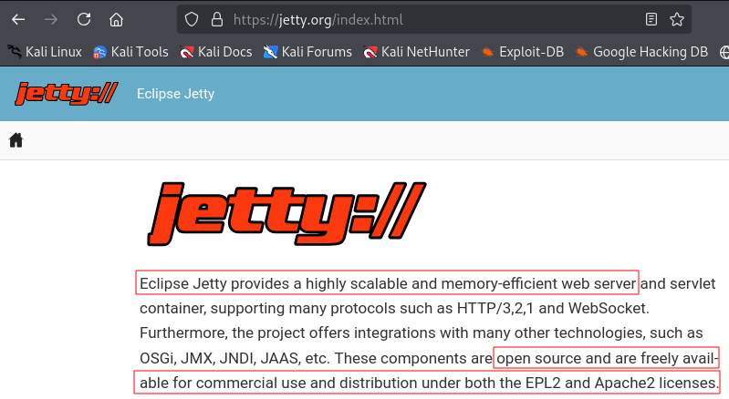
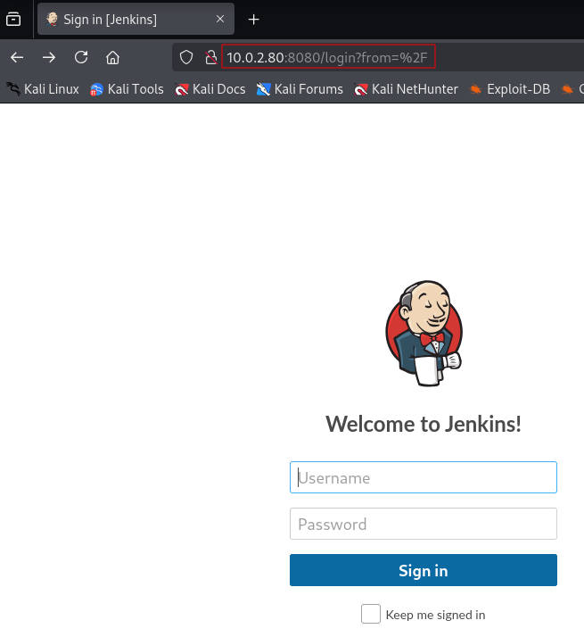
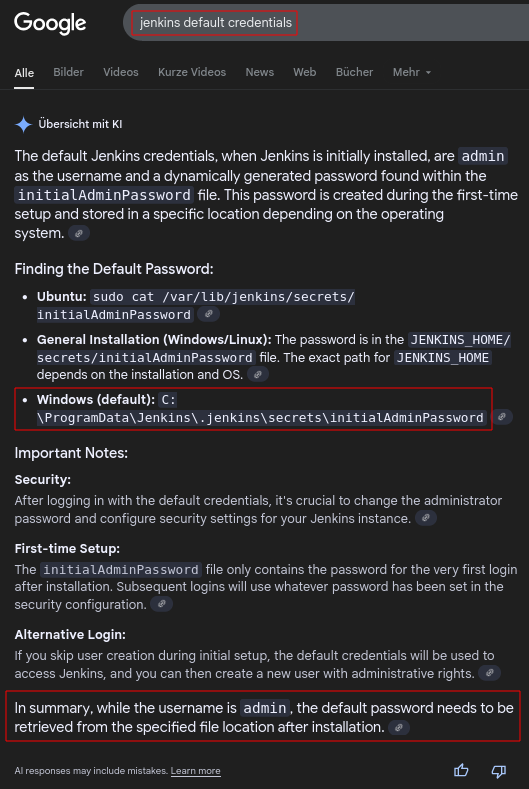

# Butler

## arp-scan und netdiscover

```
┌──(kali㉿kali)-[~]
└─$ sudo arp-scan -l

Interface: eth0, type: EN10MB, MAC: 08:00:27:b4:a1:05, IPv4: 10.0.2.5
WARNING: Cannot open MAC/Vendor file ieee-oui.txt: Permission denied
WARNING: Cannot open MAC/Vendor file mac-vendor.txt: Permission denied
Starting arp-scan 1.10.0 with 256 hosts (https://github.com/royhills/arp-scan)
10.0.2.1        52:54:00:12:35:00       (Unknown: locally administered)
10.0.2.2        52:54:00:12:35:00       (Unknown: locally administered)
10.0.2.3        08:00:27:33:52:51       (Unknown)
10.0.2.80       08:00:27:49:14:0a       (Unknown)

4 packets received by filter, 0 packets dropped by kernel
Ending arp-scan 1.10.0: 256 hosts scanned in 1.830 seconds (139.89 hosts/sec). 4 responded
```

```
┌──(kali㉿kali)-[~]
└─$ sudo netdiscover -r 10.0.2.0/24

Currently scanning: Finished!   |   Screen View: Unique Hosts

 4 Captured ARP Req/Rep packets, from 4 hosts.   Total size: 240
 _____________________________________________________________________________
   IP            At MAC Address     Count     Len  MAC Vendor / Hostname      
 -----------------------------------------------------------------------------
 10.0.2.1        52:54:00:12:35:00      1      60  Unknown vendor
 10.0.2.2        52:54:00:12:35:00      1      60  Unknown vendor
 10.0.2.3        08:00:27:33:52:51      1      60  PCS Systemtechnik GmbH
 10.0.2.80       08:00:27:49:14:0a      1      60  PCS Systemtechnik GmbH 
```

**Both scans show the same results. Victim IP address: 10.0.2.80**


## nmap

```
┌──(kali㉿kali)-[~/Capstone/Butler]
└─$ sudo nmap 10.0.2.80 -T4 -p- > Butler_nmap.txt

Starting Nmap 7.95 ( https://nmap.org ) at 2025-06-24 01:55 EDT
Nmap scan report for 10.0.2.80
Host is up (0.00045s latency).
Not shown: 65524 closed tcp ports (reset)
PORT      STATE SERVICE
135/tcp   open  msrpc
139/tcp   open  netbios-ssn
445/tcp   open  microsoft-ds
5040/tcp  open  unknown
8080/tcp  open  http-proxy
49664/tcp open  unknown
49665/tcp open  unknown
49666/tcp open  unknown
49667/tcp open  unknown
49668/tcp open  unknown
49670/tcp open  unknown
MAC Address: 08:00:27:49:14:0A (PCS Systemtechnik/Oracle VirtualBox virtual NIC)

Nmap done: 1 IP address (1 host up) scanned in 346.79 seconds
```

```
┌──(kali㉿kali)-[~/Capstone/Butler]
└─$ sudo nmap 10.0.2.80 -T4 -A -p 135,139,445,5040,8080,49664-49668,49670 >> Butler_nmap.txt

Starting Nmap 7.95 ( https://nmap.org ) at 2025-06-24 02:02 EDT
Nmap scan report for 10.0.2.80
Host is up (0.00030s latency).

PORT      STATE SERVICE       VERSION
135/tcp   open  msrpc         Microsoft Windows RPC
139/tcp   open  netbios-ssn   Microsoft Windows netbios-ssn
445/tcp   open  microsoft-ds?
5040/tcp  open  unknown
8080/tcp  open  http          Jetty 9.4.41.v20210516
|_http-server-header: Jetty(9.4.41.v20210516)
|_http-title: Site doesn't have a title (text/html;charset=utf-8).
| http-robots.txt: 1 disallowed entry 
|_/
49664/tcp open  msrpc         Microsoft Windows RPC
49665/tcp open  msrpc         Microsoft Windows RPC
49666/tcp open  msrpc         Microsoft Windows RPC
49667/tcp open  msrpc         Microsoft Windows RPC
49668/tcp open  msrpc         Microsoft Windows RPC
49670/tcp open  msrpc         Microsoft Windows RPC
MAC Address: 08:00:27:49:14:0A (PCS Systemtechnik/Oracle VirtualBox virtual NIC)
Warning: OSScan results may be unreliable because we could not find at least 1 open and 1 closed port
Device type: general purpose
Running: Microsoft Windows 10
OS CPE: cpe:/o:microsoft:windows_10
OS details: Microsoft Windows 10 1709 - 21H2
Network Distance: 1 hop
Service Info: OS: Windows; CPE: cpe:/o:microsoft:windows

Host script results:
|_nbstat: NetBIOS name: BUTLER, NetBIOS user: <unknown>, NetBIOS MAC: 08:00:27:49:14:0a (PCS Systemtechnik/Oracle VirtualBox virtual NIC)
| smb2-security-mode: 
|   3:1:1: 
|_    Message signing enabled but not required
| smb2-time: 
|   date: 2025-06-24T06:05:33
|_  start_date: N/A

TRACEROUTE
HOP RTT     ADDRESS
1   0.30 ms 10.0.2.80

OS and Service detection performed. Please report any incorrect results at https://nmap.org/submit/ .
Nmap done: 1 IP address (1 host up) scanned in 173.19 seconds
```

**Open ports:**

* 135: Microsoft Windows RPC
* 139: Microsoft Windows netbios-ssn
* 445: microsoft-ds?
* 5040: unknown
* 8080: HTTP (Jetty 9.4.41.v20210516)
* 49664-49668, 49670: Microsoft Windows RPC

**Operating system details:** Microsoft Windows 10 1709 - 21H2

**Host script results:** nbstat: NetBIOS name: BUTLER, NetBIOS user: <unknown>,
SMB2




## SMB (Ports 139, 445)

### Manual Test

```
┌──(kali㉿kali)-[~/Capstone/Butler]
└─$ smbclient -L //10.0.2.80/
Password for [WORKGROUP\kali]:
session setup failed: NT_STATUS_ACCESS_DENIED
```

```
┌──(kali㉿kali)-[~/Capstone/Butler]
└─$ smbclient -L //10.0.2.80 -I 10.0.2.80
Password for [WORKGROUP\kali]:
session setup failed: NT_STATUS_ACCESS_DENIED
```


## NetBIOS (Ports 139)

**Google search for `"netbios-ssn vulnerabilities"`:**

### What does NetBIOS ssn do?

NetBIOS Session Service (NBSS) is a protocol to connect two computers to
transmit heavy data traffic. It is mostly used for printer and file services
over a network.

See also this [webpage](https://wirexsystems.com/resource/protocols/netbios/).

### Übersicht mit KI

NetBIOS Session Service (NetBIOS-SSN) vulnerabilities arise from the protocol's
inherent design, particularly its lack of encryption and reliance on cleartext
communication. This makes it susceptible to various attacks, including
information disclosure, denial of service, and remote code execution.
Specifically, attackers can exploit NetBIOS-SSN to gather sensitive information
like computer names, IP addresses, and user IDs, potentially leading to targeted
attacks. Furthermore, attackers can manipulate NetBIOS packets to cause denial
of service, or even execute arbitrary code on vulnerable systems.

Here's a breakdown of the vulnerabilities:

1. Information Disclosure: NetBIOS-SSN lacks encryption, making it easy for
attackers to intercept and read transmitted data. Tools like nbstat can be used
to enumerate NetBIOS information, revealing computer names, IP addresses, and
user IDs. This information can be leveraged to identify potential targets for
further attacks.

2. Denial of Service (DoS): Attackers can exploit weaknesses in how NetBIOS
handles packets, causing a target system to become unresponsive. Specifically,
crafted NetBT Session Service packets can trigger a denial of service condition.

3. Remote Code Execution: A vulnerability in Microsoft's implementation of
NetBIOS Session Service (CVE-2017-0161) allows remote attackers to execute
arbitrary code on the target system. This is achieved by sending specially
crafted NetBT Session Service packets.

4. NetBIOS Spoofing: In certain scenarios, NetBIOS responses can be spoofed,
potentially leading to hijacked network traffic or bypassed security mechanisms.
This vulnerability (CVE-2016-3213) can be exploited to render untrusted content
in a browser.

5. Exploitation through SMB: NetBIOS is often used in conjunction with Server
Message Block (SMB) for file and printer sharing. Attackers can leverage
vulnerabilities in SMB, such as the EternalBlue exploit, to gain access to
systems using NetBIOS for communication.

*Mitigation Strategies:*

* Disable NetBIOS: The most effective mitigation is to disable NetBIOS over
TCP/IP, especially on systems exposed to the internet.

* Block NetBIOS traffic: If NetBIOS is necessary, block it at the firewall,
restricting its use to specific IP addresses or subnets.

* Enable SMB signing: Implementing SMB signing can help prevent
man-in-the-middle attacks

* Keep systems updated: Regularly patching systems with security updates is
crucial to address known vulnerabilities.

* Disable unnecessary services: Disable or remove NetBIOS from network
interfaces that don't require it.

* Use strong passwords and authentication: Implement strong password policies
and multi-factor authentication.

* Segment the network: Consider segmenting the network to limit the impact of a
potential NetBIOS compromise. 

* Monitor network traffic: Monitor NetBIOS traffic for suspicious activity and
potential attacks.


## Microsoft Directory Service (Port 445)

**Google search for `"microsoft ds 445"`:**

### Übersicht mit KI

Microsoft-DS (Microsoft Directory Service) oder auch bekannt als Port 445, ist
ein Netzwerkport, der für die Server Message Block (SMB)-Freigabe von Dateien
und Druckern über TCP/IP verwendet wird. SMB ist ein Netzwerkprotokoll, das von
Microsoft für den Dateizugriff und die Druckerfreigabe innerhalb eines Netzwerks
entwickelt wurde. Port 445 ermöglicht es Windows-Computern, Ressourcen wie
Dateien und Drucker im selben Netzwerk gemeinsam zu nutzen, ohne die
Notwendigkeit älterer Protokolle.

Erläuterung:

* SMB (Server Message Block): SMB ist ein Netzwerkprotokoll, das es Anwendungen
ermöglicht, auf Dateien und Ressourcen auf einem Server im Netzwerk zuzugreifen
und diese gemeinsam zu nutzen.

* Port 445: Dieser Port wird verwendet, um SMB-Verbindungen über TCP/IP
herzustellen, was eine effiziente Kommunikation im Netzwerk ermöglicht.

* Microsoft-DS: Dies ist die Bezeichnung für die Microsoft-Implementierung von
SMB, die über Port 445 kommuniziert.

Wichtige Punkte:

* Sicherheit: Obwohl Port 445 für die gemeinsame Nutzung von Ressourcen wichtig
ist, kann er auch ein Sicherheitsrisiko darstellen, wenn er nicht ordnungsgemäß
gesichert ist.

* Firewall: Es ist wichtig, den Zugriff auf Port 445 über die Firewall zu
kontrollieren, um unbefugten Zugriff auf das Netzwerk zu verhindern.

* NetBIOS: Früher wurde SMB über das NetBIOS-Protokoll auf Port 139 verwendet.
Port 445 wurde eingeführt, um SMB direkt über TCP/IP zu ermöglichen, was 
effizienter ist.

Zusammenfassend lässt sich sagen, dass Port 445 eine wichtige Rolle bei der
Dateifreigabe und dem Netzwerkzugriff in Windows-Umgebungen spielt, aber eine
sorgfältige Konfiguration und Überwachung ist erforderlich, um die Sicherheit zu
gewährleisten.


## HTTP (Port 8080)

### Gobuster

```
┌──(kali㉿kali)-[~/Capstone/Butler]
└─$ gobuster dir -u http://10.0.2.80:8080/ -w /usr/share/wordlists/dirbuster/directory-list-lowercase-2.3-medium.txt -t 50 -x .txt, .php, .js, .* --no-error -q
Error: the server returns a status code that matches the provided options for non existing urls. http://10.0.2.80:8080/8c9edc93-02f6-4606-9d97-5a3b4a8e5a9c => 403 (Length: 620). To continue please exclude the status code or the length
```


### Dirb

```
┌──(kali㉿kali)-[~/Capstone/Butler]
└─$ dirb http://10.0.2.80:8080/ /usr/share/dirbuster/wordlists/directory-list-lowercase-2.3-small.txt   

-----------------
DIRB v2.22    
By The Dark Raver
-----------------

START_TIME: Wed Jun 25 15:39:30 2025
URL_BASE: http://10.0.2.80:8080/
WORDLIST_FILES: /usr/share/dirbuster/wordlists/directory-list-lowercase-2.3-small.txt

-----------------

GENERATED WORDS: 81628                                                         

---- Scanning URL: http://10.0.2.80:8080/ ----
+ http://10.0.2.80:8080/login (CODE:200|SIZE:2028)                                                                
(!) WARNING: All responses for this directory seem to be CODE = 403.                                              
    (Use mode '-w' if you want to scan it anyway)
                                                                               
-----------------
END_TIME: Wed Jun 25 15:41:31 2025
DOWNLOADED: 140 - FOUND: 1
```


### Manual Test



Maybe we can find login credentials with a brute force attack. Default login
credentials could make our life easier when we run a brute force attack with
`BurpSuite`.




<!--
span style="color:green;font-weight:700;font-size:20px">
markdown color font styles
</span
-->
