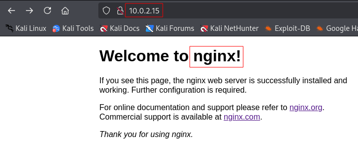

# Black Pearl

## netdiscover and arp-scan

Leaked credentials are `root:tcm`. Logging in to the victim machine, an `ip a`
gives the IP address `10.0.2.15`.

```
┌──(kali㉿kali)-[~]
└─$ sudo netdiscover -r 10.0.2.0/24

Currently scanning: Finished!   |   Screen View: Unique Hosts

 5 Captured ARP Req/Rep packets, from 4 hosts.   Total size: 300
 _____________________________________________________________________________
   IP            At MAC Address     Count     Len  MAC Vendor / Hostname
 -----------------------------------------------------------------------------
 10.0.2.1        52:54:00:12:35:00      1      60  Unknown vendor
 10.0.2.2        52:54:00:12:35:00      1      60  Unknown vendor
 10.0.2.3        08:00:27:3d:b1:71      1      60  PCS Systemtechnik GmbH
 10.0.2.15       08:00:27:cf:f9:27      2     120  PCS Systemtechnik GmbH
```


```
┌──(kali㉿kali)-[~]
└─$ sudo arp-scan -l
Interface: eth0, type: EN10MB, MAC: 08:00:27:b4:a1:05, IPv4: 10.0.2.5
WARNING: Cannot open MAC/Vendor file ieee-oui.txt: Permission denied
WARNING: Cannot open MAC/Vendor file mac-vendor.txt: Permission denied
Starting arp-scan 1.10.0 with 256 hosts (https://github.com/royhills/arp-scan)
10.0.2.1        52:54:00:12:35:00       (Unknown: locally administered)
10.0.2.2        52:54:00:12:35:00       (Unknown: locally administered)
10.0.2.3        08:00:27:3d:b1:71       (Unknown)
10.0.2.15       08:00:27:cf:f9:27       (Unknown)

4 packets received by filter, 0 packets dropped by kernel
Ending arp-scan 1.10.0: 256 hosts scanned in 1.867 seconds (137.12 hosts/sec). 4
responded
```


## nmap

```
┌──(kali㉿kali)-[~]
└─$ nmap -T4 -p- 10.0.2.15
Starting Nmap 7.95 ( https://nmap.org ) at 2025-06-29 17:59 EDT
Nmap scan report for 10.0.2.15
Host is up (0.00038s latency).
Not shown: 65532 closed tcp ports (reset)
PORT   STATE SERVICE
22/tcp open  ssh
53/tcp open  domain
80/tcp open  http
MAC Address: 08:00:27:CF:F9:27 (PCS Systemtechnik/Oracle VirtualBox virtual NIC)

Nmap done: 1 IP address (1 host up) scanned in 2.29 seconds
```

```
┌──(kali㉿kali)-[~]
└─$ nmap -T4 -p 22,53,80 -A 10.0.2.15
Starting Nmap 7.95 ( https://nmap.org ) at 2025-06-29 18:00 EDT
Nmap scan report for 10.0.2.15
Host is up (0.00038s latency).

PORT   STATE SERVICE VERSION
22/tcp open  ssh     OpenSSH 7.9p1 Debian 10+deb10u2 (protocol 2.0)
| ssh-hostkey:
|   2048 66:38:14:50:ae:7d:ab:39:72:bf:41:9c:39:25:1a:0f (RSA)
|   256 a6:2e:77:71:c6:49:6f:d5:73:e9:22:7d:8b:1c:a9:c6 (ECDSA)
|_  256 89:0b:73:c1:53:c8:e1:88:5e:c3:16:de:d1:e5:26:0d (ED25519)
53/tcp open  domain  ISC BIND 9.11.5-P4-5.1+deb10u5 (Debian Linux)
| dns-nsid:
|_  bind.version: 9.11.5-P4-5.1+deb10u5-Debian
80/tcp open  http    nginx 1.14.2
|_http-title: Welcome to nginx!
|_http-server-header: nginx/1.14.2
MAC Address: 08:00:27:CF:F9:27 (PCS Systemtechnik/Oracle VirtualBox virtual NIC)
Warning: OSScan results may be unreliable because we could not find at least 1 open and 1 closed port
Device type: general purpose|router
Running: Linux 4.X|5.X, MikroTik RouterOS 7.X
OS CPE: cpe:/o:linux:linux_kernel:4 cpe:/o:linux:linux_kernel:5 cpe:/o:mikrotik:routeros:7 cpe:/o:linux:linux_kernel:5.6.3
OS details: Linux 4.15 - 5.19, OpenWrt 21.02 (Linux 5.4), MikroTik RouterOS 7.2 - 7.5 (Linux 5.6.3)
Network Distance: 1 hop
Service Info: OS: Linux; CPE: cpe:/o:linux:linux_kernel

TRACEROUTE
HOP RTT     ADDRESS
1   0.38 ms 10.0.2.15

OS and Service detection performed. Please report any incorrect results at https://nmap.org/submit/ .
Nmap done: 1 IP address (1 host up) scanned in 15.94 seconds
```

**Open ports:**

* 22 (SSH): OpenSSH 7.9p1 Debian 10+deb10u2 (protocol 2.0)

* 53 (ISC BIND): ISC BIND 9.11.5-P4-5.1+deb10u5 (Debian Linux)

* 80 (HTTP): nginx 1.14.2


## Port 80 (HTTP)



The page source code includes the email address of the webmaster:
```
<!-- Webmaster: alek@blackpearl.tcm -->
```


Directory busting with `DIRB` delivers only one result:


```
┌──(kali㉿kali)-[~]
└─$ dirb http://10.0.2.15/ /usr/share/dirbuster/wordlists/directory-list-lowercase-2.3-small.txt

-----------------
DIRB v2.22    
By The Dark Raver
-----------------

START_TIME: Tue Jul  1 02:37:40 2025
URL_BASE: http://10.0.2.15/
WORDLIST_FILES: /usr/share/dirbuster/wordlists/directory-list-lowercase-2.3-small.txt

-----------------

GENERATED WORDS: 81628                                                         

---- Scanning URL: http://10.0.2.15/ ----
+ http://10.0.2.15/secret (CODE:200|SIZE:209)                                                                      
                                                                                                                   
-----------------
END_TIME: Tue Jul  1 02:40:04 2025
DOWNLOADED: 81628 - FOUND: 1
```


The URL `http://10.0.2.25/secret` is a text file with the following content:

```
    OMG you got r00t !

    Just kidding... search somewhere else. Directory busting won't give anything.

    <This message is here so that you don't waste more time directory busting
    this particular website.>

    - Alek 
```

Maybe we assume this is credible and stop enumerating port 80, except perhaps
for the **username `alek`** and the **email address `alek@blackpearl.tcm`**.


## Port 22 (SSH)

sad


## Port 53 (ISC BIND)

There seems to be a vulnerability in this version of BIND, a buffer overflow as
described in
[CVE-2020-8625](https://www.cybersecurity-help.cz/vdb/SB2021021718). Vulnerable
versions of bind are `9.5.0-9.17.1`. The here installed version `9.11.5-P4-5.1`
seems to fall into this category.

**Google search for `CVE-2020-8625 exploit code`:**

```
    CVE-2020-8625 is a security vulnerability in BIND, a popular DNS server
    software, that could lead to a denial-of-service (DoS) or potentially remote
    code execution. The vulnerability specifically exists in the GSS-TSIG (Generic
    Security Service - Transaction Signature) implementation when configured with
    specific settings. While a crash of the named process (BIND's main process) is
    the most likely outcome, remote code execution is a theoretical possibility.

    Affected Versions:

        BIND 9.5.0 -> 9.11.27
        BIND 9.12.0 -> 9.16.11
        BIND 9.11.3-S1 -> 9.11.27-S1 (Supported Preview Edition)
        BIND 9.16.8-S1 -> 9.16.11-S1 (Supported Preview Edition)
        BIND 9.17.0 -> 9.17.1 (development branch) 

    (...)


    Example Code (Concept):

    Since the exact exploit code is not readily available due to security concerns,
    the following provides a conceptual outline:

    1. Craft a malicious DNS message: This message would include a GSS-TSIG record
    with carefully crafted data to trigger the vulnerability.

    2. Send the crafted message to the target server: This can be achieved using
    standard DNS tools or custom scripts.
    
    3. Observe the server's behavior: If the exploit is successful, the named
    process should crash or exhibit other unusual behavior.

    (...)
```


### Enumerating DNS Manually

From [PTR-Record: Wie funktioniert der
DNS-Eintrag?](https://www.ionos.de/digitalguide/hosting/hosting-technik/ptr-record/):

Das Domain Name System (DNS) erleichtert die Kommunikation im Internet. Die
bekannteste Funktion dürfte wohl die Namensauflösung sein. Sie ermöglicht einem
Nutzer, eine URL in den Browser einzugeben und trotzdem eine Verbindung per
IP-Adresse herzustellen. Damit das funktionieren kann, greift das DNS bzw.
greifen die verantwortlichen Nameserver auf Zonendateien zurück. Dabei handelt
es sich um einfache Textdateien, in denen Zeile für Zeile DNS-Einträge
aufgelistet sind. Die Namensauflösung erfolgt dabei über A- oder AAAA-Records.
E-Mail-Verbindungen werden durch MX-Records ermöglicht. (...)

Die PTR-Records stellen quasi das Gegenstück zu den A-Records da. Statt einer
IP-Adresse einen Domain-Namen zuzuordnen, erfolgt bei ihnen die Verknüpfung
andersherum. Damit ermöglichen PTR-Records das Reverse DNS.


**PTR-Records-Erklärung an einem Beispiel**

PTR steht für „Pointer“. Der Name liefert bereits eine erste Idee, was mit dem
Eintragstyp erreicht wird. Ein PTR-Record verweist auf ein Objekt: den
Domain-Namen. Dadurch wird das Reverse DNS (rDNS) bzw. ein Reverse Lookup
möglich. Im Standardfall möchte man die Verbindung zu einem Server aufnehmen,
dessen Domain-Namen man kennt, nicht aber die korrekte IP-Adresse. Bei der
rückwärtigen Anfrage läuft der Prozess genau umgekehrt: Die IP-Adresse ist
bereits bekannt und man möchte erfahren, wie die zugehörige Domain heißt bzw.
unter welcher URL man sie erreichen kann.


Syntax der Einträge

Der Aufbau eines PTR-Records ähnelt dem der anderen Eintragstypen. Die verschiedenen Informationen sind im Eintrag in sogenannten Feldern nacheinander angeordnet.

- **name:** Das erste Feld wird beim PTR-Record mit der IP-Adresse gefüllt.
- **ttl:** Die Time to live gibt die Zeit in Sekunden an, die ein Eintrag gültig ist, bevor dieser neu aufgerufen werden muss.
- **class:** Das Feld enthält das Kürzel der verwendeten Netzwerkklasse.
- **type:** In diesem Fall steht an vierter Stelle PTR, um den Typ des Eintrags zu definieren.
- **rdata:** Das letzte Feld enthält schließlich die Resource Data – den Domain-Namen.

Alle Felder werden der Reihe nach innerhalb einer Zeile angeordnet. Man trennt
die Felder nicht durch irgendwelche Symbole – ein Leerzeichen reicht aus. Die
Zeile und damit den Eintrag beendet man nur durch den Einsatz eines
Zeilenumbruchs.

<name> <ttl> <class> <type> <rdata>

Damit ist die Syntax exakt wie bei einem A-Record aufgebaut, nur der Inhalt der
Felder unterscheidet sich. Zunächst gibt man die IP-Adresse an. Dabei sind
sowohl IPv4- als auch IPv6-Adressen gültig. Es gibt allerdings eine Besonderheit
zu beachten: Man verwendet dabei Reverse Mapping – die IP-Adresse wird also in
umgekehrter Reihenfolge angegeben.

Wenn man eine IPv4-Adresse verwendet, dreht man allerdings nur die Oktette um.
Innerhalb der einzelnen Gruppen bleibt die Ziffernreihenfolge unverändert.
Anders bei IPv6-Adressen: Bei ihnen wird jede Ziffer bzw. jeder Buchstabe
umgekehrt und mit einem Punkt vom nächsten Wert getrennt. Auch führende Nullen,
die man in der hexadezimalen Notation in der Regel weglässt, werden in
PTR-Records ausgeschrieben.

Zusätzlich gibt man noch die Zone an. Hier kommen zwei in Frage – wieder
abhängig davon, ob es sich um eine IPv4- oder IPv6-Adresse handelt. Erstere
erhält die Erweiterung `in-addr.arpa.`; letztere `ip6.arpa`.

Die Time to live gibt die Dauer an, die ein Eintrag noch gültig ist. Ist die
Zeitspanne abgelaufen, muss die Information erneut angefragt werden. Damit
umgeht das DNS das Problem, dass eventuell veraltete Einträge im Cache behalten
werden, was dann zu Verbindungsproblemen führt. In der Regel taucht das Feld
allerdings nicht im Eintrag selbst auf. Stattdessen legt man mit der Anweisung
$TTL am Anfang der Datei die Zeit für die komplette Zone fest. Die TTL gibt man
in Sekunden an.

Das Feld zur Klasse hat nur noch historische Bedeutung. Als das DNS entwickelt
wurde, gab es noch zwei weitere Netzwerkprojekte: Hesiod (mit der Abkürzung HS)
und das Chaosnet (durch CH dargestellt). Beide werden inzwischen nicht mehr
genutzt, weshalb nur noch das Internet als Klasse in Frage kommt. Aus diesem
Grund findet man an dieser Stelle entweder grundsätzlich das Kürzel IN oder das
Feld wird komplett ausgelassen. Bei einer Auslassung geht das System vom
üblichen Standard aus, der wiederum das Internet ist. Als Typ steht bei dieser
Eintragsart verständlicherweise immer PTR. Im abschließenden Datenfeld steht
dann der Name der Domain – wieder in der Notation von FQDN. (...)


From [Wikipedia, Reserved IP
addresses](https://en.wikipedia.org/wiki/Reserved_IP_addresses):

```
CIDR: 127.0.0.0/8, address range: 127.0.0.0–127.255.255.255, 16777216 addresses, used for loopback addresses to the local host
```


<!--
span style="color:green;font-weight:700;font-size:20px">
markdown color font styles
</span -->
