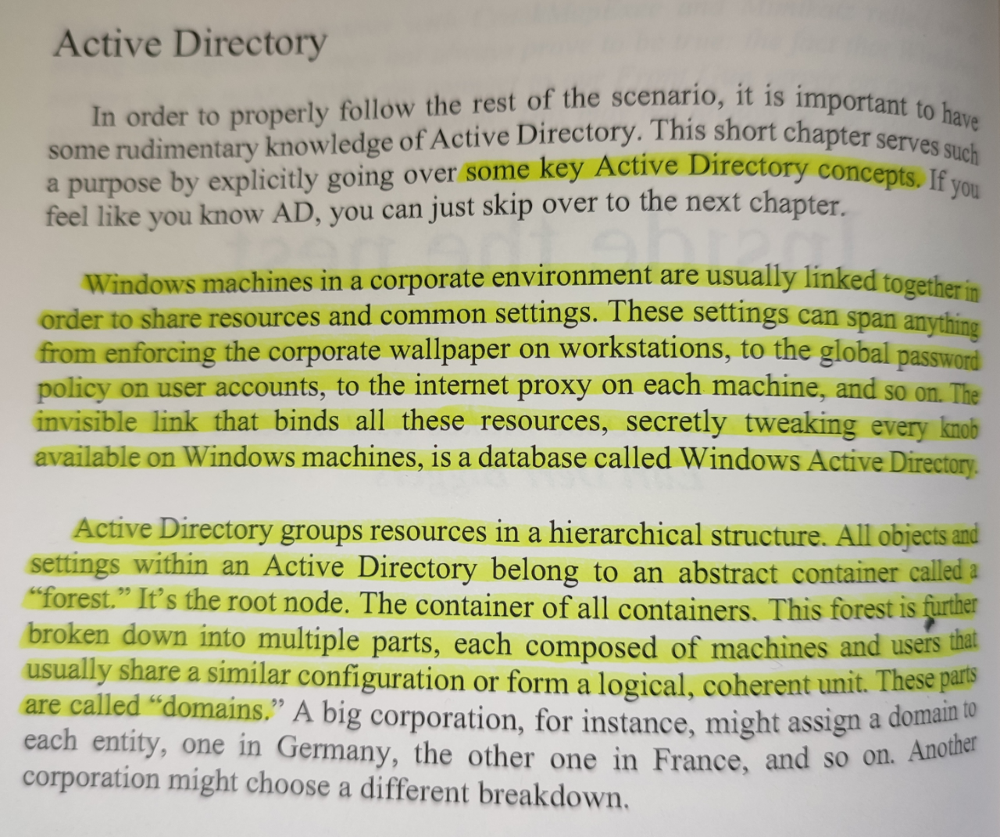
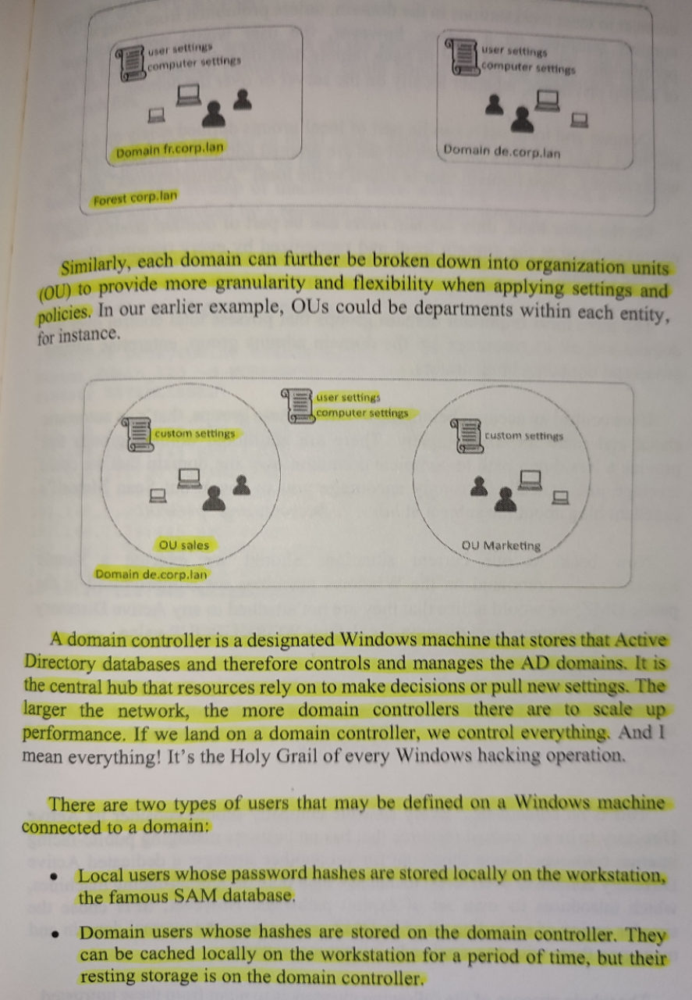
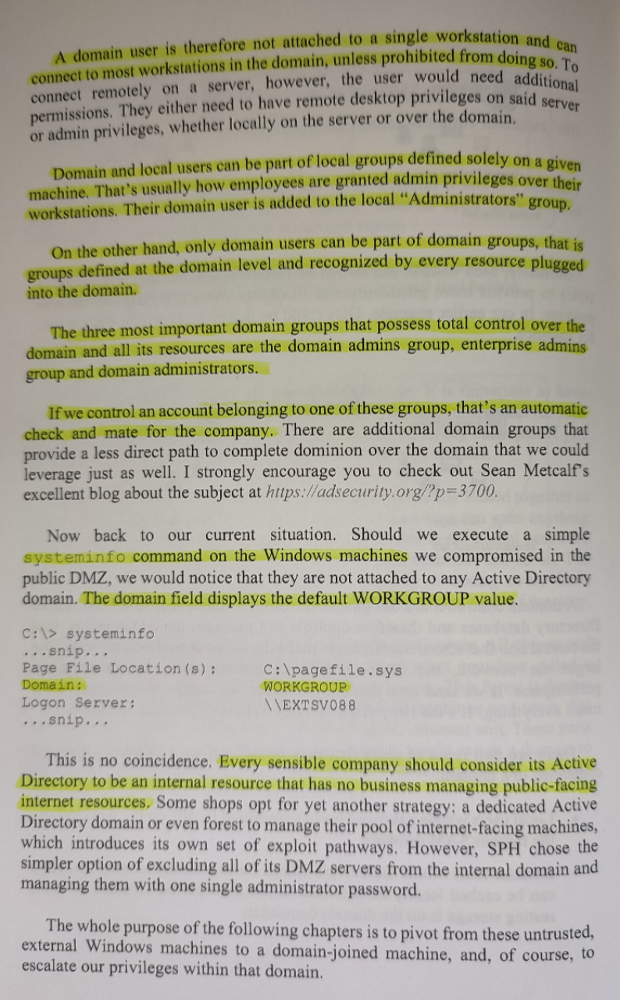

# Active Directory Overview

Active Directory is covered as part of **Internal Pentesting**, i.e. already
starting from the inside of a network as opposed to **External Pentesting**,
which was subject of the course so far. Active Directory becomes important
after we have gotten access to a machine on the network and want to traverse
through the network from there.

Active Directory can be considered similar to a phonebook. It is a database
that stores information about the objects on a Windows network, such as users,
computers, printers, but also policies, shared ressources, etc. It serves as an
Identity Management Service, and even though there are others on the market, AD
is by far the most common.

Authentication is handled through Kerberos and Kerberos tickets. Non-Windows
devices can use Active Directory as well.

Most companies (99%) use Active Directory for their internal environment, so we
can safely assume that we will have to handle AD for any internal pentest.

AD comes with a lot of **features** that have vulnerabilities that can be
exploited, but which are not considered requiring a patch by Microsoft since
there are also methods to prevent the exploitation. So even if AD is set up in
a way that was intended, it may incur vulnerabilities.

## Hack Like a Pornstar

<!--
span style="color:green;font-weight:700;font-size:20px">
markdown color font styles

