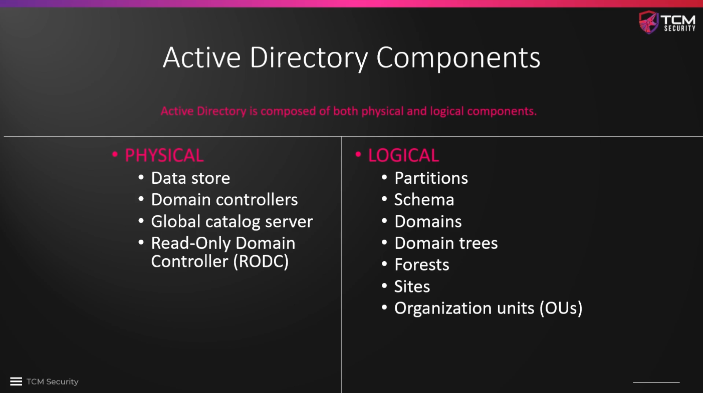
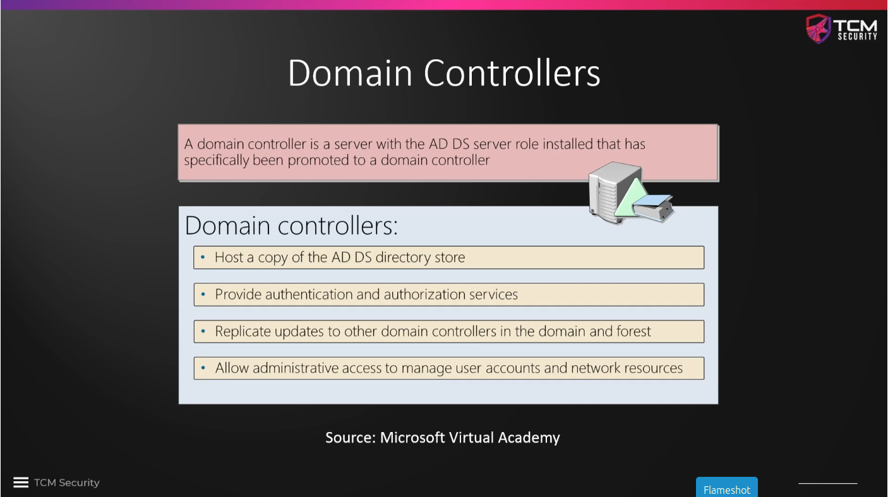
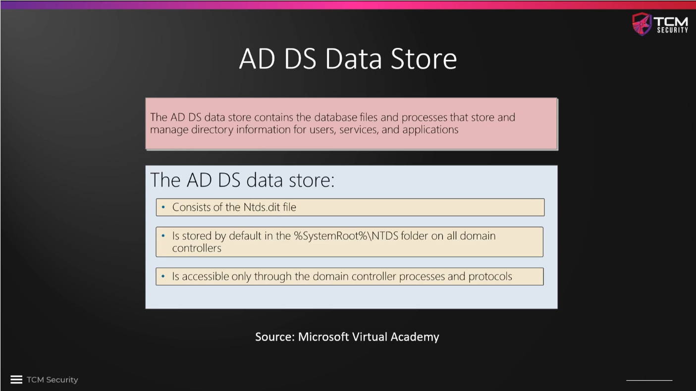

# Physical Active Directory Components

Active Directory is composed of physical and logical components, some of which
will be briefly explained in this course. For more detail, this
[introduction](https://learn.microsoft.com/de-de/shows/introtoad/) by Microsoft
may be helpful.

The **Domain Controller** is the most important component of an AD structure. It
hosts the "phonebook", provides authorization and authentication and gives the
opportunity for administrative access, e.g. for policies or to set passwords
remotely.

Another imporant component is the **AD DS Data Store**, which contains all of
the database files and information on users, ressources, etc. Most importantly,
it contains a very, very imporant file called `ntds.dit`. We can draw a lot of
information from this file, most importantly all stored password hashes.

<!--
span style="color:green;font-weight:700;font-size:20px">
markdown color font styles

