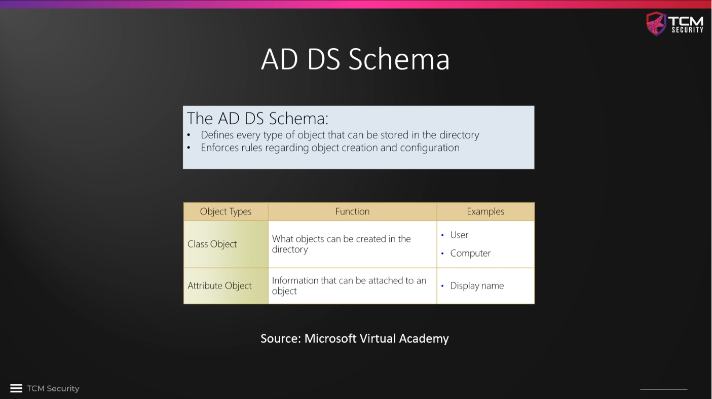
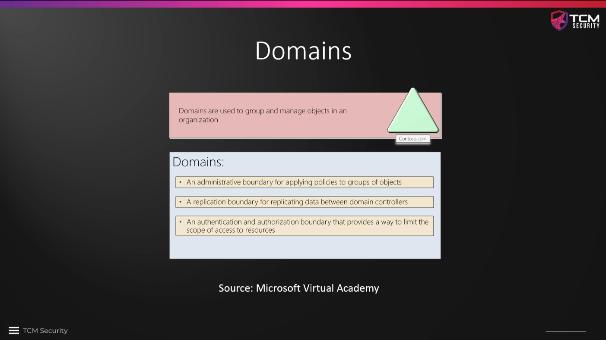
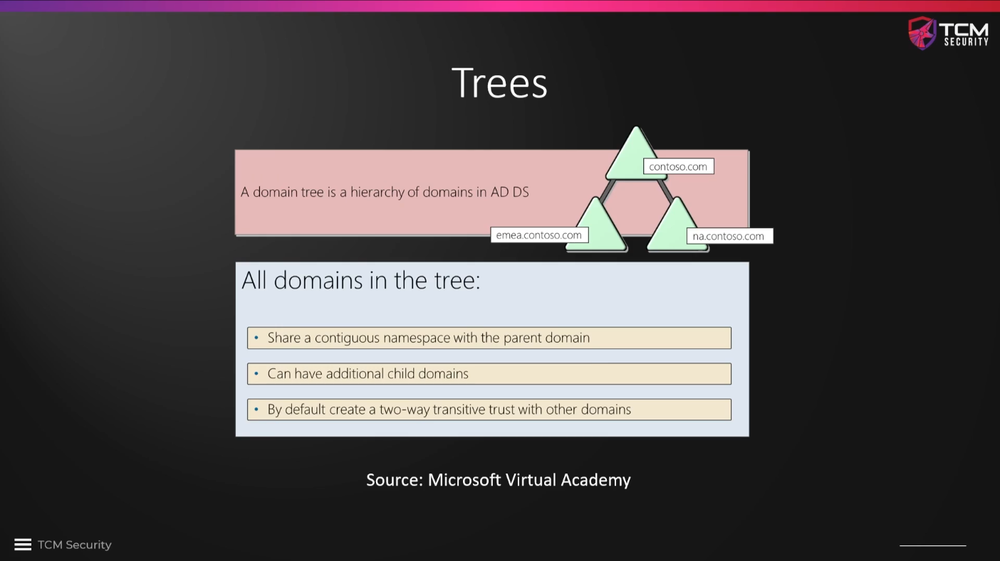
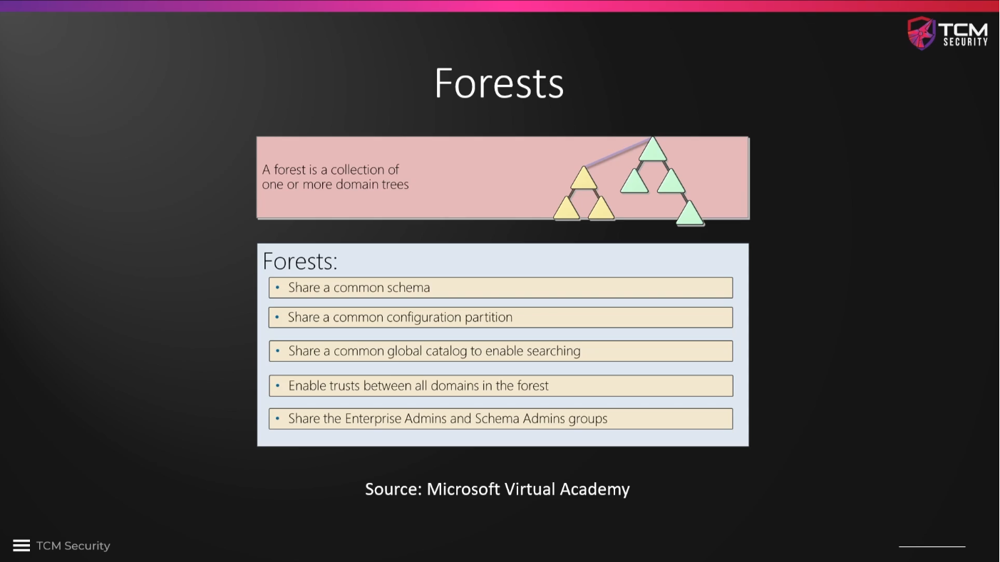
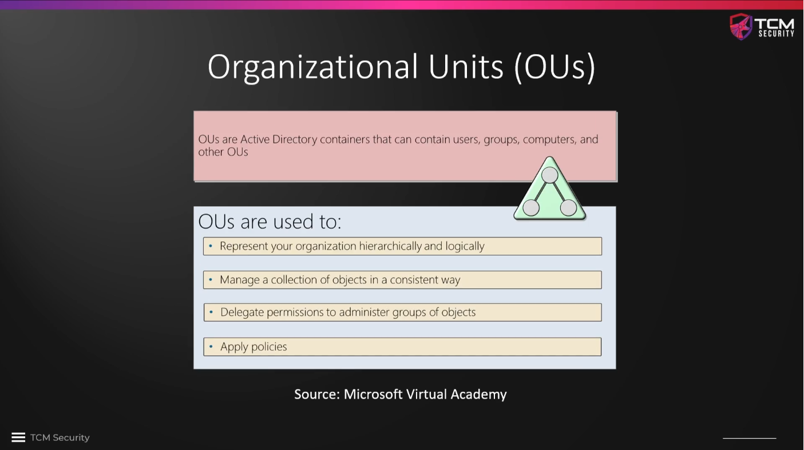
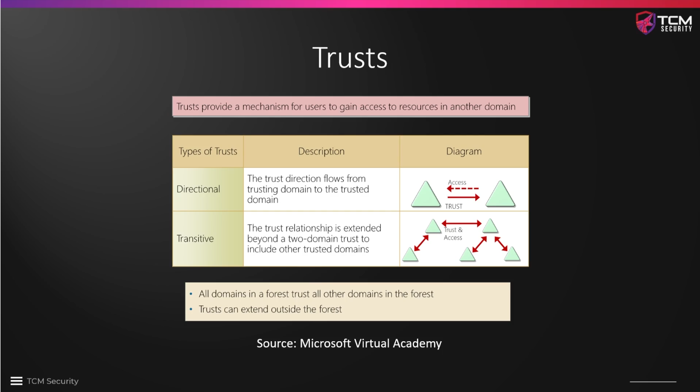
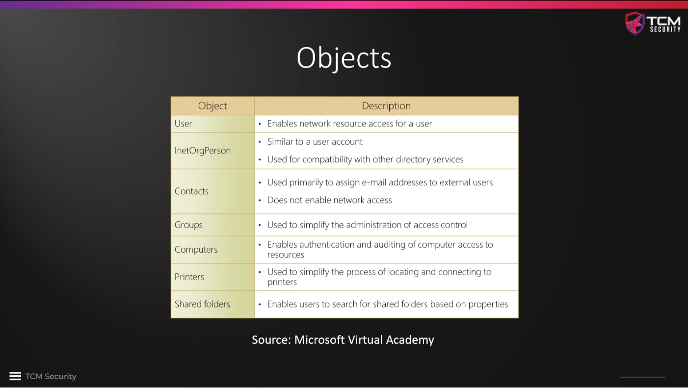

# Logical Active Directory Components

The **AD DS Schema** can be considered a rolebook or **blueprint**. It defines
every type of object that can be stored in our directory as well as rules for
object creation and configuration. There are different types of objects: class
objects for entities such as users or ressources and attribute objects that store
information, e.g. a display name.

**Domains** are used to group and organize the objects in a network. Their names
have structures like `contoso.com` used in the example below, but the ending can
also be different like, e.g. `.local`, `.banana` or so. The domains are controlled
by the previously discussed domain controller. The domain is a boundary for
applying policies. In the course we will only use a single domain,
`MARVEL.local`, but there can be situations where we encounter more than one
domain. 

A hierarchy of domains is organized in a **tree** with a parent domain, e.g.
`contoso.com` and several children domains, e.g. `emea.contoso.com` and
`na.contoso.com`.

A collection of trees is called a **forest**. Most of the time, internal
pentests are executed against a single domain. Jumping from one domain to
another is a bit more advanced and not covered in this course. Since forests
share enterprise and schema administrators, elevating to one of these accounts
may allow one to cross domain boundaries, while domain admins are not
necessarily also enterprise or schema admins and hence may not be able to cross
domain boundaries.

**Organizational Units** are containers that are used to organize objects, e.g.
users, computers, other OUs, etc. One can also group objects into OUs and then
apply a common policy to the objects in the OU.

**Trust** can be directional (i.e., from a trusting to a trusted domain) or
transitive.

**Objects** live within an organizational unit and can be all sorts of things,
such as users, computers, printers, etc.

<!--
span style="color:green;font-weight:700;font-size:20px">
markdown color font styles

