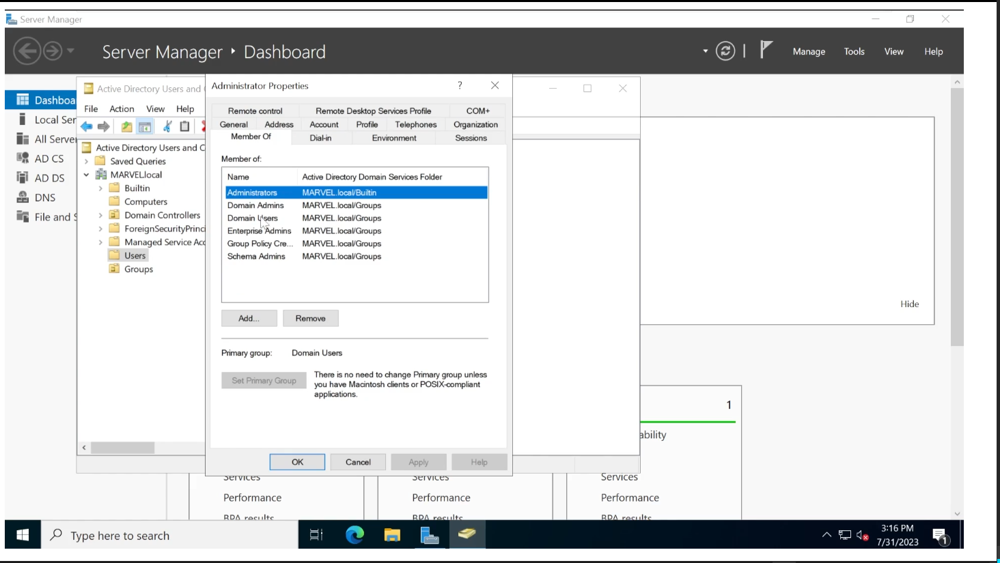
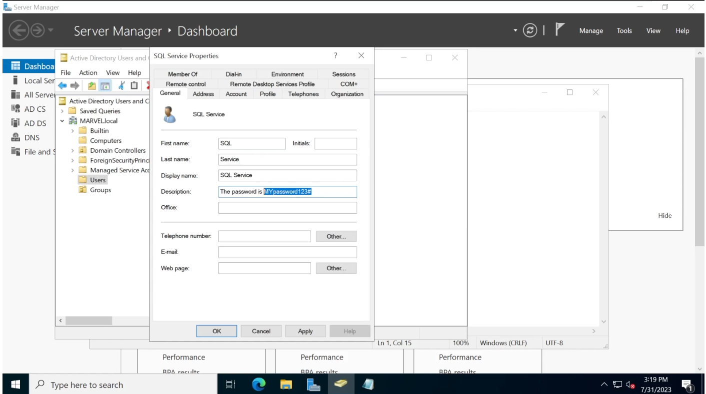
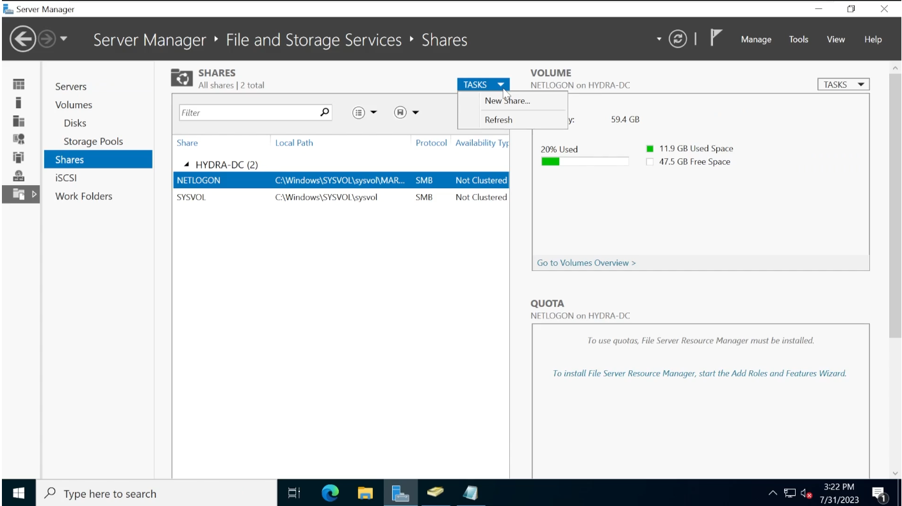
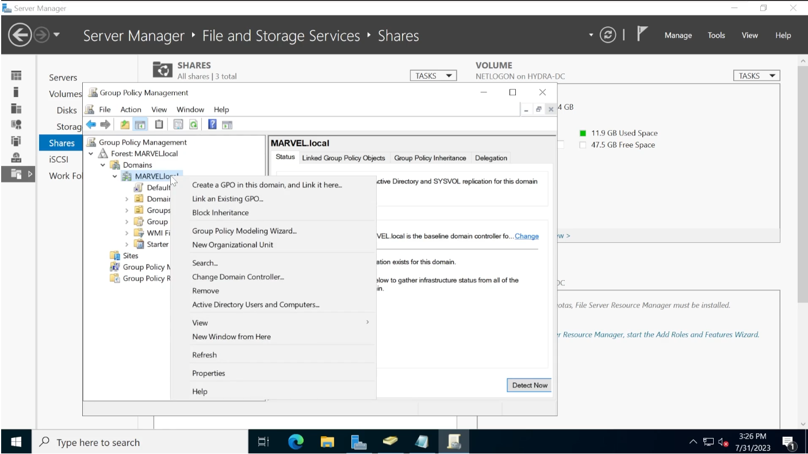
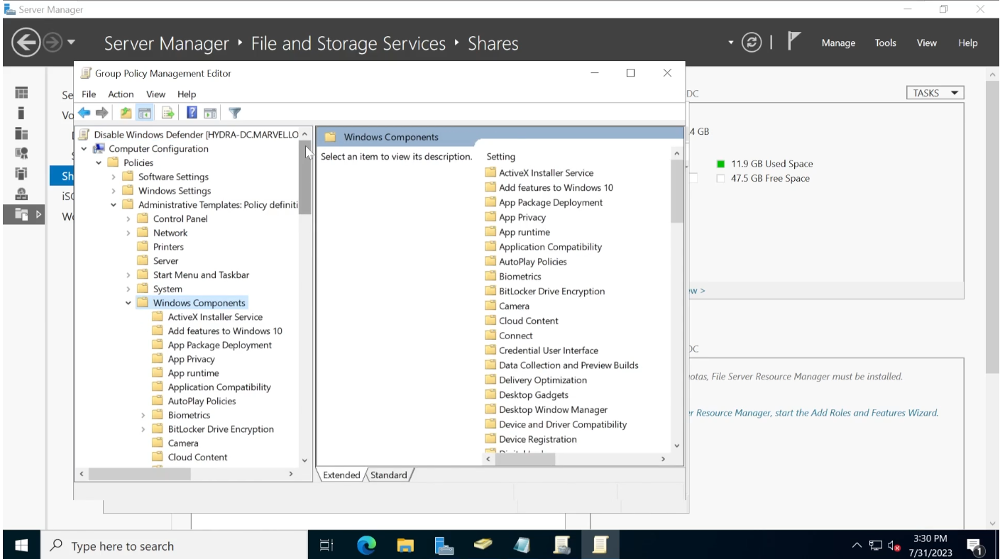
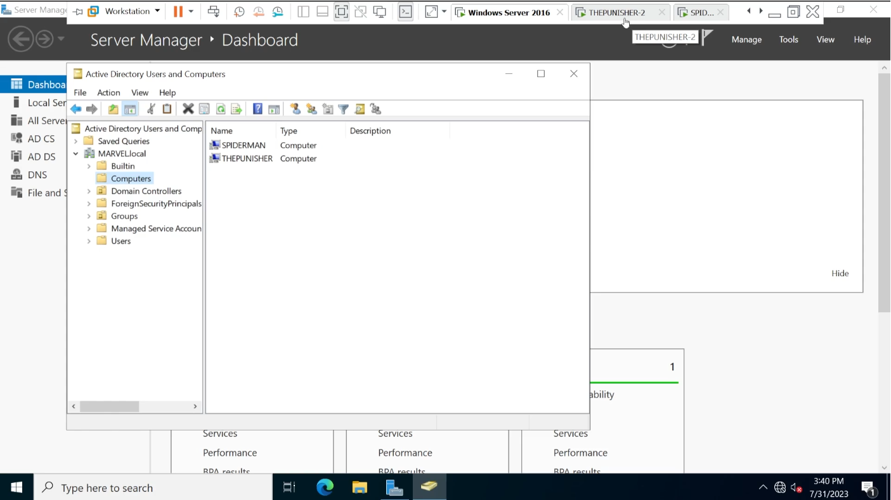
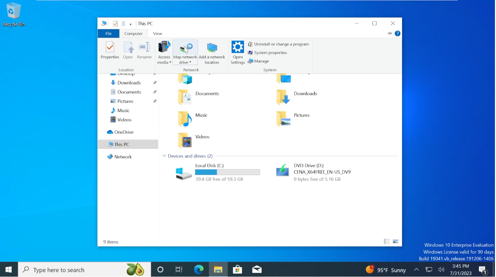

# Active Directory Lab Build

## Lab Overview and Requirements

* 1 Windows Server (2022) + 2 Windows Workstations (2010 Enterprise)
* 60 GB disk space
* 16 GB RAM


## Lab Build - Cloud Alternative

The lab can also be built in the cloud, e.g.
[Azure](https://kamran-bilgrami.medium.com/ethical-hacking-lessons-building-free-active-directory-lab-in-azure-6c67a7eddd7f)
or AWS, but this is not supported by TCM's support team. Using the cloud
ressources costs money, too.


## Downloading Necessary ISOs

The necessary ISO files for the Windows Server 2022 and Windows 10 Enterprise
can be downloaded from [Microsoft's Evaluation
Center](https://www.microsoft.com/en-us/evalcenter/) free of charge.

Once the 90 day evaluation period expires, certain features will not work any
more, but in principle one can use them further. An annoying feature is that
they shut down after 30-60 minutes of inactivity.

Download both ISOs for Windows Server 2022 (64 bit, US edition) and Windows 10
Enterprise (64 bit, US edition). The forms do not need to be filled out with
true data, some bla bla will suffice.


## Setting Up the Domain Controller

Start Virtualbox and click `Neu`, then navigate to the folder where the Windows
Server 2022 ISO file is, pick the file, check `Unbeaufsichtigte Installation
überspringen`, and give the new machine 50-60 GB of disk space, 2 processors and
ideally 8 GB RAM (can be reduced later). Make sure the floppy disk drive is not
installed. Choose `NAT network` as the network connection. Use the NAT network
from the Capstone projects again.

Start the machine, go through the Windows installation process, choose `Windows
Server 2022 Standard Evaluation (Desktop Experience)`, otherwise Windows will
be installed without GUI. Pick the `Custom Install`, click `New` to create a
new harddrive partition, then click `Next` to start the installation process.

* Choose the following login credentials: `Administrator`:`P@$$w0rd!` and log in.
* Change the PC name to `HYDRA-DC` and reboot.

In the `Server Manager` window that pops up upon login, we click `Manage` in
the upper right corner and pick `Add Roles and Features` to make our new machine
the domain controller. In the wizzard, click `Next`, then `Role-based or
feature-based installation`, then choose the `HYDRA-DC` server and click
`Next`. When we get to choose the `Server Roles`, we pick `Active Directory
Domain Services (AD DS)`, then `Next`. In the `Features` pick list, click
`Next` immediately, same in the following `AD DS` menu. Finally click `Install`
with the permission to reboot the machine automatically whenever required.

After the role installation is finished, click on the text `Promote this server
to a domain controller`. In the next window, choose `Add a new forest` with the
root domain name `MARVEL.local`. In the following `Domain Controller Options`,
we set the `Directory Services Restore Mode (DSRM) password` to `P@$$w0rd!`, the
same password that we have chosen for the local administrator account for the
Windows Server 2022 machine. Click `Next` twice, then choose `MARVEL` for the
NetBIOS domain name, click `Next` a couple of times until the `Prerequites
Check` is finished. Click `Install` and wait until the Login screen pops up
again asking us to log into as `MARVEL\Administrator`, now in the `MARVEL`
domain.

Finally, we have to set up `Certificate Services`, again starting by clicking
on `Manage` on the `Server Manager Dashboard`, followed by clicking `Add Roles
and Features`. We choose the `Role-based or feature-based installation` again,
then `Next`again, then in the `Server Roles` we pick the first entry, `Active
Directory Certificate Services`.

The Certificate Services are used to verify
identities on a domain controller and offer a form of enhanced security through
`secure LDAP (LDAP-S)`. LDAP (`Lightweight Directory Access Protocol`) is the
phonebook of our Active Directory. There is a number of attacks that make use
of the Active Directory Certificate Services, which will not be covered in
depth in the course. Certificate Services will be installed with most Active
Directory domain builds.

Click `Next` a few times, make sure that `Certification Authority` is checked
under `Role services`, finally click `Install`. Once the installation is done,
click on the text `Configure Active Directory Certificate Services on the
destination server`. Click `Next`, make sure again that `Certification
Authority` is checked under `Select Role Services to configure`. Choose the
setup type `Enterprise CA` and `Root CA`. Choose `Create a new private key`
with `SHA256` hash algorithm. Leave the CA name unchanged and click through the
menus with `Next` to start the configuration.

Reboot the server before we begin to set up the user machines in the next
chapter. If RAM is scarce, we can also shut it down to change the amount of RAM
that is allocated to the server upon the next start.


## Setting Up the User Machines

To create the two user machines, start in Virtualbox again and click `Neu`,
then follow the menus to select the ISO file for the Windows 10 Enterprise
installations. Again, chose `Unbeaufsichtige Installation überspringen`. Give
both machines 2 cores and 4 GB of RAM each (or 2 GB as the minimum). As machine
names, we choose `THEPUNISHER` and `SPIDERMAN`, and we keep the suggested virtual
harddisk size. Remember to remove any floppy disk, if present. Click `Next`
until the installation starts.

The second machine can be built in parallel with the first one. As for the
Windows Server, the network should be set to `NAT network` to make sure that
all three machines will be in the same network when they are switched on
together.

Install both user machines analogous to Windows Server 2022: pick `Custom
Install`, create `New` partition, click `Next` and let the installation start.
Follow the installation until we get to `Sign in with Microsoft`, then choose
`Domain join instead` in the lower left corner. That allows us to use a local
account instead of an online account that requires registration at Microsoft.
We choose the following login credentials:

* `frankcastle`:`Password1` on the user machine `THEPUNISHER`
* `peterparker`:`Password1` on the user machine `SPIDERMAN`

For security questions we can choose any three of the choice and answer with
e.g. `bob`. The deselect all of the permissions in the privacy settings and
also refuse using `Cortana` with `Not now`. Same for both user machines.

Finally, log in to both machines and rename the machines `THEPUNISHER` and
`SPIDERMAN` and reboot both.


## Setting Up Users, Groups, and Policies

Next step is to modify the domain controller and to set up some users, groups
and policies to play with. For this purpose, we switch off the two user
machines and switch on the server. We will add users, look at organization
units (OUs) and objects, and set up some domain policies. Basically we will be
using the domain controller as it would be done in a real network.

After login, we use the `Server Manager Dashboard` and click on `Tools` in the
upper right corner, then we pick `Active Directory Users and Computers`. There
are already a couple of OUs, such as `Computers` and `Users`. For better
clarity, we create a new OU by right-clicking on `MARVEL.local`, then choose
`New`, then `Organizational Unit`, which we call `Groups`. Then we move all
groups from the `Users` OU into the `Groups` OU. The little logo on the `Guest`
account indicates that it is disabled.

To create a new administrator, we right-click on the `Administrator` account
and pick `Copy`, which will also copy all rights from the original account. To
see the settings, we can double-click on the `Administrator` user and then on
`Member of`.





Upon `Copy` we enter the name `Tony Stark` and the logon name `tstark`, click
`Next` and then the password `Password12345!` and make sure to check `Password
never expires` (no-no!), then click `Finish`.

After that, we copy the administrator account again to create a service
account, which is considered a no-no (first name `SQL`, last name `Service`,
logon `SQLService`, password: `MYpassword123#`). Even though the password meets
all common complexity requirements of a password (numbers, small and capital
letters, special characters), it is rather easy to guess since it is composed of
dictionary words. 

It is quite common that administrators use the description field of a user to
store the password in clear text. Account descriptions are visible to any valid
user!





Next, two regular "low-level" users will be created by right-clicking into the
white space in the `Active Directory Users and Computers` window, then pick
`New` and `User`:

* User `Frank Castle`, logon `fcastle`, password `Password1`, password never
  expires
* By copying `Frank Castle`: user `Peter Parker`, logon `pparker`, password
  `Password2`, password never expires

After that, we create a file share. Click `File and Storage Services` at the
bottom of the `Server Manager Dashboard` menu on the left. Then click on
`Shares` on the left side of the next window. Above the `Shares` pane in the
centre, choose `New Share` from the `TASKS` dropdown menu. Click on `SMB Share
- Quick`, then twice `Next` (confirming the location in the `C:\Shares\` folder)
and give it the name `hackme`, resulting in the remote path `\\HYDRA-DC\hackme`.
Allow the caching of the share, confirm the permissions and click `Create`.





Next, open a command prompt (right-click, `Run as administrator`) and enter
```
setspn -a HYDRA-DC/SQLService.MARVEL.local:60111 MARVEL/SQLService
```


    ChatGPT:
    ========
    Ein SPN (Service Principal Name) ist ein eindeutiger Name, der ein Dienstkonto
    mit einem Dienst auf einem bestimmten Host in einer Active Directory-Umgebung
    verknüpft. Er wird z. B. bei Kerberos-Authentifizierung verwendet, um einem
    Client zu ermöglichen, einen Dienst eindeutig zu identifizieren und mit diesem
    sicher zu kommunizieren.

    Der Befehl bedeutet "Registriere einen SPN HYDRA-DC/SQLService.MARVEL.local:60111
    für das Dienstkonto MARVEL\SQLService.

    Dadurch kann ein Client, der den Dienst auf HYDRA-DC über Port 60111
    ansprechen will, eine Kerberos-Anfrage für HYDRA-DC/SQLService.MARVEL.local:60111
    stellen. Die Domäne weiß dann: "Dieser Dienst gehört zu MARVEL\SQLService"
    und kann ein gültiges Kerberos-Ticket ausstellen.

    -a: Option für "add", d. h. einen neuen SPN hinzufügen


We can check the success with `setspn -T MARVEL.local -Q */*` and should see
`Existing SPN found!` at the end of the output. (SPN will be covered in more
detail in conjunction with Kerberos attacks.)

The final thing that needs to be done for the setup of the domain controller is
to set up a group policy that will apply for the entire domain. We start by
searching for `Group` in the Start menu and pick `Group Policy Management`.
Then click on `FOREST: MARVEL.local`, then `Domains`, then right-click on
`MARVEL.local` and choose `Create a GPO in this domain and link it here`. Give
it the name `Disable Windows Defender`. Pick the new policy from the tree
structure on the left, confirm the popup window, then right-click on the new
group and pick `Edit`. 





In the new window, we pick `Computer Configuration` in the tree view, then
`Policies`, then `Administrative Templates` and `Windows Components`. Find
`Microsoft Defender Antivirus` (could also be `Microsoft Defender Antivirus`).
Double-click on `Turn off Microsoft Defender Antivirus`, then select `Enabled`,
then `Apply` and `Ok`. Go back to the `Group Policy Management` window,
right-click on the `Disable Microsoft Defender` policy and choose `Enforced`,
so that whenever a user or computer joins the domain, the group policy will be
enforced.





The really final task is to check the IP configuration, using `ipconfig` from
the command prompt. We can also set a static IP address using `Open Network &
Internet settings` in the lower right corner, then `Change adapter options` and
`Properties` and `Internet Protocol Version 4` for the chosen NIC. However, we
do not need an internet connection, since we will exploit the Windows domain.

Done. Shut down the Windows Server.


## Joining Our Machines to the Domain

Before we start the virtual machines, we can now reduce the allocated RAM from
8 GB to 2 GB for the server, keeping 4 GB for each of the two user machines.
(If it had to be, `SPIDERMAN` could also be reduced to 2 GB RAM.) We can then
switch on all three machines to join the domain with the two user machines.

On both user machines, we quickly check our that our IP address is in the same
subnet as the server, then we go to `Change adapter options` again and set our
domain controller's IP address as the static DNS server address.

To join the `MARVEL.local` domain, we go to the start menu and search for
`domain`, then we choose `Access work or school` and click `+ Connect`. Instead
of entering an email address, we choose `Join this device to a local Active
Directory domain` and enter `MARVEL.local` as the domain name. If things go as
planned, we are asked to enter login credentials. We use
`Administrator`:`P@$$w0rd!` and add a user account for `administrator` (account
type `Administrator`) if we are asked for it. Restart the machine if asked for
it. Same process for both user machines.

Log in to the domain controller to check whether the users `frankcastle` and
`peterparker` have joined the domain. Under the `Server Manager Dashboard` go
to `Tools` in the upper right corner and pick `Active Directory Users and
Computers`. Under the domain `MARVEL.local` we should now find the computers
`THEPUNISHER` and `SPIDERMAN` under `Computers`. 





Next, we log in to `THEPUNISHER` with the `MARVEL\Administrator`:`P@$$word!`
credentials, same on the `SPIDERMAN` machine. We will now set up local
administrators for the two user machines and a shared drive on the `SPIDERMAN`
machine.

On `THEPUNISHER` enter `users` in the search field, then pick `Edit local users
and groups` and click on `Users` to show the local users on the machine. We can
change the password for the `Administrator` user by right-clicking on the
account. We set it to `Password1!`. Next, we double-click on the account and
uncheck the box `Account is disabled` to enable it (`Apply`, `Ok`).

Next, we click on `Groups` in the tree view on the left and click on
`Administrators` in the right part of the window. We should see four accounts,
two local and two domain accounts. We will add an account by clicking on
`Add...` and entering `fcastle` in the text box. Click on `Check names` will
lead to the OS finding the user on the domain, so that we can add it with `Ok`
and `Apply`.

Then we open a Windows Explorer and click on `Network`. If network discovery is
not enabled, we can do so by clicking on the yellow bar at the top of the
window and turning it on (`Turn on network discovery and file sharing`). Now we
should see the `HYDRA-DC` domain and the `hackme` share on it.

We carry out the exact same steps on the `SPIDERMAN` machine with the exception
that we add both `pparker` (by analogy), but also `fcastle` as local
administrators. Next, we log out of the `SPIDERMAN` machine and log in again as
the local administrator `.\peterparker`:`Password1`. 





We open a Windows Explorer again and click on `This PC` in the tree view, then
`Computer` at the top menu, then click on `Map network drive` and assign the
network path `\\HYDRA-DC\hackme` ("folder") to the drive Z:, checking the box
`Connect using different credentials`. The enter `administrator`:`P@$$w0rd!` as
the credentials, then the share should appear as drive Z: in our `Network
locations`.

The lab build for Active Directory is now finished.


<!--
span style="color:green;font-weight:700;font-size:20px">
markdown color font styles
</span
-->
