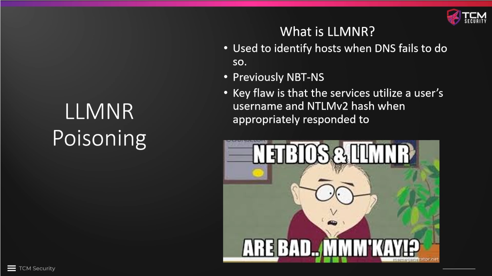
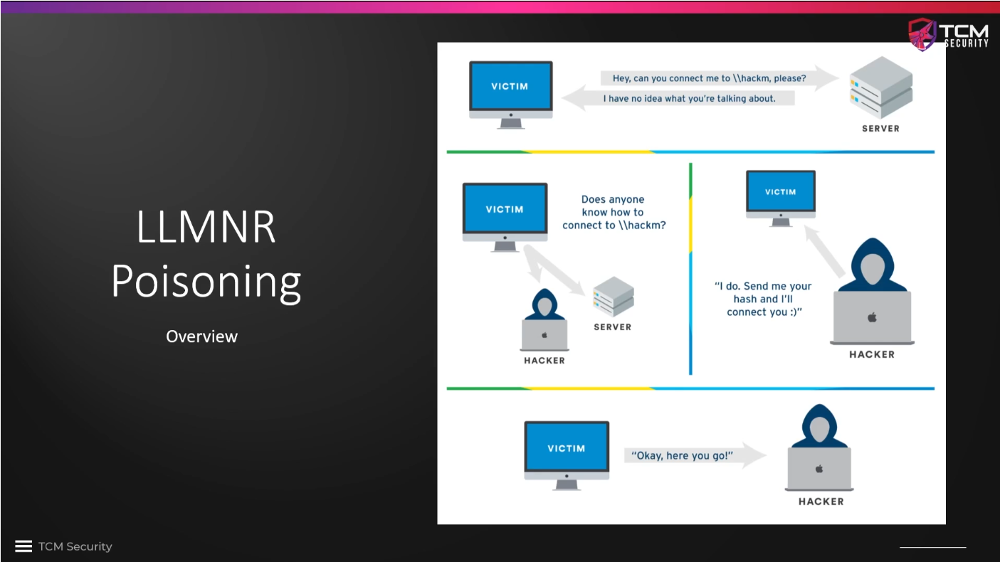
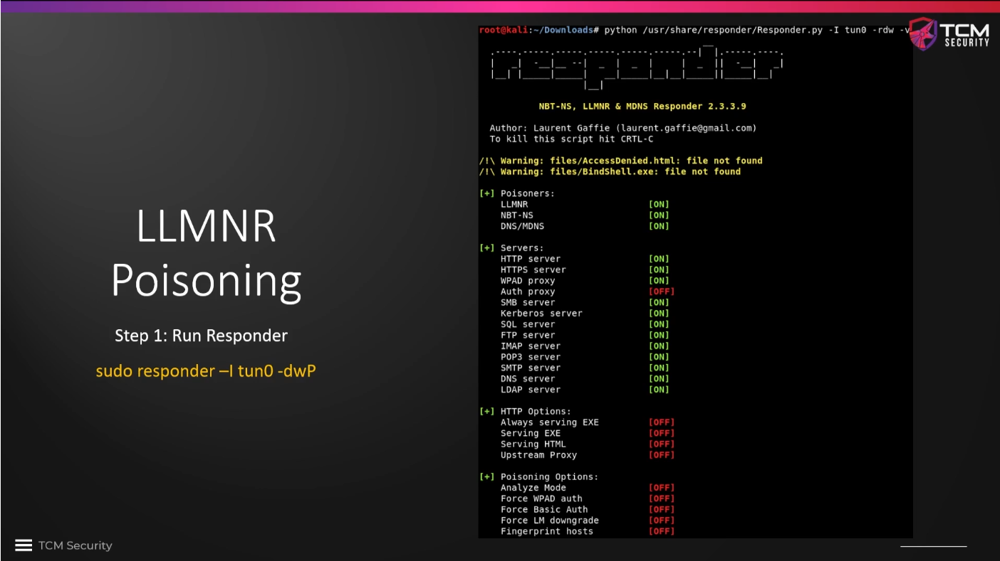
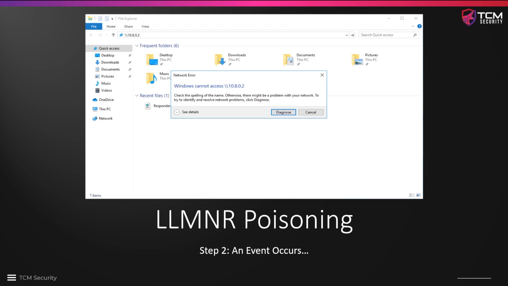
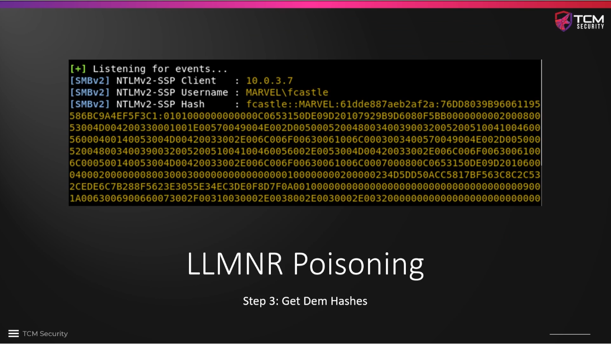
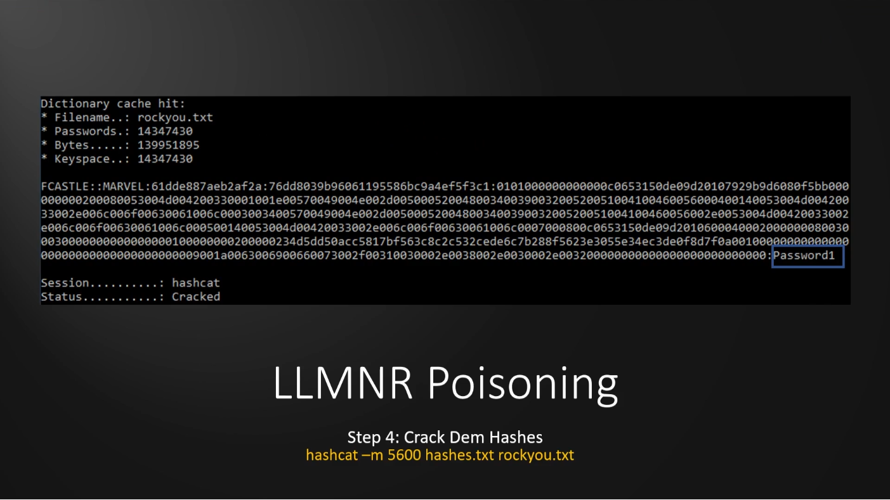

# LLMNR Poisoning Overview

**Link-Local Multicast Name Resolution (LLMNR)** is probably the most popular
and common attack in an internal penetration test. The protocol is used when DNS
fails to identify hosts in a network. It used to be known as NBT-NS (found in
older networks), even though this has been replaced by LLMNR. We can attack both
with the same tool. The key flaw is that when we intercept the corresponding
traffic in the network, we will be able to intercept a username and the
matching password hash! When we have captured the hash, we can try to crack it
offline. This is an example of a **man-in-the-middle attack**.







We run a Python script called `responder` on our Kali attack machine. The
syntax to run it is

```
sudo responder -I <interface> -dwP
```

where `<interface>` denotes the NIC through which we communicate with the
victim network, e.g. `eth0` or `enps0`. As the name suggests, the `responder`
will respond to incoming traffic, including LLMNR if it is active on the
network. The share folder shown on the slide above was just one example, actually
there will be a lot of such traffic, particularly early in the morning or after
lunch, when many people log in to their computers. Also running `Nessus` or other
scans can generate additional traffic. We simply start `responder` and let it
gather hashes whenever it encounters one. 







In our lab, we are simulating traffic and are intentionally creating traffic
for `responder`, e.g. by opening a file share over the network.

We can then use software like `hashcat` to crack the password based on the
captured hash. If the password is weak enough, this can be done rather easily.
This is a very common attack method against, particularly since LLMNR is
enabled by default on Windows networks -- a "feature" of Windows and Active
Directory.







### Further reading

* [deutsch](https://pentestit.de/lokale-netzwerkangriffe-llmnr-und-nbtns-poisoning/)
* [MITRE, english](https://attack.mitre.org/techniques/T1557/001/)


<!--
span style="color:green;font-weight:700;font-size:20px">
markdown color font styles
</span
-->
