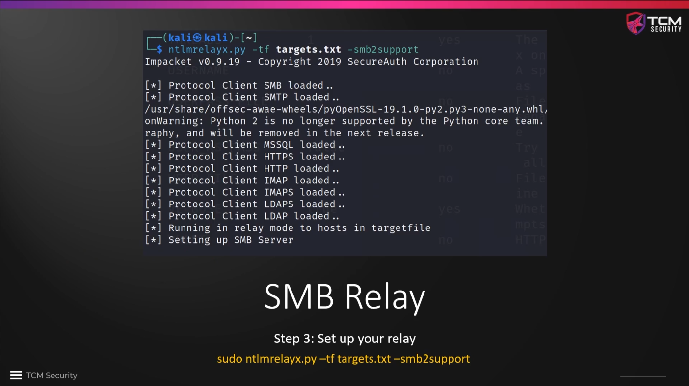

# SMB Relay Attacks Overview

In contrast to capturing and then cracking a hash in an LLMNR attack, we can also
relay (=forward) that hash via SMB to gain access to a victim machine. That is
an interesting option if, e.g., the password policy of the victim is good, and
it is hard to crack the captured hashes.

There are some prerequisites:

* **SMB signing** must be disabled or not enforced on the target, which is the
case by default on Windows workstations, whereas it is enforced by default on
servers. (The default settings can be changed in both cases, of course. We have
to check the actual setting with a network scan.)

* The relayed credentials must have **local administrator privileges** on the
target machine, otherwise the attack is not very fruitful.


The steps of a successful SMB relay attacks are as follows:

* **Identify hosts without SMB signing enforced** with `nmap` or any other
vulnerability scanner, e.g. Nessus. With `nmap`, the message `Message signing
enabled but not required` is proof that SMB signing is disabled (and hence an
important finding for our pentest report!). Use the command
`nmap --script=smb2-security-mode.nse -p445 <target IP CIDR>`, used once on the
Windows server (10.0.2.5) and once on one of the Windows user machines (10.0.2.6).
**Note:** `"Message signing enabled and required"` means that SMB signing is
enforced on the machine. Consider to use the switch `-Pn` for the `nmap`
command, especially when using security scripts. This treats all hosts as online
and skips host discovery.

```
┌──(kali㉿kali)-[~]
└─$ nmap --script=smb2-security-mode.nse -p445 10.0.2.15
Starting Nmap 7.95 ( https://nmap.org ) at 2025-08-29 12:07 PDT
Nmap scan report for blackpearl.tcm (10.0.2.15)
Host is up (0.00054s latency).

PORT    STATE SERVICE
445/tcp open  microsoft-ds
MAC Address: 08:00:27:99:A3:3E (PCS Systemtechnik/Oracle VirtualBox virtual NIC)

Host script results:
| smb2-security-mode:
|   3:1:1:
|_    Message signing enabled and required

Nmap done: 1 IP address (1 host up) scanned in 0.46 seconds

┌──(kali㉿kali)-[~]
└─$ nmap --script=smb2-security-mode.nse -p445 10.0.2.6
Starting Nmap 7.95 ( https://nmap.org ) at 2025-08-29 12:11 PDT
Nmap scan report for 10.0.2.6
Host is up (0.00028s latency).

PORT    STATE SERVICE
445/tcp open  microsoft-ds
MAC Address: 08:00:27:16:45:F8 (PCS Systemtechnik/Oracle VirtualBox virtual NIC)

Host script results:
| smb2-security-mode:
|   3:1:1:
|_    Message signing enabled but not required

Nmap done: 1 IP address (1 host up) scanned in 0.32 seconds
```


* **Start Responder with changed configuration:** Switch SMB and HTTP off by
editing the config file stored under `/etc/responder/Responder.conf` and
running Responder with `sudo responder -I <interface> -dwP` (again: switches w
and P incompatible, change to `-dP`)

```
    ┌──(kali㉿kali)-[~]
    └─$ cat /etc/responder/Responder.conf
    [Responder Core]

    ; Poisoners to start
    MDNS  = On
    LLMNR = On
    NBTNS = On

    ; Servers to start
    SQL      = On
    SMB      = Off
    RDP      = On
    Kerberos = On
    FTP      = On
    POP      = On
    SMTP     = On
    IMAP     = On
    HTTP     = Off
    HTTPS    = On
    DNS      = On
    LDAP     = On
    DCERPC   = On
    WINRM    = On
    SNMP     = Off
    MQTT     = On

    ; Custom challenge.
    (...)
```


* **Start ntlmrelayx**: store the target machines that have SMB signing
  disabled in a file, e.g. `targets.txt` and run
  `ntlmrelayx.py -tf targets.txt -smb2support`. When `responder` captures a hash
  it forwards it to `ntlmrelayx`, which then forwards it to the selected targets.
  If the intercepted user credentials belong to a local administrator account
  on the target machine(s), we will gain access. For installation instructions
  see the [github repo](https://github.com/fortra/impacket) of `impacket`, which
  `ntlmrelayx.py` is part of.




* Next, we **need an event to occur**, similar to the previous attack type
  LLMNR poisoning. In the same way, we will point the request to ourselves.
  (What happens if we choose another network ressource, e.g. the SMB share?)


* Once the **relay succeeded** (see topmost line in the screenshot below), we
  get a dump of all hashes in the SAM file on the host to which the credentials
  were relayed. Once we have the hash for the administrator, we can use it to
  log into the machine (more details will follow later).


* As an alternative, we can also add an `-i` switch to the `ntlmrelayx` command
  we have used earlier to get an **interactive shell**, which we can use to
  connect to the respective machine with netcat to execute commands and list
  shares and files.


* We can also use `ntlmrelayx` to **execute commands directly** by appending the
  switch `-c "<command>"` to the `ntlmrelayx` command. This can be, e.g., the
  creation of a new user with admin rights to get permanent access to the host.


### Further Reading

* [TCM Sec writeup](https://tcm-sec.com/smb-relay-attacks-and-how-to-prevent-them/)
* [A detailed
  walkthrough](https://medium.com/@AnisO./active-directory-attacks-smb-relay-attacks-ea7d8cf9a8f8)


<!--
span style="color:green;font-weight:700;font-size:20px">
markdown color font styles
</span
-->
