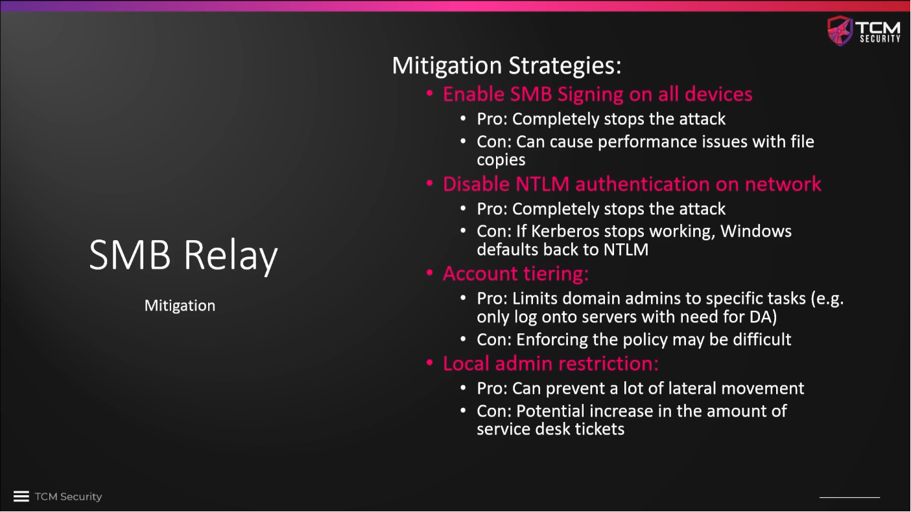

# SMB Relay Attack Defenses

TCM recommends **enforcing SMB signing** on all devices as the #1 remedy against
SMB relay attacks. He cites claims of unnamed sources that file copying speed
dropped by 10-20% as a consequence. For companies with the need to copy a lot
of big files, this may be an argument, but for most organizations the plus in
safety should overcompensate the drop in copying speed.

The other mitigation strategies mentioned in the screenshot below are best
practices, anyway -- not necessarily disabling NTLM completely, but the other
two, regardless of our SMB relay attack defense strategy.

**Account tiering** basically means that admins should use accounts with as low
permissions as possible and only use a dedicated account with full admin rights
when it is really necessary. The difficulty to enforce this just stems from
laziness of the admins to pursue this approach diligently.

If we **do not allow local admins**, the SMB relay attack is not really viable
because the attacker can only get access to a low-level account, neither to the
SAM file, nor to any further enumeration results. Local admin privilege abuse is
a very important way of gaining access to a Windows network, hence taking it
away reduces the attack surface a lot. On the downside, the effort for the user
help desk may increase since users cannot do mundane admin tasks themselves. 

<!--
span style="color:green;font-weight:700;font-size:20px">
markdown color font styles

