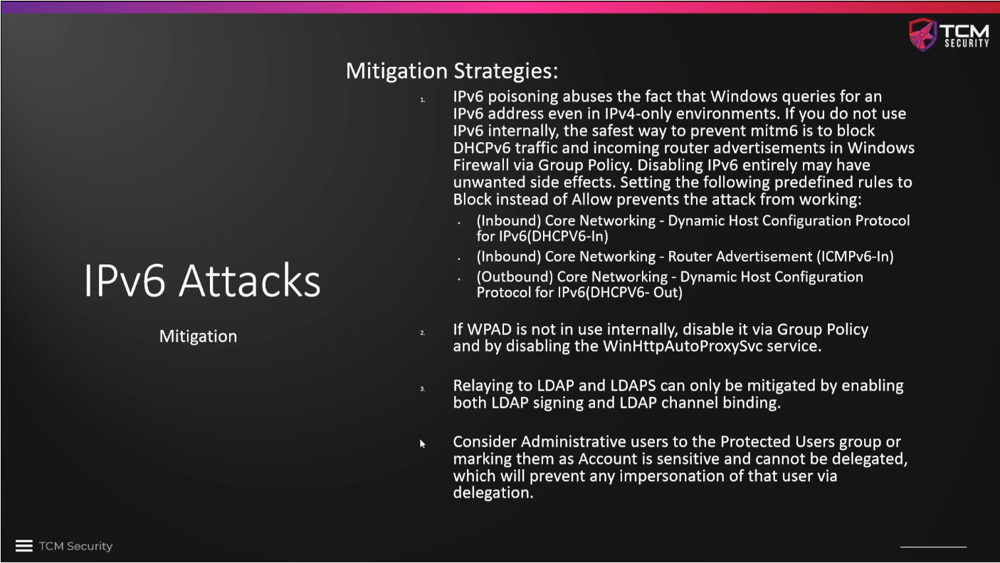

# IPv6 Attack Defenses

Simply disabling IPv6 internally may lead to unwanted side effects. Instead,
certain traffic can be blocked in the Windows Firewall: `DHCPv6-In`,
`ICMPv6-In` and `DHCPv6-Out`.

Other mitigation strategies include disabling `WPAD` through Group Policies if
the protocol is not used in the network. Also disable the `WinHttpAutoProxySvc`
Service.

Relaying to LDAP and LDAPS can be mitigated by using LDAP signing (similar to
SMB signing)and LDAP channel binding.

A **general best practice** is to move the administrators to a **Protected
Users** group. We can also mark the account as sensitive and not to be
delegated to prevent **impersonation attack** via a delegation (not discussed
here, but a very prominent attack vector).

<!--
span style="color:green;font-weight:700;font-size:20px">
markdown color font styles

