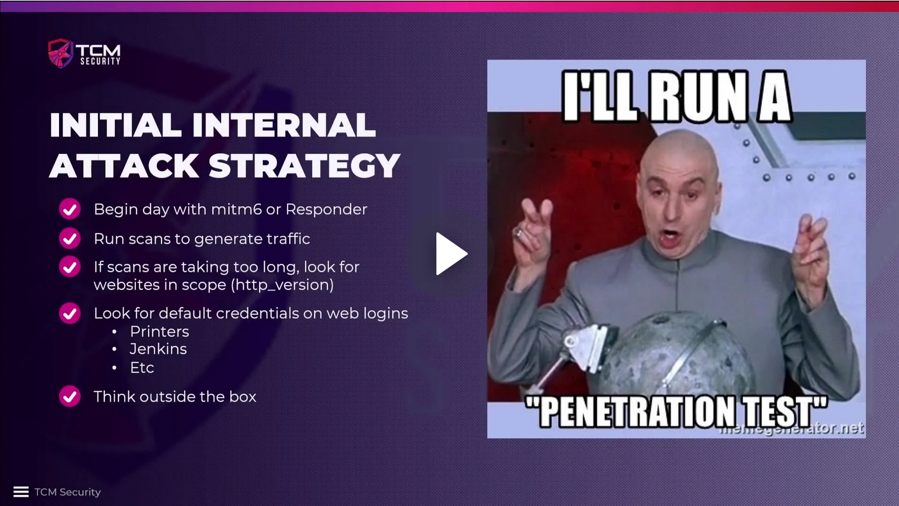

# Initial Internal Attack Strategy

`Responder` may be preferrable over starting the internal pentest with `mitm6`
due to the risk of taking down the network, hence 5-10 minute sprints. We
should runs scans, e.g. `Nessus`, in parallel to generate some traffic.
`Responder` can run all day, but the best times are in the morning and after
lunch, when users are logging in to their computers.

If we are waiting for traffic, or if there are no results from `responder` and
`mitm6` we should look for internal websites using the `Metasploit` module
`http_version`. (In general, we should never just be sitting around, but try to
be multi-tasking instead.)

We can also try default credentials on devices such as network printers or
other hardware or on CMS like Jenkins.

If we do not find anything helpful, we need to start thinking outside the box
and use what is available, such as websites and default passwords. If nothing
else helps, we can also ask our customer to create an account for us that we
can use to try to enumerate the network and elevate our user rights -- that is
due diligence towards our customer!

**Dig, dig, dig! Enumeration is going to make or break our career as a hacker**,
not exploits or attacks, but the information that we can gather and use against
an organization.

#### Further reading

* [Metasploit Working with HTTP Auxiliaries](https://library.mosse-institute.com/articles/2022/07/metasploit-working-with-http-auxiliaries/metasploit-working-with-http-auxiliaries.html)

<!--
span style="color:green;font-weight:700;font-size:20px">
markdown color font styles

