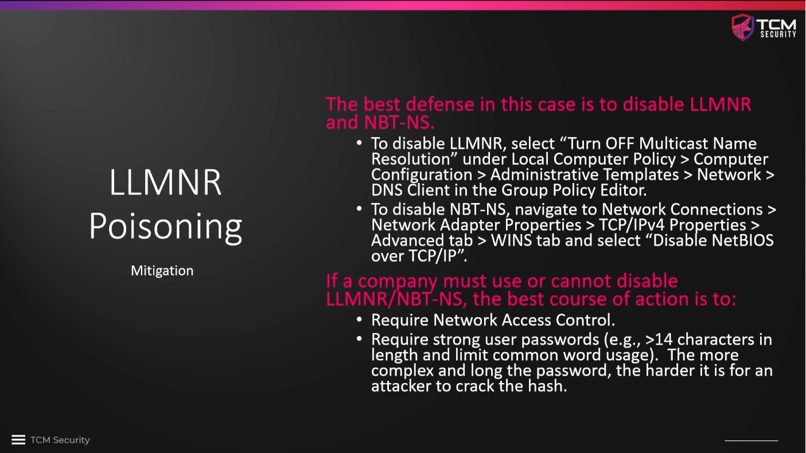

# LLMNR Poisoning Mitigation

The best mitigation is to simply switch of LLMNR and NBT-NS through group
policies that are set on the domain controller similarly to the group policy
that we have set up to switch of Microsoft Defender.

On the Windows Server, search for `Group Policy Management` and go to the
domain in question in the tree view on the left. We can edit an existing
`Default Domain Policy`, then go to `Computer Configuration` and further into
`Administrative Templates`. Within `Network` find the `DNS Client` settings. At
the bottom of the setting list is `Turn of multicast name resolution`, which
needs to be `Enabled`, followed by `Apply` and `Ok`.

If there are reasons that make it impossible to disable LLMNR or NBT-NS, the
mitigations are

* **Network Access Control**, which only allows explicitly allowed devices on the
  network, e.g. via a MAC address whitelist. This makes it impossible to just
  add a device to the network by plugging it into a network socket.
* **Strong user passwords** that make cracking very costly. **Long does not
  necessarily also mean complex!** We need to avoid usage of common words that
  can easily be found in a dictionary. Passwords must be longer than 14
  characters. These rules should of course always be followed when a new
  password is chosen.

<!--
span style="color:green;font-weight:700;font-size:20px">
markdown color font styles

