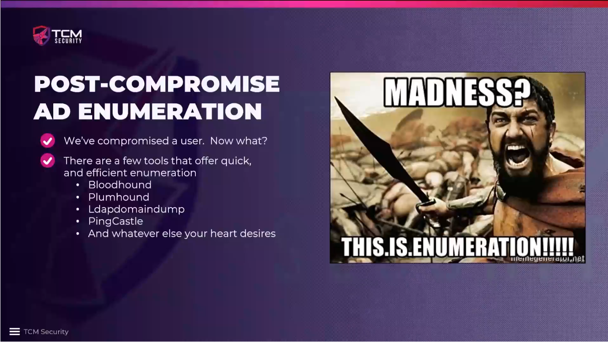

# Introduction

What happens once we compromise an account? We are focussing on the first 2-3
stages of the 5 stages of hacking: information gathering, scanning and
executing a hack. In this case, we will go back and re-enumerate the network
once we get access to an account. Even if it is a regular user, we can gain a
lot of information from the account.

When we get into an internal pentest, we usually have no information about the
network at all. So we start from the one account that we have to explore the
network from there.

Powerview is not part of the tools that we will use since it has not been
updated for a long time and is easily picked up by antivirus software.

### Further reading

* [LDAP (Wikipedia)](https://en.wikipedia.org/wiki/Lightweight_Directory_Access_Protocol)
* [Was ist LDAP-Authentifizierung? Grundlagen und Vorteile](https://www.redhat.com/de/topics/security/what-is-ldap-authentication)
* [LDAP Enumeration: Unveiling the Double-Edged Sword of Active Directory](https://unit42.paloaltonetworks.com/lightweight-directory-access-protocol-based-attacks/)
* [Andreas Happe: Active Directory: Using LDAP Queries for Stealthy Enumeration](https://snikt.net/blog/2023/01/25/active-directory-using-ldap-queries-for-stealthy-enumeration/)
* [Lightweight Directory Access Protocol (LDAP)](https://github.com/curtishoughton/Penetration-Testing-Cheat-Sheet/blob/master/Enumeration/LDAP/LDAP.md)
* [The Hacker Recipes -- LDAP](https://www.thehacker.recipes/ad/recon/ldap)
* [LDAP Pentesting for Red Teamers: A Complete Guide](https://medium.com/@gokulg.me/introduction-92199491c808)

<!--
span style="color:green;font-weight:700;font-size:20px">
markdown color font styles

