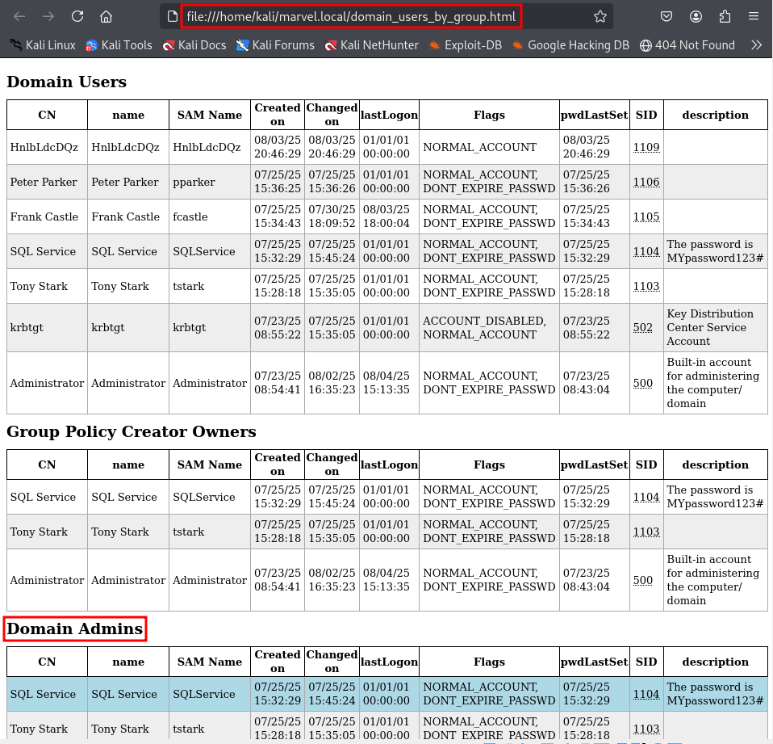

# Domain Enumeration with LDAPDomainDump

We have already used the tool `LDAPDomainDump` in the previous section in the
IPv6 man-in-the-middle attack. To use it independently of `mitm6`, e.g. if IPv6
cannot be used, but we have user credentials for an account, we first create a
folder on our attack machine with `mkdir marvel.local` and `cd` into this
folder. Then we invoke the (preinstalled) tool with

```
┌──(kali㉿kali)-[~/marvel.local]
└─$ ldapdomaindump ldaps://10.0.2.15 -u 'MARVEL\fcastle' -p Password1
[*] Connecting to host...
[*] Binding to host
[+] Bind OK
[*] Starting domain dump
[+] Domain dump finished
                                                                                                                    
┌──(kali㉿kali)-[~/marvel.local]
└─$ ls                                                               
domain_computers_by_os.html  domain_groups.grep  domain_policy.html  domain_trusts.json          domain_users.json
domain_computers.grep        domain_groups.html  domain_policy.json  domain_users_by_group.html
domain_computers.html        domain_groups.json  domain_trusts.grep  domain_users.grep
domain_computers.json        domain_policy.grep  domain_trusts.html  domain_users.html
```
The output of `ldapdomaindump` is now stored in our newly created folder. We
could otherwise have specified an output folder with the option `-o <folder
name>`.

We will get the same information as in the IPv6 relay attack very quickly.
Again, the information on the machines on the network and the users by group
are particularly helpful for the further attack. In the first place, we want to
know who the high-value targets are: domain admins and enterprise admins, but
also any other credentials that might be accessible from the data dump and that
can be of value to get access to other resources again.

Also the information about `domain_computers` is very helpful because we can
spot older operating systems that we can exploit more easily than others.




<!--
span style="color:green;font-weight:700;font-size:20px">
markdown color font styles
</span
-->
