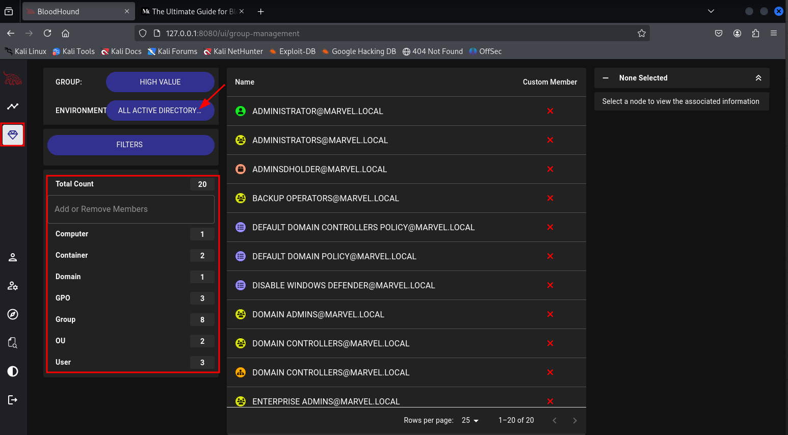

# Domain Enumeration with Bloodhound

Installing `Bloodhound` was a nightmare that took me more than a full day since
the TCM video is from 2021, and `Bloodhound` has changed quite a bit in the
meantime. It is now based on `Docker`, and it is not necessary any more to
install `neo4j` explicitly, even though it is used to display the results.
After a long time of trial-and-error, I started with a fresh installation of
`Kali 2025.2` and updated it with `sudo apt update && sudo apt upgrade`, before
I followed the steps described in this
[youtube video](https://www.youtube.com/watch?v=NFfHUYAyGN8&t=1s):

* Switch to `root` with `sudo su`
* Navigate to `/opt`, create a folder `Bloodhound` and `cd` into that folder
* Install Docker: `sudo apt install docker.io && sudo apt install
  docker-compose`
* Add the current user to the docker group: `sudo usermod -aG docker $USER`
* Download and install `Bloodhound` with `curl -L https://ghst.ly/getbhce >
  docker-compose.yml` and `sudo docker-compose pull && docker-compose up`
* Open a browser tab and go to `http://127.0.0.1:8080/`
* Log in as user `admin` with the random password that was displayed during the
  installation, then change the random password to a new one.

It turned out, though, that the major change was perhaps not so much following
the installation steps above, but much more to set the Virtualbox settings from
2 GB / 2 cores to 4 GB / 4 cores. Without that, `Bloodhound` allowed me to log
in with the credentials `admin:admin` or `admin:<random password shown during
the installation>`, depending on the source of the `Bloodhound` version in use.
However, I never managed to get beyond the point where I was asked to change my
password. Whenever I entered a new password, the VM froze for 1-2 minutes, then
I got an error message that the password could not be changed. The freezing
made me wonder if more resources might help, and they did. With the same
installation, but starting with 4 GB and 4 cores, I was able to set a new
password and to start a new instance of `Bloodhound` with `sudo docker-compose
up -d` started from the folder `/opt/Bloodhound`. I could then open a browser
tab and navigate to [localhost, port 8080](http://127.0.0.1:8080/) and log in.

Finally, I have downloaded the script `pimpmykali` that is provided by TCM Sec.
to prepare a fresh Kali VM with everything that is needed for the coursework.
The script can be downloaded from
[github](https://github.com/Dewalt-arch/pimpmykali) and is installed according
to the instructions in the github repo.

The key functions can be invoked as follows (differing from TCM's video!):

* **Clear database:** in the toolbar on the left, choose `Administration`, then
  choose `Database Management` and check the boxes of those items that shall be
  deleted, then press `Delete`
* **Importing data using an ingestor:** create a new directory, e.g.
  `bloodhound-data` and `cd` into the directory. Enter `sudo bloodhound-python
  -d MARVEL.local -u fcastle -p Password1 -ns 10.0.2.15 -c all` with options
  `-d`, `-u` and `-p` for the domain, user name and password, `-ns` for the IP
  of the   domain controller and `-c all` to collect all available data. The
  output of this command is a couple of `JSON` files that can be imported into
  `Bloodhound`.
```
┌──(kali㉿kali)-[~/bloodhound-data]
└─$ sudo bloodhound-python -d MARVEL.local -u fcastle -p Password1 -ns 10.0.2.15 -c all
[sudo] password for kali: 
INFO: BloodHound.py for BloodHound LEGACY (BloodHound 4.2 and 4.3)
INFO: Found AD domain: marvel.local
INFO: Getting TGT for user
WARNING: Failed to get Kerberos TGT. Falling back to NTLM authentication. Error: [Errno Connection error (hydra-dc.marvel.local:88)] [Errno -3] Temporary failure in name resolution
INFO: Connecting to LDAP server: hydra-dc.marvel.local
INFO: Found 1 domains
INFO: Found 1 domains in the forest
INFO: Found 3 computers
INFO: Connecting to LDAP server: hydra-dc.marvel.local
INFO: Found 9 users
INFO: Found 52 groups
INFO: Found 3 gpos
INFO: Found 2 ous
INFO: Found 19 containers
INFO: Found 0 trusts
INFO: Starting computer enumeration with 10 workers
INFO: Querying computer: SPIDERMAN.MARVEL.local
INFO: Querying computer: THEPUNISHER.MARVEL.local
INFO: Querying computer: HYDRA-DC.MARVEL.local
INFO: Done in 00M 01S
                                                                                             
┌──(kali㉿kali)-[~/bloodhound-data]
└─$ ls
20250806090433_computers.json   20250806090433_gpos.json    20250806090433_users.json
20250806090433_containers.json  20250806090433_groups.json
20250806090433_domains.json     20250806090433_ous.json
```
* **Import data:** in the toolbar on the left, choose `Administration`, then
choose `File Ingest`, then click `Upload File(s)` in the upper right corner.
Drag and drop the data files in the respective field and click upload. Make
sure that the import was successful (`Done` and green checkmark for every file).


* **Processing and exploring data:** after the data has been imported, we can
  use the `Group Management` function from the main menu to look into the data
  and analyse it. We can, e.g. choose `All Active Directory Domains` from the
  `Environment` dropdown menu. This will display a list of all imported Active
  Directory objects. We can now **filter** these objects, e.g. for `OU`s, as
  shown in the 2nd screenshot below. The available information on the respective
  object and its links to other objects are then accessible through the panel
  on the right-hand side of the screen. We can get a graphical representation
  by a click on the `Open in Explorer` button, particularly to show its relation
  to other objects.




* The **predefined analysis** that TCM has shown in his video is accessible via
  the `Explore` main menu, then choose the `</Cyper>` submenu and click on the
  folder icon to display a list of predefined (SQL?) searches to run against the
  data.


* One can mark users as **owned** by right-clicking on the respective user and
  choosing `Add to Owned` in the context menu.

To really use `Bloodhound` efficiently, one surely needs to look deeper into
its functions using actual data. I should watch the two youtube videos below.


### Further reading

* [Short introductory youtube video](https://www.youtube.com/watch?v=RhdhLwZHZmU)
* [Another good introduction on youtube](https://www.youtube.com/watch?v=80n32GgjZ0I)
* [BloodHound with Kali Linux: 101 (6 y/o writeup)](https://www.ired.team/offensive-security-experiments/active-directory-kerberos-abuse/abusing-active-directory-with-bloodhound-on-kali-linux)
* [How to Use BloodHound to Hack Active Directory: A Full Guide](https://www.stationx.net/how-to-use-bloodhound-active-directory/)
* [TCM Sec. website on `pimpmykali`](https://tcm-sec.com/pimpmykali-pmk-v-2-0-release/)


<!--
span style="color:green;font-weight:700;font-size:20px">
markdown color font styles
</span
-->
