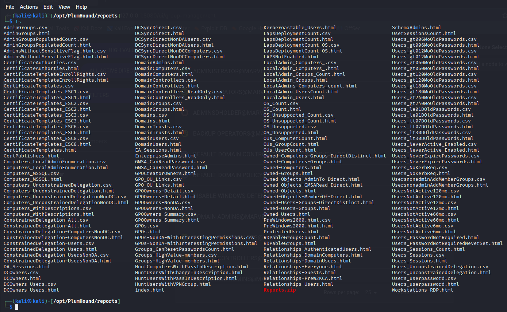
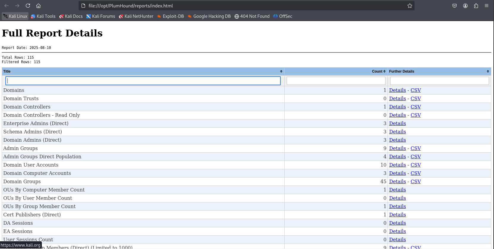
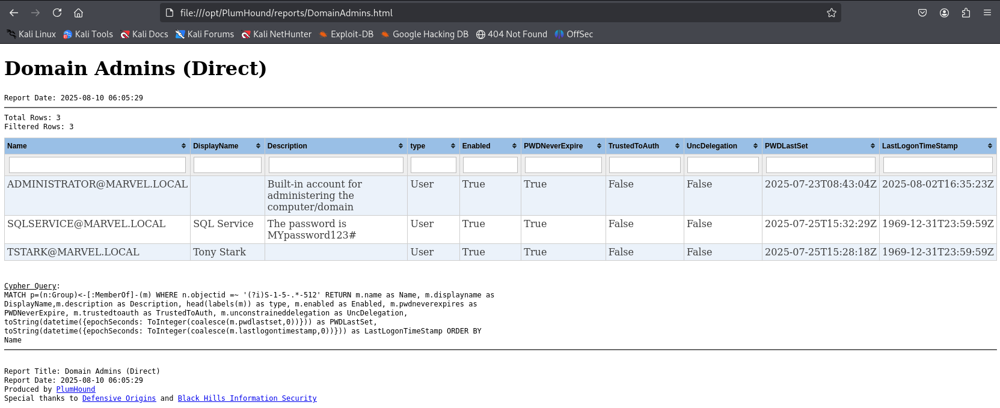

# Domain Enumeration with Plumhound

`Plumhound` is a blue/purple team tool that builds on `Bloodhound`. It is
installed by the `pimpmykali` script from TCM. To use use `Plumhound`,
`Bloodhound` needs to be running since `Plumhound` pulls its data from the
`Bloodhound` database, analyses it and stores its results as HTML files.

From the folder `/opt/PlumHound` we can first run a test using the password for
`neo4j`, `neo4j1` with the option `--easy`, which tests the database connection
and returns the domain users to `stdout`.

```
┌──(kali㉿kali)-[/opt/PlumHound]
└─$ sudo python3 PlumHound.py --easy -p neo4j1

        PlumHound 1.6
        For more information: https://github.com/plumhound
        --------------------------------------
        Server: bolt://localhost:7687
        User: neo4j
        Password: *****
        Encryption: False
        Timeout: 300
        --------------------------------------
        Task: Easy
        Query Title: Domain Users
        Query Format: STDOUT
        Query Cypher: MATCH (n:User) RETURN n.name, n.displayname
        --------------------------------------
INFO    Found 1 task(s)
INFO    --------------------------------------

on 1: n.name                      n.displayname
      --------------------------  ---------------
      TSTARK@MARVEL.LOCAL         Tony Stark
      SQLSERVICE@MARVEL.LOCAL     SQL Service
      PPARKER@MARVEL.LOCAL        Peter Parker
      KRBTGT@MARVEL.LOCAL
      HNLBLDCDQZ@MARVEL.LOCAL     HnlbLdcDQz
      GUEST@MARVEL.LOCAL
      FCASTLE@MARVEL.LOCAL        Frank Castle
      ADMINISTRATOR@MARVEL.LOCAL

      NT AUTHORITY@MARVEL.LOCAL

         Executing Tasks |██████████████████████████████████████████████████| Tasks 1 / 1  in 0.1s (8272.62/s)

        Completed 1 of 1 tasks.
```

To execute the default data export from `Bloodhound`, we use the following
command. Other tasks are pre-defined in the subfolder `./tasks`.

```
┌──(kali㉿kali)-[/opt/PlumHound]
└─$ sudo python3 PlumHound.py -x tasks/default.tasks -p neo4j1

        PlumHound 1.6
        For more information: https://github.com/plumhound
        --------------------------------------
        Server: bolt://localhost:7687
        User: neo4j
        Password: *****
        Encryption: False
        Timeout: 300
        --------------------------------------
        Tasks: Task File
        TaskFile: tasks/default.tasks
        Found 119 task(s)
        --------------------------------------


on 119:         Completed Reports Archive: reports//Reports.zip
         Executing Tasks |██████████████████████████████████████████████████| Tasks 119 / 119  in 6.5s (17.99/s) 

        Completed 119 of 119 tasks.
```

The results are stored in the subfolder `./reports`, in total 119 files, in
most cases a `csv` and an `html` file plus one `zip` file that includes all
other 118 files.




The `index.html` file is an ideal startin point that links to all other reports
in the folder and also allows us to filter for reports. We can open it with
`firefox index.html`.






### Further reading

* [`Plumhound` github repo](https://github.com/PlumHound/PlumHound)
* [TCM SECURITY — Domain Enumeration With Plumhound](https://medium.com/@tayyabanoor1201/tcm-security-domain-enumeration-with-plumhound-2e7ff0dd5e1f)


<!--
span style="color:green;font-weight:700;font-size:20px">
markdown color font styles
</span
-->
