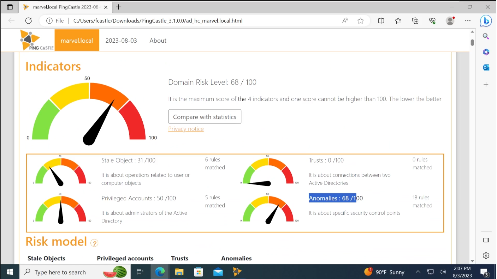

# Domain Enumeration with PingCastle

`PingCastle` is a reporting tool that is only available for Windows. It is a
tool for which a community edition is [available](https://www.pingcastle.com/download/),
but for penetration tests, the commercial version must be purchased.

The output is structured similarly to `Plumhound` with links to more detailed
reports, but there is a ranking and a traffic light indication for
visualization.

<!--
span style="color:green;font-weight:700;font-size:20px">
markdown color font styles

