# Pass Attacks Overview

When we dump a password hash from a SAM or crack a password, we can pass the
login credentials (clear text password or the password hash) around on the
network to see if they work on other machines, too. This is a way of lateral
movement.

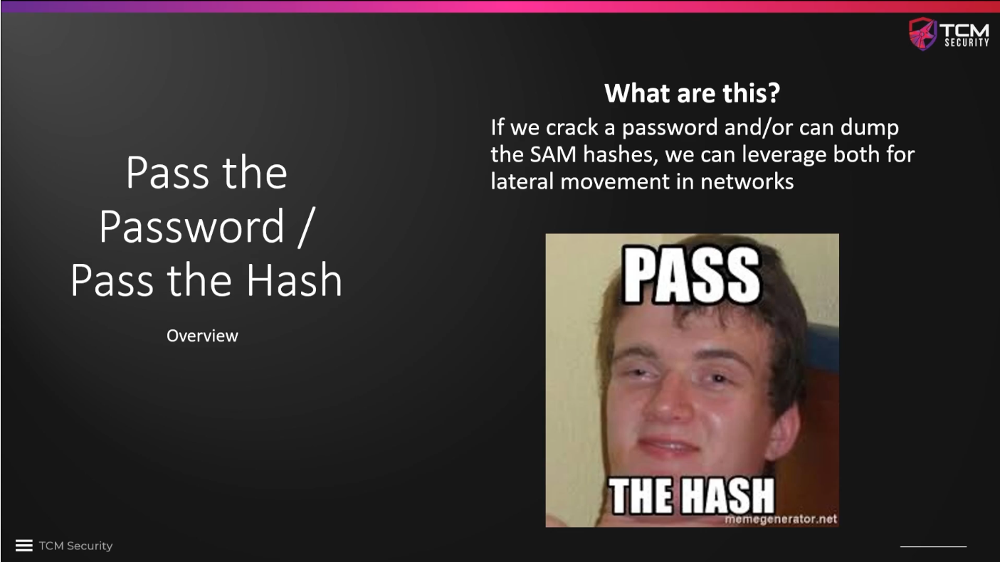

We will primarily use a tool called `crackmapexec`. In the first example, we
assume that we have a valid `user:password` pair that we have retrieved
previously somehow, in this case `fcastle:Password1`. `crackmapexec` will pass
these credentials to every other machine on the network that accepts SMB
connections. We are primarily interested in accounts where we have local
administrator rights, as indicated by `(Pwn3d!)` at the end of the success
message. In the example, the credentials work on all three machines, but we only
have local admin rights on `SPIDERMAN` and `THEPUNISHER`, but not on `HYDRA-DC`.

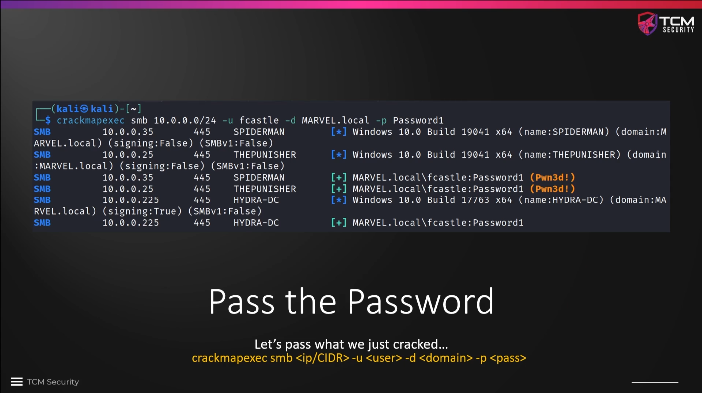

We can do the same with password hashes, e.g. if we got a `Meterpreter` shell
in `Metasploit` and do a password `hashdump`...

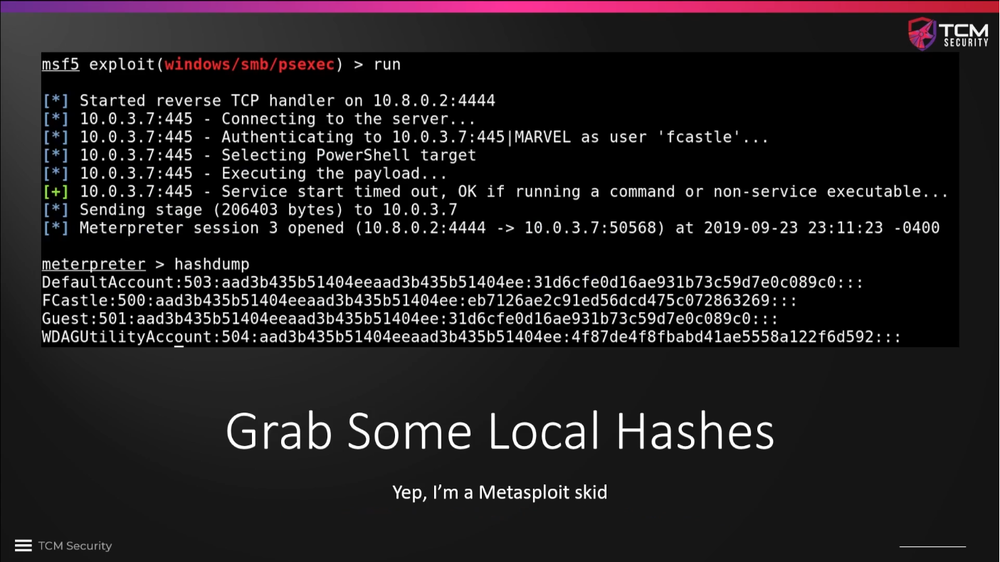

..., or if we get a SAM dump with a Python script, such as `secretsdump.py`,
which is part of the same `Impacket` package as `ldapdomaindump.py`. It
requires that we have access credentials of a local admin on a machine.

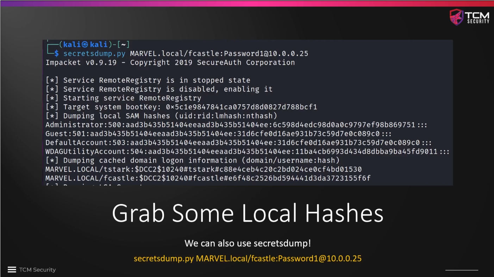

Similar to passing known user credentials, we can also pass a password hash
with `crackmapexec` when we use the switch `--local-auth` and the option `-h
<HASH>`. We can tell from red `[-]` indicator that the login on `HYDRA-DC`
failed. This is because we are using a hash for a local account, and the
password on `HYDRA-DC` is different from the one used on `THEPUNISHER` and
`SPIDERMAN`.

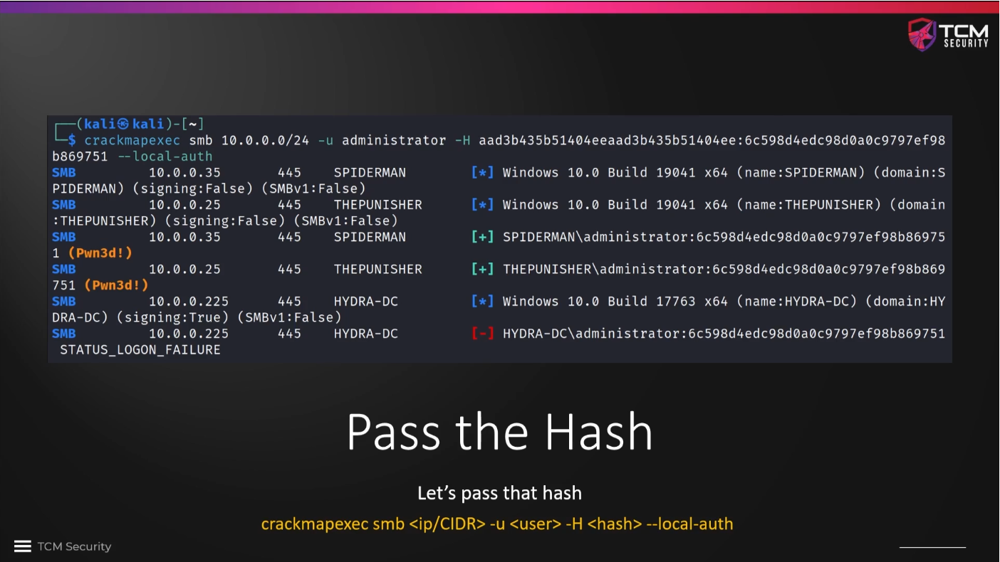

We can also use `crackmapexec` to dump the SAM of every device that we log in to
instead of using a dedicated tool, such as `secretsdump.py` using the switches
`--local-auth` and `--sam`... 

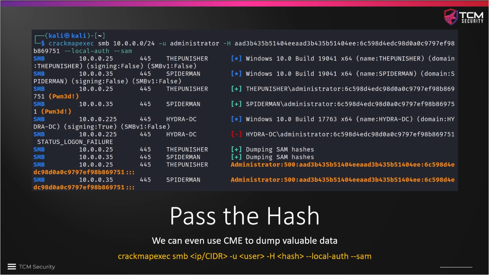

... or `--shares` to enumerate the shares on every device to see whether we can
see shares that we cannot see otherwise.

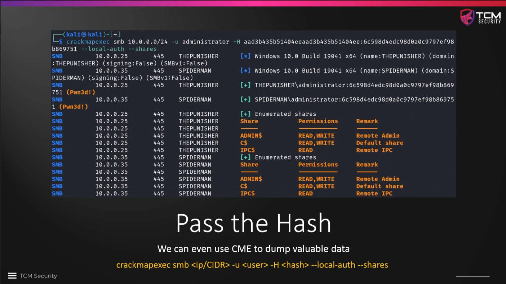

We can try to dump the `LSA (Local Security Authority)` using the `--lsa` switch.
This can also be done with `secretsdump.py`, which is TCM's preferred method. 

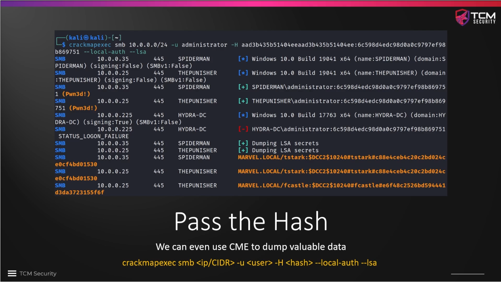

`crackmapexec` has a number of built-in modules.

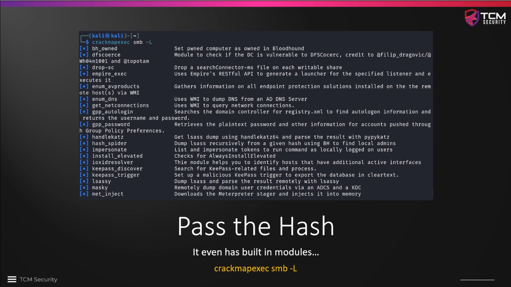

One of these built-in modules is called `lsassy`, which can be used with the `-M
lsassy` option. The LSASS enforces the security policy, but more importantly, it
also stores credentials of users that are currently logged in. In this way we
may get access to credentials that might otherwise not be accessible to us via
a secrets dump.

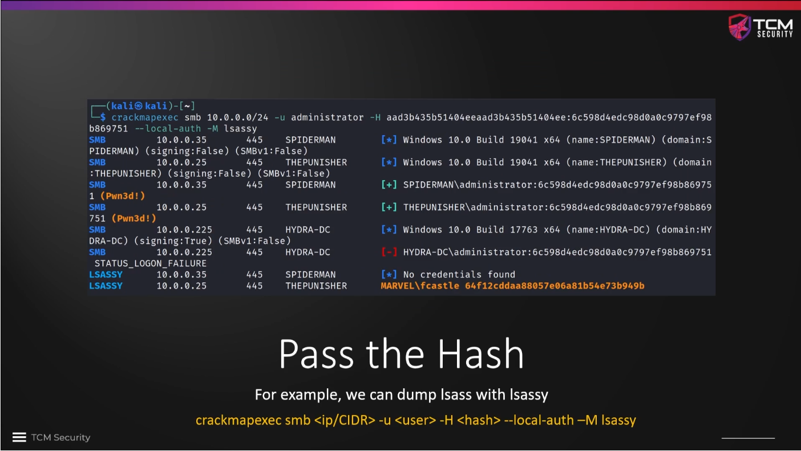

Finally, the results of all attempts that we have made are stored in a
database, so that we have convenient access to them.

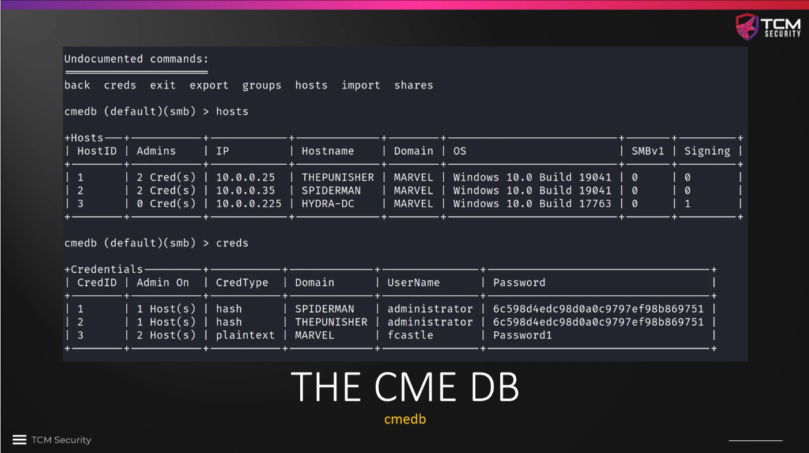

### Further reading

* [Pass the Hash (Wikipedia)](https://en.wikipedia.org/wiki/Pass_the_hash)
* [Pass-the-Hash-Attack (IT-Forensik Wiki)](https://it-forensik.fiw.hs-wismar.de/index.php/Pass-the-Hash-Attack)
* [Pass-the-Hash in Windows 10 (SANS, pdf)](https://www.sans.org/white-papers/39170)
* [Active Directory Hacking: Angriffe mit mimikatz - Pass-the-Hash (PtH)](https://www.whitehat.de/active-directory-hacking-angriffe-mit-mimikatz/pass-the-hash-pth)

<!--
span style="color:green;font-weight:700;font-size:20px">
markdown color font styles

