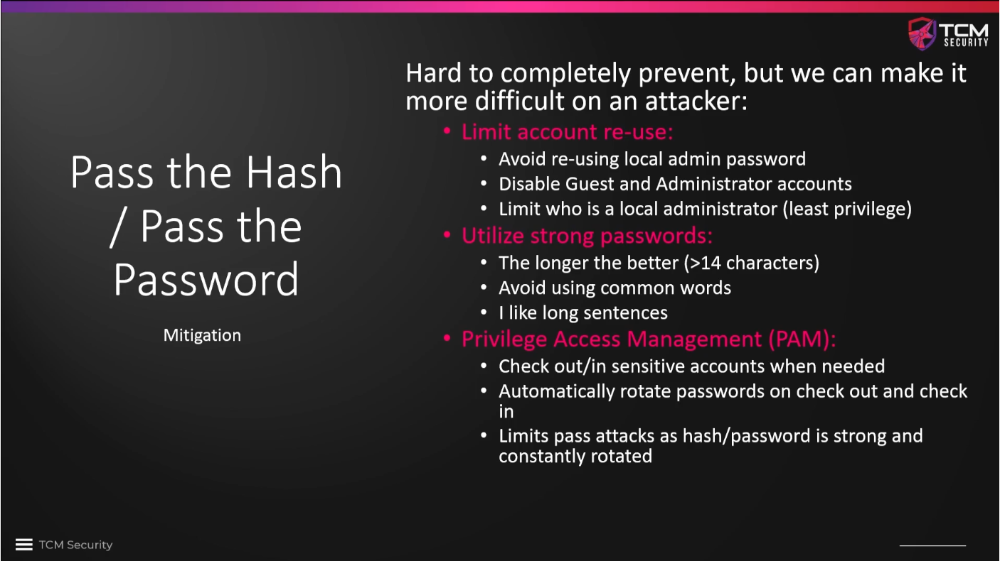

# Pass Attack Mitigations

It is difficulat to prevent pass attacks completely, but we can make life more
difficult for the attacker. The points listed under "Limit account reuse" are
generally all best practice. Using strong passwords may avoid that hashes are
cracked successfully, but it does not prevent **pass-the-hash** attacks.

**Privileged Access Management (PAM)** can be implemented using tools like
`CyberArk` or `DeLinea`. Another idea is using Windows on-board feature **`LAPS`
(Local Administrator Password Solution)**, which is free of charge, easy to set
up and very powerful.

### Further reading

* [Was ist PAM (Privileged Access Management)?](https://www.microsoft.com/de-de/security/business/security-101/what-is-privileged-access-management-pam)
* [Die besten Lösungen für Privileged Access Management (PAM) im Jahr 2025](https://geekflare.com/de/best-privileged-access-management-solutions/)
* [Was ist das Windows LAPS?](https://learn.microsoft.com/de-de/windows-server/identity/laps/laps-overview)

<!--
span style="color:green;font-weight:700;font-size:20px">
markdown color font styles

