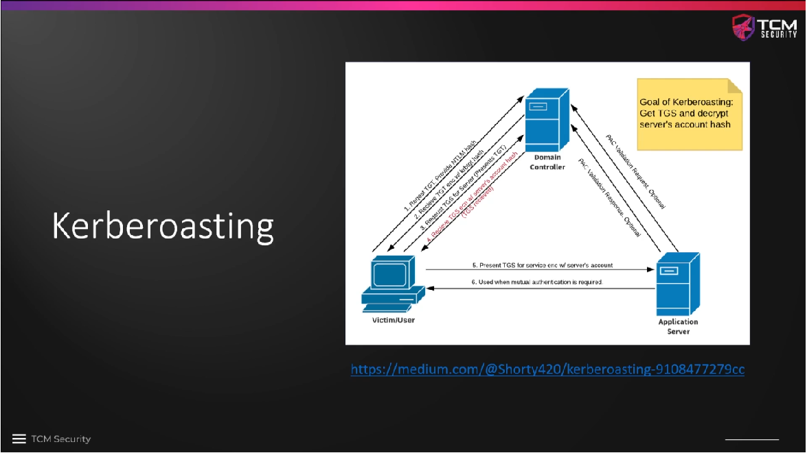
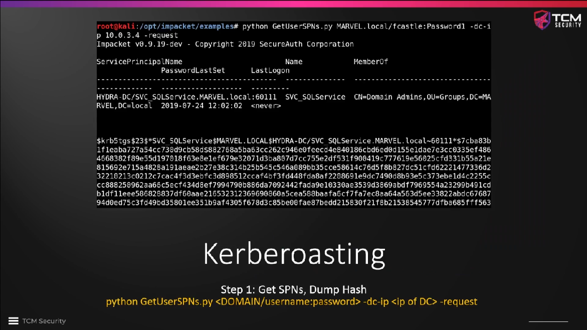
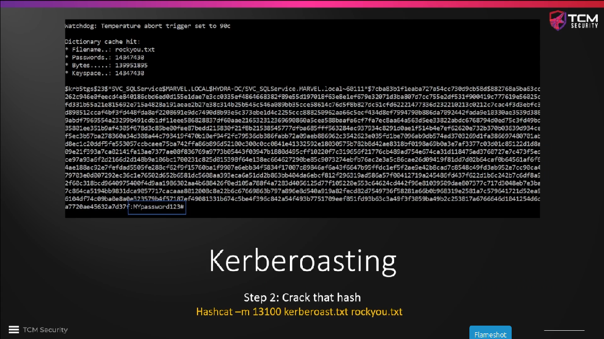

# Kerberoasting Overview

**Kerberoasting** is a very popular attack and a quick way to get control of
the domain controller in a network. The attack makes use of service accounts
such as the `SQLService` account that we have created in our lab. We have set
it to `SPN (Service Principal Name)`.

When we have an application server and a user machine on a network and the
latter wants to access the application server, it has to get some credentials
from the domain controller, which acts as the `Key Distribution Center (KDC)`.

The authorization process is initiated by the user machine sending a
`Ticket-granting ticket (TGT)` request to the KDC, in which a legitimate username
and password are provided. The domain controller sends a `TGT` back if the
credentials are correct (including those which we have compromised already:
`fcastle:Password1`). In the next step, we request a `Ticket-granting Service (TGS)`
from the domain controller, using the `TGT` that we have just received. The
`TGS` that the domain controller provides then is encrypted with the server's
account hash. In the normal process, we would present the `TGS` to the
application server, which would decrypt it to see if the user has the authority
to access the service. However, this last step is not relevant for our pentest.
We just want to capture the domain controller's account hash from the `TGS`.

We will use a tool called `GetUserSPNs.py` with breached credentials and issue
a request. We will get a long hash in return, which we can try to crack with
`hashcat`.

### Further reading

* [Kerberoast](https://www.thehacker.recipes/ad/movement/kerberos/kerberoast)
* [Detecting Kerberoasting Activity](https://adsecurity.org/?p=3458)
* [Attacking Service Accounts with Kerberoasting](https://medium.com/r3d-buck3t/attacking-service-accounts-with-kerberoasting-with-spns-de9894ca243f)

<!--
span style="color:green;font-weight:700;font-size:20px">
markdown color font styles

