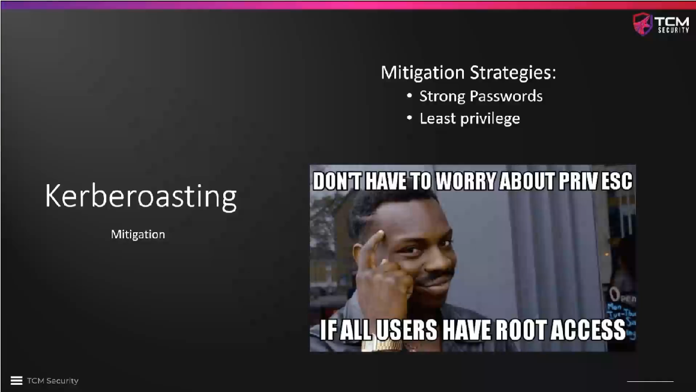

# Kerberoasting Mitigations

* Service accounts should not run as domain admins! (This can be found in
  almost any pentest, but it is not required.)
* Service accounts should have strong passwords!
* Never store the password or hints to the password in the description of the
  Active Directory account.

<!--
span style="color:green;font-weight:700;font-size:20px">
markdown color font styles

