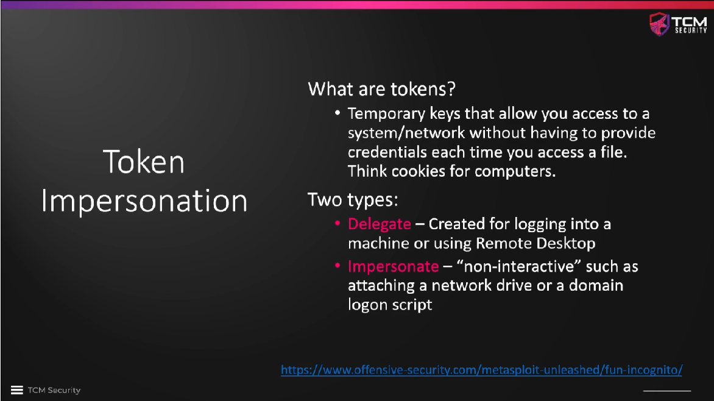
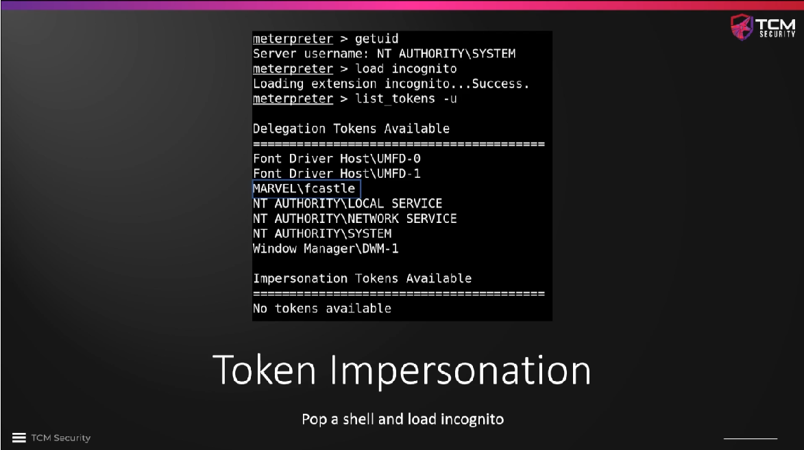
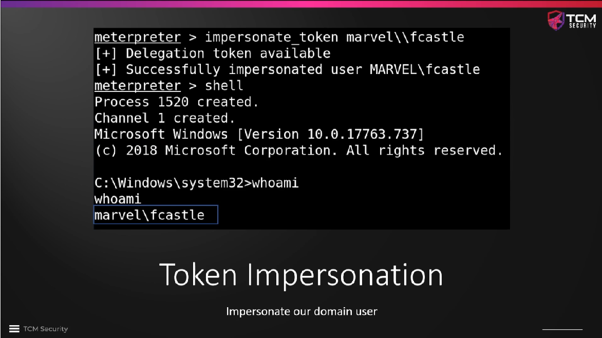
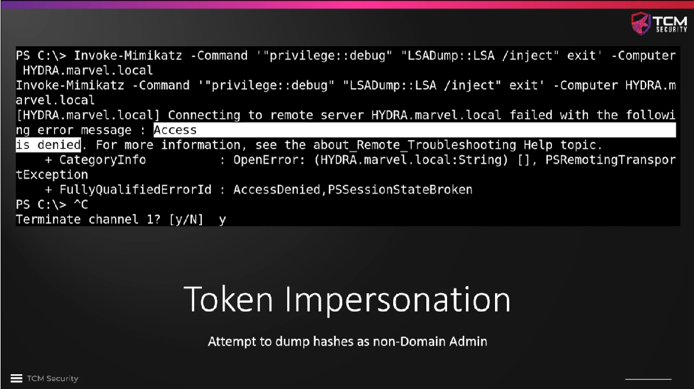
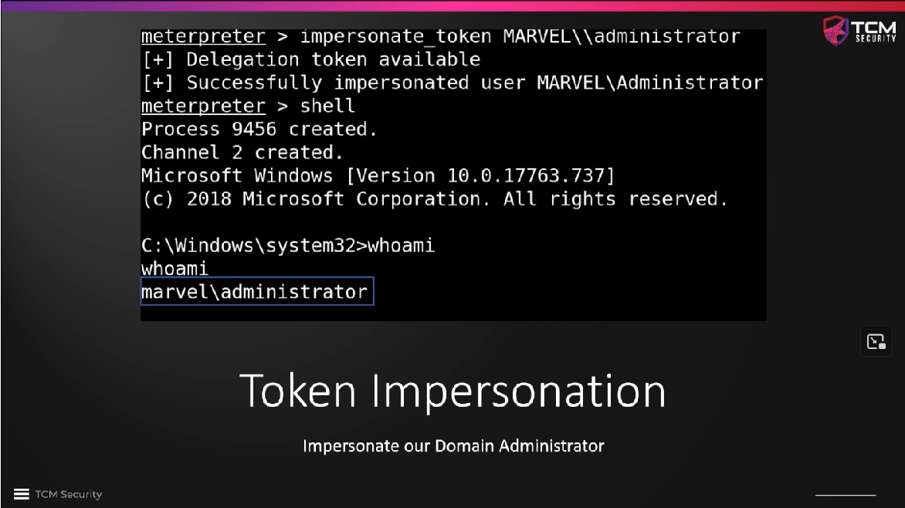
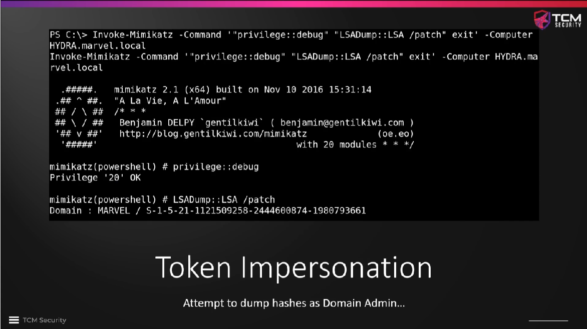
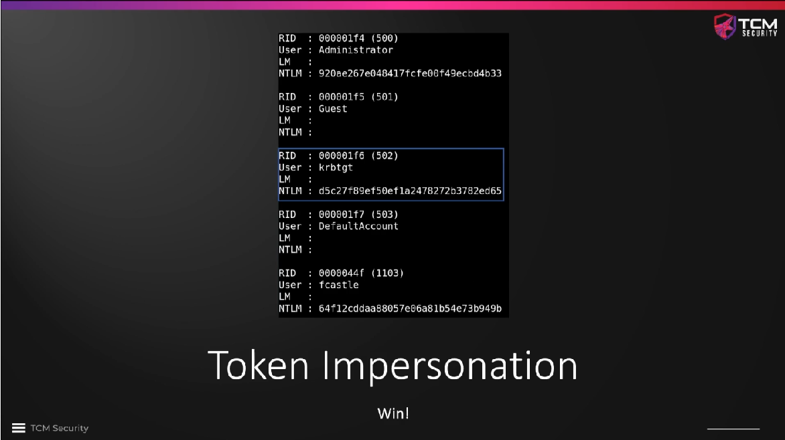
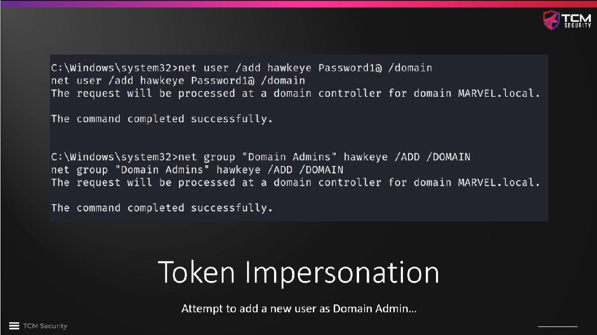
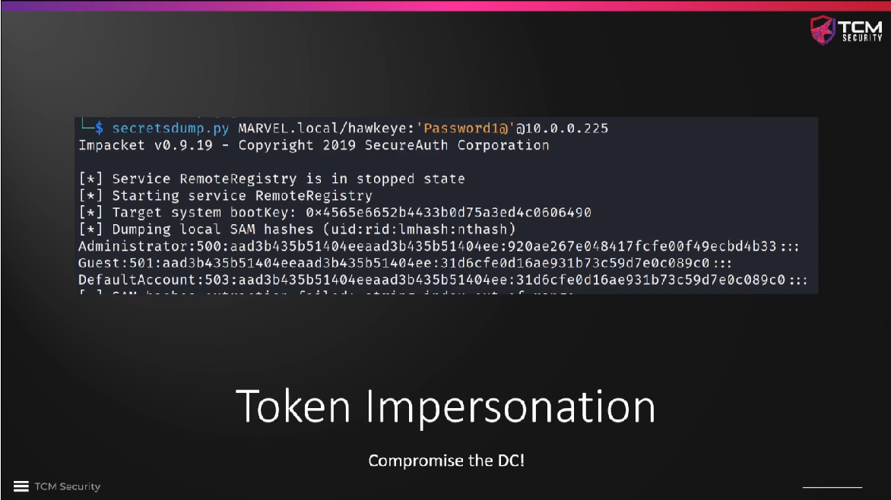

# Token Impersonation Overview 

**Tokens** are like cookies for computers -- temporary keys that allow a user to
access a computer or network without having to provide credentials every time.
The most common type is the **delegate token**, which is created when we log
in to a computer or we are using `Remote Desktop`. This is the type of token
that we will exploit in this section. The other type, **impersonate tokens**,
will be covered later in the course.

In `metasploit` we can use a tool called `incognito` for token impersonation.
It lists all delegation tokens that are available. When we use `incognito` to
impersonate `fcastle` and then open a shell, we can see that we are actually
`fcastle`, again without cracking any hash.

If we try to run anything that requires admin rights, the user `fcastle` is not
suitable, since he is a low-privilege user (`Access is denied.`).

If a domain token was available instead, perhaps because an administrator has
logged in to a machine, as indicated by a delegation token for
`MARVEL\Administrator` being available, we can use that token to get access
with admin rights, again using the `incognito` tool in `metasploit`.

When we then run the same admin-rights-requiring command again, we are
successful. We can drop the NTLM hashes of all domain users with `mimikatz`.

**A better example:** Let's assume that we can impersonate a domain admin
account. We can then use remote commands to add a new user and add that user to
the domain admins group.

Once this user has been created and made domain admin, we can use the account
credentials with `secretsdump.py` against the domain controller and dump all
secrets that are stored on the DC.

It is by default enabled that a domain admin runs commands from any computer on
the network. If a domain admin has logged in to a computer since it has last
been rebooted and we can log in to that computer as well and are able to
impersonate the domain admin, we can do as above, i.e. create our own domain
admin account and own the domain easily. **This is a very dangerous attack!**

### Further reading

* [Access token (Wikipedia)](https://en.wikipedia.org/wiki/Access_token)
* [Access tokens](https://learn.microsoft.com/en-us/windows/win32/secauthz/access-tokens)
* [Windows Privilege Escalation – Token Impersonation](https://steflan-security.com/linux-privilege-escalation-token-impersonation/)

<!--
span style="color:green;font-weight:700;font-size:20px">
markdown color font styles

