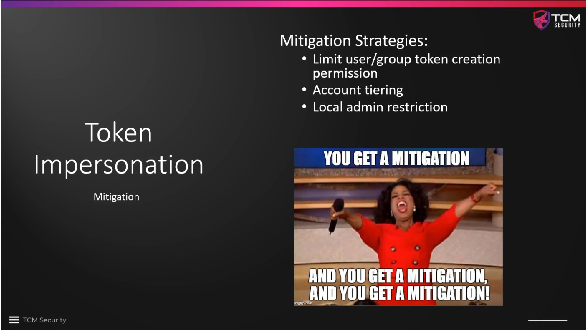

# Token Impersonation Mitigation

One specific mitigation strategy against Kerberoasting is to limit the user and
group token creation permissions.

The other approaches besides that are **general best practices**:

* **Account tiering**, i.e. only logging in to the domain controller with a
  domain admin account, not to any other machines where someone might
  impersonate an admin token. You can always set extra permissions on other
  accounts, if necessary, it does not have to be a domain admin account.

* **Local admin restrictions** help prevent getting access to a machine in the
  first place. If an attacker can get access to the machine in any way, they
  can look for delegate tokens. We generally have to be very restrictive who can
  access a machine with which access rights.

<!--
span style="color:green;font-weight:700;font-size:20px">
markdown color font styles

