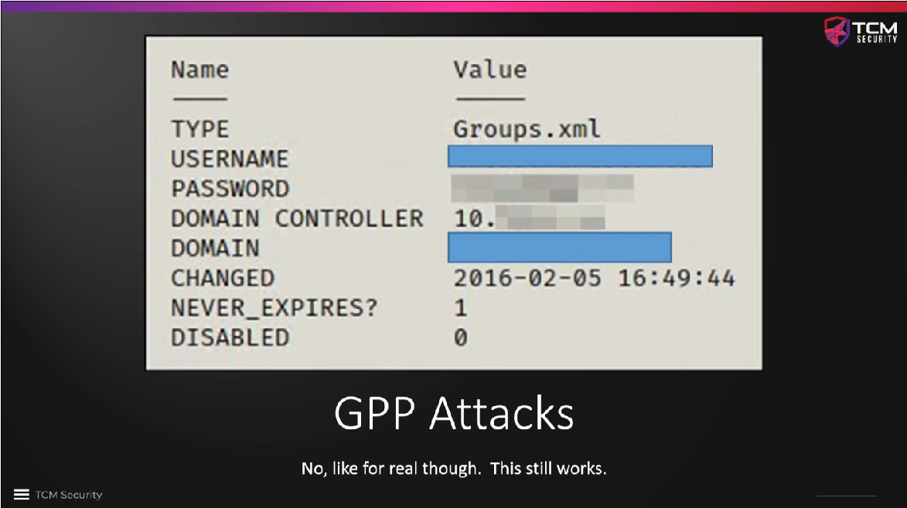

# GPP / cPassword Attacks and Mitigations

This is an old attack (already 10 years old in 2021!), but it still appears in
penetration tests. The vulnerability was patched in `MS14-025`, but if a domain
controller has not been patched or if the `cPassword` has never been deleted,
the passwords are still there, and the system can still be attacked if they
have not been changed in the meantime.

The tool `gpp-decrypt` that is built into Kali can be used to crack cPassword
data and get the clear text password, which might otherwise be very difficult
to crack.

There is also a tool in `metasploit` called `smb_enum_gpp` that uses any set of
valid credentials for the attacked network. The tool will access the `SYSVOL`
of the domain controller, dig through the stored policies and look for XLM
files that contain cPassword entries. If it finds entries, they will
automatically be decrypted to get the clear text passwords.

To fix the GPP vulnerability, one can simply patch the Windows operating system
or -- more manually -- find all old GPP XML files in `SYSVOL` and delete them.
Especially on old operating systems there is a good chance of finding such
passwords, even 10 years after the vulnerability has become publicly known.

### Further reading

* [Finding Passwords in SYSVOL & Exploiting Group Policy Preferences](https://adsecurity.org/?p=2288)
* [Attacking GPP(Group Policy Preferences) Credentials | Active Directory Pentesting](https://infosecwriteups.com/attacking-gpp-group-policy-preferences-credentials-active-directory-pentesting-16d9a65fa01aa)
* [GPP Passwords](https://blog.salucci.ch/docs/HackingLab/HackTheBox/SOC-Analyst/GPP-Passwords/)

<!--
span style="color:green;font-weight:700;font-size:20px">
markdown color font styles

