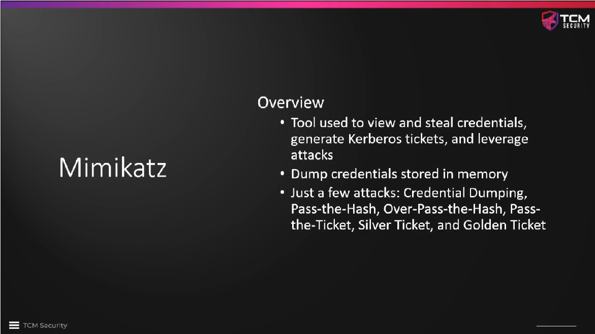

# Mimikatz Overview 

`Mimikatz` is an important tool, although it will probably be picked up by any
sort of antivirus software, unless it obfuscated with a lot of effort, which is
outside the scope of the course. However, if we have the ability to control the
antivirus software, `Mimikatz` can be tremendously helpful and has a lot of
features -- see the screenshot below.

<!--
span style="color:green;font-weight:700;font-size:20px">
markdown color font styles

